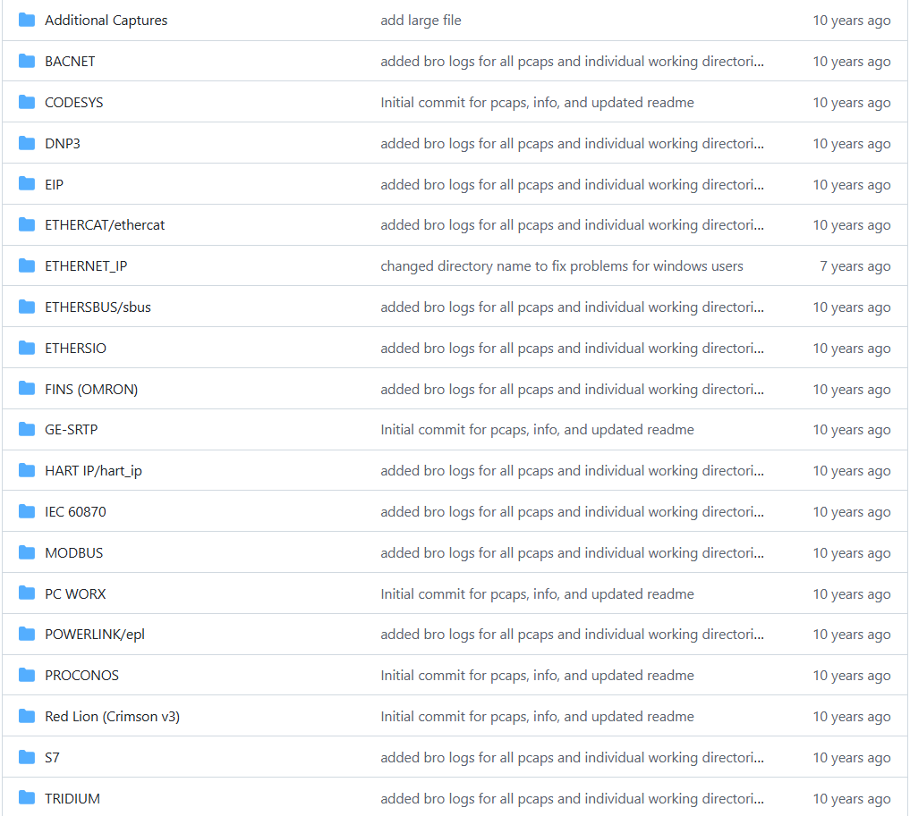
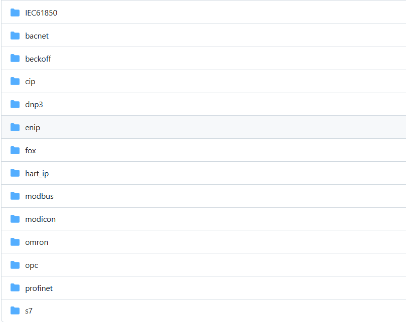

Exploitation Framework for Embedded Devices

https://github.com/threat9/routersploit

Malcolm is a powerful, easily deployable network traffic analysis tool suite for full packet capture artifacts (PCAP files), Zeek logs and Suricata alerts.

https://github.com/cisagov/Malcolm

iec61850的协议解析操作

https://github.com/mz-automation/libiec61850

# 二、pcap集合

| 名称                             | 地址                                                         | 简介                         |
| -------------------------------- | ------------------------------------------------------------ | ---------------------------- |
| MMS-protocol-parser-for-Zeek-IDS | https://github.com/smartgridadsc/MMS-protocol-parser-for-Zeek-IDS | 使用zeek的ids，mms协议解析器 |
| ICS-pcap                         | https://github.com/automayt/ICS-pcap                         |                              |
| icsmaster                        | https://github.com/w3h/icsmaster                             |                              |

https://github.com/automayt/ICS-pcap

协议列表如下

https://github.com/w3h/icsmaster

协议列表如下

