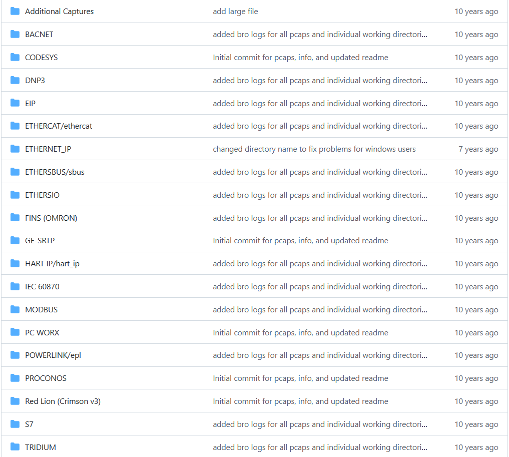
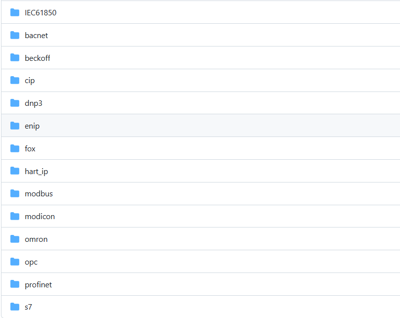

# 一、什么是工控（OT）？

OT：Operational Technology 工业控制技术

它关注：如何控制现实世界的设备运行。

电力场景：

```
调度系统
↓
变电站自动化系统
↓
IED
↓
断路器
```

控制：输电、保护、开关动作。


电力OT和普通工控的区别

在熟悉这些规则的地方，

Engineering Station


Exploitation Framework for Embedded Devices

https://github.com/threat9/routersploit


iec61850的协议解析操作

https://github.com/mz-automation/libiec61850


# 二、pcap集合

| 名称                             | 地址                                                         | 简介                         |
| -------------------------------- | ------------------------------------------------------------ | ---------------------------- |
| MMS-protocol-parser-for-Zeek-IDS | https://github.com/smartgridadsc/MMS-protocol-parser-for-Zeek-IDS | 使用zeek的ids，mms协议解析器 |
| ICS-pcap                         | https://github.com/automayt/ICS-pcap                         |                              |
| icsmaster                        | https://github.com/w3h/icsmaster                             |                              |


https://github.com/automayt/ICS-pcap

协议列表如下




https://github.com/w3h/icsmaster

协议列表如下


