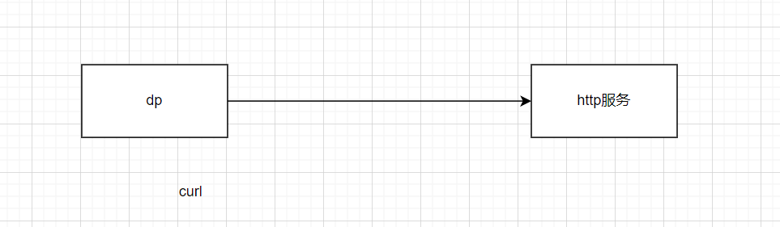

1、几个json文件对应的流程，都过一下。

2、交流下疑问点 inside 流量，咱们测试下。接口是使用主机的还是容器的？

3、测试的问题，大概知道如何测试了。（观察到触发日志）




主要是分为四步的简单步骤。

1、搭建个httpd或nginx服务（ok）

2、加载规则（ok）

3、模拟waf攻击进行测试（ok）

4、如何来验证（日志路径和格式给牛超说一下）


dpi_waf_ep_policy_check函数中p->ep->dlp_detector检测器指针为空

dpi_dlp_detect_add_mac

dpi_dlp_detect_update

ep和dlp_detect是一种什么关系，以及如何梳理这种关系呢？


# 1、设置debug开关

{
	"ctrl_set_debug": {
		"categories": []
	}
}


# 2、配置内部网段

{
	"ctrl_cfg_internal_net": {
		"flag": 3,
		"subnet_addr": [{
			"ip": "172.17.0.0",
			"mask": "255.255.0.0"
		}, {
			"ip": "10.240.19.0",
			"mask": "255.255.255.0"
		}, {
			"ip": "192.168.29.0",
			"mask": "255.255.255.0"
		}]
	}
}

# 3、配置指定ip

{
	"ctrl_cfg_specip_net": {
		"flag": 3,
		"subnet_addr": [{
			"ip": "192.168.29.144",
			"mask": "255.255.255.255",
			"iptype": "hostip"
		}, {
			"ip": "10.240.19.222",
			"mask": "255.255.255.255",
			"iptype": "hostip"
		}]
	}
}

# 4、添加虚拟接口的部分（微隔离暂时不用关心）

dp_ctrl_handler: dp_ctrl_handler json str:{"ctrl_add_srvc_port":{"iface":"vth-neuv","jumboframe":false}}

容器里面的接口

{
	"ctrl_add_tap_port": {
		"netns": "/host/proc/32313/ns/net",
		"iface": "eth0",
		"epmac": "02:42:ac:11:00:03"
	}
}

TODO：疑问点说

# 5、添加接口及其mac地址（需要）

```json
{
	"ctrl_add_mac": {
		"iface": "vth-neuv", //enforcer容器
		"mac": "02:42:ac:11:00:03",
		"ucmac": "",//unicast 
		"bcmac": "",//broadcast
		"oldmac": "",//记录上次mac
		"pmac": "",//proxymesh origin mac
		"pips": null //数组
	}
}
```

# 6、配置mac地址(对dlp不影响)

```json
{
	"ctrl_cfg_mac": {
		"macs": ["02:42:ac:11:00:03"],
		"tap": true
	}
}
```


ctrl_cfg_policy策略配置

```
{
	"ctrl_cfg_policy": {
		"cmd": 1,
		"flag": 3,
		"defact": 1,
		"dir": 1,
		"mac": ["02:42:ac:11:00:03"],
		"rules": null
	}
}
```

{"ctrl_cfg_policy_addr":{"flag":3,"subnet_addr":[]}}
{"ctrl_refresh_app":{}}

# 7、ctrl_cfg_dlp配置dlp

**从agent代码中可以看出ctrl_cfg_dlp和ctrl_bld_dlp是一起下发的。**


# 8、ctrl_bld_dlp配置接口

{
	"ctrl_bld_dlp": {
		"flag": 3,
		"dir": 1,
		"dlp_rules": [{
			"name": "haolipeng_nVwAfCtR.haolipeng-rule",
			"id": 40002,
			"patterns": ["/\\$\\{((\\$|\\{|lower|upper|[a-zA-Z]|\\:|\\-|\\})*[jJ](\\$|\\{|lower|upper|[a-zA-Z]|\\:|\\-|\\})*[nN](\\$|\\{|lower|upper|[a-zA-Z]|\\:|\\-|\\})*[dD](\\$|\\{|lower|upper|[a-zA-Z]|\\:|\\-|\\})*[iI])((\\$|\\{|lower|upper|[a-zA-Z]|\\:|\\-|\\}|\\/)|[ldapLDAPrmiRMInsNShtHTcobCOB])*.*/is; context packet"]
		}, {
			"name": "haolipeng_nVwAfCtR.zhuzhe-rule",
			"id": 40003,
			"patterns": ["/\\$\\{((\\$|\\{|lower|upper|[a-zA-Z]|\\:|\\-|\\})*[jJ](\\$|\\{|lower|upper|[a-zA-Z]|\\:|\\-|\\})*[nN](\\$|\\{|lower|upper|[a-zA-Z]|\\:|\\-|\\})*[dD](\\$|\\{|lower|upper|[a-zA-Z]|\\:|\\-|\\})*[iI])((\\$|\\{|lower|upper|[a-zA-Z]|\\:|\\-|\\}|\\/)|[ldapLDAPrmiRMInsNShtHTcobCOB])*.*/is; context packet"]
		}, {
			"name": "sensor.log4shell_nVwAfCtR.rule.log4shell",
			"id": 40000,
			"patterns": ["/\\$\\{((\\$|\\{|lower|upper|[a-zA-Z]|\\:|\\-|\\})*[jJ](\\$|\\{|lower|upper|[a-zA-Z]|\\:|\\-|\\})*[nN](\\$|\\{|lower|upper|[a-zA-Z]|\\:|\\-|\\})*[dD](\\$|\\{|lower|upper|[a-zA-Z]|\\:|\\-|\\})*[iI])((\\$|\\{|lower|upper|[a-zA-Z]|\\:|\\-|\\}|\\/)|[ldapLDAPrmiRMInsNShtHTcobCOB])*.*/is; context header"]
		}, {
			"name": "sensor.spring4shell_nVwAfCtR.rule.spring4shell",
			"id": 40001,
			"patterns": ["/if.*equals.*request\\.getParameter.*pwd.*getRuntime.*exec.*request\\.getParameter.*cmd.*getInputStream.*read.*print.*classLoader/is; context body"]
		}],
		"mac": ["02:42:ac:11:00:03"],
		"delmac": []
	}
}

我找到了测试waf的办法。等这周空了时，好好测试下。


下面和waf、dlp没啥关系。

allinone_5.0.0 | 2022-06-16T08:42:52|DEBU|cmd|dp_ctrl_handler: ctrl_sys_conf json str:{"ctrl_sys_conf":{"xff_enabled":true}}
allinone_5.0.0 | 2022-06-16T08:42:52|DEBU|cmd|dp_ctrl_handler: dp_ctrl_handler json str:{"ctrl_cfg_mac":{"macs":["02:42:ac:11:00:03"],"apps":[{"ip_proto":6,"port":80,"app":0,"server":2022}]}}

dpSendMsgExSilent