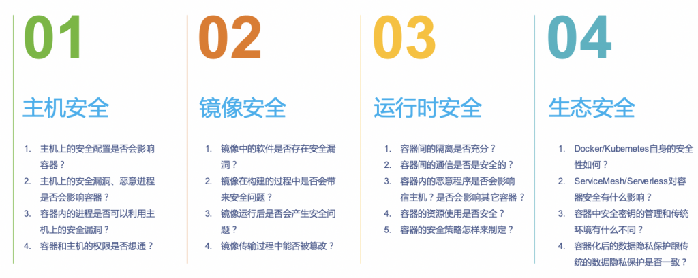

容器安全包括哪些内容

一种在构建阶段保护镜像安全的方法

https://m.freebuf.com/articles/container/340556.html

研究容器安全需要什么技术栈？？这块自己需要好好补一补。

第一，就是容器环境**基础设施的安全性**

比如主机上的安全配置是否会影响到其上面运行的容器，

主机上的安全漏洞是否会影响到容器，

主机上的恶意进程是否会影响到容器，

容器内的进程是否可以利用到主机上的安全漏洞等。

第二，是容器的**镜像安全**，

镜像中的软件是否存在安全漏洞，

镜像在构建过程中是否存在安全风险，

镜像在传输过程中是否被恶意篡改等。

第三，是容器的**运行时安全**

运行的容器间隔离是否充分，（微隔离？）

容器间的通信是否是安全的，

容器内的恶意程序是否会影响到主机或者其它容器，（攻击左移的概念？）

容器的资源使用情况是否是安全的等（挖矿？）。

第四，是整个**容器生态的安全性**，

比如Docker/Kubernetes自身的安全性如何，

ServiceMesh/Serverless对容器安全有什么影响，

容器中安全密钥的管理和传统环境有什么不同，（数据安全）

容器化后的数据隐私保护跟传统的数据隐私保护是否一致等。（数据安全）
