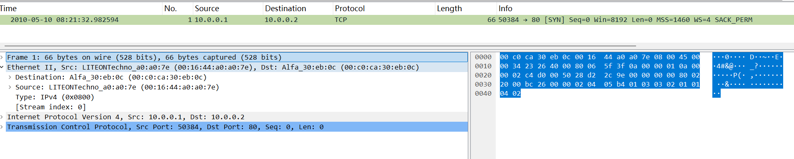
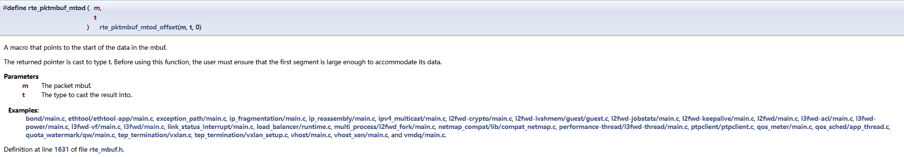
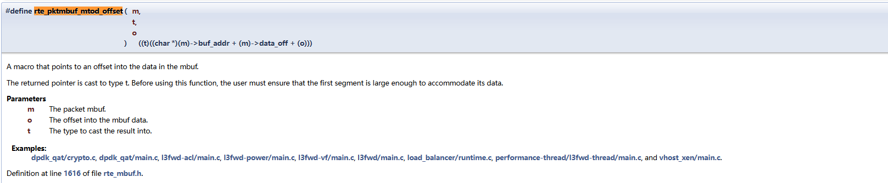

# 一、熟悉pcap文件中ip、tcp协议数据包



左下方是数据包的格式，以及每个字段的值。

右方是数据包的二进制格式的表示。


### 1. 网络字节序 vs 主机字节序

- 网络字节序（Big Endian）：网络协议中使用的字节序，高位字节在前

- 主机字节序（Host Byte Order）：CPU的字节序，在x86/x64架构上是小端序（Little Endian）

从DPDK的 rte_ether.h 头文件可以看到：

```
struct rte_ether_hdr {
    struct rte_ether_addr dst_addr; 
    struct rte_ether_addr src_addr; 
    rte_be16_t ether_type;  // 注意：这是 rte_be16_t 类型
};
```

ether_type字段被定义为rte_be16_t类型，big endian 表明这是一个16位的大端序值。

https://doc.dpdk.org/api/structrte__ether__hdr.html


### 2. 为什么需要转换

当数据包从网络到达时，ether_type 字段是以网络字节序（即大端序）存储的。例如：

- IPv4 的 ether_type 值是 0x0800

- 在网络字节序中存储为：0x08 0x00

- 但在小端序的x86 CPU上，如果直接读取会得到：0x00 0x08 = 0x0008


3、转换函数

```
ether_type = rte_be_to_cpu_16(eth_hdr->ether_type);
```

这行代码将网络字节序的 ether_type 转换为主机字节序，确保：

- 0x0800 在网络中存储为 0x08 0x00

- 转换后在CPU中正确读取为 0x0800

- 后续的比较 if (ether_type == RTE_ETHER_TYPE_IPV4) 才能正确工作


# 二、mbuf结构

rte_pktmbuf_mtod

含义：A macro that points to the start of the data in the mbuf.




rte_pktmbuf_mtod_offset




# 三、解析数据包信息

## 3、1 解析以太网字段

使用rte_pktmbuf_mtod

rte_be_to_cpu_16


## 3、2 解析网络层字段


## 3、3 解析传输层字段