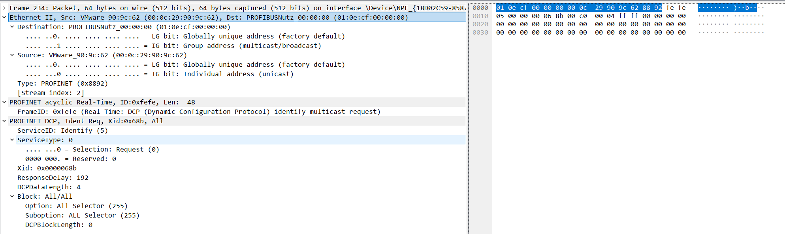
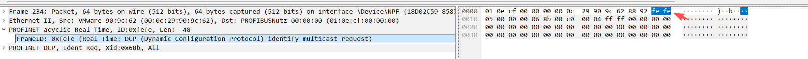
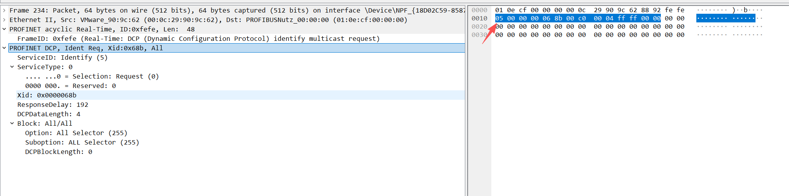
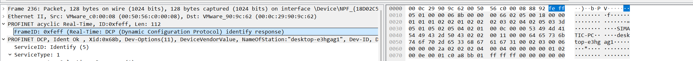
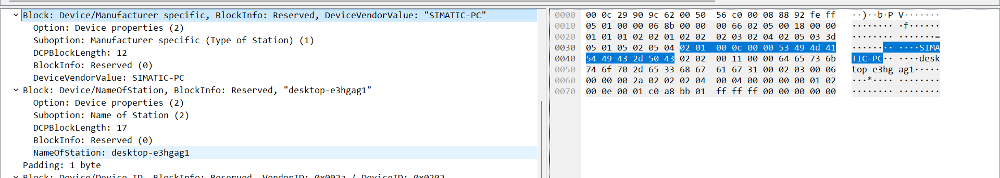
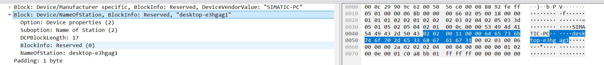
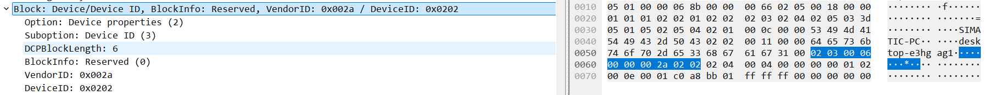
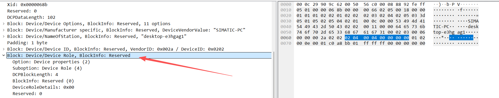
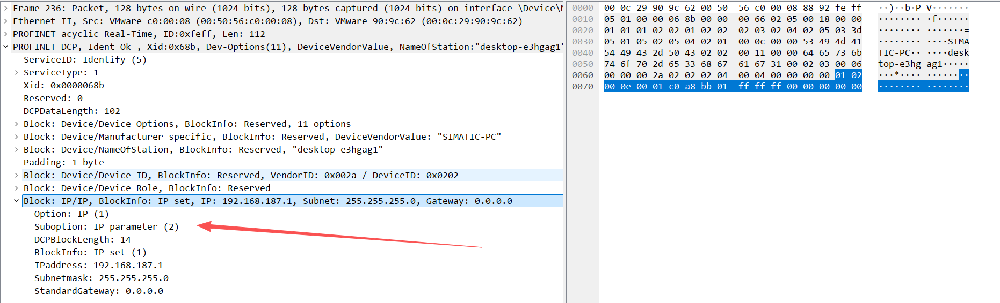

# 一、PROFINET概述


## PROFINET是如何工作的？

PROFINET使用DCP发现设备后，它们会建立AR和CR，建立连接并交换设备参数信息后，实现PROFINET IO系统内数据的转发。

### DCP

DCP（Discovery and basic Configuration Protocol）为“发现和基本配置协议”是一种数据链路层协议，它为PROFINET提供多种服务，例如用于PROFINET网络中的发现识别设备，配置设备名称、配置IP地址等。

为实现这些服务DCP提供了“Identify All”、“Identify”、“Set”、“Set-Flash”、“Set-Reset to Factory”、“Get”作为主要功能。

主要功能具体描述如下。

- **Identify All：**识别全部设备。以广播的方式向整个网络发送消息，所有设备收到消息都要做出响应。工程工具中利用此功能可以获得所有设备信息列表来确定网络中是否存如下问题：
  - （1）设备有无连接;
  - （2）设备名称是否设置;
  - （3）设备中有无重复的IP地址或重复的设备名称;
  - （4）设备名称和IP地址设置是否合规;
  - （5）设备类型或供应商是否正确，利用Identify All功能工程工具可以轻松实现网络管理。
- Identify：查找具体设备和检查设备参数设置。系统启动前，IO控制器会用它来识别设备，通过设备名称来进行查找，具有该设备名称的设备进行响应，但如果查找的设备名称长度为零则所有未分配名称的设备都要做出响应。
- Get：获取设备信息。比如获取设备名称、IP地址和制造商信息等，可以在一个帧中依次请求多个条件，用来找到相匹配的设备。
- Set：向设备写入参数。将设备名称、IP地址和恢复出厂配置写入寻址到的设备中。
- Set-Flash：让指定IO设备的LED灯闪烁，当同一网络中有多个同类设备时，可以通过闪烁LED的方式来确定要操作的对象。


### AR/CR

**应用关系（Application Relation，AR）：**控制器/监视器和设备之间是通过精确定义的通信通道进行数据传输的，控制器通过接收到的组态信息建立通信通道，它必须在数据交换之前建立完成。每个数据交换被嵌入在“应用关系(AR)”中。一个设备只能和一个控制器对接，它们之间可以建立AR。

**通信关系（Communication Relation，CR）：**CR规定了消费者和生产者之间明确的通信通道标识，CR必须建立在AR内，这样才能进行数据交换。在一个AR中可以建立多个不同的CR。


# 二、PROFINET-DCP请求-响应拆解

## 2、1 Request请求分析



**整体帧结构总览**

```
| 以太网头 (14B) | FrameID (2B) | DCP 头 (10B) | DCP Block (4B) | Padding (34B) |
```


### 第一层：以太网帧头（14 字节）

```
01 0e cf 00 00 00    00 0c 29 90 9c 62    88 92
|← 目的 MAC (6B) →| |← 源 MAC (6B)   →|  |EtherType|
```


| 字段      | 值                | 定义                                                        |
| --------- | ----------------- | ----------------------------------------------------------- |
| 目的 MAC  | 01:0e:cf:00:00:00 | PROFINET DCP 专用组播地址，所有 PROFINET 设备都会监听此地址 |
| 源 MAC    | 00:0c:29:90:9c:62 | VMware 虚拟网卡（OUI `00:0c:29` 是 VMware 的前缀）          |
| EtherType | 0x8892            | 标识这是一个 PROFINET 帧                                    |

**安全要点**：目的地址是组播，意味着这帧会被同一二层广播域中所有 PROFINET 设备接收。攻击者用一帧就能触发所有设备响应，暴露整个网络拓扑。


### 第二层：PROFINET RT 头（2 字节）



```
fe fe
|FrameID|
```

| 字段    | 值     | 定义                           |
| ------- | ------ | ------------------------------ |
| FrameID | 0xFEFE | DCP Identify Multicast Request |

**记忆方法**：DCP 相关的 FrameID 都在 `0xFExx` 范围内：

- `0xFEFE` = Identify Request（组播）
- `0xFEFF` = Identify Response（单播）
- `0xFEFD` = Get/Set Request/Response
- `0xFEFC` = Hello


### 第三层：DCP 协议头（10 字节）



```
05     00     00 00 06 8b    00 c0    00 04
|SID| |ST|  |← Xid (4B) →| |RspDly| |DataLen|
```

| 字段          | 字段长度 | 值         | 定义                                    |
| ------------- | -------- | ---------- | --------------------------------------- |
| ServiceID     | 1B       | 0x05       | Identify 服务                           |
| ServiceType   | 1B       | 0x00       | Request（最低位=0表示请求，=1表示响应） |
| Xid           | 4B       | 0x0000068b | 事务标识符，用于匹配请求和响应          |
| ResponseDelay | 2B       | 0x00C0     | 设备应在随机延迟后响应，避免响应风暴    |
| DCPDataLength | 2B       | 0x0004     | 后续 Block 数据的总长度为 4 字节        |

**ServiceID 速查**：

- `0x03` = Get
- `0x04` = Set
- `0x05` = Identify
- `0x06` = Hello

**ServiceType取值：**

- `0x00` = Request（请求）
- `0x01 = Response Success（成功响应）
- `0x05` = Response - Unsupported（不支持的服务）


常见组合示例：

| 场景         | ServiceID         | ServiceType               |
| ------------ | ----------------- | ------------------------- |
| 设备发现请求 | `0x05` (Identify) | `0x00` (Request)          |
| 设备发现响应 | `0x05` (Identify) | `0x01` (Response Success) |
| 设置 IP 请求 | `0x04` (Set)      | `0x00` (Request)          |
| 设备上线公告 | `0x06` (Hello)    | `0x00` (Request)          |


### 第四层：DCP Block（4 字节）

```
 ff     ff     00 00
|Opt|  |Sub| |BlkLen|
```

| 字段           | 值     | 定义           |
| -------------- | ------ | -------------- |
| Option         | 0xFF   | All Selector   |
| Suboption      | 0xFF   | All Selector   |
| DCPBlockLength | 0x0000 | 无附加过滤数据 |

Option=0xFF + Suboption=0xFF 的含义是：不做任何过滤，要求所有 PROFINET 设备都必须响应。

### 第五层：填充（Padding）

```
0x001E ~ 0x003F: 全部为 0x00
```

以太网帧最小长度为 64 字节（不含 FCS）。实际 DCP 数据只有 30 字节（14+2+10+4），不够 64 字节，所以用零填充至最小长度。


## 二、Response响应

### 第一层：以太网帧头（14 字节）

```
00 0c 29 90 9c 62 | 00 50 56 c0 00 08 | 88 92
|←── 目的MAC ──→|   |←── 源MAC ────→|   |Type|
```

| 字段      | 值                | 定义                                                        |
| --------- | ----------------- | ----------------------------------------------------------- |
| 目的 MAC  | 00:0c:29:90:9c:62 | PROFINET DCP 专用组播地址，所有 PROFINET 设备都会监听此地址 |
| 源 MAC    | 00:50:56:c0:00:08 | VMware 虚拟网卡（OUI `00:0c:29` 是 VMware 的前缀）          |
| EtherType | 0x8892            | 标识这是一个 PROFINET 帧                                    |

**安全要点**：对比 Request 的组播目的地址 `01:0e:cf:00:00:00`，Response 使用单播——只回给请求者。源和目的恰好互换，攻击者由此获得目标设备的真实 MAC 地址。


### 第二层：PROFINET RT 头（2 字节）

```
fe ff
|FrameID|
```



| 字段    | 值     | 含义                          |
| ------- | ------ | ----------------------------- |
| FrameID | 0xFEFF | DCP Identify Response（单播） |

**记忆方法**：与 Request 仅差最后一个 bit：

- `0xFEFE` = Identify Request（组播，末位=0）
- `0xFEFF` = Identify Response（单播，末位=1）

### 第三层：DCP 协议头（10 字节）

```
 05     01     00 00 06 8b    00 00    00 66
|SID|  |ST|   |← Xid (4B) →|  |Rsv|   |DataLen|
```

| 字段          | 值   | 含义                                                 |
| ------------- | ---- | ---------------------------------------------------- |
| ServiceID     | 0x05 | Identify 服务                                        |
| ServiceType   | 0x01 | Response Success（最低位=1表示响应，bit3=0表示成功） |
| Xid           |      |                                                      |
| Reserved      |      |                                                      |
| DCPDataLength |      |                                                      |


### 第四层：DCP Blocks（102 字节，共 6 个 Block）

Response 不再携带过滤器，而是返回设备的**全部身份信息**。

每个 Block 的通用格式如下：

```
[Option 1B][Suboption 1B][DCPBlockLength 2B][BlockInfo 2B][Data ...]
```

⚠️ DCPBlockLength **包含** BlockInfo 的 2 字节，即实际数据长度 = DCPBlockLength - 2。


**Block 1：Device Options（设备能力清单，28 字节）**

```
02     05     00 18    00 00    01 01 01 02 02 01 02 02 02 03 02 04 02 05 03 3d 05 01 05 02 05 04
|Opt| |Sub|  |BlkLen| |Info|  |←────────────── 11 个 Option/Suboption 对 (22B) ──────────────────→|
```

| 字段           | 值          | 含义                           |
| -------------- | ----------- | ------------------------------ |
| Option         | 0x02        | Device properties              |
| Suboption      | 0x05        | Device Options                 |
| DCPBlockLength | 0x0018 (24) | 含 2B BlockInfo + 22B 选项列表 |
| BlockInfo      | 0x0000      | Reserved预留                   |

11 个支持选项（每对 2 字节）：

| 序号 | 字节  | 含义                                                    |
| ---- | ----- | ------------------------------------------------------- |
| 1    | 01 01 | IP / MAC address — 支持查询 MAC                         |
| 2    | 01 02 | IP / IP parameter — 支持查询/设置 IP                    |
| 3    | 02 01 | Device properties / Type of Station — 支持查询设备类型  |
| 4    | 02 02 | Device properties / Name of Station — 支持查询/设置站名 |
| 5    | 02 03 | Device properties / Device ID — 支持查询设备 ID         |
| 6    | 02 04 | Device properties / Device Role — 支持查询设备角色      |
| 7    | 02 05 | Device properties / Device Options — 支持查询选项列表   |
| 8    | 03 3d | DHCP / Client Identifier (61) — 支持 DHCP 客户端标识    |
| 9    | 05 01 | Control / Start Transaction — 支持事务启动              |
| 10   | 05 02 | Control / End Transaction — 支持事务结束                |
| 11   | 05 04 | Control / Response — 支持控制响应                       |

**安全要点**：选项 9–11 表明设备支持 DCP Set 事务——攻击者可以无需认证直接修改该设备的 IP 和站名。


**Block 2：Type of Station（设备类型，14 字节）**



```
 02     01     00 0c    00 00    53 49 4d 41 54 49 43 2d 50 43
|Opt| |Sub|  |BlkLen| |Info|  |←──── ASCII 字符串 (10B) ────→|
```

| 字段              | 值           | 含义                         |
| ----------------- | ------------ | ---------------------------- |
| Option            | 0x02         | Device properties            |
| Suboption         | 0x01         | Type of Station              |
| DCPBlockLength    | 0x000c (12)  | 含 2B BlockInfo + 10B 字符串 |
| BlockInfo         | 0x0000       | Reserved                     |
| DeviceVendorValue | "SIMATIC-PC" | 设备厂商类型标识             |

**安全要点**：这是西门子 SIMATIC 系列 PC 站，攻击者由此可缩小漏洞搜索范围。

### Block 3：Name of Station



```
 02     02     00 11    00 00    64 65 73 6b 74 6f 70 2d 65 33 68 67 61 67 31    00
|Opt| |Sub|  |BlkLen| |Info|  |←──────────── ASCII 字符串 (15B) ────────────→| |Pad|
```

| 字段           | 值                | 含义                            |
| -------------- | ----------------- | ------------------------------- |
| Option         | 0x02              | Device properties               |
| Suboption      | 0x02              | Name of Station                 |
| DCPBlockLength | 0x0011 (17)       | 含 2B BlockInfo + 15B 站名      |
| BlockInfo      | 0x0000            | Reserved                        |
| NameOfStation  | "desktop-e3hgag1" | PROFINET 站名（小写、唯一标识） |
| Padding        | 0x00              | 站名长度为奇数，补齐到偶数边界  |

**安全要点**：站名是 PROFINET 中寻址设备的唯一标识。**攻击者可通过 DCP Set 篡改站名**，导致 IO Controller 无法找到该设备，造成通信中断（DoS）。


### Block 4：Device ID（设备标识，10 字节）



```
 02     03     00 06    00 00    00 2a    02 02
|Opt| |Sub|  |BlkLen| |Info|  |VendID| |DevID|
```

| 字段           | 值          | 含义                                 |
| -------------- | ----------- | ------------------------------------ |
| Option         | 0x02        | Device properties                    |
| Suboption      | 0x03        | Device ID                            |
| DCPBlockLength | 0x0006 (6)  | 含 2B BlockInfo + 4B ID              |
| BlockInfo      | 0x0000      | Reserved                             |
| VendorID       | 0x002A (42) | **Siemens AG**（由 PI 组织统一分配） |
| DeviceID       | 0x0202      | 具体产品型号代码                     |

**安全要点**：攻击者可查阅 GSDML 设备描述文件数据库，通过 VendorID + DeviceID 精确定位产品型号和适用固件版本，进而匹配已知 CVE。


### Block 5：Device Role（设备角色，8 字节）



| 字段              | 值         | 含义                      |
| ----------------- | ---------- | ------------------------- |
| Option            | 0x02       | Device properties         |
| Suboption         | 0x04       | Device Role               |
| DCPBlockLength    | 0x0004 (4) | 含 2B BlockInfo + 2B 角色 |
| BlockInfo         | 0x0000     | Reserved                  |
| DeviceRoleDetails | 0x00       | 无角色                    |
| Reserved          | 0x00       | 保留                      |

TODO：这块需要把所有角色的枚举值都列出来下。

**安全要点**：全零表示设备当前未承担任何 PROFINET 角色，可能尚未完成组态，或仅作为工程站存在——这类设备往往缺少安全防护。


### Block 6：IP Parameter（IP 参数，18 字节）



```
 01     02     00 0e    00 01    c0 a8 bb 01    ff ff ff 00    00 00 00 00
|Opt| |Sub|  |BlkLen| |Info|  |← IP Addr →|  |← Subnet →|  |← Gateway →|
```

| 字段           | 值            | 含义                          |
| -------------- | ------------- | ----------------------------- |
| Option         | 0x02          | Device properties             |
| Suboption      | 0x02          | IP parameter                  |
| DCPBlockLength | 0x000e (14)   | 含 2B BlockInfo + 12B IP 数据 |
| BlockInfo      | 0x0001        | IP set（IP 已配置）           |
| IP Address     | 192.168.187.1 | 设备当前 IP 地址              |
| Subnet Mask    | 255.255.255.0 | /24 子网掩码                  |
| Gateway        | 0.0.0.0       | 无默认网关                    |

IP 地址逐字节：

```
c0=192  a8=168  bb=187  01=1  → 192.168.187.1
```

BlockInfo 取值含义：

| 值     | 含义                        |
| ------ | --------------------------- |
| 0x0000 | IP not set（未配置）        |
| 0x0001 | **IP set（已配置）** ← 本帧 |
| 0x0002 | IP set by DHCP              |
| 0x0080 | IP conflict detected        |

**安全要点**：IP 已暴露，攻击者可直接发起 IP 层攻击。无网关说明设备仅在本地子网通信。

### 第五层：填充（Padding）

```
0x0078 ~ 0x007F: 全部为 0x00
```

以太网帧最小长度为 64 字节（不含 FCS）。本帧实际 DCP 数据为 128 字节，已超过最小长度要求，此处尾部的 `00 00 00 00` 属于 Block 6 中 Gateway 的值（0.0.0.0），而非额外填充。


Request ↔ Response 对话配对

```
┌──────────────────────┐                     ┌──────────────────────┐
│ 00:0c:29:90:9c:62    │                     │ 00:50:56:c0:00:08    │
│ (请求者 / 侦察者)      │                     │ (SIMATIC-PC 设备)     │
└──────────┬───────────┘                     └──────────┬───────────┘
           │                                            │
           │ ── Identify Request (0xFEFE) ───────────→  │
           │    Xid: 0x0000068b                         │
           │    Filter: NameOfStation="desktop-e3hgag1" │
           │    Dst: 01:0e:cf:00:00:00 (组播)            │
           │                                            │
           │ ←── Identify Response (0xFEFF) ──────────  │
           │    Xid: 0x0000068b (匹配 ✅)               │
           │    返回: 6 个 Block 全部身份信息              │
           │    Dst: 00:0c:29:90:9c:62 (单播)            │
           │                                            │
```

