# 一、S7协议结构简洁

S7Comm（S7 Communication）是西门子专有的协议，是西门子S7通讯协议簇里的一种。

S7协议的TCP/IP实现依赖于面向块的ISO传输服务。S7协议被封装在**TPKT**和**ISO-COTP**协议中，这使得**PDU**（协议数据单元）能够通过TCP传送。

它用于PLC编程，在PLC之间交换数据，从SCADA（监控和数据采集）系统访问PLC数据以及诊断目的。

S7Comm以太网协议基于OSI模型：

| **OSI layer**        | **Protocol**            |
| -------------------- | ----------------------- |
| 7 Application Layer  | S7 communication        |
| 6 Presentation Layer | S7 communication (COTP) |
| 5 Session Layer      | S7 communication (TPKT) |
| 4 Transport Layer    | ISO-on-TCP (RFC 1006)   |
| 3 Network Layer      | IP                      |
| 2 Data Link Layer    | Ethernet                |
| 1 Physical Layer     | Ethernet                |

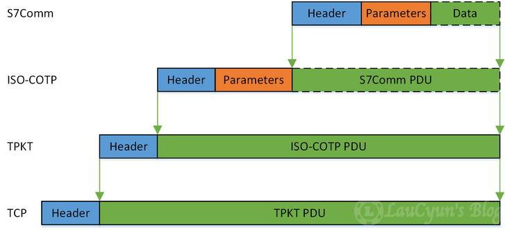

# 二、S7Comm协议

S7Comm数据作为COTP数据包的有效载荷，第一个字节总是0x32作为协议标识符。

S7Comm协议包含三部分：

- Header
- Parameter
- Data

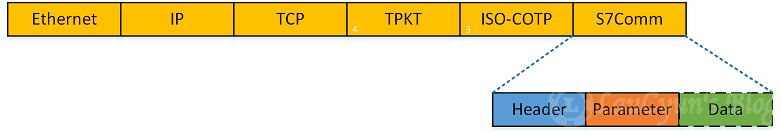

根据实现的功能不同，S7 comm协议的结构会有所不同。

## 2、1 S7Comm头结构

S7Comm的头，定义了该包的类型、参数长度、数据长度等，其结构如图所示：

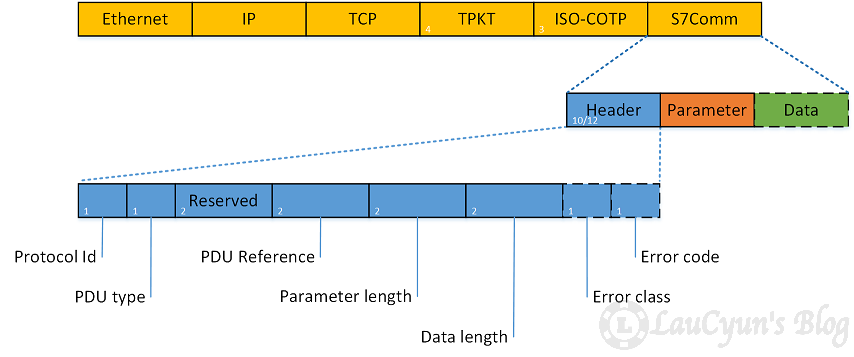

所以，S7Comm Header的格式为：

- 0 (unsigned integer, 1 byte): Protocol Id，协议ID，通常为`0x32`；
- 1 (unsigned integer, 1 byte): ROSCTR，PDU type，PDU的类型，一般有以下取值：
  - `0x01`：作业请求（JOB），由主设备发送的请求（例如，读/写存储器，读/写块，启动/停止设备，设置通信）；
  - `0x02`：确认响应（ACK），没有数据的简单确认；
  - `0x03`：确认数据响应（ACK_DATA），这个一般都是响应JOB的请求；
  - `0x07`：协议的扩展（USERDATA），参数字段包含请求/响应ID（用于编程/调试，读取SZL，安全功能，时间设置，循环数据...）。
- 2~3 (unsigned integer, 2 bytes): Redundancy Identification (Reserved)，冗余数据，通常为`0x0000`；
- 4~5 (unsigned integer, 2 bytes): 协议数据单元参考，通过请求事件增加；
- 6~7 (unsigned integer, 2 bytes): 参数部分的总长度；
- 8~9 (unsigned integer, 2 bytes): 数据长度。如果读取PLC内部数据，此处为`0x0000`；对于其他功能，则为Data部分的数据长度；

其中最重要的字段就是ROSCTR，它决定了后续参数的结构

## 2、2 作业请求（Job）和确认数据响应（Ack_Data）

上面介绍了S7Comm PDU的结构和通用协议头其头部结构。

S7Comm中Job和Ack_Data中的Parameter项的第一个字段是function（功能码），其类型为Unsigned integer，大小为`1 byte`。

所以接下来，将进一步介绍各功能码对应的结构和作用。

### 2、2、1 建立通信（Setup communication [0xF0]）

当PDU类型为Job时，建立通信功能中Parameter的结构，如下图：

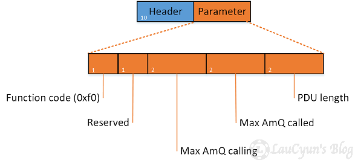

具体的参数结构，如下：

- 1 (Unsigned integer, 1 byte):  PDU 中的保留字节；
- 2 (Unsigned integer, 2 bytes): 主叫方（请求发起方）最大并行确认作业数；
- 3 (Unsigned integer, 2 bytes): 被叫方（请求接收方）最大并行确认作业数；
- 4 (Unsigned integer, 2 bytes): 协商PDU长度。

示例采用的pcap名为s7comm_varservice_libnodavedemo.pcap

请求报文：

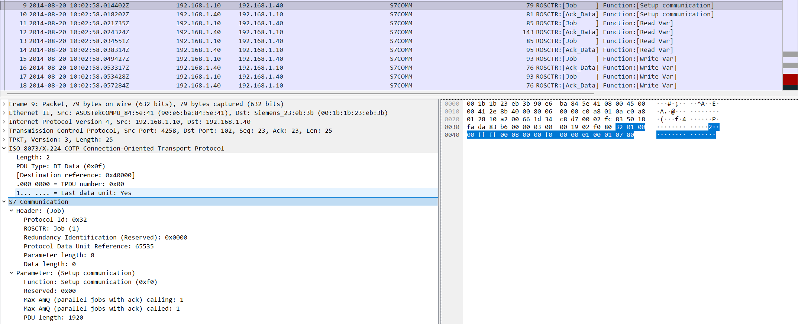

响应报文：

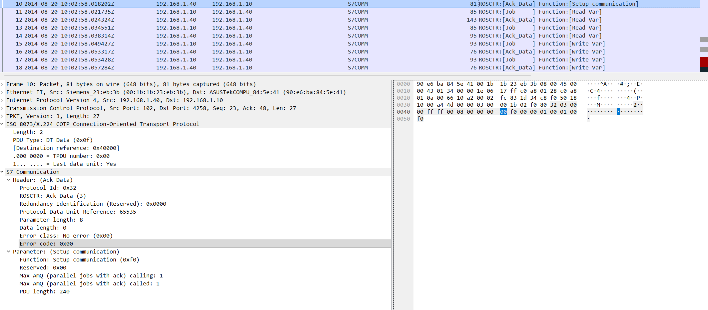

### 2、2、2 读取值（Read Var [0x04]）

数据读写操作通过指定变量的存储区域，地址（偏移量）及其大小或类型来执行。

当PDU类型为Job时，那么其S7Comm结构，如图所示：

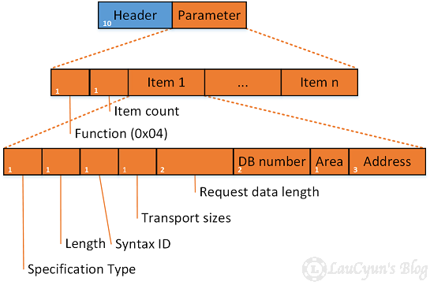

所以，接下来的Parameter字段是item count（项目个数），其类型为`Unsigned integer`，大小为`1 byte`。

那么一个item的结构是咋样的呢？如下（图17中item1）：

- 0 (Unsigned integer, 1 byte)：结构标识（Variable specification），通常为`0x12`，代表变量规范；
- 1 (Unsigned integer, 1 byte)：长度（Length of following address specification），主要是以此往后的长度；
- 2 (Unsigned integer, 1 byte)： 结构标识的Syntax Ids（Syntax Ids of variable specification），确定寻址模式和其余项目结构的格式。常见的Syntax Id，可参考[6.5](https://web.archive.org/web/20190925060928/https://laucyun.com/3aa43ada8cfbd7eca51304b0c305b523.html#6-5)；
- 3(Unsigned integer, 1 byte)：变量的类型（Transport sizes in item data），常见的变量类型，可参考[6.4.1](https://web.archive.org/web/20190925060928/https://laucyun.com/3aa43ada8cfbd7eca51304b0c305b523.html#6-4-1)；
- 4~5 (Unsigned integer ,2 byte)：请求数据长度（Request data length）；
- 6~7 (Unsigned integer, 2 byte)：DB编号（DB number），如果访问的不是DB区域，此处为`0x0000`；
- 8 (Unsigned integer, 1 byte)：区域（Area），常见的区域，可参考[6.3](https://web.archive.org/web/20190925060928/https://laucyun.com/3aa43ada8cfbd7eca51304b0c305b523.html#6-3)；
- 9~11(Unsigned integer, 3 byte)：地址（Address）。

头晕了吧？哈哈哈~~先举个例子：

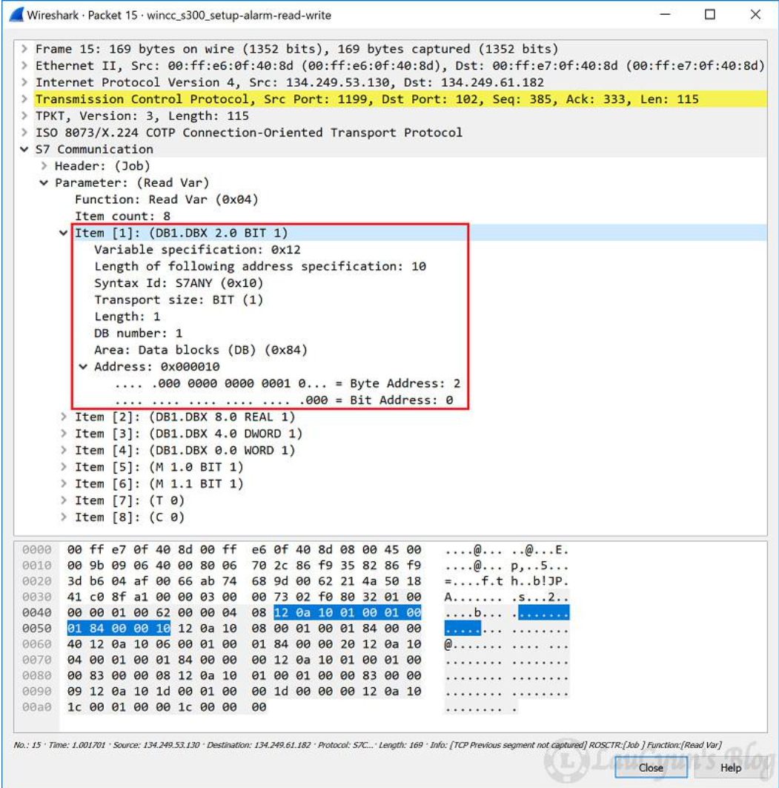

上图中item1是读取`DB1`的Address地址处`0x000010`（DB1.DBX 2.0 BIT 1）值，并且（Transport size）类型为BIT的请求。

////////////////////////////////////////////////////////////////////////////////////////////////////////////////////////////////

PDU类型为Job时，S7Comm结构介绍完了，那PDU类型为Ack_Data时，其S7Comm的结构如何呢？

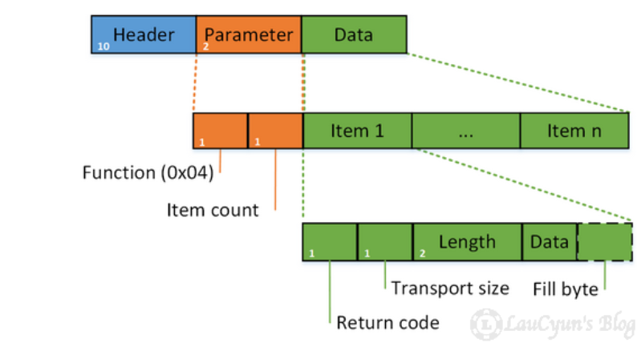

其Parameter只有function、item count两个字段。

继续，那么接下来的是Data啦！其结构如下：

- 0 (Unsigned integer, 1 byte): 返回码（Return Code），常见的返回码，可参考[6.6](https://web.archive.org/web/20190925060928/https://laucyun.com/3aa43ada8cfbd7eca51304b0c305b523.html#6-6)；
- 1 (Unsigned integer, 1 byte): 数据传输大小（Transport Size），常见的值，可参考[6.4.2](https://web.archive.org/web/20190925060928/https://laucyun.com/3aa43ada8cfbd7eca51304b0c305b523.html#6-4-2)；
- 2~3 (Unsigned integer, 2 bytes): 数据的长度（Length）；
- 4~4+length (?): 数据（Data）；
- n (Unsigned integer, 1 byte): 填充字节（Fill byte），如果数据的长度不足Length的话，则填充`0x00`。

继续看其响应的数据包：

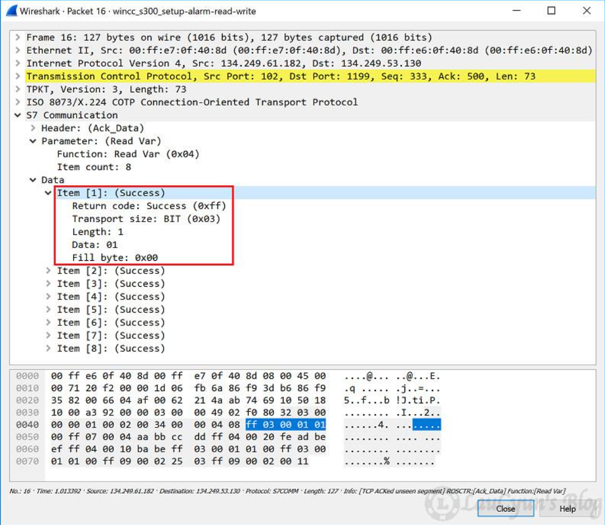

图中，item1是读取`DB1`的`0x000010（DB1.DBX 2.0 BIT 1）`值，并且类型为BIT的响应，其响应的数据为`01`。

### 2、2、3 写入值（Write Var [0x05]）

Write Var中Parameter的结构跟2.2.2一样，但是Write Va还需写入值，所以Write Var比Read Var多Data项。结构如下：

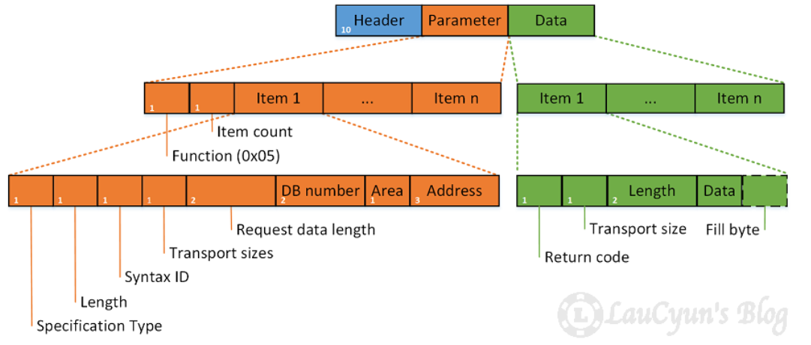

由此，Data的结构为：

- 0 (Unsigned integer, 1 byte): 返回码（Return Code），这里是未定义，所以为Reserved（0x00）；
- 1 (Unsigned integer, 1 byte): 数据传输大小（Transport Size），常见的值，可参考[6.4.2](https://web.archive.org/web/20190925060928/https://laucyun.com/3aa43ada8cfbd7eca51304b0c305b523.html#6-4-2)；
- 2~3 (Unsigned integer, 2 bytes): 数据的长度（Length）；
- 4~4+length (?): 写入的数据（Data）；
- n (Unsigned integer, 1 byte): 填充字节（Fill byte），如果数据的长度不足Length的话，则填充`0x00`。

举个例子：

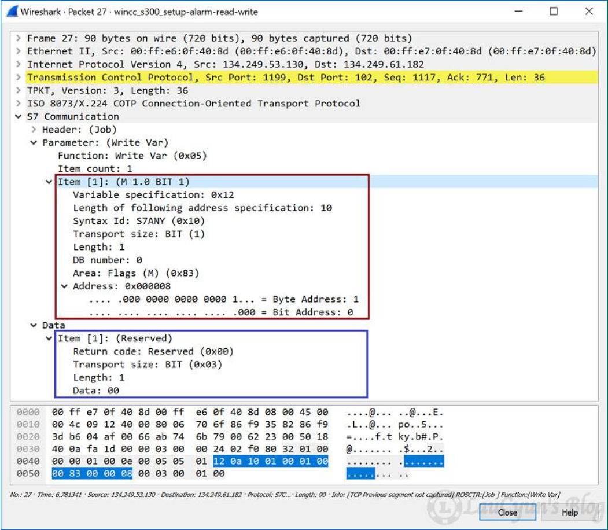

上图中，是一个向地址为0x000008的Flags（M）写入0x00的作业请求。

那PDU类型为Ack_Data时，其S7Comm的结构如何呢？

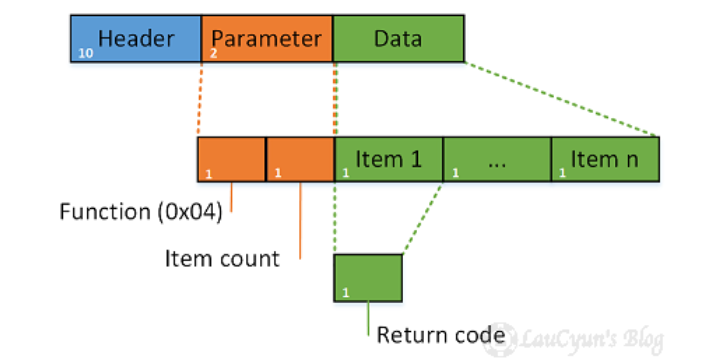对的，Parameter也只有function、item count两个字段。而Data中也只有一个Return code字段，其结构如下：

- 0 (Unsigned integer, 1 byte)：返回码（Return Code），常见的返回码，可参考请；

继续看响应数据包，如下图所示：

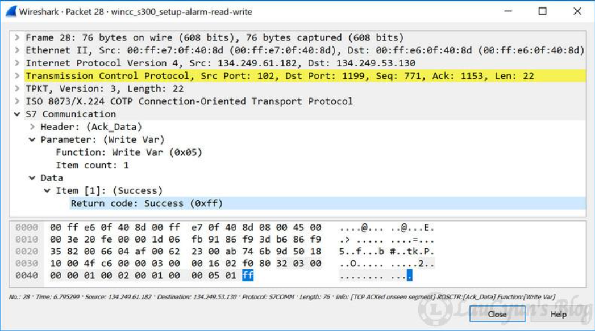

图中的item1，说明向地址为`0x000008`的`Flags（M）`写入`0x00`成功！

# 五、附录

## 5、1 返回码（Return Code）

响应报文中Data部分的常见返回码，如下表：

| Hex  | 值                               | 描述                                |
| :--- | :------------------------------- | :---------------------------------- |
| 0x00 | Reserved                         | 未定义，预留                        |
| 0x01 | Hardware error                   | 硬件错误                            |
| 0x03 | Accessing the object not allowed | 对象不允许访问                      |
| 0x05 | Invalid address                  | 无效地址，所需的地址超出此PLC的极限 |
| 0x06 | Data type not supported          | 数据类型不支持                      |
| 0x07 | Data type inconsistent           | 日期类型不一致                      |
| 0x0a | Object does not exist            | 对象不存在                          |
| 0xff | Success                          | 成功                                |

# 六、疑问点

ROSCTR还有Userdata的取值的。

参考链接：

https://web.archive.org/web/20190925060928/https://laucyun.com/3aa43ada8cfbd7eca51304b0c305b523.html

问题：

IEC61850 mms协议和S7 Common协议都是使用的102端口，