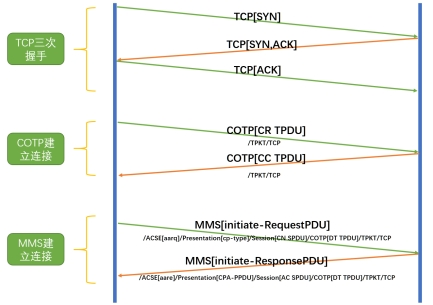
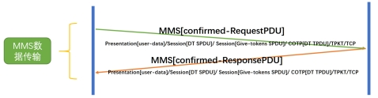
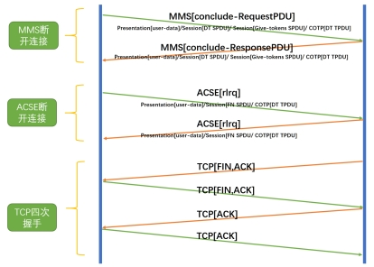
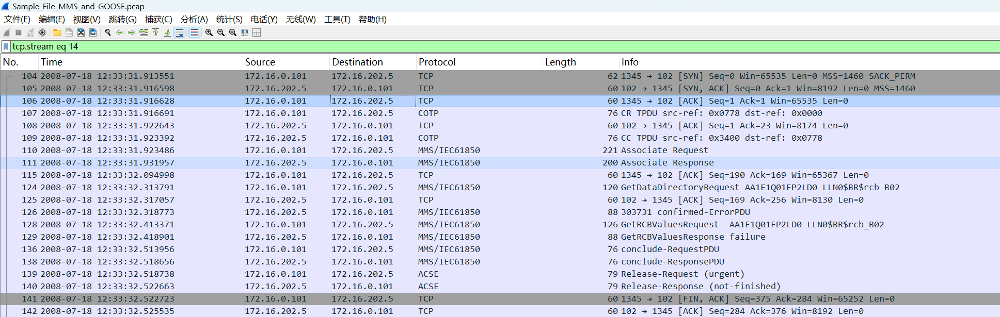
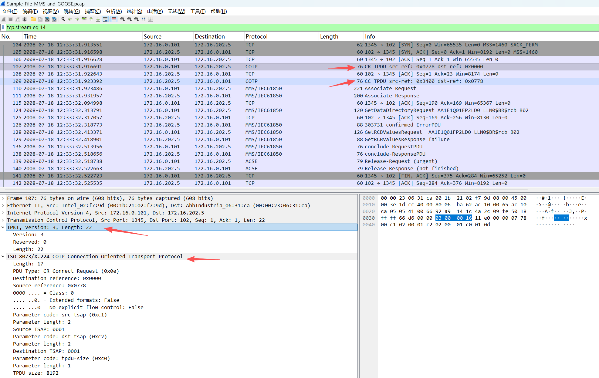
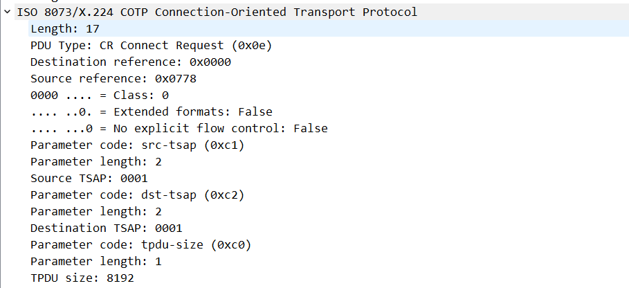
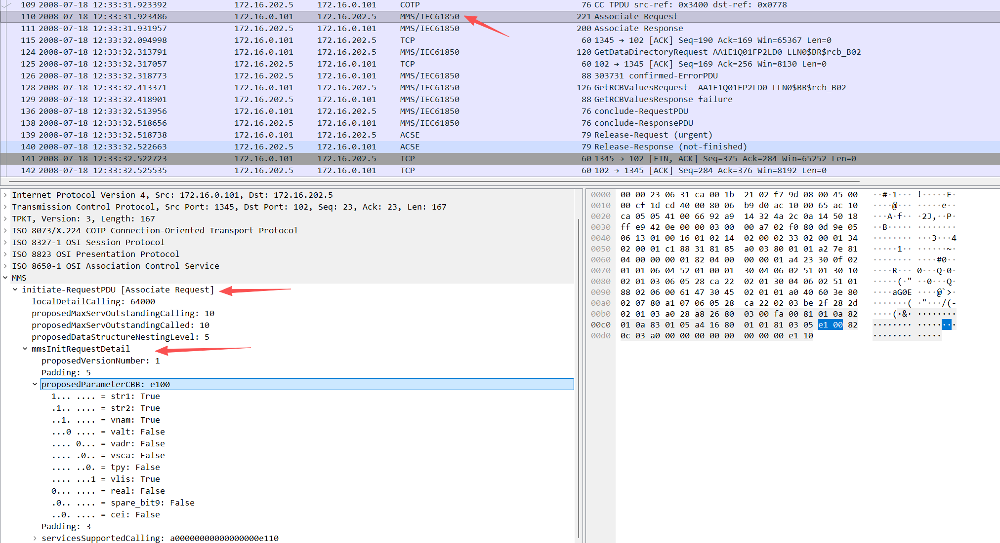
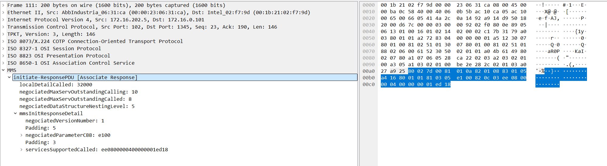
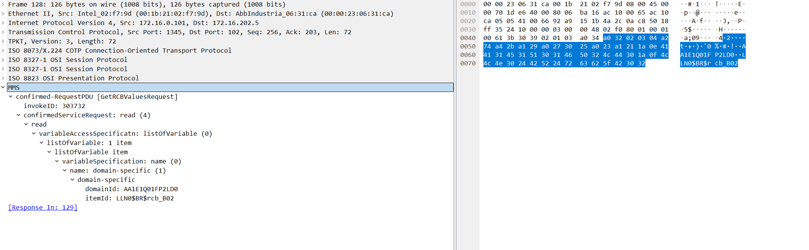
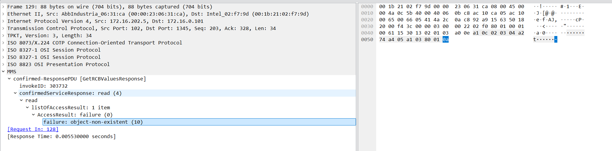

| 字段                                | Tag  | 值    | 说明                       |
| ----------------------------------- | ---- | ----- | -------------------------- |
| localDetailCalled                   | 80   | 32000 | 服务端最大PDU大小(字节)    |
| negotiatedMaxServOutstandingCalling | 81   | 10    | 协商后客户端最大并发请求数 |
| negotiatedMaxServOutstandingCalled  | 82   | 8     | 协商后服务端最大并发请求数 |
| negotiatedDataStructureNestingLevel | 83   | 5     | 协商后数据结构嵌套深度     |

各种疑问，


# 一、IEC-61850 MMS协议介绍

# 二、MMS通信过程剖析

MMS协议在开始进行数据交互之前需要建立关联，交互完成后有解除关联的过程。

建立连接：对应到实际报文上有三次交互过程，即TCP，COTP和MMS，其中会话层、表示层、ACSE的关联报文与MMS关联报文一起发送。

 

数据传输，简单请求-响应式交互。

 

断开连接：断开连接不仅需要断开MMS的关联，还需要断开底层建立的关联/连接。对应到报文上也是三次报文交互。

 

对应pcap文件"mms完整流程展示.pcap"



## 2、1 TCP三次握手建立连接

客户端随机端口访问服务端默认102端口发送syn数据包请求建立连接，服务端确认ack，同时也向客户端请求建立连接syn，客户端回复确认ack，tcp三次握手结束，连接建立。


## 2、2 COTP建立连接

在说COTP协议之前，先说下TPKT协议：

TPKT 解决的核心问题是**消息边界**。TCP 是面向字节流的协议，不保留消息边界，而 COTP 需要识别每个 TPDU 的起止位置。TPKT 通过在每个 TPDU 前面加一个带长度字段的头部，为 TCP 字节流重新划定了消息边界。

TPKT 头部只有 4 个字节：1 字节版本号（固定 0x03）、1 字节保留字段（固定 0x00）、2 字节长度字段（表示包含头部在内的整个 TPKT 报文总长度）。接收方先读取这 4 个字节解析出长度，就知道还需要再读多少字节才能凑齐一个完整的 COTP TPDU。

定位到序号为107的数据包，截图如下：




简单的介绍一下，COTP（ISO 8073/X.224 COTP Connection-Oriented Transport Protocol），翻译为面向连接的传输协议，这个协议的作用就是进行传输连接的建立，我们仔细观察上图中的两个COTP包，分别被标记为CR和CC,是connect request和connet confirm，功能就是COTP的连接请求包和连接确认包。

先细看下连接请求包：



连接请求的格式为：

```
0                   1                   2                   3
 0 1 2 3 4 5 6 7 8 9 0 1 2 3 4 5 6 7 8 9 0 1 2 3 4 5 6 7 8 9 0 1
+---------------+---------------+-------------------------------+
|      Length       |  Type (0xE0)  |         DST-REF           |
+---------------+---------------+-------------------------------+
|          SRC-REF              | Class/Option  |
+-------------------------------+---------------+
|                                               |
|          Variable Part (可变长度)              |
|  (TPDU Size, SRC-TSAP, DST-TSAP 等)           |
+-----------------------------------------------+
```

在可变长度的数据中，每个参数都遵循统一的 TLV 结构：

```
+----------------+----------------+------------------+
| Parameter Code | Parameter Len  | Parameter Data   |
|    1 字节       |    1 字节      |   Len 个字节     |
+----------------+----------------+------------------+
```


| **字节** | **数据报文**          | **报文含义**                                                 |
| -------- | --------------------- | ------------------------------------------------------------ |
| 1 byte   | Length                | COTP后续数据的长度                                           |
| 1 byte   | PDU type              | PDU类型如下：ED Expedited Data，加急数据EA Expedited Data Acknowledgement，加急数据确认UD，用户数据RJ Reject，拒绝AK Data Acknowledgement，数据确认ER TPDU Error，TPDU错误DR Disconnect Request，断开请求DC Disconnect Confirm，断开确认CC Connect Confirm，连接确认CR Connect Request，连接请求DT Data，数据传输 |
| 2 byte   | Destination reference | 目标的引用，可以认为是用来唯一标识目标                       |
| 2 byte   | Source reference      | 源的引用，可以认为是用来唯一标识目标                         |
| 1 byte   | opt                   | 包括Extended formats、No explicit flow control，值都是Boolean类型。前四位标识class，也就是标识类别，倒数第二位对应Extended formats，是否使用拓展样式，倒数第一位对应No explicit flow control，是否有明确的指定流控制。 |
| 7 bytes  | Parameter             | 参数。一般参数包含Parameter code(Unsigned integer, 1 byte)<br />Parameter length(Unsigned integer, 1 byte)和Parameter data三部分 |
| 1 byte   | code                  | 标识类型，主要包括：<br />0xc0，tpdu的size，tpdu即传送协议数据单元，也就是传输的数据的大小 <br />0xc1，src-tsap，源的端到端传输。 <br />0xc2，dst-tsap，目标的端到端传输。 |


## 2、3 MMS建立连接

MMS连接建立阶段主要有两种包：**initiate-RequestPDU、confirmed-RequestPDU**

### 2、3、1 initiate-RequestPDU请求

查看序号为110的数据包：



根据上述截图信息，MMS Initiate-RequestPDU 整体：

```
+------+--------+--------------------------------------------+
| Tag  | Length |                 Value                      |
| 0xA8 |  0x26  |      Initiate-RequestPDU (38字节)          |
+------+--------+--------------------------------------------+
```

顶层字段：

```
+------+--------+------------------+-----------------------------------+
| Tag  | Length |      Value       |             说明                   |
+------+--------+------------------+-----------------------------------+
| 0x80 |  0x03  |    0x00FA00      | localDetailCalling = 64000        |
|      |        |                  | (最大PDU大小, 单位字节)              |
+------+--------+------------------+-----------------------------------+
| 0x81 |  0x01  |    0x0A          | proposedMaxServOutstandingCalling |
|      |        |                  | = 10 (客户端最大并发请求数)          |
+------+--------+------------------+-----------------------------------+
| 0x82 |  0x01  |    0x0A          | proposedMaxServOutstandingCalled  |
|      |        |                  | = 10 (服务端最大并发请求数)          |
+------+--------+------------------+-----------------------------------+
| 0x83 |  0x01  |    0x05          | proposedDataStructureNestingLevel |
|      |        |                  | = 5 (数据嵌套层级)                  |
+------+--------+------------------+-----------------------------------+
| 0xA4 |  0x16  |  (见下方展开)      | initRequestDetail (22字节)        |
+------+--------+------------------+-----------------------------------+
```

initRequestDetail（0xA4）内部：

```
+------+--------+---------------------+-----------------------------------+
| Tag  | Length |        Value        |             说明                   |
+------+--------+---------------------+-----------------------------------+
| 0x80 |  0x01  |    0x01             | proposedVersionNumber = 1         |
+------+--------+---------------------+-----------------------------------+
| 0x81 |  0x03  |  05 E1 00           | proposedParameterCBB (BIT STRING) |
|      |        |                     | Padding: 5, 位串值: E100           |
+------+--------+---------------------+-----------------------------------+
| 0x82 |  0x0C  | 03 A0 00 00 00 00   | servicesSupportedCalling          |
|      |        | 00 00 00 00 E1 10   | (BIT STRING)                      |
|      |        |                     | Padding: 3, 位串值:                |
|      |        |                     | a000000000000000e110              |
+------+--------+---------------------+-----------------------------------+
```

BIT STRING 编码规则：Value 第一个字节为 Padding（未使用位数），后面才是位串数据。


### 2、3、2 initiate-ResponsePDU响应



**1）整体结构（TLV 逐层解析）**

```
A9 25                          ← initiate-ResponsePDU, 长度 37 字节
├── 80 02 7D 00                ← localDetailCalled: 32000
├── 81 01 0A                   ← negotiatedMaxServOutstandingCalling: 10
├── 82 01 08                   ← negotiatedMaxServOutstandingCalled: 8
├── 83 01 05                   ← negotiatedDataStructureNestingLevel: 5
└── A4 16                      ← mmsInitResponseDetail, 长度 22 字节
    ├── 80 01 01               ← negotiatedVersionNumber: 1
    ├── 81 03 05 E1 00         ← negotiatedParameterCBB (BIT STRING)
    └── 82 0C 03 EE 08 00 00  ← servicesSupportedCalled (BIT STRING)
              40 00 00 00 01
              ED 18
```


**2）基本参数详解**

| 字段                                | Tag  | 原始Hex | 值        | 说明                       |
| ----------------------------------- | ---- | ------- | --------- | -------------------------- |
| localDetailCalled                   | 80   | 7D 00   | **32000** | 服务端最大PDU大小(字节)    |
| negotiatedMaxServOutstandingCalling | 81   | 0A      | **10**    | 协商后客户端最大并发请求数 |
| negotiatedMaxServOutstandingCalled  | 82   | 08      | **8**     | 协商后服务端最大并发请求数 |
| negotiatedDataStructureNestingLevel | 83   | 05      | **5**     | 协商后数据结构嵌套深度     |

关键差异说明：

1. **PDU大小**：客户端希望64000字节，服务端只支持32000，后续通信以 **32000** 为上限
2. **MaxServOutstandingCalled**：客户端希望服务端并发处理10个请求，服务端只能 **8个**
3. **服务能力**：
   - 客户端（Calling）仅声明了少量服务（`a000000000000000e110`）
   - 服务端（Called）声明了丰富的服务能力（`ee0800004000000001ed18`），包括文件操作、域上传、信息报告等，这是 **IED设备**提供的完整 IEC 61850 MMS 服务集


### 2、3、3 confirmed-RequestPDU



总体嵌套关系

```
A0 32                         第1层  confirmed-RequestPDU
├── 02 03 [04 A2 74]          第2层  invokeID = 303732
└── A4 2B                     第2层  read服务
    └── A1 29                 第3层    variableAccessSpecification
        └── A0 27             第4层      listOfVariable            
            └── 30 25         第5层        变量项
                └── A0 23     第6层          name方式
                    └── A1 21 第7层            domain-specific
                        ├── 1A 0E [AA1E1Q01FP2LD0]   第8层 设备名
                        └── 1A 0F [LLN0$BR$rcb_B02]  第8层 变量名
```


TLV逐层解析

#### **第1层：confirmed-RequestPDU**

```
+------+--------+---------------------+----------------------------------------+
| Tag  | Length |       Value         |              说明                       |
+------+--------+---------------------+----------------------------------------+
| 0xA0 |  0x32  | (后续50字节)         | confirmed-RequestPDU                   |
|      |        |                     | Tag解读: A0 = [0] CONSTRUCTED          |
|      |        |                     | 查 MmsPdu 的 CHOICE                    |
|      |        |                     | 编号[0] = confirmed-RequestPDU         |
+------+--------+---------------------+----------------------------------------+
```

tag解读

```
0xA0 = 1010 0000
       ││└──┴──┴──── 低5位: 00000 = Tag编号 0
       │└──────────── 第5位: 1 = Constructed
       └───────────── 高2位: 10 = Context-specific
```


如何判断出是confirmed-RequestPDU？根据附录表中A0就代表confirmed-RequestPDU

```
+--------+------------------------------+----------+
| 编号   | PDU类型                       | Tag值     |
+--------+------------------------------+----------+
|  [0]   | confirmed-RequestPDU         | 0xA0     |
|  [1]   | confirmed-ResponsePDU        | 0xA1     |
|  [2]   | confirmed-ErrorPDU           | 0xA2     |
|  [3]   | unconfirmed-PDU              | 0xA3     |
|  [4]   | rejectPDU                    | 0xA4     |
|  ...   | ...                          | ...      |
|  [8]   | initiate-RequestPDU          | 0xA8     |
|  [9]   | initiate-ResponsePDU         | 0xA9     |
+--------+------------------------------+----------+
```


#### **第2层：invokeID + read 服务**

```
+------+--------+---------------------+----------------------------------------+
| Tag  | Length |       Value         |              说明                       |
+------+--------+---------------------+----------------------------------------+
| 0x02 |  0x03  | 04 A2 74            | invokeID = 303732                      |
|      |        |                     | 0x02 = UNIVERSAL INTEGER               |
|      |        |                     | 请求编号，用来匹配响应                   |
|      |        |                     | 0x04A274 = 303732                      |
+------+--------+---------------------+----------------------------------------+
| 0xA4 |  0x2B  | (后续43字节)         | confirmedServiceRequest: read          |
|      |        |                     | Tag解读: A4 = [4] CONSTRUCTED          |
|      |        |                     | 查 ConfirmedServiceRequest 的 CHOICE   |
|      |        |                     | 编号[4] = read服务（读取变量）           |
+------+--------+---------------------+----------------------------------------+
```

0xA4 这个 Tag 字节怎么对应到 read 的？

```
0xA4 = 1010 0100
       ││└──┴──┴──── 低5位: 00100 = Tag编号 4
       │└──────────── 第5位: 1 = Constructed（结构体，里面还有嵌套）
       └───────────── 高2位: 10 = Context-specific（上下文特定类）
```

因为 confirmed-RequestPDU 里面有一个字段叫 `confirmedServiceRequest`，它也是一个 CHOICE 菜单：

```
+--------+-------------------------------------+----------+
| 编号   | 服务类型                              | Tag值     |
+--------+-------------------------------------+----------+
|  [0]   | status（状态查询）                    | 0xA0     |
|  [1]   | getNameList（获取名称列表）            | 0xA1     |
|  [2]   | identify（身份识别）                  | 0xA2     |
|  [3]   | rename（重命名）                      | 0xA3     |
|  [4]   | read（读取变量）            ← 命中！   | 0xA4     |
|  [5]   | write（写入变量）                     | 0xA5     |
|  [6]   | getVariableAccessAttributes         | 0xA6     |
|  [7]   | defineNamedVariable                 | 0xA7     |
|  ...   | ...                                 | ...      |
+--------+-------------------------------------+----------+
```


#### **第3层：variableAccessSpecification**

```
+------+--------+---------------------+----------------------------------------+
| Tag  | Length |       Value         |              说明                       |
+------+--------+---------------------+----------------------------------------+
| 0xA1 |  0x29  | (后续41字节)         | variableAccessSpecification            |
|      |        |                     | Tag解读: A1 = [1] CONSTRUCTED          |
|      |        |                     | 查 ReadRequest 的 SEQUENCE             |
|      |        |                     | 编号[1] = variableAccessSpecification  |
|      |        |                     | （指定要读哪些变量）                     |
+------+--------+---------------------+----------------------------------------+
```

Tag解码，如何解析出variableAccessSpecification？

```
0xA1 = 1010 0001
       ││└──┴──┴──── 低5位: 00001 = Tag编号 1
       │└──────────── 第5位: 1 = Constructed（结构体，里面还有嵌套）
       └───────────── 高2位: 10 = Context-specific（上下文特定类）
```

解码器看到 **0xA1 → 编号[1] → 查 ReadRequest 的 SEQUENCE 定义 → variableAccessSpecification**。

```
+--------+-------------------------------+--------+-------------------+
| 编号   | 字段名                         | Tag值   | 备注              |
+--------+-------------------------------+--------+-------------------+
|  [0]   | specificationWithResult       | 0x80   | 可选，默认FALSE    |
|        |                               |        | 本帧中省略了       |
+--------+-------------------------------+--------+-------------------+
|  [1]   | variableAccessSpecification   | 0xA1   | ← 命中！         |
|        |                               |        | 指定要读哪些变量   |
+--------+-------------------------------+--------+-------------------+
```


#### **第4层：listOfVariable**

```
+------+--------+---------------------+----------------------------------------+
| Tag  | Length |       Value         |              说明                       |
+------+--------+---------------------+----------------------------------------+
| 0xA0 |  0x27  | (后续39字节)         | listOfVariable                         |
|      |        |                     | Tag解读: A0 = [0] CONSTRUCTED          |
|      |        |                     | 查 VariableAccessSpecification 的 CHOICE|
|      |        |                     | 编号[0] = listOfVariable               |
|      |        |                     | （用变量列表方式逐个指定）               |
+------+--------+---------------------+----------------------------------------+
```

表格：

```
VariableAccessSpecification ::= CHOICE {
    listOfVariable    [0] SEQUENCE OF ListOfVariableItem,
    variableListName  [1] ObjectName
}
```

**`SEQUENCE OF` 的意思是"一个列表，里面每个元素类型相同"。列表里的每个元素就是一个 `ListOfVariableItem`，它本身是一个标准的 SEQUENCE，所以直接用 UNIVERSAL 标签 0x30。**

```
+--------+------------------------------+--------+-------------------------------+
| 编号   | 选项                          | Tag值   | 说明                          |
+--------+------------------------------+--------+-------------------------------+
|  [0]   | listOfVariable               | 0xA0   | 逐个列出要读/写的变量            |
|        |                              |        | 里面是一个变量项的列表           |
+--------+------------------------------+--------+-------------------------------+
|  [1]   | variableListName             | 0xA1   | 用一个预定义的变量列表名称        |
|        |                              |        | 服务端事先定义好了一组变量        |
|        |                              |        | 客户端只需说出列表名字即可        |
+--------+------------------------------+--------+-------------------------------+
```


#### **第5层：变量项**

```
+------+--------+---------------------+----------------------------------------+
| Tag  | Length |       Value         |              说明                       |
+------+--------+---------------------+----------------------------------------+
| 0x30 |  0x25  | (后续37字节)         | listOfVariable item: SEQUENCE          |
|      |        |                     | Tag解读: 30 = UNIVERSAL SEQUENCE       |
|      |        |                     | 列表中的一个变量项                       |
+------+--------+---------------------+----------------------------------------+
```

tag解读

```
0x30 = 0011 0000
       │ │└─┴──┴──── 低5位: 10000 = 16 → SEQUENCE
       │ └──────────── 第5位: 1 = Constructed（结构体，里面还有嵌套）
       └───────────── 高2位: 00 = UNIVERSAL（通用类）
```

0x30 就是 ASN.1 标准中固定的 **SEQUENCE** 标签。


#### **第6层：variableSpecification（name方式）**

```
+------+--------+---------------------+----------------------------------------+
| Tag  | Length |       Value         |              说明                       |
+------+--------+---------------------+----------------------------------------+
| 0xA0 |  0x23  | (后续35字节)         | variableSpecification: name            |
|      |        |                     | Tag解读: A0 = [0] CONSTRUCTED          |
|      |        |                     | 查 variableSpecification 的 CHOICE     |
|      |        |                     | 编号[0] = name                         |
|      |        |                     | （用"名字"方式指定要读哪个变量）          |
+------+--------+---------------------+----------------------------------------+
```

tag解读

```
0xA0 = 1010 0000
       ││└──┴──┴──── 低5位: 00000 = Tag编号 0
       │└──────────── 第5位: 1 = Constructed（结构体，里面还有嵌套）
       └───────────── 高2位: 10 = Context-specific（上下文特定类）
```

回到了熟悉的 Context-specific，**编号 [0]**。

上一层确定了 `ListOfVariableItem` 的第一个字段是 `variableSpecification`，它的类型是 `VariableSpecification`，又是一个 **CHOICE**（菜单）：

查找表：

```
+--------+-------------------------------+--------+------------------------------+
| 编号   | 选项                           | Tag值   | 说明                          |
+--------+-------------------------------+--------+------------------------------+
|  [0]   | name                          | 0xA0   | ← 命中！                     |
|        |                               |        | 用"名字"来指定变量             |
|        |                               |        | 最常用的方式                   |
+--------+-------------------------------+--------+------------------------------+
|  [1]   | address                       | 0xA1   | 用"内存地址"来指定变量          |
|        |                               |        | 直接给出变量的存储地址           |
+--------+-------------------------------+--------+------------------------------+
|  [2]   | variableDescription           | 0xA2   | 用"描述"来指定变量              |
|        |                               |        | 给出地址+类型描述               |
+--------+-------------------------------+--------+------------------------------+
|  [3]   | scatteredAccessDescription    | 0xA3   | 分散访问                       |
|        |                               |        | 访问一个变量中多个不连续的部分    |
+--------+-------------------------------+--------+------------------------------+
|  [4]   | invalidated                   | 0xA4   | 已失效                         |
|        |                               |        | 标记变量已无效                  |
+--------+-------------------------------+--------+------------------------------+
```


#### **第7层：domain-specific**

```
+------+--------+---------------------+----------------------------------------+
| Tag  | Length |       Value         |              说明                       |
+------+--------+---------------------+----------------------------------------+
| 0xA1 |  0x21  | (后续33字节)         | name: domain-specific                  |
|      |        |                     | Tag解读: A1 = [1] CONSTRUCTED          |
|      |        |                     | 查 ObjectName 的 CHOICE                |
|      |        |                     | 编号[1] = domain-specific              |
|      |        |                     | （用"域名+变量名"方式定位）              |
+------+--------+---------------------+----------------------------------------+
```

tag解读

```
0xA1 = 1010 0001
       ││└──┴──┴──── 低5位: 00001 = Tag编号 1
       │└──────────── 第5位: 1 = Constructed（结构体，里面还有嵌套）
       └───────────── 高2位: 10 = Context-specific（上下文特定类）
```

**编号 [1]**，Context-specific，继续查菜单。

```
+--------+---------------------+--------+----------------------------------------+
| 编号   | 选项                 | Tag值   | 说明                                    |
+--------+---------------------+--------+----------------------------------------+
|  [0]   | vmd-specific        | 0x80   | VMD（虚拟制造设备）级别的变量             |
|        |                     |        | 全局变量，不属于任何特定域                |
|        |                     |        | Primitive，只需一个 Identifier           |
+--------+---------------------+--------+----------------------------------------+
|  [1]   | domain-specific     | 0xA1   | ← 命中！                               |
|        |                     |        | 域（Domain）级别的变量                   |
|        |                     |        | Constructed，里面包含两个字段             |
|        |                     |        | 需要"域名+变量名"一起定位                |
+--------+---------------------+--------+----------------------------------------+
|  [2]   | aa-specific         | 0x82   | AA（应用关联）级别的变量                  |
|        |                     |        | 只在当前连接会话内有效                    |
|        |                     |        | Primitive，只需一个 Identifier           |
+--------+---------------------+--------+----------------------------------------+
```

这三种方式就像找一本书的三种定位级别：

- **[0] vmd-specific**：说书名就行——"我要《三国演义》"（全图书馆就一本，不会重名）
- **[1] domain-specific**：说楼层+书名——"3楼的《三国演义》"（不同楼层可能有同名的书）← 本帧用的
- **[2] aa-specific**：说"就是我刚才借过的那本"（只在当前借阅会话内有效）

在 IEC 61850 场景下，**domain 就是逻辑设备（LD）**，所以 domain-specific 的意思就是"告诉我是哪个逻辑设备里的哪个变量"。


#### **第8层：domainId + itemId**

Tag 拆解

```
0x1A = 0001 1010
       ││└──┴──┴──── 低5位: 11010 = 26 → VisibleString
       │└──────────── 第5位: 0 = Primitive（原始类型，没有嵌套了）
       └───────────── 高2位: 00 = UNIVERSAL（通用类）
```

和第5层的 0x30 一样，**高2位是 00，UNIVERSAL 类型**，不需要查上下文菜单。0x1A 是 ASN.1 标准中固定的 **VisibleString** 标签（Tag编号26）。

并且注意**第5位是 0，Primitive**，说明这是最底层了，里面不再有嵌套结构，直接就是原始数据。

VisibleString 是 ASN.1 中的一种字符串类型，只允许包含 ASCII 可见字符，在 MMS 协议中，`Identifier` 就是用 VisibleString 来表示的：

第一个字段：domainId

```
+------+--------+--------------------------------------+---------------------+
| Tag  | Length |              Value（Hex）              | 说明                 |
+------+--------+--------------------------------------+---------------------+
| 0x1A |  0x0E  | 41 41 31 45 31 51 30 31              | domainId             |
|      | (14)   | 46 50 32 4C 44 30                    | 域名（逻辑设备名）    |
+------+--------+--------------------------------------+---------------------+
```

逐字节 ASCII 解码：

```
41 → 'A'
41 → 'A'
31 → '1'
45 → 'E'
31 → '1'
51 → 'Q'
30 → '0'
31 → '1'
46 → 'F'
50 → 'P'
32 → '2'
4C → 'L'
44 → 'D'
30 → '0'
```

拼起来：**AA1E1Q01FP2LD0**


第二个字段：itemId

```
+------+--------+--------------------------------------+---------------------+
| Tag  | Length |              Value（Hex）              | 说明                 |
+------+--------+--------------------------------------+---------------------+
| 0x1A |  0x0F  | 4C 4C 4E 30 24 42 52 24              | itemId               |
|      | (15)   | 72 63 62 5F 42 30 32                 | 变量名               |
+------+--------+--------------------------------------+---------------------+
```

逐字节 ASCII 解码：

```
4C → 'L'
4C → 'L'
4E → 'N'
30 → '0'
24 → '$'
42 → 'B'
52 → 'R'
24 → '$'
72 → 'r'
63 → 'c'
62 → 'b'
5F → '_'
42 → 'B'
30 → '0'
32 → '2'
```

拼起来：**LLN0$BR$rcb_B02**


### 2、3、4 confirmed-ResponsePDU



总体嵌套关系

```
A1 0C                              第1层  confirmed-ResponsePDU
├── 02 03 [04 A2 74]               第2层  invokeID = 303732
└── A4 05                          第2层  confirmedServiceResponse: read
    └── A1 03                      第3层    listOfAccessResult (1 item)
        └── 80 01 [0A]             第4层      failure: object-non-existent (10)
```

TLV 逐层解析

#### 第1层：confirmed-ResponsePDU

```
+------+--------+---------------------+----------------------------------------+
| Tag  | Length |       Value         |              说明                       |
+------+--------+---------------------+----------------------------------------+
| 0xA1 |  0x0C  | (后续12字节)         | confirmed-ResponsePDU                  |
+------+--------+---------------------+----------------------------------------+
```

Tag 拆解：

```
0xA1 = 1010 0001
       ││└──┴──┴──── 低5位: 00001 = Tag编号 1
       │└──────────── 第5位: 1 = Constructed
       └───────────── 高2位: 10 = Context-specific
```

查 MmsPdu 的 CHOICE：

```
+--------+------------------------------+--------+
| 编号   | 选项                          | Tag值   |
+--------+------------------------------+--------+
|  [0]   | confirmed-RequestPDU         | 0xA0   |  ← 上一帧（请求）
|  [1]   | confirmed-ResponsePDU        | 0xA1   |  ← 本帧命中！（响应）
|  [2]   | confirmed-ErrorPDU           | 0xA2   |
|  [3]   | unconfirmed-PDU              | 0xA3   |
|  ...   | ...                          | ...    |
+--------+------------------------------+--------+
```

#### 第2层：invokeID + read 响应

```
+------+--------+---------------------+----------------------------------------+
| Tag  | Length |       Value         |              说明                       |
+------+--------+---------------------+----------------------------------------+
| 0x02 |  0x03  | 04 A2 74            | invokeID = 303732                      |
|      |        |                     | 0x02 = UNIVERSAL INTEGER               |
|      |        |                     | 与请求帧的 invokeID 完全一致             |
|      |        |                     | 服务端原样回传，用于请求-响应配对         |
+------+--------+---------------------+----------------------------------------+
| 0xA4 |  0x05  | (后续5字节)          | confirmedServiceResponse: read         |
|      |        |                     | A4 = [4] CONSTRUCTED                   |
|      |        |                     | 编号[4] = read                         |
+------+--------+---------------------+----------------------------------------+
```

**invokeID 配对机制**：请求帧发出 invokeID = 303732，响应帧回传同一个值。客户端收到后比对编号，就知道"这是对我那条 read 请求的回复"。

#### 第3层：listOfAccessResult

```
+------+--------+---------------------+----------------------------------------+
| Tag  | Length |       Value         |              说明                       |
+------+--------+---------------------+----------------------------------------+
| 0xA1 |  0x03  | (后续3字节)          | listOfAccessResult                     |
|      |        |                     | A1 = [1] CONSTRUCTED                   |
|      |        |                     | ReadResponse (SEQUENCE) 中的字段 [1]    |
+------+--------+---------------------+----------------------------------------+
```

查 ReadResponse 的 SEQUENCE（"填表"）：

```
ReadResponse ::= SEQUENCE {
    [0] variableAccessSpecification  OPTIONAL,  ← 本帧未出现（可选）
    [1] listOfAccessResult                      ← 命中！结果列表
}
```

请求读了 1 个变量，所以结果列表里也只有 **1 个元素**。


#### 第4层：AccessResult — failure

```
+------+--------+---------------------+----------------------------------------+
| Tag  | Length |       Value         |              说明                       |
+------+--------+---------------------+----------------------------------------+
| 0x80 |  0x01  | 0A                  | failure: object-non-existent (10)      |
+------+--------+---------------------+----------------------------------------+
```

Tag 拆解：

```
0x80 = 1000 0000
       ││└──┴──┴──── 低5位: 00000 = Tag编号 0
       │└──────────── 第5位: 0 = Primitive（原始类型，到底了）
       └───────────── 高2位: 10 = Context-specific
```

查 AccessResult 的 CHOICE（"点菜"）：

```
+--------+-------------+--------+---------------------------------------------+
| 编号   | 选项         | Tag值   | 说明                                         |
+--------+-------------+--------+---------------------------------------------+
|  [0]   | failure     | 0x80   | ← 命中！读取失败，返回错误码                   |
|        |             |        |   Primitive：直接携带一个整数错误码             |
+--------+-------------+--------+---------------------------------------------+
|  [1]   | success     | 0xA1   | 读取成功，返回变量的实际数据                    |
|        |             |        |   Constructed：里面嵌套具体的 Data 结构        |
+--------+-------------+--------+---------------------------------------------+
```

错误码 0x0A = 10，查 DataAccessError 枚举表：

```
+-------+----------------------------+----------------------------------+
| 值    | 错误名称                    | 含义                              |
+-------+----------------------------+----------------------------------+
|   0   | object-invalidated         | 对象已失效                        |
|   1   | hardware-fault             | 硬件故障                          |
|   2   | temporarily-unavailable    | 暂时不可用                        |
|   3   | object-access-denied       | 访问被拒绝                        |
|   4   | object-undefined           | 对象未定义                        |
|   ...                                                                 |
|  10   | object-non-existent        | ← 命中！对象不存在                |
+-------+----------------------------+----------------------------------+
```

请求-响应完整对照

```
请求（第128帧）                          响应（第129帧）
─────────────────────                   ─────────────────────
confirmed-RequestPDU (A0)        →      confirmed-ResponsePDU (A1)
invokeID = 303732                ←→     invokeID = 303732（配对）
read 请求                        →      read 响应
  读取目标:                              读取结果:
    域: AA1E1Q01FP2LD0                     failure (0)
    变量: LLN0$BR$rcb_B02                    object-non-existent (10)
```


## 2、4 MMS断开连接

### 2、4、1 conclude-RequestPDU

TLV 解析

```
+------+--------+---------------------+----------------------------------------+
| Tag  | Length |       Value         |              说明                       |
+------+--------+---------------------+----------------------------------------+
| 0x8B |  0x00  | （空，无内容）        | conclude-RequestPDU                    |
+------+--------+---------------------+----------------------------------------+
```

Tag 拆解：

```
0x8B = 1000 1011
       ││└──┴──┴──── 低5位: 01011 = Tag编号 11
       │└──────────── 第5位: 0 = Primitive（原始类型，没有嵌套）
       └───────────── 高2位: 10 = Context-specific
```

查 MmsPdu 的 CHOICE：

0x8B对应的是conclude-RequestPDU

**为什么这么简单？**

conclude-RequestPDU 的语义就是一句话：**"我要断开了"**。

不需要参数，不需要指定原因，不需要附带数据。就像打电话结束时说"挂了"——不需要额外解释什么。


### 2、4、2 conclude-ResponsePDU

TLV 解析

```
+------+--------+---------------------+----------------------------------------+
| Tag  | Length |       Value         |              说明                       |
+------+--------+---------------------+----------------------------------------+
| 0x8C |  0x00  | （空，无内容）        | conclude-ResponsePDU                   |
+------+--------+---------------------+----------------------------------------+
```


Tag 拆解：

```
0x8C = 1000 1100
       ││└──┴──┴──── 低5位: 01100 = Tag编号 12
       │└──────────── 第5位: 0 = Primitive（原始类型，没有嵌套）
       └───────────── 高2位: 10 = Context-specific
```


查 MmsPdu 的 CHOICE：

```
+--------+------------------------------+--------+--------+
| 编号   | 选项                          | Tag值   | 本帧    |
+--------+------------------------------+--------+--------+
| [11]   | conclude-RequestPDU          | 0x8B   | ← 上一帧 |
| [12]   | conclude-ResponsePDU         | 0x8C   | ← 命中！ |
+--------+------------------------------+--------+--------+
```


请求-响应对照

```
帧136  客户端 → 服务端   8B 00   conclude-RequestPDU    "我要断开了"
帧138  服务端 → 客户端   8C 00   conclude-ResponsePDU   "好的，同意"
```


**问题1：ACSE是否会出现在每个MMS报文中？**

ACSE 并不是在**每一个** MMS 报文中都会出现的。更准确的说法是需要分两种情况来看：

在**关联建立和释放阶段**（即 MMS 的 Initiate-Request/Response 和 Conclude-Request/Response），协议栈确实是你说的完整链路：Ethernet → IP → TCP → TPKT → COTP → Session → Presentation → ACSE → MMS。此时 ACSE 负责承载 Associate-Request/Response（A-ASSOCIATE）或 Release-Request/Response（A-RELEASE）等关联控制服务，MMS 的 Initiate PDU 作为 ACSE 的用户数据嵌在里面。

而在**关联建立之后的正常数据交换阶段**（如 Read、Write、GetNameList、InformationReport 等），MMS PDU 直接作为 Presentation 层的用户数据传输，不再经过 ACSE。此时实际的封装是：Ethernet → IP → TCP → TPKT → COTP → Session → Presentation → MMS。


# 三、附录

MMS 协议用 ASN.1 定义了 PDU 的格式

```
+------+------+------+----------------------------+----------------+------------------+
| 编号 | Tag  | P/C  | PDU 名称                    | 底层ASN.1类型   | 含义              |
+------+------+------+----------------------------+----------------+------------------+
|  [0] | 0xA0 |  C   | confirmed-RequestPDU       | SEQUENCE       | 需确认的请求       |
|  [1] | 0xA1 |  C   | confirmed-ResponsePDU      | SEQUENCE       | 需确认的响应       |
|  [2] | 0xA2 |  C   | confirmed-ErrorPDU         | SEQUENCE       | 需确认的错误       |
|  [3] | 0xA3 |  C   | unconfirmed-PDU            | SEQUENCE       | 无需确认的PDU      |
|  [4] | 0xA4 |  C   | rejectPDU                  | SEQUENCE       | 拒绝              |
|  [5] | 0x85 |  P   | cancel-RequestPDU          | Unsigned32     | 取消请求           |
|  [6] | 0x86 |  P   | cancel-ResponsePDU         | Unsigned32     | 取消响应           |
|  [7] | 0x87 |  P   | cancel-ErrorPDU            | Unsigned32     | 取消错误           |
|  [8] | 0xA8 |  C   | initiate-RequestPDU        | SEQUENCE       | 初始化请求         |
|  [9] | 0xA9 |  C   | initiate-ResponsePDU       | SEQUENCE       | 初始化响应         |
| [10] | 0xAA |  C   | initiate-ErrorPDU          | SEQUENCE       | 初始化错误         |
| [11] | 0x8B |  P   | conclude-RequestPDU        | NULL           | 结束请求           |
| [12] | 0x8C |  P   | conclude-ResponsePDU       | NULL           | 结束响应           |
| [13] | 0xAD |  C   | conclude-ErrorPDU          | SEQUENCE       | 结束错误           |
+------+------+------+----------------------------+----------------+------------------+
```

