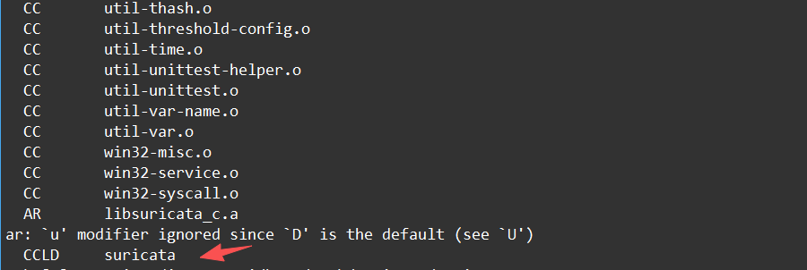
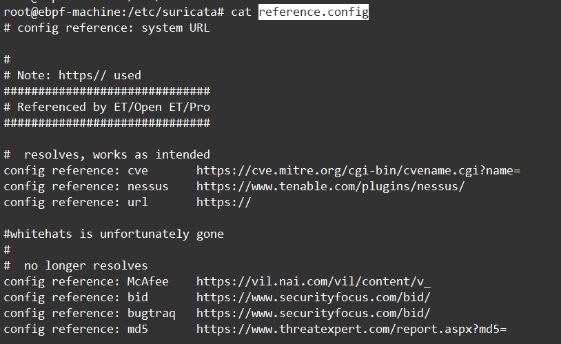

# 零、预安装要求

在ubuntu环境下，其依赖库如下：

```
apt-get -y install libpcre2-dev build-essential autoconf \
automake libtool libpcap-dev libnet1-dev libyaml-0-2 libyaml-dev \
pkg-config zlib1g zlib1g-dev libcap-ng-dev libcap-ng0 make \
libmagic-dev libjansson-dev rustc cargo jq git-core
```


# 一、编译安装

```
./scripts/bundle.sh
```

执行bundle.sh脚本获取的suricata-update的仓库源代码。


分为几个步骤

configure

make

make install


## 1、1 configure命令


### 1）常规configure

```
./configure --prefix=/usr  --sysconfdir=/etc --localstatedir=/var
```

**--prefix=/usr :**将Suricata二进制文件安装到/usr/bin/

**--sysconfdir=/etc :**将Suricata配置文件安装到/etc/suricata/

**--localstatedir=/var :**设置Suricata写日志到/var/log/suricata/


### 2） 开启调试和单元测试（可选）

执行如下的configure命令

```shell
CFLAGS="-g -O0" ./configure --prefix=/usr  --sysconfdir=/etc --localstatedir=/var  --enable-debug --enable-unittests
```

设置CFLAGS标志是因为要编译可单步debug版本的代码。

**--enable-debug :**开启debug模式

--enable-unittests：开启单元测试


### 3）htp库（可选）

```shell
CFLAGS="-g -O0" ./configure --prefix=/usr  --sysconfdir=/etc --localstatedir=/var  --enable-debug --enable-unittests --enable-non-bundled-htp --with-libhtp-includes=/usr/include --with-libhtp-libraries=/usr/lib
```

在执行configure命令之前需要配置下PKG_CONFIG_PATH环境变量，让suricata能否寻找到libhtp的位置


## 1、2 编译

| 命令               | 作用                                               |
| ------------------ | -------------------------------------------------- |
| make install-conf  | 安装 + 自动创建目录结构和 `suricata.yaml` 配置文件 |
| make install-rules | 安装 + 自动下载最新 Emerging Threats 规则集        |
| make install-full  | 安装 + 配置 + 规则，一步到位                       |


编译过程




编译

#make install-rules :安装suricata提供的规则文件到/etc/suricata/rules目录下

## 1、3 install安装

### 1）make install安装相关文件

**1、Suricata 主程序**


**2、suricatasc和suricatactl**

suricatasc通常用于和 Suricata Unix socket 交互，比如查看状态、触发规则重载；

suricatactl 是管理辅助工具。


**3、suricata-update 工具**

规则管理工具：下载 ET Open、合并规则、套用 disable.conf / enable.conf / drop.conf / modify.conf，最后生成 /var/lib/suricata/rules/suricata.rules。


**4、Suricata 自带规则文件**

安装到/usr/share/suricata/rules/，具体包括这些源代码rules目录下的文件：

```
app-layer-events.rules
decoder-events.rules
dhcp-events.rules
dnp3-events.rules
dns-events.rules
enip-events.rules
files.rules
ftp-events.rules
http-events.rules
http2-events.rules
ipsec-events.rules
kerberos-events.rules
ldap-events.rules
mdns-events.rules
modbus-events.rules
mqtt-events.rules
nfs-events.rules
ntp-events.rules
pgsql-events.rules
pop3-events.rules
quic-events.rules
rfb-events.rules
smb-events.rules
smtp-events.rules
ssh-events.rules
stream-events.rules
tls-events.rules
websocket-events.rules
```

这些不是 ET 规则，而是 Suricata 引擎自带的基础事件规则。比如协议解析异常、HTTP/ DNS/ TLS/ SSH 解析事件、解码器事件等。


rules/http-events.rules 是 Suricata 自带的 HTTP 协议异常事件规则文件。

它不是用来检测“某个木马、某个 CVE、某个 WebShell”的规则，而是用来把 Suricata HTTP 解析器发现的异常变成告警。

通俗理解：

HTTP 流量进入 Suricata
          ↓
  Suricata 的 HTTP 解析器尝试理解请求/响应
          ↓
  如果发现格式不正常、字段异常、压缩异常、协议不合规
          ↓
  触发 http-events.rules 里的对应规则
          ↓
  生成一条 SURICATA HTTP ... 告警

比如这个规则：

```
alert http any any -> any any (
    msg:"SURICATA HTTP missing Host header";
    flow:established,to_server;
    app-layer-event:http.missing_host_header;
    sid:2221014;
  )

```

规则含义：如果客户端发到服务器的 HTTP 请求里缺少 Host 头，就告警。

生产环境怎么理解这些告警：

这次 HTTP 请求或响应的格式有点“不正常”，比如头部写得不规范、字段异常、压缩内容解析失败、请求结构怪异等。正常软件有时也会产生这种流量，但攻击者也可能故意制造这种异常格式来绕过检测。


**5、共享数据文件classification.config和reference.config**

安装到/usr/share/suricata/目录下


### 2) make install-conf安装配置文件

make install-conf不仅执行常规的"make install"，还有自动创建必要的目录，以及suricata.yaml文件给你。

```
root@r630-PowerEdge-R630:/home/work/openSource/suricata-latest# make install-conf
install -d "/etc/suricata/"
install -d "/var/log/suricata/files"
install -d "/var/log/suricata/certs"
install -d "/var/run/"
install -m 770 -d "/var/run/suricata"
install -m 770 -d "/var/lib/suricata/data"
install -m 770 -d "/var/lib/suricata/cache/sgh"
```

1. 创建配置目录：
      - **/etc/suricata/**
  2. 如果目标文件不存在，就安装这些配置文件，权限是 600：
      - **suricata.yaml -> /etc/suricata/suricata.yaml**
      - **etc/classification.config -> /etc/suricata/classification.config**
      - **etc/reference.config -> /etc/suricata/reference.config**
      - **threshold.config -> /etc/suricata/threshold.config**

     注意：它用了 test -e ... || install ...，所以已有配置文件不会被覆盖。
  3. 创建 Suricata 运行/数据相关目录：
      - **/var/log/suricata/files**
      - **/var/log/suricata/certs**
      - **/var/run/**
      - **/var/run/suricata，权限 770**
      - **/var/lib/suricata/data，权限 770**
      - **/var/lib/suricata/cache/sgh，权限 770**


**疑问点1：classification.config是什么作用？**

**classification.config 解决的实际问题是：规则里只写一个简短的分类名，但告警输出需要给人看的分类描述和严重级别。**

例如文件里有这一行：

```
config classification: trojan-activity,A Network Trojan was detected, 1

trojan-activity                 短分类名，供规则里的 classtype 引用
A Network Trojan was detected   告警里展示的人类可读描述
1                               优先级，1 最高，4 较低
```

规则里引用的是短分类名：

```
alert tcp $HOME_NET any -> $EXTERNAL_NET any (
    msg:"Possible Trojan Activity";
    flow:established;
    content:"malicious-pattern";
    classtype:trojan-activity;
    sid:1000001;
    rev:1;
  )
```

当这条规则触发时，Suricata 会根据：classtype:trojan-activity;去 classification.config 里找到A Network Trojan was detected, 1

然后告警里就能显示成类似：
  [Classification: A Network Trojan was detected] [Priority: 1] {TCP} 192.168.1.10:45678 -> 8.8.8.8:443

所以它的核心作用是：

  - 把规则里的短分类名翻译成可读描述
  - 给该类规则分配默认优先级
  - 让不同规则集使用统一的分类体系
  - 方便分析人员按分类和优先级筛选告警

一句话概括：classification.config 是 classtype 的字典，规则引用短名，告警输出描述和优先级。


**疑问点2：reference.config是什么作用？**

**reference.config 解决的是：规则里只写简短的参考来源类型和编号，但分析告警时需要能还原成完整的外部资料链接。**

如图所示：



 config reference: cve       https://cve.mitre.org/cgi-bin/cvename.cgi?name=

 它定义的是：引用类型 -> URL 前缀，其中cve是引用类型，https://cve.mitre.org/cgi-bin/cvename.cgi?name=是URL 前缀

 规则里可以写：

```
alert tcp $HOME_NET any -> $EXTERNAL_NET any (
    msg:"ET TROJAN Likely Bot Nick in IRC";
    flow:established,to_server;
    content:"NICK ";
    pcre:"/NICK .*USA.*[0-9]{3,}/i";
    reference:cve,CVE-2014-1234; #这里是reference引用
    classtype:trojan-activity;
    sid:2008124;
    rev:2;
  )
```

结合：

config reference: cve https://cve.mitre.org/cgi-bin/cvename.cgi?name=

就表示：

https://cve.mitre.org/cgi-bin/cvename.cgi?name=CVE-2014-1234

所以它的核心作用是：

  - 规则里不用写一长串网址，只写一个简短代号就行
  - 把常用资料网站的地址格式放在一个文件中统一管理
  - 看到告警胡，可以根据reference快速拼出完整链接
  - 分析人员可以顺着这些链接去查这个告警对应的漏洞、攻击手法或规则说明

简单的一句话：reference.config 就像一个“网址前缀通讯录”。规则里只写 cve,CVE-2014-1234，Suricata 就知道它对应的是 CVE 网站上的这个漏洞页面。


**疑问点3：threshold.config是什么作用？**

threshold.config 可以理解成：控制告警频率的配置文件。

它解决的问题是：有些规则可能会在短时间内反复触发，导致日志里出现大量重复告警。threshold.config 可以限制这些告警的告警频次，避免告警刷屏。

```
threshold gen_id 1, sig_id 2404000, type limit, track by_dst, count 1, seconds 10
```

通俗解释：

对于 sid 为 2404000 的这条规则，按照目标IP分开统计，每个目标 IP 在 10 秒内最多只记录 1 条告警。

一句话概括：

threshold.config 就是 Suricata 的“告警限流配置”：用来控制重复告警的记录频率，防止日志被同类告警刷屏。


### 3) make install-rules 安装rules规则

默认情况下规则是安装在`/usr/share/suricata/rules`目录的。

我发现/usr/share/suricata/rules目录下还有很多规则文件，比如dns-events.rules、http-events.rules等很多rules文件，它和/var/lib/suricata/rules/suricata.rules的关系是什么？在实际生产环境中，我应该改写哪个文件呢？


/usr/share/suricata/rules/*.rules 是 Suricata 随程序安装自带的规则源文件，例如 dns-events.rules、http-events.rules、stream-events.rules。这些主要是协议解析器、解码器、应用层事件相关的基础规则。


/var/lib/suricata/rules/suricata.rules 是 suricata-update 生成的最终规则文件。它会把多个来源合并进去，包括：

  - **ET Open 下载规则**
  - **/usr/share/suricata/rules 下 Suricata 自带的分发规则**
  - **你配置的本地规则**
  - **启用、禁用、drop、modify 过滤后的结果**

Suricata 默认实际加载的是：

```
default-rule-path: /var/lib/suricata/rules
  rule-files:
   - suricata.rules
```

所以生产环境里，不要直接改 /usr/share/suricata/rules/*.rules，也不要手工改 /var/lib/suricata/rules/suricata.rules。

原因是：

- /usr/share/suricata/rules 属于软件安装内容，升级 Suricata 可能覆盖。
- /var/lib/suricata/rules/suricata.rules 属于 suricata-update 生成物，下次更新规则会覆盖。

## 1、4 注意事项

如果是新环境首次搭建，直接用：

```
./configure && make && sudo make install-full
```


### 注意事项

- 如果是**升级**已有环境，不要用 `install-conf`，否则会覆盖你已修改的 `suricata.yaml`
- 升级时建议只用 `make install`，然后手动对比新旧配置差异
- 规则更新后续建议用 `suricata-update` 工具管理，比 `install-rules` 更灵活


# 二、运行程序

## 2、1 运行主程序

**生产环境**

```
suricata -c suricata.yaml
```

把所有配置都维护在yaml文件中，更容易管理和版本控制，符合最佳实践。


**测试环境**

```
suricata -c suricata.yaml -s signatures.rules -i eth0
suricata -c suricata.yaml -i eth0
```

- 方便快速测试新规则
- 方便切换监听接口
- 不影响生产配置


## 2、2 运行测试程序

内置的单元测试程序只有在configure时添加了--enable-unittests标志才有效。

运行单元测试程序不要求配置文件。


**单独执行某一个单元测试**

```
suricata -u -U StreamTcpTest14
```

运行的单元测试的名称为StreamTcpTest14，此时可以在StreamTcpTest14函数中下断点进行debug单步调试。


**-u：**运行单元测试程序然后退出。

**-U，--unittest-filter=REGEX**  使用-U选项，您可以选择要运行哪个单元测试。此选项使用正则表达式进行选择。

**--list-unittests**：列举出可用的单元测试

**--fatal-unittests**：当单元测试失败时，将会产生错误。


然后从命令行设置debug级别

```
SC_LOG_LEVEL=Debug suricata -u
```


## 2、3 suricata.yaml配置文件

配置文件详解，可以单独出一个文章来讲下这个事了。


# 四、参考链接

参考文档：https://docs.suricata.io/en/latest/devguide/codebase/installation-from-git.html

