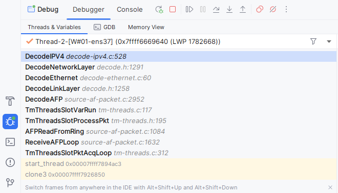

https://suricatacn.readthedocs.io/zh-cn/latest/command-line-options.html

命令行参数

runmode控制运行模式

--pcap 以PCAP模式运行。

`--af-packet[``=<device>]` 指定Linux上使用AF_PACKET进行数据包捕获。


实时pcap抓包的运行参数

```
-c /etc/suricata/suricata.yaml --pcap=ens37 -v
```


离线pcap处理的运行参数


配置的AF_PACKET模式，其

函数的堆栈如下所示：



DecodeAFP

​	->DecodeLinkLayer

​		->DecodeEthernet

​			->DecodeNetworkLayer

​				-> DecodeIPV4 

​					-> DecodeIPV4Packet