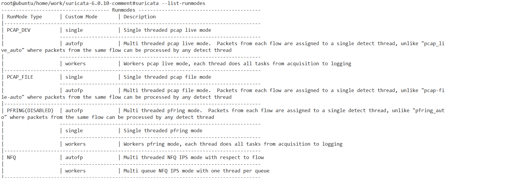
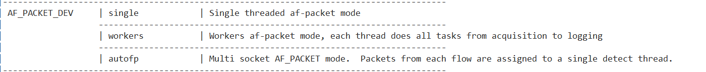
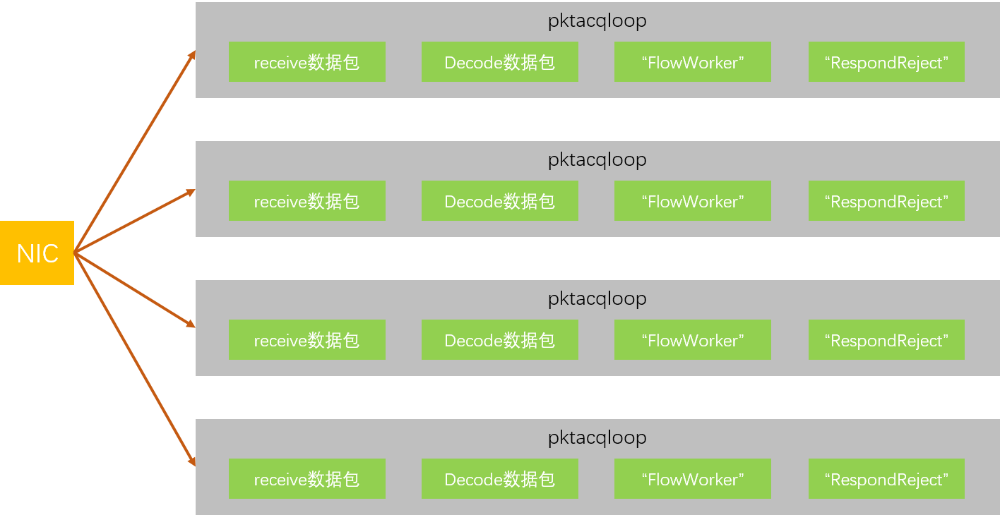
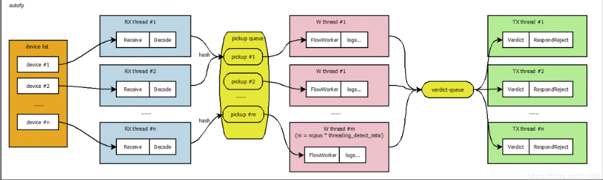
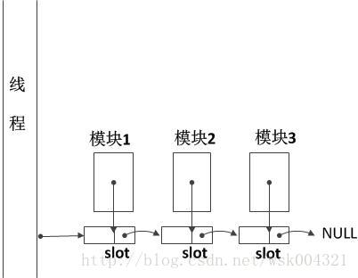
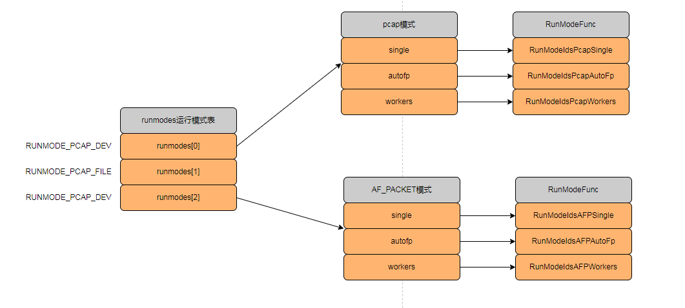
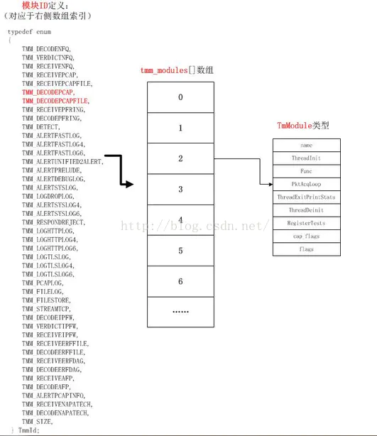
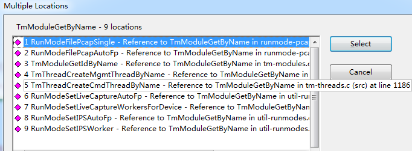

suricata源代码分析系列是基于6.0.10版本的代码

suricata源代码分析系列是基于6.0.10版本的代码

suricata源代码分析系列是基于6.0.10版本的代码


源代码的架构层次

| 源文件名                | 模块所属     | 作用                                     |
| ----------------------- | ------------ | ---------------------------------------- |
| src/runmodes.c          | 基础架构     | 运行模式核心实现                         |
| src/runmodes.h          | 基础架构     | 运行模式定义                             |
| src/suricata.c          | 基础架构     | 主程序入口                               |
| src/tm-threads.c        | 基础架构     | 线程模块管理                             |
| src/tm-threads.h        | 基础架构     | 线程模块的定义                           |
| src/threadvars.h        | 基础架构     | 线程变量定义                             |
|                         |              |                                          |
| src/runmode-af-packet.c | 运行模式     | AF_PACKET 模式实现                       |
| src/source-af-packet.c  | 运行模式     | AF_PACKET 数据源                         |
| src/runmode-af-packet.h | 运行模式     | AF_PACKET 模式头文件(pcap,pcap-file同理) |
|                         |              |                                          |
| src/tm-queues.c         | 线程间通信   | 线程队列管理                             |
| src/tm-queues.h         | 线程间通信   | 线程队列接口                             |
| src/tmqh-*.c            | 线程间通信   | 队列处理器实现                           |
|                         |              |                                          |
| src/decode.c            | 解码模块     | 数据包解码核心                           |
| src/decode-*.c          | 解码模块     | 各种协议解码器                           |
|                         |              |                                          |
| src/detect.c            | 检测引擎模块 | 检测引擎核心                             |
| src/detect-engine.c     | 检测引擎模块 | 检测引擎实现                             |
| src/detect-*.c          | 检测引擎模块 | 各种检测模块                             |
|                         |              |                                          |
| src/flow.c              | 流管理       | 流相关文件                               |
| src/flow-manager.c      | 流管理       | 流管理器                                 |
| src/flow-*.c            | 流管理       | 流相关功能                               |
|                         |              |                                          |


**从个人角度来思考：**

如果让我来设计，从场景分析上来看，一个线程上可能运行多个不同的功能（比如数据包捕获、解析、统计信息等），这些功能之间是彼此有联系的。

那么把这些功能封装下，统称为Thread Module线程模块，每个模块中有多个串行执行的功能子模块，我觉得这个设计挺好的。


线程类型分类：

- 接收线程 (Receive Threads): 负责数据包捕获

- 解码线程 (Decode Threads): 负责数据包解码

- 检测线程 (Detect Threads): 负责规则匹配和检测

- 流管理线程 (Flow Manager): 负责流状态管理

- 输出线程 (Output Threads): 负责日志输出

- 管理线程 (Management Threads): 负责系统管理

**其中流管理线程和管理线程之间的区别是什么？**线程命名规范：

```
const char *thread_name_autofp = "RX";//autofp工作模式线程
const char *thread_name_single = "W";//单线程工作模式线程
const char *thread_name_workers = "W";//多线程worker工作模式线程
const char *thread_name_verdict = "TX";//裁决线程
const char *thread_name_flow_mgr = "FM";//流管理线程
const char *thread_name_flow_rec = "FR";//流回收线程
const char *thread_name_flow_bypass = "FB";//流绕过线程
```


具体运行模式

#### AF_PACKET 模式

```
src/runmode-af-packet.c    # AF_PACKET 模式实现
src/source-af-packet.c     # AF_PACKET 数据源
src/runmode-af-packet.h    # AF_PACKET 模式头文件
```

#### PCAP 模式深入研究

```
src/runmode-pcap.c         # PCAP 模式实现
src/source-pcap.c          # PCAP 数据源
src/runmode-pcap.h         # PCAP 模式头文件
```


# 一、初识suricata运行模式

首先来看一下suricata有几种运行模式


执行suricata --list-runmodes命令行，可以查看支持多少种运行模式。





上述只是把suricata --list-runmodes命令的执行结果的一部分进行了截图。

其中第一列是RunMode Type运行模式类型，值可以为PCAP_DEV,PCAP_FILE,AF_PACKET_DEV等。

第二列是Custom Mode自定义模式，可选值为


Suricata有多种运行模式，这些模式与抓包驱动和IDS、IPS选择相关联。抓包驱动包括：pcap，pcap file，dpdk等。

Suricata在启动时只能选择某种运行模式。如-i表示pcap，-r表示pcap file。

## 1、1 single模式

单工作线程完成所有工作。第一个模块完成抓包，其他模块依次处理，没有后续队列。


## 1、2 workers模式（高性能，难度适中）

每个工作线程与single模式单线程工作流程一样，互不影响。

- 线程数量：网卡接口数量 * 每个网卡接口可并发的抓包线程数。
- 线程模块：内部与single模式一致。相当于一个线程内跑多个业务流程。



其中FlowWorker为流管理模块，RespondReject为响应模块。


我感觉自己对workers模式掌握的并不熟练。

## 1、3 autofp模式（复杂，高性能）

其中autofp模式是最高效的模型。

两种数据包处理线程，分别是收包线程和检测线程。收包线程和检测线程间通过PacketQueue传递数据包进行处理，每个检测线程对应一个队列，多个检测线程时为数据包选择队列采用一致性哈希算法，以确保同一个流的数据包按顺序传递给同一个检测线程。




后续我们单独拿一个章节出来，好好讲下autofp模式。


从上面的流程图可以看出autofp属于最高效的模式，也是最复杂的模式，worker适中。


**packet的流水线：**

1、Receive模块抓取数据包后，封装成packet结构体，传递给Decode模块；

2、Decode模块根据数据包的类型解析对应上层协议（IP，TCP，UDP，HTTP协议等）

3、将处理后的数据报继续扔给FlowWorker流管理模块；


**线程模块：**

线程模块是对packet处理任务的抽象。线程模块分为以下几种：

| 模块名            | 作用                                                         |
| ----------------- | ------------------------------------------------------------ |
| Receive模块       | 收集网络数据包，封装成Packet对象后将其传递给Decode线程模块   |
| Decode模块        | Packet按协议4层模型(数据链路层、网络层、传输层、应用层)进行解码，获取协议和负荷信息，解码完成后将Packet传递给FlowWorker线程模块。该模块主要是进行packet解码，不处理应用层。应用层由专门的应用层解码模块处理 |
| FlowWorker模块    | 对packets进行分配flow，Tcp会话管理，TCP重组，应用层数据解析处理，Detect规则检测 |
| RespondReject模块 | 根据detect检测后的结果，对于reject的包需要向双端发送reset包  |


上述代码表示采用pcap file + single模式下，第一个线程中有三个线程模块，分为是ReceivePcapFile、DecodePcapFile、FlowWorker，这块很好理解。

**线程、槽、模块之间关系**



每个线程都包含一个slot的链表，每个slot节点都悬挂着不同的模块，程序执行时会遍历slot链表，按照加入slot链表的顺序执行模块的函数。


从上图中，我们能推测出组成**运行模式**的基本元素：

suricata由线程、线程模块、队列组成。

- 数据包在线程间传递通过队列实现，线程由多个线程模块组成，每个线程模块实现一种功能。
- 一个数据包可以由多个线程处理，数据包将通过队列传递到下一个线程
- 一个线程可以有一个或多个线程模块

这块介绍的东西太过于抽象了，新手一上来是很不好理解的。


线程模块TmModule

线程Slot，TMSlot

AF_PACKET抓包流程是如上所示：

TmThreadsSlotPktAcqLoop-》ReceiveAFPLoop-》AFPReadFromRing-》TmThreadsSlotProcessPkt-》TmThreadsSlotVarRun-》SlotFunc（FlowWorker）


核心数据结构

```
typedef struct RunMode_ {
    /* the runmode type */
    int runmode;//抓包模式的index值
    const char *name;//运行模式的字符串名
    const char *description;//描述信息
    int (*RunModeFunc)(void);//运行模式函数,在RunModeDispatch函数中被调用
} RunMode;

typedef struct RunModes_ {
    int no_of_runmodes;//运行模式的数量
    RunMode *runmodes;//存储不同运行模型下自定义模式的信息
} RunModes;

//划重点
static RunModes runmodes[RUNMODE_USER_MAX];//二维数组，存储运行模式及自定义模式
```


pcap模式，其内部还分为pcap live实时抓包，pcap offline离线抓包模式。

# 二、注册运行模式，填充runmodes表

## 2、1 注册不同运行模式

```c
void RunModeRegisterRunModes(void)
{
    memset(runmodes, 0, sizeof(runmodes));

    RunModeIdsPcapRegister();//ids + pcap 模式
    RunModeFilePcapRegister();//file + pcap 模式
    RunModeIdsAFPRegister();//IDS+AFP 模式（重点关注）
    ......//略
    return;
}
```

我们最关心的是AF_PACKET和pcap模式，以注册AF_PACKET运行模式的RunModeIdsAFPRegister()函数为例进行讲解：

```c
void RunModeIdsAFPRegister(void)
{
    //single运行模式
    RunModeRegisterNewRunMode(RUNMODE_AFP_DEV, "single",
                              "Single threaded af-packet mode",
                              RunModeIdsAFPSingle);
    //workers运行模式
    RunModeRegisterNewRunMode(RUNMODE_AFP_DEV, "workers",
                              "Workers af-packet mode, each thread does all"
                              " tasks from acquisition to logging",
                              RunModeIdsAFPWorkers);
    default_mode_workers = "workers";
    //autofp运行模式
    RunModeRegisterNewRunMode(RUNMODE_AFP_DEV, "autofp",
                              "Multi socket AF_PACKET mode.  Packets from "
                              "each flow are assigned to a single detect "
                              "thread.",
                              RunModeIdsAFPAutoFp);
    return;
}

```

其中每一种运行模式都调用RunModeRegisterNewRunMode函数注册各自的自定义模式。上面注册了AF_PAKCET的single、workers、autofp三种自定义模式。

运行模式的核心数据结构：

RunMode和RunModes结构体的定义如下：

```c
typedef struct RunMode_ {
    /* the runmode type */
    int runmode;//抓包模式的index值
    const char *name;//运行模式的字符串名
    const char *description;//描述信息
    int (*RunModeFunc)(void);//运行模式函数,在RunModeDispatch函数中被调用
} RunMode;

typedef struct RunModes_ {
    int no_of_runmodes;//运行模式的数量
    RunMode *runmodes;//存储不同运行模型下自定义模式的信息
} RunModes;

//划重点
static RunModes runmodes[RUNMODE_USER_MAX];//二维数组，存储运行模式及自定义模式
```

其中全局二维数组runmodes，存储着全部运行模式及自定义模式


进入RunModeRegisterNewRunMode函数，代码如下：

```c
void RunModeRegisterNewRunMode(int runmode, const char *name,
                               const char *description,
                               int (*RunModeFunc)(void))
{
    void *ptmp;
    ptmp = SCRealloc(runmodes[runmode].runmodes,(runmodes[runmode].no_of_runmodes + 1) * sizeof(RunMode));
    runmodes[runmode].runmodes = ptmp;

    RunMode *mode = &runmodes[runmode].runmodes[runmodes[runmode].no_of_runmodes];
    runmodes[runmode].no_of_runmodes++;

    mode->runmode = runmode;
    mode->name = SCStrdup(name);
    mode->description = SCStrdup(description);
    mode->RunModeFunc = RunModeFunc;//此处为注册回调函数

    return;
}

```

根据runmode值去寻找runmodes一级索引的位置，然后对RunMode类型结构体变量并进行赋值。


当将所有运行模式都注册完毕后，其全局二维数组runmodes的情况如下所示：




重点注意下，之前注册的回调函数RunModeFunc，它在何处被调用呢？

答案：在**RunModeDispatch**函数中被调用。


## 2、2 运行不同模式的回调函数

```
void RunModeDispatch(int runmode, const char *custom_mode,
    const char *capture_plugin_name, const char *capture_plugin_args)
{
   	...省略代码...

	//获取默认的自定义的模式
    if (custom_mode == NULL || strcmp(custom_mode, "auto") == 0) {
        switch (runmode) {
            case RUNMODE_PCAP_DEV:
                custom_mode = RunModeIdsGetDefaultMode();
                break;
            case RUNMODE_PCAP_FILE:
                custom_mode = RunModeFilePcapGetDefaultMode();
                break;
            case RUNMODE_AFP_DEV:
                custom_mode = RunModeAFPGetDefaultMode();
                break;
            default:
                FatalError(SC_ERR_FATAL, "Unknown runtime mode. Aborting");
        }
    }

	//遍历二维数组runmodes，找到第一级索引为runmode，custom_mode的RunMode类型值
    RunMode *mode = RunModeGetCustomMode(runmode, custom_mode);

	//调用模式注册的回调函数RunModeFunc
    mode->RunModeFunc();

   	...省略代码...
}
```


## 2、3 RunModeFunc pcap-file流程

RunModeFunc回调函数我们上面讲过，我们以最简单的RunModeFilePcapSingle为例进行讲解.

```
int RunModeFilePcapSingle(void)
{
	//创建ThreadVars，这块比较多，马上讲解
 	ThreadVars *tv = TmThreadCreatePacketHandler(tname,"packetpool", "packetpool",
                                                 "packetpool", "packetpool","pktacqloop");

	//数据接收模块
    TmModule *tm_module = TmModuleGetByName("ReceivePcapFile");
    TmSlotSetFuncAppend(tv, tm_module, file);

	//数据解析模块
    tm_module = TmModuleGetByName("DecodePcapFile");
    TmSlotSetFuncAppend(tv, tm_module, NULL);

	//流处理模块
    tm_module = TmModuleGetByName("FlowWorker");
    TmSlotSetFuncAppend(tv, tm_module, NULL);

	//设置线程cpu亲和性
    TmThreadSetCPU(tv, WORKER_CPU_SET);

	//创建线程
    TmThreadSpawn(tv);
    return 0;
}
```

RunModeFilePcapSingle函数主要做了下3件事：

- 创建ThreadVars
- 创建不同功能的线程模块，并调用TmSlotSetFuncAppend添加到TmSlot中
- 创建工作线程


以数据接收模块举例：

```
//数据接收模块
TmModule *tm_module = TmModuleGetByName("ReceivePcapFile");
TmSlotSetFuncAppend(tv, tm_module, file);
```

操作流程为：先调用TmModuleGetByName获取模块的指针，

```
TmModule *TmModuleGetByName(const char *name)
{
    TmModule *t;
    uint16_t i;

	//遍历tmm_modules模块列表，具体可参考第二章节
    for (i = 0; i < TMM_SIZE; i++) {
        t = &tmm_modules[i];

        if (t->name == NULL)
            continue;

		//模块名称的名字相同，则直接返回
        if (strcmp(t->name, name) == 0)
            return t;
    }

    return NULL;
}
```

然后调用TmSlotSetFuncAppend函数将模块挂载到slot上。

```
void TmSlotSetFuncAppend(ThreadVars *tv, TmModule *tm, const void *data)
{
    TmSlot *slot = SCMalloc(sizeof(TmSlot));
    if (unlikely(slot == NULL))
        return;
    memset(slot, 0, sizeof(TmSlot));
    SC_ATOMIC_INITPTR(slot->slot_data);
    slot->SlotThreadInit = tm->ThreadInit;//线程模块的线程初始化
    slot->slot_initdata = data;//slot槽数据的初始化
    if (tm->Func) {
    	//当为pcap、pcap-file、af_packet模式时，tm->Func为NULL
        slot->SlotFunc = tm->Func;
    } else if (tm->PktAcqLoop) {
        slot->PktAcqLoop = tm->PktAcqLoop;
        if (tm->PktAcqBreakLoop) {
            tv->break_loop = true;
        }
    } else if (tm->Management) {
        slot->Management = tm->Management;
    }
    
    slot->SlotThreadDeinit = tm->ThreadDeinit;//线程模块的线程销毁
    slot->tm_id = TmModuleGetIDForTM(tm); //获取每个模块对应的ID值，方便debug调试查看是flowWorker、decode、receive类型的模块

    if (tv->tm_slots == NULL) {
    	//tm_slots为空，则添加在链表头结点
        tv->tm_slots = slot;
    } else {
        TmSlot *a = (TmSlot *)tv->tm_slots, *b = NULL;

        /* get the last slot */
        //找到最后一个slot槽
        for ( ; a != NULL; a = a->slot_next) {
             b = a;
        }
        //添加到尾部，为保证顺序
        /* append the new slot */
        if (b != NULL) {
            b->slot_next = slot;
        }
    }
    return;
}
```

slot->SlotFunc = tm->Func;此行代码是很重要的。


### 2、3、1 线程模块

上述代码表示采用pcap file + single模式下，第一个线程中有三个线程模块，分为是ReceivePcapFile、DecodePcapFile、FlowWorker，这块很好理解。

**线程、槽、模块之间关系**


每个线程都包含一个slot的链表，每个slot节点都悬挂着不同的模块，程序执行时会遍历slot链表，按照加入slot链表的顺序执行模块的函数。


问题：何处去调用slot->SlotFunc呢？

答：在TmThreadsSlotVarRun函数被调用。

```
TmEcode TmThreadsSlotVarRun(ThreadVars *tv, Packet *p, TmSlot *slot)
{
    for (TmSlot *s = slot; s != NULL; s = s->slot_next) {
        TmEcode r = s->SlotFunc(tv, p, SC_ATOMIC_GET(s->slot_data));

        /* handle new packets */
        while (tv->decode_pq.top != NULL) {
            Packet *extra_p = PacketDequeueNoLock(&tv->decode_pq);
            if (unlikely(extra_p == NULL))
                continue;

            /* see if we need to process the packet */
            if (s->slot_next != NULL) {
                r = TmThreadsSlotVarRun(tv, extra_p, s->slot_next);
                if (unlikely(r == TM_ECODE_FAILED)) {
                    TmThreadsSlotProcessPktFail(tv, s, extra_p);
                    return TM_ECODE_FAILED;
                }
            }
            tv->tmqh_out(tv, extra_p);
        }
    }

    return TM_ECODE_OK;
}

```


### 2、3、2 创建ThreadVars

```
ThreadVars *TmThreadCreatePacketHandler(const char *name, const char *inq_name,
                                        const char *inqh_name, const char *outq_name,
                                        const char *outqh_name, const char *slots)
{
    ThreadVars *tv = NULL;
    tv = TmThreadCreate(name, inq_name, inqh_name, outq_name, outqh_name,slots, NULL, 0);
    return tv;
}
```

TmThreadCreatePacketHandler调用TmThreadCreate函数

#### 1）TmThreadCreate函数

```
ThreadVars *TmThreadCreate(const char *name, const char *inq_name, const char *inqh_name,
                           const char *outq_name, const char *outqh_name, const char *slots,
                           void * (*fn_p)(void *), int mucond)
{
	//分配ThreadVars内存空间
    tv = SCMalloc(sizeof(ThreadVars));
    memset(tv, 0, sizeof(ThreadVars));

	//赋值ThreadVars的inq、tmqh_in、inq_id等字段（重要）
	//如果inq队列名称不等于packetpool，则从tmq_list链表中重新获取
    if (inq_name != NULL && strcmp(inq_name, "packetpool") != 0) {
        tmq = TmqGetQueueByName(inq_name);
        tv->inq = tmq;
    }
    //inq队列的hander
    if (inqh_name != NULL) {
        int id = TmqhNameToID(inqh_name);
        tmqh = TmqhGetQueueHandlerByName(inqh_name);

        tv->tmqh_in = tmqh->InHandler;
        tv->inq_id = (uint8_t)id;
    }

	//赋值ThreadVars的tmqh_out、outq_id、outq、outctx等字段（重要）
    //outq队列的handler名称不为空
    if (outqh_name != NULL) {
        int id = TmqhNameToID(outqh_name);
        tmqh = TmqhGetQueueHandlerByName(outqh_name);

        tv->tmqh_out = tmqh->OutHandler;
        tv->outq_id = (uint8_t)id;

		//如果outq队列名称不等于packetpool，则从tmq_list链表中重新获取
        if (outq_name != NULL && strcmp(outq_name, "packetpool") != 0) {
            tmq = TmqGetQueueByName(outq_name);
            tv->outq = tmq;
            tv->outctx = NULL;
        }
    }

	/*很重要的函数*/
    TmThreadSetSlots(tv, slots, fn_p);

    return tv;
}
```

- tmqh_in：在初始化时绑定为inqh的InHander，用于从上一级队列中获取数据包。
- tmqh_out：在初始化时绑定为outqh的OutHander，用于将处理后的数据包送往下一级队列。


#### 2）TmqGetQueueByName函数

```
Tmq *TmqGetQueueByName(const char *name)
{
    Tmq *tmq = NULL;
    TAILQ_FOREACH(tmq, &tmq_list, next) {
        if (strcmp(tmq->name, name) == 0)
            return tmq;
    }
    return NULL;
}
```

遍历tmq_list，根据name查询对应的Tmq。tmq_list是何时注册的呢？


#### 3）TmqhGetQueueHandlerByName函数

```
Tmqh *TmqhGetQueueHandlerByName(const char *name)
{
    for (int i = 0; i < TMQH_SIZE; i++) {
        if (tmqh_table[i].name != NULL) {
            if (strcmp(name, tmqh_table[i].name) == 0)
                return &tmqh_table[i];
        }
    }

    return NULL;
}
```

根据name从tmqh_table表中查询出对应的handler，具体详情在本文第三章节《填充tmqh_table表》。


#### 4）TmThreadSetSlots函数

```
static TmEcode TmThreadSetSlots(ThreadVars *tv, const char *name, void *(*fn_p)(void *))
{
    if (strcmp(name, "varslot") == 0) {
        tv->tm_func = TmThreadsSlotVar;
    } else if (strcmp(name, "pktacqloop") == 0) {
        tv->tm_func = TmThreadsSlotPktAcqLoop;//执行此行代码
    } else if (strcmp(name, "management") == 0) {
        tv->tm_func = TmThreadsManagement;
    } else if (strcmp(name, "command") == 0) {
        tv->tm_func = TmThreadsManagement;
    }

    return TM_ECODE_OK;
}
```

在pcap file的single模式下，其函数堆栈如下所示，传递给TmThreadSetSlots函数name的实参为“pktacqloop”，所以执行 tv->tm_func = TmThreadsSlotPktAcqLoop;


综上所述，TmThreadCreate函数主要做四件事

1. 分配ThreadVars内存空间
2. 赋值ThreadVars的inq、tmqh_in、inq_id等字段
3. 赋值ThreadVars的tmqh_out、outq_id、outq、outctx等字段
4. 设置slot相关属性


### 2、3、3 创建工作线程

```
TmEcode TmThreadSpawn(ThreadVars *tv)
{
	//创建线程，把tv->tm_func作为线程函数
    pthread_attr_t attr;
    pthread_attr_init(&attr);
    int rc = pthread_create(&tv->t, &attr, tv->tm_func, (void *)tv);

    return TM_ECODE_OK;
}
```

 **问题：tv->tm_func是什么代码赋值的呢？**

在上面的TmThreadSetSlots函数中， tv->tm_func = TmThreadsSlotPktAcqLoop;


## 2、4 RunMode af-packet流程

其中mode->RunModeFunc();RunModeFunc在AF_PACKET运行模式下分别注册了如下函数：

| 运行模式        | 自定义模式 | RunModeFunc注册      |
| --------------- | ---------- | -------------------- |
| RUNMODE_AFP_DEV | single     | RunModeIdsAFPSingle  |
| RUNMODE_AFP_DEV | workers    | RunModeIdsAFPWorkers |
| RUNMODE_AFP_DEV | autofp     | RunModeIdsAFPAutoFp  |

以RunModeIdsAFPWorkers函数为例：

RunModeIdsAFPWorkers函数

​	-> RunModeSetLiveCaptureWorkers函数

​		-> RunModeSetLiveCaptureWorkersForDevice函数

```
static int RunModeSetLiveCaptureWorkersForDevice(ConfigIfaceThreadsCountFunc ModThreadsCount,
                              const char *recv_mod_name,
                              const char *decode_mod_name, const char *thread_name,
                              const char *live_dev, void *aconf,
                              unsigned char single_mode)
{
    int threads_count;

    if (single_mode) {
        threads_count = 1;//单工作线程模式
    } else {
        threads_count = ModThreadsCount(aconf);
        SCLogInfo("Going to use %" PRId32 " thread(s)", threads_count);
    }

    /* create the threads */
    for (int thread = 0; thread < threads_count; thread++) {
        char tname[TM_THREAD_NAME_MAX];
        ThreadVars *tv = NULL;
        TmModule *tm_module = NULL;
        const char *visual_devname = LiveGetShortName(live_dev);
		
		//构造线程名称
        if (single_mode) {
            snprintf(tname, sizeof(tname), "%s#01-%s", thread_name, visual_devname);
        } else {
            snprintf(tname, sizeof(tname), "%s#%02d-%s", thread_name,
                     thread+1, visual_devname);
        }
        tv = TmThreadCreatePacketHandler(tname,
                "packetpool", "packetpool",
                "packetpool", "packetpool",
                "pktacqloop");

        tm_module = TmModuleGetByName(recv_mod_name);//接收模块（“ReceiveAFP”）
        TmSlotSetFuncAppend(tv, tm_module, aconf);

        tm_module = TmModuleGetByName(decode_mod_name);//解码模块（“DecodeAFP”）
        TmSlotSetFuncAppend(tv, tm_module, NULL);

        tm_module = TmModuleGetByName("FlowWorker");//FlowWorker模块
        TmSlotSetFuncAppend(tv, tm_module, NULL);

        TmThreadSetCPU(tv, WORKER_CPU_SET);//设置cpu亲和性

        TmThreadSpawn(tv);//创建线程并和ThreadVars实例关联
    }

    return 0;
}
```

recv_mod_name:接收数据模块的名称

decode_mod_name :解析数据模块的名称

因为大体流程都和pcap file模式差不多，所以就不详细说了，感兴趣的自己看看。

# 三、 注册模块，填充tmm_modules表

## 3、1 模块注册

模块注册的函数调用堆栈为

```
main
	--> PostConfLoadedSetup
		--> RegisterAllModules
```

因为我关心AF_PACKET模块，所以截取了相关的代码。

```
void RegisterAllModules()
{   
    /* managers */
    TmModuleFlowManagerRegister();//流管理模块
    TmModuleFlowRecyclerRegister();//流回收模块

    /* pcap live */
    TmModuleReceivePcapRegister();//接收模块
    TmModuleDecodePcapRegister();//解码模块
    
    /* pcap file */
    TmModuleReceivePcapFileRegister();//接收模块
    TmModuleDecodePcapFileRegister();//解码模块

    /* af-packet */
    TmModuleReceiveAFPRegister();//接收模块
    TmModuleDecodeAFPRegister();//解码模块

    /* flow worker */
    TmModuleFlowWorkerRegister();//flow worker模块
}
```

每种抓包模式都会注册receive和decode两种功能模块，其他还有公用的各种模块如FlowManager模块、FlowRecycle模块、FlowWorker模块等。


### 2、1、1 收包模块注册

```
void TmModuleReceiveAFPRegister (void)
{
    tmm_modules[TMM_RECEIVEAFP].name = "ReceiveAFP";
    tmm_modules[TMM_RECEIVEAFP].ThreadInit = ReceiveAFPThreadInit;
    tmm_modules[TMM_RECEIVEAFP].Func = NULL;
    tmm_modules[TMM_RECEIVEAFP].PktAcqLoop = ReceiveAFPLoop;
    tmm_modules[TMM_RECEIVEAFP].PktAcqBreakLoop = NULL;
    tmm_modules[TMM_RECEIVEAFP].ThreadExitPrintStats = ReceiveAFPThreadExitStats;
    tmm_modules[TMM_RECEIVEAFP].ThreadDeinit = ReceiveAFPThreadDeinit;
}
```

其中PktAcqLoop是数据包获取循环的回调函数。ReceiveAFPLoop此函数是核心。


### 2、1、2 解码模块注册

```
void TmModuleDecodeAFPRegister (void)
{
    tmm_modules[TMM_DECODEAFP].name = "DecodeAFP";
    tmm_modules[TMM_DECODEAFP].ThreadInit = DecodeAFPThreadInit;
    tmm_modules[TMM_DECODEAFP].Func = DecodeAFP;
    tmm_modules[TMM_DECODEAFP].ThreadExitPrintStats = NULL;
    tmm_modules[TMM_DECODEAFP].ThreadDeinit = DecodeAFPThreadDeinit;
    tmm_modules[TMM_DECODEAFP].RegisterTests = NULL;
    tmm_modules[TMM_DECODEAFP].cap_flags = 0;
    tmm_modules[TMM_DECODEAFP].flags = TM_FLAG_DECODE_TM;
}
```


## 3、2 模块结构体和存储结构

```
typedef struct TmModule_ {
    const char *name;

    TmEcode (*ThreadInit)(ThreadVars *, const void *, void **);
    void (*ThreadExitPrintStats)(ThreadVars *, void *);
    TmEcode (*ThreadDeinit)(ThreadVars *, void *);

    /** the packet processing function */
    TmEcode (*Func)(ThreadVars *, Packet *, void *);

    TmEcode (*PktAcqLoop)(ThreadVars *, void *, void *);

    /** terminates the capture loop in PktAcqLoop */
    TmEcode (*PktAcqBreakLoop)(ThreadVars *, void *);

    TmEcode (*Management)(ThreadVars *, void *);

    /** global Init/DeInit */
    TmEcode (*Init)(void);
    TmEcode (*DeInit)(void);
    
    uint8_t cap_flags;   /**< Flags to indicate the capability requierment of
                             the given TmModule */
    /* Other flags used by the module */
    uint8_t flags;
} TmModule;
```

- name：模块的名称
- ThreadInit：初始化线程的函数指针，用于在线程开始之前进行一些初始化操作。
- ThreadExitPrintStats：线程退出并打印统计信息的函数指针。
- ThreadDeinit：线程退出并进行一些清理操作的函数指针。
- Func：实现Suricata的主要功能的函数指针，即数据包处理函数。
- PktAcqLoop：数据包采集循环的函数指针。
- PktAcqBreakLoop：终止数据包采集循环的函数指针。
- Management：管理函数指针，用于管理Suricata的配置和状态等信息。
- Init：初始化函数指针，用于在Suricata启动时进行一些初始化操作。
- DeInit：退出函数指针，用于在Suricata关闭时进行一些清理操作。
- RegisterTests：测试函数指针，用于Suricata的测试和调试。

可以发现模块被保存到了**tmm_modules**数组中，是模块类型(即TmModule)的数组。



tmm_modules数组的下标为模块ID，常见的模块ID如下：

```
typedef enum {
    TMM_FLOWWORKER,
    
    TMM_RECEIVEPCAP,
    TMM_RECEIVEPCAPFILE,
    
    TMM_DECODEPCAP,
    TMM_DECODEPCAPFILE,
    
    TMM_RECEIVEAFP,
    TMM_DECODEAFP,

    TMM_FLOWMANAGER,
    TMM_FLOWRECYCLER,

    TMM_SIZE,
} TmmId;
```


## 3、3 模块初始化

模块初始化的函数是**TmModuleRunInit**，其调用之处是在RegisterAllModules函数之后，其调用堆栈如下：

```
main
	--> PostConfLoadedSetup
		--> RegisterAllModules(前)
		--> TmModuleRunInit(后)
```


定义如下：

```
void TmModuleRunInit(void)
{
    TmModule *t;
    uint16_t i;

    for (i = 0; i < TMM_SIZE; i++) {
        t = &tmm_modules[i];

        if (t->name == NULL)
            continue;

        if (t->Init == NULL)
            continue;

        t->Init();//实际没啥模块调用Init函数
    }
}
```

该函数执行了模块全局初始化函数Init()。


## 3、4 tmm_modules模块调用

tmm_modules全局变量调用的位置如下图所示：



以简单的RunModeFilePcapSingle函数举例：

```
int RunModeFilePcapSingle(void)
{
	...省略代码...
	
	//数据接收模块
    TmModule *tm_module = TmModuleGetByName("ReceivePcapFile");
    TmSlotSetFuncAppend(tv, tm_module, file);

	//数据解析模块
    tm_module = TmModuleGetByName("DecodePcapFile");
    TmSlotSetFuncAppend(tv, tm_module, NULL);

	//流处理模块
    tm_module = TmModuleGetByName("FlowWorker");
    TmSlotSetFuncAppend(tv, tm_module, NULL);

	...省略代码...
    return 0;
}
```

调用TmModuleGetByName函数，通过名称获取模块指针。


# 四、 注册队列处理函数，填充tmqh_table表

main函数 -> PostConfLoadedSetup函数 -> TmqhSetup函数


Tmqh结构体的定义如下所示；

```
typedef struct Tmqh_ {
    char *name;
    Packet *(*InHandler)(ThreadVars *);//入流量处理函数
    void (*OutHandler)(ThreadVars *, Packet *);//出流量处理函数
} Tmqh;

Tmqh tmqh_table[TMQH_SIZE];//提供了4种类型队列:simple,flow,packetpool
```

Tmqh_结构的全称是Thread Module Queue Handler


```
void TmqhSetup (void)
{
    memset(&tmqh_table, 0, sizeof(tmqh_table));

    TmqhSimpleRegister();
    TmqhPacketpoolRegister();
    TmqhFlowRegister();
}

//simple注册
void TmqhSimpleRegister (void)
{
    tmqh_table[TMQH_SIMPLE].name = "simple";
    tmqh_table[TMQH_SIMPLE].InHandler = TmqhInputSimple;
    tmqh_table[TMQH_SIMPLE].InShutdownHandler = TmqhInputSimpleShutdownHandler;
    tmqh_table[TMQH_SIMPLE].OutHandler = TmqhOutputSimple;
}

//pool注册
void TmqhPacketpoolRegister (void)
{
    tmqh_table[TMQH_PACKETPOOL].name = "packetpool";
    tmqh_table[TMQH_PACKETPOOL].InHandler = TmqhInputPacketpool;
    tmqh_table[TMQH_PACKETPOOL].OutHandler = TmqhOutputPacketpool;
}

//flow注册
void TmqhFlowRegister(void)
{
    tmqh_table[TMQH_FLOW].name = "flow";
    tmqh_table[TMQH_FLOW].InHandler = TmqhInputFlow;
    tmqh_table[TMQH_FLOW].OutHandlerCtxSetup = TmqhOutputFlowSetupCtx;
    tmqh_table[TMQH_FLOW].OutHandlerCtxFree = TmqhOutputFlowFreeCtx;
    tmqh_table[TMQH_FLOW].RegisterTests = TmqhFlowRegisterTests;

    tmqh_table[TMQH_FLOW].OutHandler = TmqhOutputFlowHash;
    return;
}
```

填充了队列处理程序结构体Tmqh，填充队列处理程序name分别为

- “simple”
- “packetpool”
- “flow”


# 五、注册tmq_list

```
static TAILQ_HEAD(TmqList_, Tmq_) tmq_list = TAILQ_HEAD_INITIALIZER(tmq_list);

//TAILQ_HEAD宏定义
#define TAILQ_HEAD(name, type)						\
struct name {								\
	struct type *tqh_first;	/* first element */			\
	struct type **tqh_last;	/* addr of last next element */		\
}

#define TAILQ_HEAD_INITIALIZER(head)					\
	{ NULL, &(head).tqh_first }
```

经过转换后，tmq_list变量的初始化如下所示：

```
static struct TmqList_ {								\
	struct Tmq_ *tqh_first;	/* first element */			\
	struct Tmq_ **tqh_last;	/* addr of last next element */		\
} tmq_list = { NULL, &(head).tqh_first };
```

调用堆栈：

TmThreadCreate

TmqCreateQueue

TAILQ_INSERT_HEAD


# 六、线程模型-课后题

关于线程模型的一些疑问,大家感兴趣的可以一起在评论区交流

**问题1**：suricata的报文扔给PacketQueue队列后其实后面的解码和流管理、流重组逻辑是串行的吗？

**问题2**：PacketQueue队列传递的那一个地方可以让报文跨线程？

**问题3**：PacketQueue这个对列也是被多次利用在多个地方起多个线程进行调度？

**问题4**：比如抓包和decode的线程数量我设置为2，flow的线程数量设置为4，文件还原的逻辑也改为线程模型然后给线程数量为8，http协议解析线程数量给到8，ips检查匹配的线程为8

**问题5**：这样根据各个阶段进行线程个数的配置，中间通过这个PacketQueue队列来进行报文轮转？


# 七、参考链接


https://blog.csdn.net/ljq32/article/details/122380938

https://zhuanlan.zhihu.com/p/342176316

http://www.hyuuhit.com/2018/03/22/suricata-4-0-3-thread-model/

https://promisechen.github.io/suricata/review.html#id2

https://www.cnblogs.com/zhaodejin/p/16146212.html

https://blog.csdn.net/vevenlcf/article/details/73123770


