# 一、相关

## 1、1 Flow结构体

相关代码结构在flow.h文件中，里面的成员变量很多。

```
 typedef struct Flow_
{
    /* flow "header", used for hashing and flow lookup. Static after init,
     * so safe to look at without lock */
    FlowAddress src, dst; //源地址和目的地址
    union {
        Port sp;        /**< tcp/udp 源端口 */
        struct {
            uint8_t type;   /**< icmp 类型 */
            uint8_t code;   /**< icmp 代码 */
        } icmp_s;

        struct {
            uint32_t spi; /**< esp spi */
        } esp;
    };
    union {
        Port dp;        /**< tcp/udp 目的端口 */
        struct {
            uint8_t type;   /**< icmp 类型 */
            uint8_t code;   /**< icmp 代码 */
        } icmp_d;
    };
    uint8_t proto; //ip协议号
    uint8_t recursion_level; //递归级别
    uint16_t vlan_id[VLAN_MAX_LAYERS]; //VLAN 标识符数组

    uint8_t vlan_idx;

    /* track toserver/toclient flow timeout needs */
    union {
        struct {
            uint8_t ffr_ts:4;
            uint8_t ffr_tc:4;
        };
        uint8_t ffr;
    };

    /** Thread ID for the stream/detect portion of this flow */
    FlowThreadId thread_id[2]; //流的检测线程id

    struct Flow_ *next; //哈希表中的下一个流
    struct LiveDevice_ *livedev; //实时设备

    /** flow hash - the flow hash before hash table size mod. */
    uint32_t flow_hash; //流的哈希值

    /** timeout in seconds by policy, add to Flow::lastts to get actual time this times out.
     * Ignored in emergency mode. */
    uint32_t timeout_policy; //超时策略

    /* time stamp of last update (last packet). Set/updated under the
     * flow and flow hash row locks, safe to read under either the
     * flow lock or flow hash row lock. */
    SCTime_t lastts; //最后一个数据包更新的时间戳

    FlowStateType flow_state; //流的状态

    /** flow tenant id, used to setup flow timeout and stream pseudo
     *  packets with the correct tenant id set */
    uint32_t tenant_id;

    uint32_t probing_parser_toserver_alproto_masks;
    uint32_t probing_parser_toclient_alproto_masks;

    uint32_t flags;         /**< generic flags */

    uint16_t file_flags;    /**< file tracking/extraction flags */

    /** destination port to be used in protocol detection. This is meant
     *  for use with STARTTLS and HTTP CONNECT detection */
    uint16_t protodetect_dp; /**< 0 if not used */

    /* Parent flow id for protocol like ftp */
    int64_t parent_id;

#ifdef FLOWLOCK_RWLOCK
    SCRWLock r;
#elif defined FLOWLOCK_MUTEX
    SCMutex m; //流互斥锁
#else
    #error Enable FLOWLOCK_RWLOCK or FLOWLOCK_MUTEX
#endif

    /** protocol specific data pointer, e.g. for TcpSession */
    void *protoctx; //协议特定上下文

    /** mapping to Flow's protocol specific protocols for timeouts
        and state and free functions. */
    uint8_t protomap;

    uint8_t flow_end_flags;
    /* coccinelle: Flow:flow_end_flags:FLOW_END_FLAG_ */

    AppProto alproto; //应用层协议
    AppProto alproto_ts;//到server端的应用层协议
    AppProto alproto_tc;//到client端的应用层协议

    /** original application level protocol. Used to indicate the previous
       protocol when changing to another protocol , e.g. with STARTTLS. */
    AppProto alproto_orig;
    /** expected app protocol: used in protocol change/upgrade like in
     *  STARTTLS. */
    AppProto alproto_expect;

    /** detection engine ctx version used to inspect this flow. Set at initial
     *  inspection. If it doesn't match the currently in use de_ctx, the
     *  stored sgh ptrs are reset. */
    uint32_t de_ctx_version;

    /** ttl tracking */
    uint8_t min_ttl_toserver;
    uint8_t max_ttl_toserver;
    uint8_t min_ttl_toclient;
    uint8_t max_ttl_toclient;

    /** which exception policies were applied, if any */
    uint8_t applied_exception_policy;

    /** application level storage ptrs.
     *
     */
    AppLayerParserState *alparser;     /*应用层解析器状态*/
    void *alstate;      /*应用层状态*/

    /** toclient sgh for this flow. Only use when FLOW_SGH_TOCLIENT flow flag
     *  has been set. */
    const struct SigGroupHead_ *sgh_toclient;
    /** toserver sgh for this flow. Only use when FLOW_SGH_TOSERVER flow flag
     *  has been set. */
    const struct SigGroupHead_ *sgh_toserver;

    /* pointer to the var list */
    GenericVar *flowvar; //流变量列表

    struct FlowBucket_ *fb; //流所属的哈希通Bucket

    SCTime_t startts;	//流的开始时间

    uint32_t todstpktcnt;//包计数
    uint32_t tosrcpktcnt;//包计数
    uint64_t todstbytecnt;//字节计数
    uint64_t tosrcbytecnt;//字节计数

    Storage storage[]; //零长数组
} Flow;
```


## 1、2 Flow Hash Table 会话哈希表


流存储在全局哈希表（flow_hash）中，以便通过 5 元组信息进行有效查找：

flow_hash是一个链表，其中的每个元素都是一个FlowBucket，每个FlowBucket链表中存储着多个Flow流。


next_ts字段：用于优化超时扫描的原子变量。


## 1、3 FlowQueue队列


具体代码如下：

```
typedef struct FlowQueuePrivate_
{
    Flow *top;
    Flow *bot;
    uint32_t len;
} FlowQueuePrivate;

/* Define a queue for storing flows */
typedef struct FlowQueue_
{
    FlowQueuePrivate priv;
    SC_ATOMIC_DECLARE(bool,non_empty);
    SCMutex m;
} FlowQueue;
```

核心的队列包括：

**flow_recycle_q**: 用于从哈希表中回收flow；

**spare_queue**:适用于可回收、可复用的flow结构；

**work_queue**: 需要进一步处理的流；


流管理包括以下几个部分：

- 流初始化
- 流新建、查找、更新
- 流老化
- 流的回收
- 空闲流数量的动态维护

以一个完整的tcp会话为例（包括三次握手和四次挥手），先初始化会话相关的数据结构

1、遇到syn数据包，则新建流（通过五元组计算hash值）并插入到流表中；

2、同一个会话的后续数据包到来时，通过五元组计算hash值，然后查找此会话是否存在；

3、如会话存在，则更新tcp会话状态（状态机）以及各种数据指标；

4、当遇到fin或rst报文时，代表此会话正常结束，此时从会话表中删除flow结构体以及释放对应的资源；

5、当长时间未收到fin或rst报文时，酌情考虑用老化机制来删除会话；

6、空闲流数量的动态维护工作，减少流量大幅变化导致的内存频繁申请和释放问题；


流管理使用独立的线程，包括老化线程和回收线程，可以启动多个线程，但默认启动一个线程。

 老化线程：main-》SuricataMain-》RunModeDispatch-》**FlowManagerThreadSpawn**

 回收线程：main-》SuricataMain-》RunModeDispatch-》**FlowRecyclerThreadSpawn**


# 二、流管理相关配置项

suricata流管理需要使用内存。流越多，所需的内存就越多。为了加强对内存的控制，有几个选项可关注下：

- 设置使用的最大字节数的memcap选项
- 设置哈希表的大小hash_size
- 设置预分配的流的数量级
- 设置紧急模式下空闲流的占比


suricata关于流表的配置，有几个选项是需要格外注意的。

## 1、memcap选项

默认 memcap 为 32M

```
#define FLOW_DEFAULT_MEMCAP      (32 * 1024 * 1024) /* 32 MB */
SC_ATOMIC_SET(flow_config.memcap, FLOW_DEFAULT_MEMCAP);
```

通过`FLOW_CHECK_MEMCAP`来检查内存分配的字节数是否超过了 memcap。

```
#define FLOW_CHECK_MEMCAP(size) \
    ((((uint64_t)SC_ATOMIC_GET(flow_memuse) + (uint64_t)(size)) <= SC_ATOMIC_GET(flow_config.memcap)))
```

flow_memuse当前已使用内存字节数 + size 是否超过flow_config.memcap


## 2、hash_size选项

```
flow_config.hash_size   = FLOW_DEFAULT_HASHSIZE;//预分配的FlowBucket的个数
```

哈希表预分配的FlowBucket的个数


## 3、prealloc选项

设置内存中预分配流的数量。

```
#define FLOW_DEFAULT_PREALLOC    10000
flow_config.prealloc    = FLOW_DEFAULT_PREALLOC;
```


## 4、emergency_recovery 选项

emergency_recovery选项使得流引擎进入紧急模式。在此模式下，引擎将在较短的时间内完成老化动作。

- 紧急恢复。紧急恢复设置为 30。这是预分配流的百分比，在此百分比之后，流引擎将恢复正常（当 10000 个流中的 30％完成时）。


# 三、流表初始化

## 3、1 flow_hash 全局流表初始化

全局流表的初始化在FlowInitConfig函数中实现。

```c
/** \brief initialize the configuration
 *  \warning Not thread safe */
void FlowInitConfig(char quiet)
{
    ......
    //省略读取配置信息的代码
    ......

    //计算flow哈希表的待分配的bucket数量
    uint64_t hash_size = flow_config.hash_size * sizeof(FlowBucket);
    //分配指定数量的FlowBucket，CLS是cache line size，默认值为64
    flow_hash = SCMallocAligned(flow_config.hash_size * sizeof(FlowBucket), CLS);
    if (unlikely(flow_hash == NULL)) {
        FatalError(SC_ERR_FATAL,
                   "Fatal error encountered in FlowInitConfig. Exiting...");
    }
    memset(flow_hash, 0, flow_config.hash_size * sizeof(FlowBucket));

    uint32_t i = 0;
    //初始化flow hash数组，新建流的flow存放到这个数组的每个bucket链表里
    for (i = 0; i < flow_config.hash_size; i++) {
        FBLOCK_INIT(&flow_hash[i]);
        SC_ATOMIC_INIT(flow_hash[i].next_ts);
    }
    
	//初始化流的全局内存池
    FlowSparePoolInit();

    //初始化tcp、udp、icmp等各协议的超时时间
    FlowInitFlowProto();
    return;
}
```

其步骤如下所示：

**1、先计算flow hash数组中待分配的bucket数量；**

**2、分配指定数量的FlowBucket；**

**3、初始化flow hash数组，新建流的flow存放到这个数组的每个bucket的链表里；**

**4、初始化流的全局内存池（后面分析）；**

**5、初始化tcp、udp、icmp等各协议的超时时间（后面分析）；**


## 3、2 初始化全局flow内存池

**每个工作线程新建流时，从自己的flow队列中获取flow流，当线程所属的flow队列中无flow可用时，就从全局flow内存池中获取一个flow队列使用。**

### 3、2、1 FlowSparePoolInit函数

FlowSparePoolInit函数负责初始化Suricata的流量处理预分配内存池（Flow Spare Pool）。

这个内存池是一种性能优化机制，通过预先分配一定数量的Flow对象，减少在高负载场景下的动态内存分配和释放带来的性能开销，从而提高网络流量处理效率。

```
//初始化全局内存池
void FlowSparePoolInit(void)
{
    SCMutexLock(&flow_spare_pool_m);//加锁
    //预先申请内存数（flow_config.prealloc）
    for (uint32_t cnt = 0; cnt < flow_config.prealloc; ) {
        FlowSparePool *p = FlowSpareGetPool();//简单malloc一个FlowSparePool结构体内存空间
        FlowSparePoolUpdateBlock(p);//重要函数！！！
        cnt += p->queue.len;

        /* prepend to list */
        p->next = flow_spare_pool;//FlowSparePool链接成链表
        flow_spare_pool = p;
        flow_spare_pool_flow_cnt = cnt;//更新总的flow数量
    }
    SCMutexUnlock(&flow_spare_pool_m);//释放锁
}
```

FlowSparePoolInit这个函数强烈建议大家debug单步调试下，受益匪浅。


FlowSpareGetPool函数就是简单的malloc申请一个FlowSparePool的内存空间。

```
static FlowSparePool *FlowSpareGetPool(void)
{
    FlowSparePool *p = SCCalloc(1, sizeof(*p));
    if (p == NULL)
        return NULL;
    return p;
}
```


**FlowSparePool结构体的定义如下：**

```
typedef struct FlowSparePool {
    FlowQueuePrivate queue;//存储预分配Flow对象的队列
    struct FlowSparePool *next;//指向下一个FlowSparePool的指针，形成链表
} FlowSparePool;
```


**FlowQueuePrivate结构体的定义如下：**

```
typedef struct FlowQueuePrivate_ {
    Flow *top;      // 队列头指针
    Flow *bot;      // 队列尾指针
    uint32_t len;   // 队列中元素数量
} FlowQueuePrivate;
```


### 3、2、2 FlowSparePoolUpdateBlock函数

FlowSparePoolInit函数中调用了FlowSparePoolUpdateBlock函数。

**1、for循环i的范围从p->queue.len变化到flow_spare_pool_block_size**

```
static bool FlowSparePoolUpdateBlock(FlowSparePool *p)
{
	//flow_spare_pool_block_size默认值为100
	//p->queue.len的值一直小于100，假如原先队列里有60个flow，那只需再添加40个flow
    for (uint32_t i = p->queue.len; i < flow_spare_pool_block_size; i++)
    {
        Flow *f = FlowAlloc();//申请flow结构体，分配flow
        if (f == NULL)
            return false;
		//将Flow结构体实例添加到FlowSparePool的FlowQueuePrivate中
        FlowQueuePrivateAppendFlow(&p->queue, f);
    }
    return true;
}
```

for循环i的范围从p->queue.len变化到flow_spare_pool_block_size（默认值为100），假如原先队列里有60个flow，那只需再添加40个flow。

缺少的40个flow是调用FlowQueuePrivateAppendFlow函数来添加的。


**2、先调用FlowAlloc函数申请Flow结构体**

```
Flow *FlowAlloc(void)
{
    Flow *f;
    size_t size = sizeof(Flow) + FlowStorageSize();//计算申请的内存大小

    f = SCMalloc(size);
    memset(f, 0, size);
    return f;
}
```

分配单个Flow对象的内存，同时考虑内存上限控制。


**3、最后FlowQueuePrivateAppendFlow函数，将Flow结构体实例添加到全局内存池的flow queue中。**

```
void FlowQueuePrivateAppendFlow(FlowQueuePrivate *fqc, Flow *f)
{
    if (fqc->top == NULL) {
    	//队列无flow，将flow放置到队列头部，并更新个数为1
        fqc->top = fqc->bot = f;
        fqc->len = 1;
    } else {
    	//队列已有flow，则将flow放置到队列尾部，并移动队列尾部指针
        fqc->bot->next = f;
        fqc->bot = f;
        fqc->len++;
    }
    f->next = NULL;
}
```

FlowQueuePrivateAppendFlow函数的代码逻辑就是很寻常的链表操作的逻辑了。


## 3、3 初始化各种协议的超时时间

```
void FlowInitFlowProto(void)
{
    FlowTimeoutsInit();

#define SET_DEFAULTS(p, n, e, c, b, ne, ee, ce, be)     \
    flow_timeouts_normal[(p)].new_timeout = (n);     \
    flow_timeouts_normal[(p)].est_timeout = (e);     \
    flow_timeouts_normal[(p)].closed_timeout = (c);  \
    flow_timeouts_normal[(p)].bypassed_timeout = (b); \
    flow_timeouts_emerg[(p)].new_timeout = (ne);     \
    flow_timeouts_emerg[(p)].est_timeout = (ee);     \
    flow_timeouts_emerg[(p)].closed_timeout = (ce); \
    flow_timeouts_emerg[(p)].bypassed_timeout = (be); \

	//设置默认协议的超时时间
    SET_DEFAULTS(FLOW_PROTO_DEFAULT,FLOW_DEFAULT_NEW_TIMEOUT, FLOW_DEFAULT_EST_TIMEOUT,
                    0, FLOW_DEFAULT_BYPASSED_TIMEOUT,FLOW_DEFAULT_EMERG_NEW_TIMEOUT, FLOW_DEFAULT_EMERG_EST_TIMEOUT,
                    0, FLOW_DEFAULT_EMERG_BYPASSED_TIMEOUT);
    //设置TCP协议的超时时间
    SET_DEFAULTS(FLOW_PROTO_TCP,FLOW_IPPROTO_TCP_NEW_TIMEOUT, FLOW_IPPROTO_TCP_EST_TIMEOUT,
                    FLOW_IPPROTO_TCP_CLOSED_TIMEOUT, FLOW_IPPROTO_TCP_BYPASSED_TIMEOUT,
                FLOW_IPPROTO_TCP_EMERG_NEW_TIMEOUT, FLOW_IPPROTO_TCP_EMERG_EST_TIMEOUT,
                    FLOW_IPPROTO_TCP_EMERG_CLOSED_TIMEOUT, FLOW_DEFAULT_EMERG_BYPASSED_TIMEOUT);
    //设置UDP协议的超时时间
    SET_DEFAULTS(FLOW_PROTO_UDP,FLOW_IPPROTO_UDP_NEW_TIMEOUT, FLOW_IPPROTO_UDP_EST_TIMEOUT,
                    0, FLOW_IPPROTO_UDP_BYPASSED_TIMEOUT,FLOW_IPPROTO_UDP_EMERG_NEW_TIMEOUT, FLOW_IPPROTO_UDP_EMERG_EST_TIMEOUT,
                    0, FLOW_DEFAULT_EMERG_BYPASSED_TIMEOUT);
    //设置ICMP协议的超时时间
    SET_DEFAULTS(FLOW_PROTO_ICMP, FLOW_IPPROTO_ICMP_NEW_TIMEOUT, FLOW_IPPROTO_ICMP_EST_TIMEOUT,
                    0, FLOW_IPPROTO_ICMP_BYPASSED_TIMEOUT,FLOW_IPPROTO_ICMP_EMERG_NEW_TIMEOUT, 	
                    FLOW_IPPROTO_ICMP_EMERG_EST_TIMEOUT,0, FLOW_DEFAULT_EMERG_BYPASSED_TIMEOUT);
}
```


suricata流初始化相关的测试用例，在什么文件中呢？

---

# 四、流初始化过程详细图解（基于源代码）

本章节通过多个 Mermaid 图表深入分析 Suricata 流初始化的完整过程。

## 4.1 Flow 数据结构关系图

### 4.1.1 核心数据结构类图

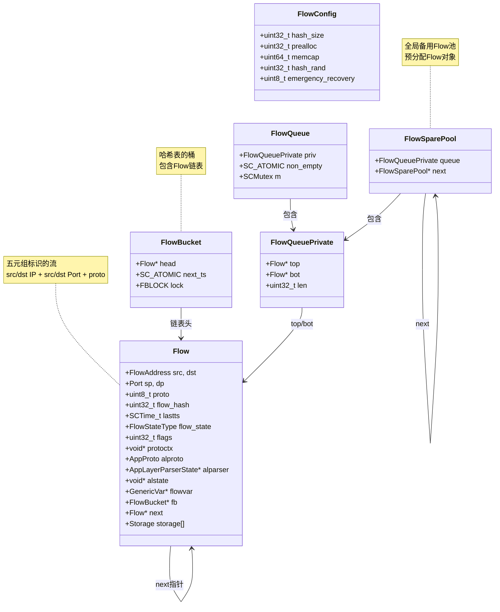

### 4.1.2 全局数据结构关系图

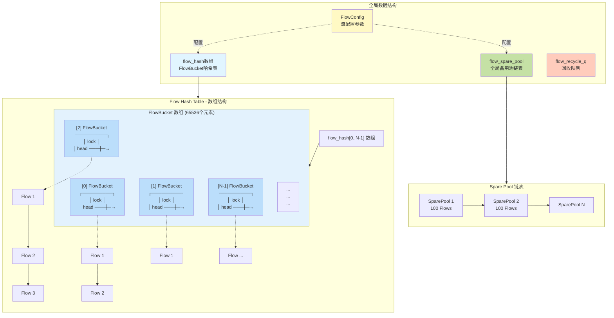

## 4.2 FlowInitConfig 初始化流程

### 4.2.1 完整初始化序列图

**代码位置：** [src/flow.c:518-645](../src/flow.c#L518-L645)

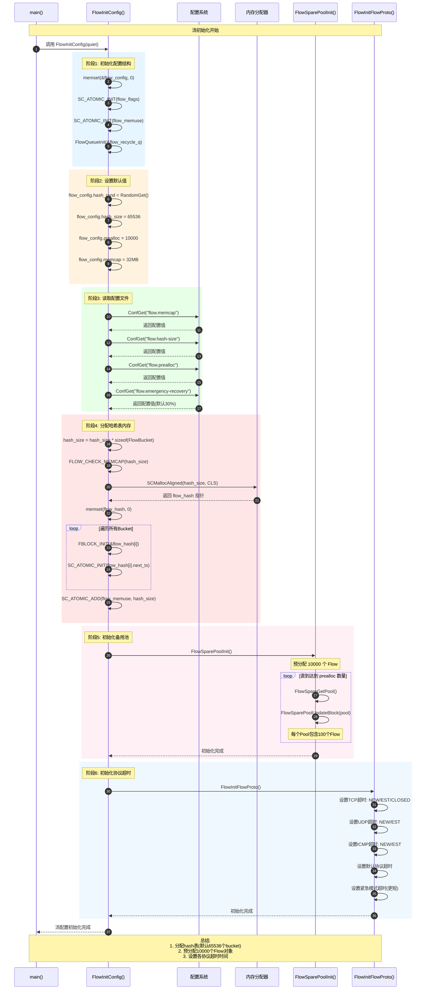

### 4.2.2 初始化流程图

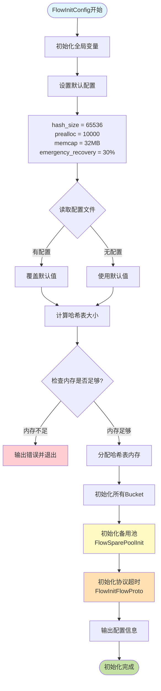

## 4.3 FlowSparePoolInit 备用池初始化

### 4.3.1 备用池初始化详细序列图

**代码位置：** [src/flow-spare-pool.c](../src/flow-spare-pool.c)

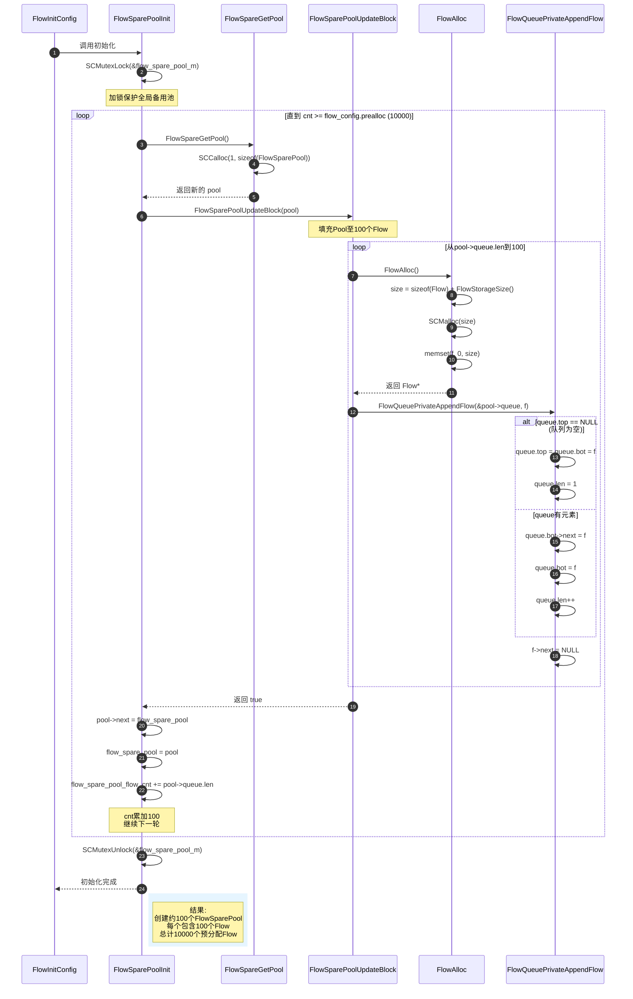

### 4.3.2 备用池结构演化图

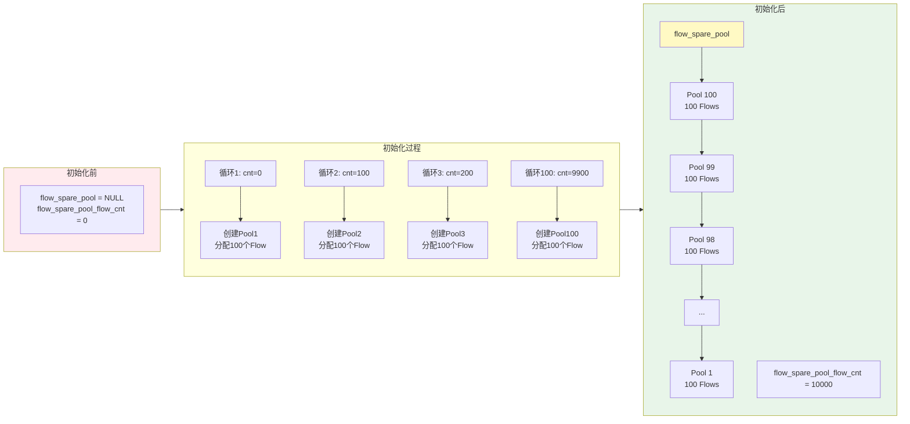

### 4.3.3 Flow 分配过程详细图

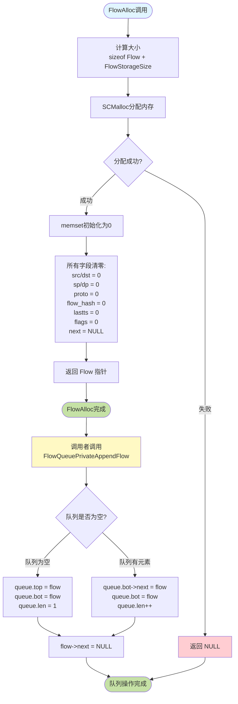

## 4.4 FlowInitFlowProto 协议超时初始化

### 4.4.1 协议超时配置矩阵

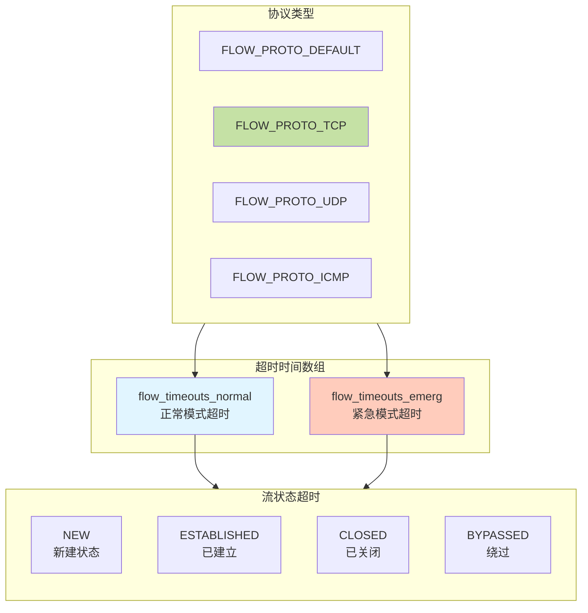

### 4.4.2 超时值对比表

| 协议 | 状态 | 正常模式超时 | 紧急模式超时 | 说明 |
|------|------|-------------|-------------|------|
| **TCP** | NEW | 60秒 | 10秒 | 三次握手未完成 |
| **TCP** | ESTABLISHED | 3600秒(1h) | 300秒(5m) | 连接已建立 |
| **TCP** | CLOSED | 120秒 | 20秒 | 四次挥手完成 |
| **TCP** | BYPASSED | 3600秒 | 300秒 | 绕过检测 |
| **UDP** | NEW | 30秒 | 10秒 | 首包 |
| **UDP** | ESTABLISHED | 300秒(5m) | 100秒 | 双向通信 |
| **UDP** | BYPASSED | 300秒 | 100秒 | 绕过检测 |
| **ICMP** | NEW | 30秒 | 10秒 | 首包 |
| **ICMP** | ESTABLISHED | 300秒 | 100秒 | 双向通信 |
| **ICMP** | BYPASSED | 300秒 | 100秒 | 绕过检测 |
| **DEFAULT** | NEW | 60秒 | 10秒 | 其他协议 |
| **DEFAULT** | ESTABLISHED | 300秒 | 100秒 | 其他协议 |
| **DEFAULT** | BYPASSED | 100秒 | 100秒 | 其他协议 |

### 4.4.3 协议超时初始化代码流程

**代码位置：** [src/flow.c](../src/flow.c) `FlowInitFlowProto()`

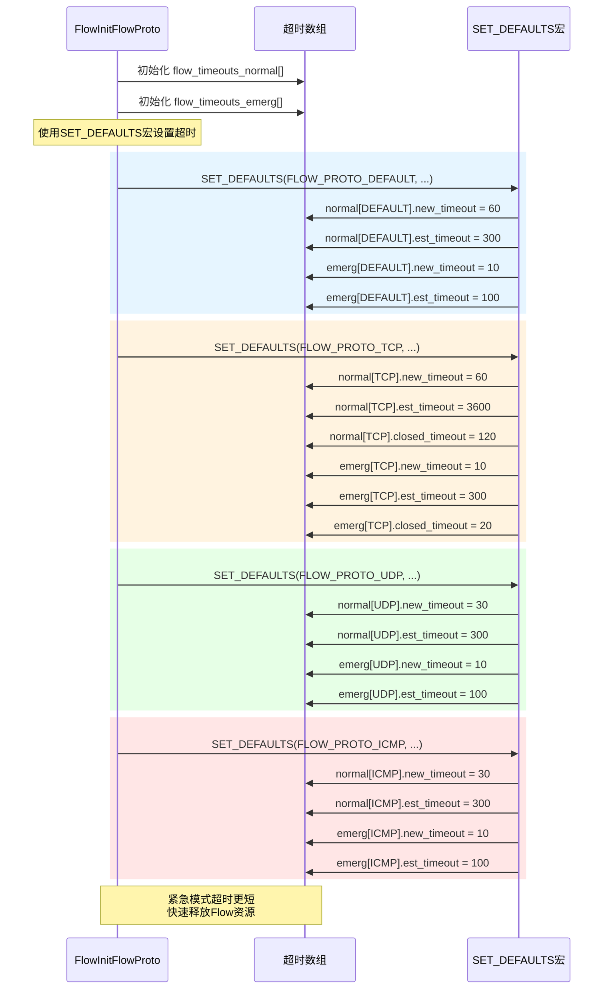

## 4.5 流初始化总览图

### 4.5.1 完整架构图

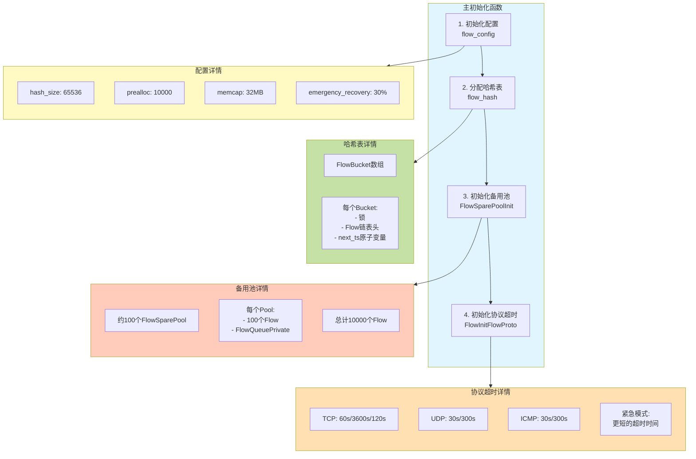

### 4.5.2 内存分配总览

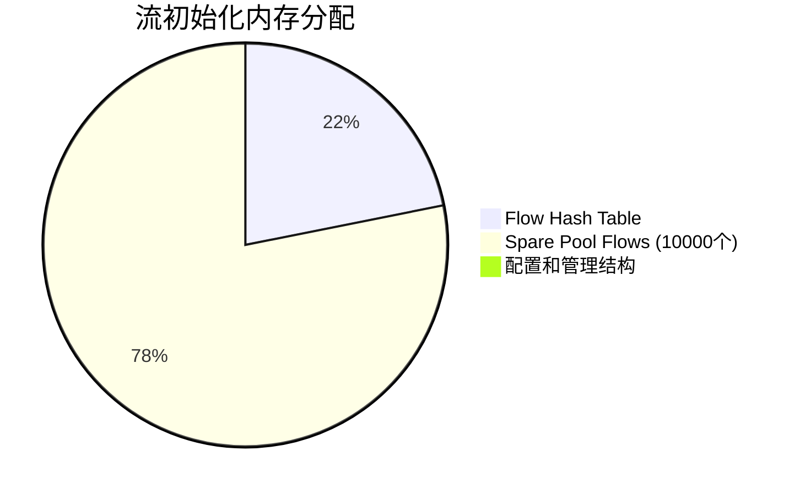

**计算说明：**
- **Hash Table**: 65536 buckets × 64 bytes = 4,194,304 bytes (~4MB)
- **Spare Pool**: 10000 flows × ~1500 bytes = 15,000,000 bytes (~15MB)
- **总计**: ~19MB (在默认32MB memcap范围内)

### 4.5.3 初始化时序图

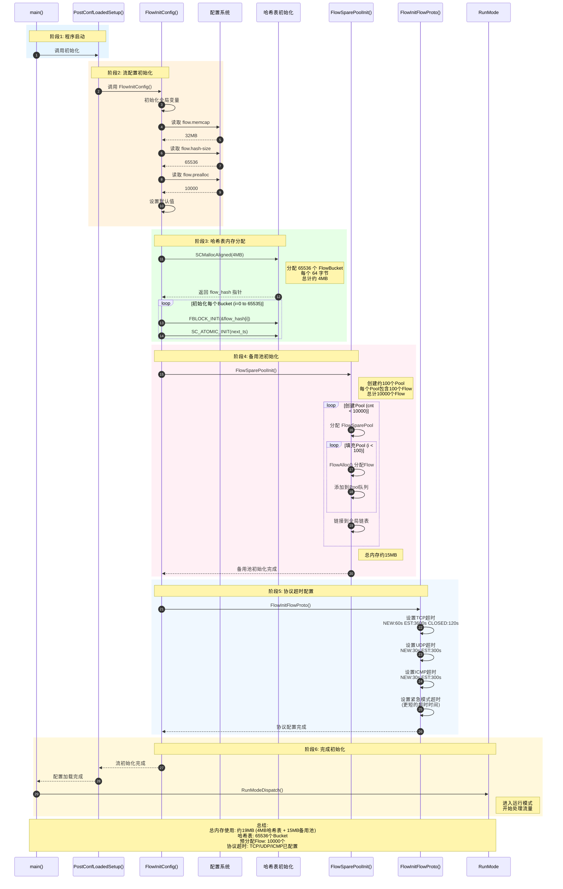

## 4.6 关键代码位置索引

| 组件 | 文件 | 函数 | 行号 | 说明 |
|------|------|------|------|------|
| 流初始化入口 | src/flow.c | `FlowInitConfig` | 518-645 | 主初始化函数 |
| 哈希表分配 | src/flow.c | `FlowInitConfig` | 612-624 | 分配并初始化哈希表 |
| 备用池初始化 | src/flow-spare-pool.c | `FlowSparePoolInit` | - | 预分配Flow对象 |
| Flow分配 | src/flow.c | `FlowAlloc` | - | 分配单个Flow |
| 队列操作 | src/flow-queue.c | `FlowQueuePrivateAppendFlow` | - | 添加Flow到队列 |
| 协议超时 | src/flow.c | `FlowInitFlowProto` | - | 设置各协议超时 |
| Flow结构定义 | src/flow.h | `Flow_` | - | Flow结构体定义 |
| 配置结构 | src/flow.h | `FlowConfig_` | - | 配置参数 |

## 4.7 配置文件示例

```yaml
# suricata.yaml 流管理配置示例

flow:
  # 流哈希表大小（桶数量）
  hash-size: 65536

  # 预分配的流数量
  prealloc: 10000

  # 流内存上限
  memcap: 64mb

  # 紧急恢复百分比（当流数量低于此百分比时退出紧急模式）
  emergency-recovery: 30

  # 内存耗尽策略
  memcap-policy: reject  # 或 pass-flow, bypass-flow

  # 各协议超时配置（可选）
  timeouts:
    default:
      new: 60
      established: 300
    tcp:
      new: 60
      established: 3600
      closed: 120
    udp:
      new: 30
      established: 300
    icmp:
      new: 30
      established: 300
```

## 4.8 调试技巧

### 4.8.1 GDB 断点建议

```bash
# 启动 GDB
gdb --args suricata -c suricata.yaml -i eth0

# 设置断点
b FlowInitConfig              # 流初始化入口
b FlowSparePoolInit           # 备用池初始化
b FlowAlloc                   # Flow分配
b FlowSparePoolUpdateBlock    # Pool填充
b FlowInitFlowProto           # 协议超时设置

# 运行
run

# 查看流配置
p flow_config
p flow_config.hash_size
p flow_config.prealloc
p flow_config.memcap

# 查看哈希表
p flow_hash[0]
p flow_hash[0].head

# 查看备用池
p flow_spare_pool
p flow_spare_pool->queue.len
p flow_spare_pool_flow_cnt
```

### 4.8.2 内存使用监控

```bash
# 查看流内存使用
cat /proc/$(pidof suricata)/status | grep VmRSS

# 查看 Suricata 统计信息
suricatasc -c "dump-counters" | grep flow

# 关键计数器
flow.memcap          # 当前内存使用
flow.spare           # 备用池中的Flow数量
flow.active          # 活跃的Flow数量
flow.recycled        # 回收的Flow数量
```

## 4.9 常见问题

**Q1: 为什么预分配10000个Flow？**

A: 这是性能优化策略：
- 避免运行时频繁的内存分配/释放
- 减少内存碎片
- 提高Flow创建速度
- 可通过配置文件调整

**Q2: 紧急模式何时触发？**

A: 当可用Flow数量低于某个阈值时：
- 触发条件: `spare_flows < (prealloc * emergency_recovery / 100)`
- 默认: 少于3000个空闲Flow (10000 * 30%)
- 效果: 使用更短的超时时间快速释放Flow

**Q3: 如何计算所需的 memcap？**

A: 公式: `memcap >= hash_table_size + (max_flows * flow_size)`
- Hash Table: `65536 * 64 ≈ 4MB`
- Flow Size: `~1500 bytes` (包含Storage)
- 示例: 支持10000个Flow需要约 `4MB + 15MB = 19MB`

**Q4: 哈希表大小如何选择？**

A: 考虑因素：
- 预期最大并发Flow数量
- 内存限制
- 一般建议: `hash_size ≥ max_concurrent_flows / 4`
- 示例: 预期40000并发Flow，设置 `hash_size = 16384`

## 4.10 总结

Suricata 流初始化是一个精心设计的过程，包含以下关键步骤：

1. **配置初始化**：读取配置文件，设置哈希表大小、预分配数量、内存上限
2. **哈希表分配**：创建FlowBucket数组，每个Bucket包含锁和Flow链表
3. **备用池初始化**：预分配大量Flow对象，组织成Pool链表，提高运行时性能
4. **协议超时配置**：为TCP/UDP/ICMP等协议设置不同状态的超时时间
5. **紧急模式支持**：当内存紧张时使用更短的超时时间

通过这些机制，Suricata能够高效地管理大量并发网络流，同时保持低延迟和高吞吐量。
