# 五、流建立过程详细图解（基于源代码）

本章节通过多个 Mermaid 图表深入分析 Suricata 流建立的完整过程。

## 5.1 流建立概览图

### 5.1.1 流建立核心数据结构关系图

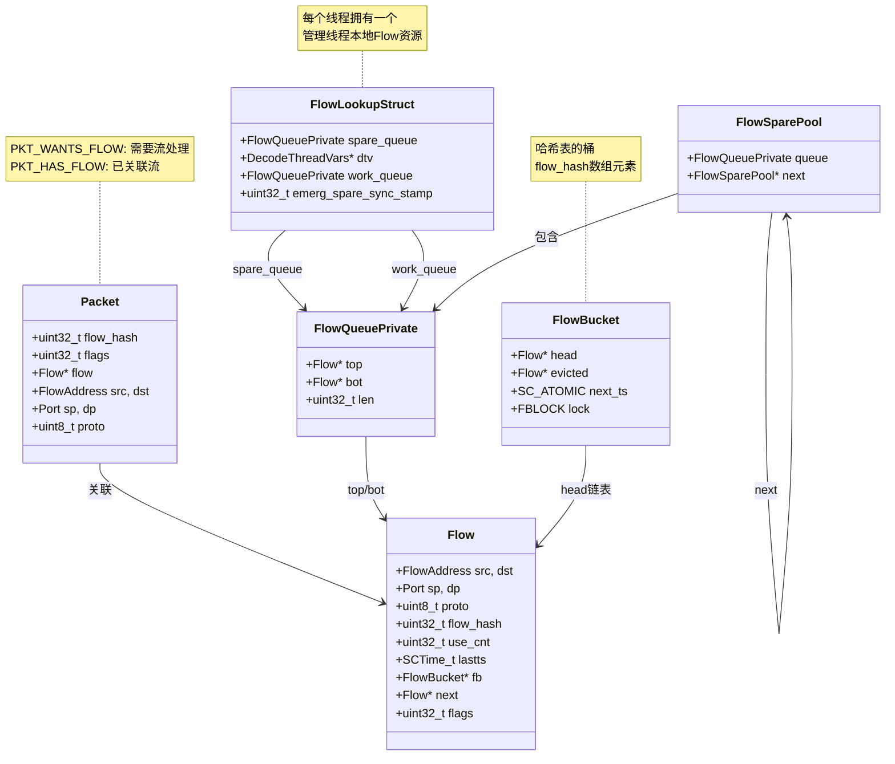

### 5.1.2 流建立整体流程图

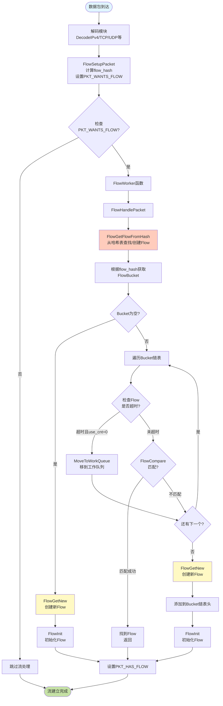

## 5.2 FlowGetFlowFromHash 详细分析

### 5.2.1 FlowGetFlowFromHash 完整序列图

**代码位置：** [src/flow-hash.c](../src/flow-hash.c)

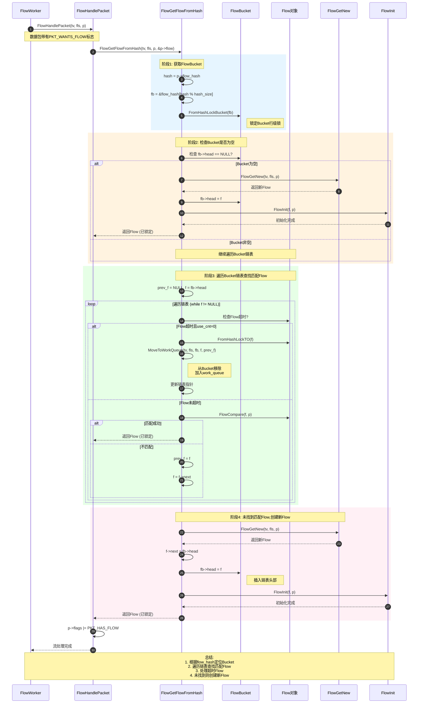

### 5.2.2 Bucket链表查找流程图

```mermaid
flowchart TD
    Start([FlowGetFlowFromHash开始]) --> GetBucket[获取FlowBucket<br/>fb = flow_hash[hash % hash_size]]

    GetBucket --> LockBucket[FromHashLockBucket<br/>锁定Bucket]

    LockBucket --> CheckHead{fb->head<br/>== NULL?}

    CheckHead -->|是| CreateFlow1[FlowGetNew<br/>创建新Flow]
    CreateFlow1 --> SetHead[fb->head = f]
    SetHead --> InitFlow1[FlowInit初始化]
    InitFlow1 --> Return1([返回Flow])

    CheckHead -->|否| InitLoop[prev_f = NULL<br/>f = fb->head]

    InitLoop --> LoopStart{f != NULL?}

    LoopStart -->|否| CreateFlow2[FlowGetNew<br/>创建新Flow]
    CreateFlow2 --> InsertHead[f->next = fb->head<br/>fb->head = f]
    InsertHead --> InitFlow2[FlowInit初始化]
    InitFlow2 --> Return2([返回Flow])

    LoopStart -->|是| CheckTimeout{Flow超时?}

    CheckTimeout -->|是| CheckUse{use_cnt == 0?}

    CheckUse -->|是| LockFlow[FromHashLockTO<br/>锁定Flow]
    LockFlow --> MoveWork[MoveToWorkQueue<br/>移到工作队列]
    MoveWork --> UpdateList[更新链表<br/>移除当前Flow]
    UpdateList --> NextFlow1[next_f = 当前next]

    CheckUse -->|否| NextFlow2[继续下一个]

    CheckTimeout -->|否| FlowCompare{FlowCompare<br/>匹配?}

    FlowCompare -->|匹配| Return3([返回Flow])
    FlowCompare -->|不匹配| UpdatePrev[prev_f = f]
    UpdatePrev --> NextFlow2

    NextFlow1 --> LoopStart
    NextFlow2 --> UpdateCurrent[f = f->next]
    UpdateCurrent --> LoopStart

    style Start fill:#e1f5ff
    style Return1 fill:#c5e1a5
    style Return2 fill:#c5e1a5
    style Return3 fill:#c5e1a5
    style CreateFlow1 fill:#fff9c4
    style CreateFlow2 fill:#fff9c4
    style MoveWork fill:#ffccbc
```

## 5.3 FlowGetNew 流创建详细分析

### 5.3.1 FlowGetNew 完整序列图

**代码位置：** [src/flow-hash.c](../src/flow-hash.c) `FlowGetNew()`

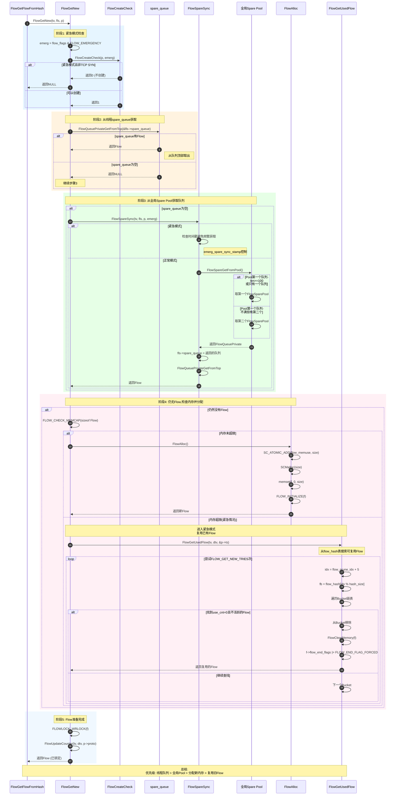

### 5.3.2 FlowGetNew 决策流程图

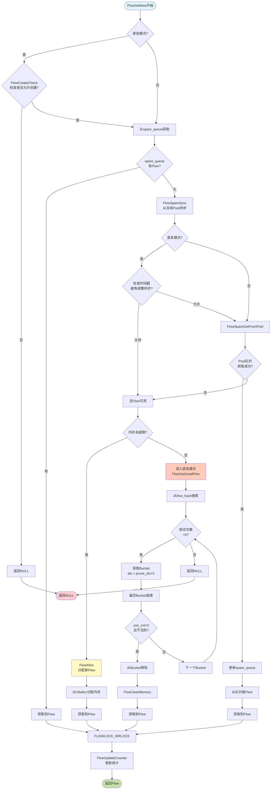

## 5.4 FlowSpareSync 全局Pool同步

### 5.4.1 FlowSpareGetFromPool 详细流程

**代码位置：** [src/flow-spare-pool.c](../src/flow-spare-pool.c)

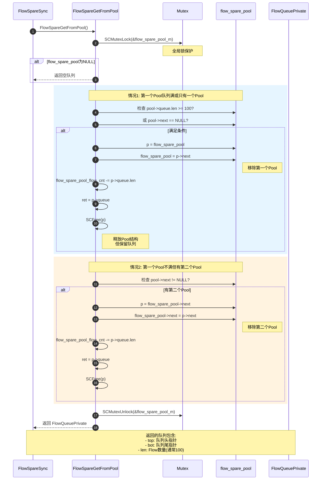

### 5.4.2 Spare Pool 组织结构图

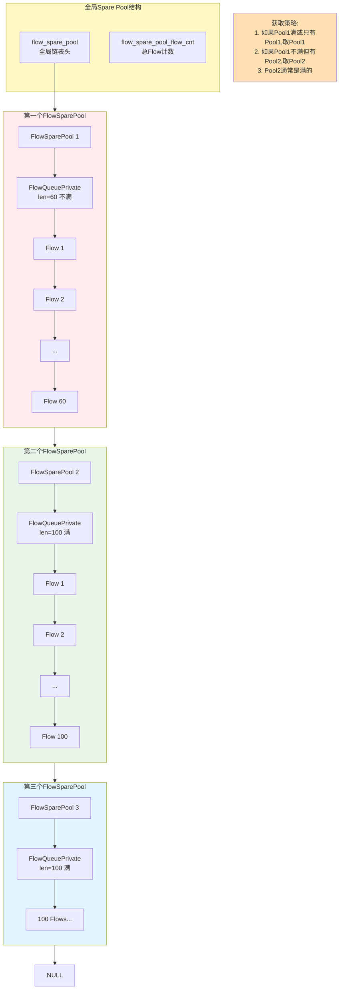

## 5.5 Flow比较与匹配

### 5.5.1 FlowCompare 函数逻辑

**代码位置：** [src/flow-hash.c](../src/flow-hash.c)

```mermaid
flowchart TD
    Start([FlowCompare开始]) --> CheckHash{flow_hash<br/>相等?}

    CheckHash -->|否| NotMatch1[返回0<br/>不匹配]
    CheckHash -->|是| CheckVlan1{vlan_id[0]<br/>相等?}

    CheckVlan1 -->|否| NotMatch2[返回0<br/>不匹配]
    CheckVlan1 -->|是| CheckVlan2{vlan_id[1]<br/>相等?}

    CheckVlan2 -->|否| NotMatch3[返回0<br/>不匹配]
    CheckVlan2 -->|是| CheckProto{proto<br/>相等?}

    CheckProto -->|否| NotMatch4[返回0<br/>不匹配]
    CheckProto -->|是| CheckRecur{recursion_level<br/>相等?}

    CheckRecur -->|否| NotMatch5[返回0<br/>不匹配]
    CheckRecur -->|是| CheckSrcAddr{src地址<br/>相等?}

    CheckSrcAddr -->|是| CheckSrcPort{src端口<br/>相等?}
    CheckSrcPort -->|是| CheckDstAddr{dst地址<br/>相等?}
    CheckDstAddr -->|是| CheckDstPort{dst端口<br/>相等?}
    CheckDstPort -->|是| Match1[返回1<br/>匹配成功]

    CheckSrcAddr -->|否| CheckDstAddr2{dst地址<br/>==pkt.src?}
    CheckSrcPort -->|否| CheckDstAddr2
    CheckDstAddr -->|否| CheckDstAddr2
    CheckDstPort -->|否| CheckDstAddr2

    CheckDstAddr2 -->|是| CheckDstPort2{dst端口<br/>==pkt.sp?}
    CheckDstPort2 -->|是| CheckSrcAddr2{src地址<br/>==pkt.dst?}
    CheckSrcAddr2 -->|是| CheckSrcPort2{src端口<br/>==pkt.dp?}
    CheckSrcPort2 -->|是| Match2[返回1<br/>匹配成功<br/>反向]

    CheckDstAddr2 -->|否| NotMatch6[返回0<br/>不匹配]
    CheckDstPort2 -->|否| NotMatch6
    CheckSrcAddr2 -->|否| NotMatch6
    CheckSrcPort2 -->|否| NotMatch6

    style Start fill:#e1f5ff
    style Match1 fill:#c5e1a5
    style Match2 fill:#c5e1a5
    style NotMatch1 fill:#ffcdd2
    style NotMatch2 fill:#ffcdd2
    style NotMatch3 fill:#ffcdd2
    style NotMatch4 fill:#ffcdd2
    style NotMatch5 fill:#ffcdd2
    style NotMatch6 fill:#ffcdd2
```

### 5.5.2 FlowCompare 匹配条件表

| 比较项 | 条件 | 说明 |
|--------|------|------|
| **flow_hash** | 必须相等 | 五元组计算的哈希值 |
| **vlan_id[0]** | 必须相等 | VLAN ID第一层 |
| **vlan_id[1]** | 必须相等 | VLAN ID第二层 |
| **proto** | 必须相等 | IP协议号(TCP/UDP/ICMP等) |
| **recursion_level** | 必须相等 | 递归级别(隧道层数) |
| **五元组匹配** | 两种方式之一 | 正向或反向匹配 |

**五元组正向匹配：**
- Flow.src == Packet.src
- Flow.sp == Packet.sp
- Flow.dst == Packet.dst
- Flow.dp == Packet.dp

**五元组反向匹配：**
- Flow.src == Packet.dst
- Flow.sp == Packet.dp
- Flow.dst == Packet.src
- Flow.dp == Packet.sp

## 5.6 完整流建立架构图

### 5.6.1 流建立多层次架构

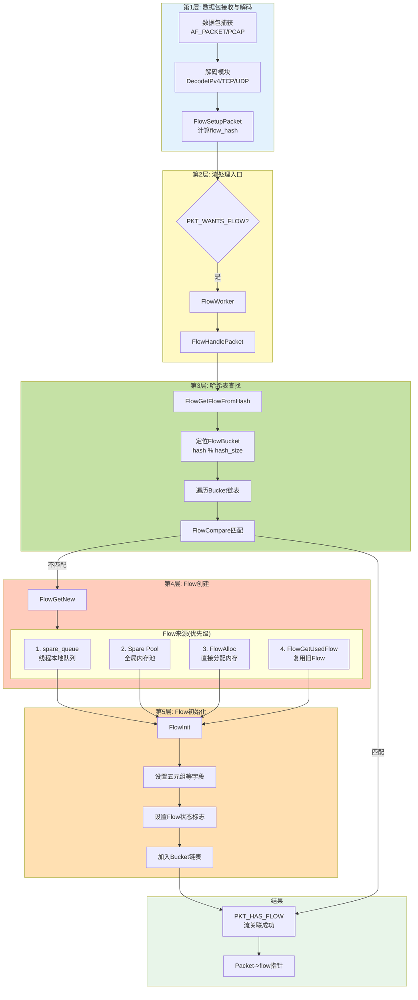

### 5.6.2 Flow生命周期状态图

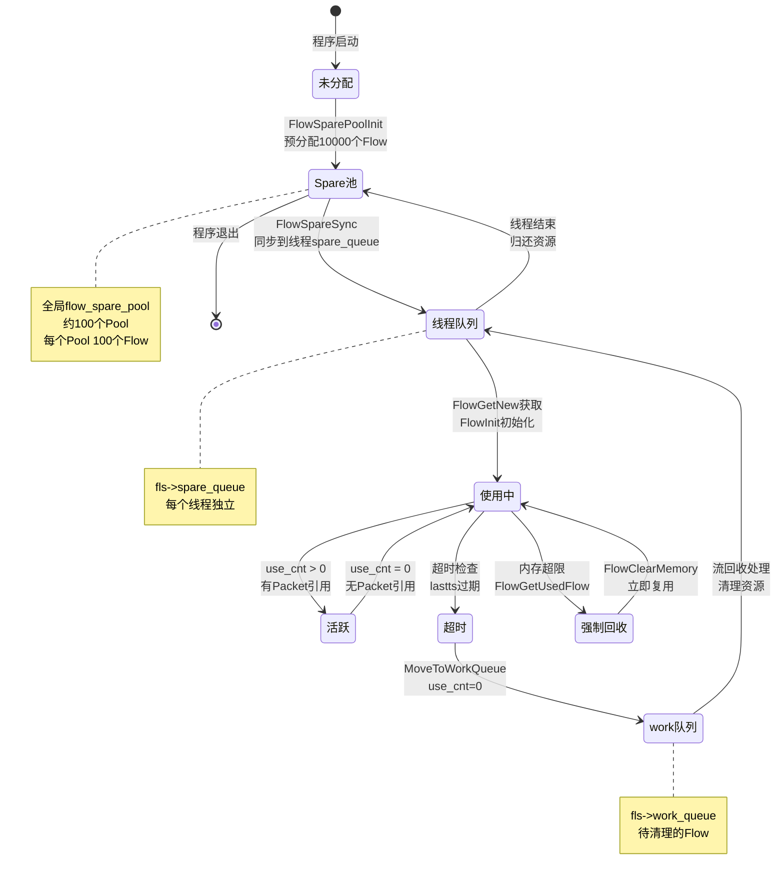

## 5.7 关键函数调用链

### 5.7.1 完整调用链序列图

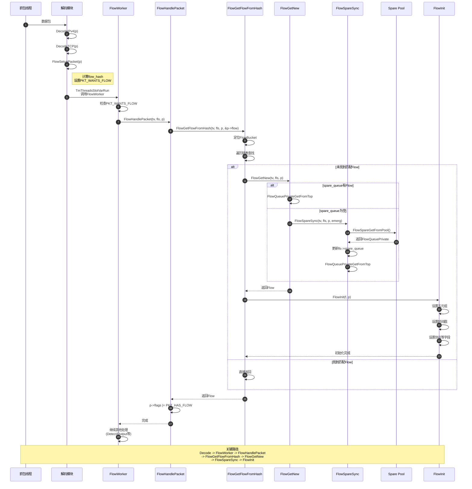

## 5.8 性能优化策略图

### 5.8.1 内存管理优化

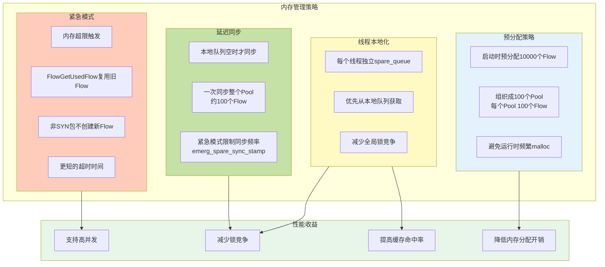

### 5.8.2 查找优化策略

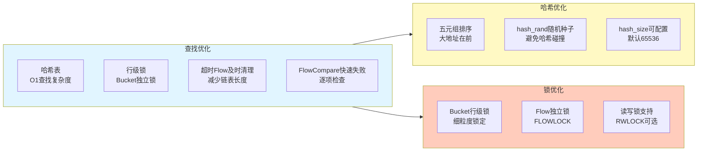

## 5.9 调试与监控

### 5.9.1 关键统计计数器

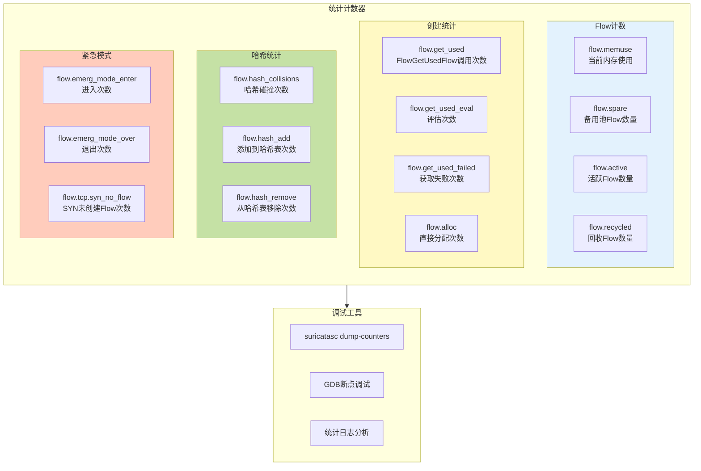

### 5.9.2 GDB调试建议

```bash
# 启动GDB
gdb --args suricata -c suricata.yaml -i eth0

# 流建立相关断点
b FlowSetupPacket              # 设置flow_hash
b FlowHandlePacket             # 流处理入口
b FlowGetFlowFromHash          # 哈希查找
b FlowGetNew                   # 创建新Flow
b FlowSpareSync                # 全局Pool同步
b FlowGetUsedFlow              # 复用旧Flow
b FlowInit                     # Flow初始化
b FlowCompare                  # Flow匹配

# 运行并查看
run

# 查看Packet信息
p p->flow_hash
p p->flags
p/x p->flags & PKT_WANTS_FLOW
p *p->flow

# 查看FlowBucket
p flow_hash[p->flow_hash % flow_config.hash_size]
p *fb->head

# 查看FlowLookupStruct
p *fls
p fls->spare_queue.len
p fls->work_queue.len

# 查看全局Pool
p flow_spare_pool
p flow_spare_pool_flow_cnt
p *flow_spare_pool

# 查看Flow对象
p *f
p f->src
p f->dst
p f->sp
p f->dp
p f->proto
p f->use_cnt
p f->flags
```

## 5.10 常见问题与解答

**Q1: 为什么需要spare_queue和全局Spare Pool两级缓存?**

A: 性能优化策略:
- **spare_queue (线程本地)**: 无锁访问，极快
- **Spare Pool (全局)**: 线程间共享，需要锁
- 优先使用本地队列，空了才同步全局Pool
- 减少锁竞争，提高并发性能

**Q2: FlowGetUsedFlow什么时候被调用?**

A: 极端场景:
- 内存超过配置的memcap限制
- 全局Spare Pool也没有可用Flow
- 系统进入紧急模式
- 从哈希表强制回收use_cnt=0的Flow复用

**Q3: Flow匹配支持双向吗?**

A: 是的，FlowCompare支持双向匹配:
- 正向: Flow(src→dst) == Packet(src→dst)
- 反向: Flow(src→dst) == Packet(dst→src)
- 一个Flow对象同时跟踪两个方向的流量

**Q4: 为什么FlowSpareGetFromPool优先取第二个Pool?**

A: Pool组织策略:
- 第一个Pool可能不满(正在回收Flow)
- 第二个Pool通常是满的(len=100)
- 取满的Pool更高效，一次获得100个Flow
- 避免频繁同步

**Q5: emerg_spare_sync_stamp的作用?**

A: 紧急模式限流:
- 记录上次同步时间戳
- 同一秒内只允许同步一次
- 避免紧急模式下频繁获取全局锁
- 保护系统稳定性

## 5.11 总结

Suricata流建立是一个精心设计的多层次系统:

1. **解码阶段**: 计算flow_hash，设置PKT_WANTS_FLOW
2. **查找阶段**: 在哈希表中查找匹配的Flow
3. **创建阶段**: 未找到则创建新Flow，优先级:
   - 线程本地spare_queue (最快)
   - 全局Spare Pool (需要锁)
   - 直接分配内存 (malloc)
   - 复用旧Flow (紧急模式)
4. **匹配阶段**: FlowCompare支持双向匹配
5. **优化策略**: 预分配、线程本地化、延迟同步、紧急模式

通过这些机制，Suricata能够高效处理大量并发连接，同时保持低延迟和高吞吐量。
