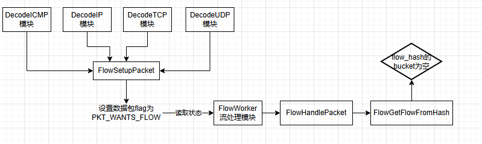
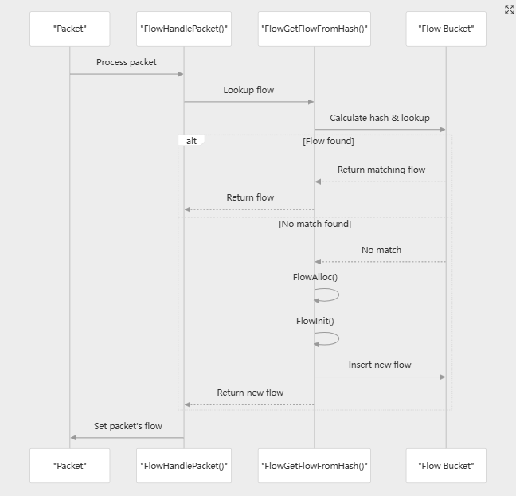

上文讲到流表的初始化，这节我们开始流建立。


# 一、流建立概述




流表建立要从FlowWorker函数说起，在解码模块中已经调用函数**FlowSetupPacket**根据五元组设置了流的hash值p->flow_hash，并且设置了标志位PKT_WANTS_FLOW，表示当前数据包需要进行流处理。

```
void FlowSetupPacket(Packet *p)
{
    p->flags |= PKT_WANTS_FLOW;
    p->flow_hash = FlowGetHash(p);
}
```

设置过PKT_WANTS_FLOW后，数据包将被关联到一个Flow结构体，用于维护连接状态。

suricata会根据计算出的流哈希值flow_hash在流表中查看对应的流对象，如果没有则创建新的流对象。


## 1、1 解码模块设置PKT_WANTS_FLOW标志

各个**解码模块**（如ip、tcp、udp等模块）调用**FlowSetupPacket**，**FlowSetupPacket**调用**FlowGetHash**函数（基于五元组计算出流的hash）将函数返回值赋值给p->flow_hash，并且设置了标志位PKT_WANTS_FLOW，表示此数据包将继续走流处理模块FlowWorker。

```
static inline uint32_t FlowGetHash(const Packet *p)
{
    uint32_t hash = 0;

    if (p->ip4h != NULL) {
        //如果数据包是TCP或UDP，则计算TCP或UDP的hash值
        if (p->tcph != NULL || p->udph != NULL) {
            FlowHashKey4 fhk;

            //地址排序，比较源地址和目的地址，索引0的位置放置大的地址
            int ai = (p->src.addr_data32[0] > p->dst.addr_data32[0]);
            fhk.addrs[1-ai] = p->src.addr_data32[0];
            fhk.addrs[ai] = p->dst.addr_data32[0];

            //端口排序，比较源端口和目的端口，索引0的位置放置大的端口
            const int pi = (p->sp > p->dp);
            fhk.ports[1-pi] = p->sp;
            fhk.ports[pi] = p->dp;

            //协议类型
            fhk.proto = (uint16_t)p->proto;
            //递归级别
            fhk.recur = (uint16_t)p->recursion_level;
            //VLAN ID
            /* g_vlan_mask sets the vlan_ids to 0 if vlan.use-for-tracking
             * is disabled. */
            fhk.vlan_id[0] = p->vlan_id[0] & g_vlan_mask;
            fhk.vlan_id[1] = p->vlan_id[1] & g_vlan_mask;

			//五元组哈希计算出一个hash值，将hash值返回
            hash = hashword(fhk.u32, 5, flow_config.hash_rand);
        } 
    }

    return hash;
}
```


## 1、2 Decoder解码模块和FlowWorker如何传递Packet

### Single模式

在single模式下，只有一个数据包处理线程，该线程包含完整的数据包处理流水线。所有模块（包括Decoder和FlowWorker）都注册在同一个线程中，通过循环调用不同模块的回调函数来处理数据包。


### Workers模式

在workers模式下，每个处理线程都包含完整的数据包流水线。

这意味着每个worker线程内部的Decoder和FlowWorker模块同样是通过模块回调机制而不是线程间传递来处理数据包的。


不管是single模式还是workers模式，模块在同一个线程内通过回调机制循序执行，无数据包传递。


### Autofp模式

数据包在不同线程之间的传递才会通过队列机制，主要发生在：

存在专门的Capture线程进行数据包抓取和数据包解码，然后将数据包通过队列传递给flow worker线程。


# 二、 流处理模块FlowWorker

## 2、1 核心数据结构之FlowLookupStruct

在流处理的代码分析过程中，我们频繁遇到FlowLookupStruct结构体

```
typedef struct FlowLookupStruct_
{
    /** thread store of spare queues */
    //就是线程自己的空闲flow队列，从里边获取一个可用的flow，不够了从全局flow内存池获取一个flow队列
    FlowQueuePrivate spare_queue;
    
    //主要为了在处理过程调用输出记录flow日志时，需要用输出参数
    DecodeThreadVars *dtv;
    
    //获取flow时如果flow超时了且引用计数为0，则把flow放到这个队列，
    //在FlowWorker底部最后一个函数会处理这个队列
    FlowQueuePrivate work_queue;
    
    //线程中flow用完时，从全局flow内存池获取flow队列的时间控制变量，不能频繁的
    //从全局flow内存池获取flow队列，每次都要锁，程序里是大于1秒就可以再次尝试获取，
    //主要避免频繁上锁
    uint32_t emerg_spare_sync_stamp;
} FlowLookupStruct;
```


## 2、2 流处理的流程分析

流处理的处理流程：



**FlowWorker -> FlowHandlePacket -> FlowGetFlowFromHash -> Flow Bucket**

流处理涉及到：

1、根据数据包的五元组计算哈希值flow_hash

2、根据flow_hash查找对应的FlowBucket

3、将Flow流和数据包进行比较（比较什么？）

4、如果找不到流，则创建一个新的Flow流


流处理模块是FlowWorker函数来负责的。

```
static TmEcode FlowWorker(ThreadVars *tv, Packet *p, void *data)
{
    FlowWorkerThreadData *fw = data;
    void *detect_thread = SC_ATOMIC_GET(fw->detect_thread);

	......
    /* 当数据包标志带有 PKT_WANTS_FLOW时，会调用FlowHandlePacket函数进行处理 */
    if (p->flags & PKT_WANTS_FLOW) {
		......
        FlowHandlePacket(tv, &fw->fls, p);//核心处理函数
		......
    } 
}
```

FlowWorker函数中，当数据包带有PKT_WANTS_FLOW宏标志后，调用**FlowHandlePacket**函数进行流flow相关处理。

```
void FlowHandlePacket(ThreadVars *tv, FlowLookupStruct *fls, Packet *p)
{
    /* Get this packet's flow from the hash. FlowHandlePacket() will setup
     * a new flow if nescesary. If we get NULL, we're out of flow memory.
     * The returned flow is locked. */
    //核心函数，重点看！
    Flow *f = FlowGetFlowFromHash(tv, fls, p, &p->flow);
    if (f == NULL)
        return;

    /* set the flow in the packet */
    p->flags |= PKT_HAS_FLOW;//设置数据包标志为PKT_HAS_FLOW
    return;
}
```

**FlowGetFlowFromHash函数作用：**

通过哈希值查找对应的flow流，并设置数据包标志为PKT_HAS_FLOW，方便后续流程处理。


FlowGetFlowFromHash函数经精简后如下所示：

```
Flow *FlowGetFlowFromHash(ThreadVars *tv, FlowLookupStruct *fls, Packet *p, Flow **dest)
{
    Flow *f = NULL;

	//以数据包的流哈希值为下标，获取哈希表中对应的FlowBucket（Bucket桶）
    const uint32_t hash = p->flow_hash;
    FlowBucket *fb = &flow_hash[hash % flow_config.hash_size];
    FromHashLockBucket(fb);//行级锁，锁住一个bucket

	//bucket为空,调用FlowGetNew获取Flow
    if (fb->head == NULL) {
        f = FlowGetNew(tv, fls, p);//新建流并初始化
        FlowInit(f, p);
        return f;
    }

    //bucket中有流，则遍历流链表，找到和数据包匹配的流
    //prev_f -> 上一个流，用途是？ next_f->下一个流    
    Flow *prev_f = NULL; /* previous flow */
    f = fb->head;
    do {
        Flow *next_f = NULL;/*next flow*/
		//检测流超时
        if (timedout) {
            FromHashLockTO(f);
            //超时且引用计数为0，则回收flow到线程所属的队列中（流回收后续）
            if (likely(f->use_cnt == 0)) {
                next_f = f->next;
                MoveToWorkQueue(tv, fls, fb, f, prev_f);//回收流，将其放入线程所属的work queue
                FLOWLOCK_UNLOCK(f);
                goto flow_removed;
            }
            FLOWLOCK_UNLOCK(f);
        } else if (FlowCompare(f, p) != 0) {//找到了和packet匹配的流则返回
            return f;
        }
        
        prev_f = f;
        next_f = f->next;

flow_removed:
		//遍历完所有流都没有找到，则创建新流
        if (next_f == NULL) {
            f = FlowGetNew(tv, fls, p);

			//flow添加到bucket链表的
            f->next = fb->head;
            fb->head = f;

            //流初始化并返回流
            FlowInit(f, p);
			......省略代码,
            return f;
        }
        f = next_f;
    } while (f != NULL);

    return NULL;
}
```

这个函数分三块理解：

1、根据数据包的flow_hash值获取对应的bucket链表，判断bucket链表是否为空，分为两种情况；

2、bucket链表为空，则调用FlowGetNew新建一个flow，初始化流并返回。

3、bucket链表不为空，则遍历流链表，找到和数据包匹配的流；

4、在查找流的过程中检查flow是否超时，如果超时且引用计数为0，则放入线程所属队列work_queue中；

5、遍历完bucket链表上所有flow后，依然没有找到和packet匹配的flow，则调用FlowGetNew新建一个flow，对流初始化并返回流。


为了方便大家理解，我特意画了张图，

其中packet1在索引为5的bucket桶中成功找到和packet匹配的flow流；

而packet2在索引为10的bucket桶中并未找到和packet匹配的flow流，代表查找失败，则需要调用FlowGetNew新建一个flow


# 三、流创建的艰难之旅

## 3、1 Flow创建流程概述

Flow流创建涉及到一个关键的数据结构：**FlowLookupStruct结构体**

```
typedef struct FlowLookupStruct_ // TODO name
{
    FlowQueuePrivate spare_queue;//空闲队列，存储可重复利用的Flow对象
    DecodeThreadVars *dtv;
    FlowQueuePrivate work_queue;//工作队列，当Flow超时需要清理时，会将其放入工作队列中
    uint32_t emerg_spare_sync_stamp;//紧急空闲同步时间戳
} FlowLookupStruct;
```

上文提到流创建使用的是FlowGetNew函数，下面我们好好看下这个函数。

```
static Flow *FlowGetNew(ThreadVars *tv, FlowLookupStruct *fls, Packet *p)
{
	//紧急模式标志
    const bool emerg = ((SC_ATOMIC_GET(flow_flags) & FLOW_EMERGENCY) != 0);
    
	//紧急模式下，做一些检查，tcp的非syn包不生成flow
    if (FlowCreateCheck(p, emerg) == 0) {
        return NULL;
    }

	//每个线程拥有一个FlowLookupStruct指针fls
	//从线程所属的flow空闲队列里获取flow，如果获取成功则返回flow
    Flow *f = FlowQueuePrivateGetFromTop(&fls->spare_queue);
    if (f == NULL) {
		//获取flow失败，则从全局flow内存池中获取一个flow队列，再从flow队列中获取flow
		//FlowSpareSync的功能是从全局flow内存池中获取一个flow队列
        f = FlowSpareSync(tv, fls, p, emerg);
    }
    
	//全局flow内存池，也没有flow队列
    if (f == NULL) {
        /* If we reached the max memcap, we get a used flow */
		//flow内存超过配置上限，则进入紧急模式
        if (!(FLOW_CHECK_MEMCAP(sizeof(Flow) + FlowStorageSize()))) {
			......//紧急模式的处理代码

			//从全局flow_hash表中的bucket中，将引用计数为0的项进行复用，不管是否满足超时条件
            f = FlowGetUsedFlow(tv, fls->dtv, &p->ts);
            
            /* flow is still locked from FlowGetUsedFlow() */
            FlowUpdateCounter(tv, fls->dtv, p->proto);
            return f;
        }

        /* now see if we can alloc a new flow */
		//内存未达到上限，则直接在内存上分配flow
        f = FlowAlloc();

        /* flow is initialized but *unlocked* */
		//flow已经初始化，但是并未上锁
    } else {
        /* flow has been recycled before it went into the spare queue */

        /* flow is initialized (recylced) but *unlocked* */
    }

    FLOWLOCK_WRLOCK(f);
    FlowUpdateCounter(tv, fls->dtv, p->proto);//更新统计计数
    return f;
}
```


**流程总结：**

**1、从线程所属的flow空闲队列spare_queue里获取flow，如成功则返回flow，如失败则走步骤2**

**2、从全局flow内存池中获取一个flow队列，再从flow队列中获取flow，失败则走步骤3**

**3、判断flow内存是否超过配置上限，不超过的话，直接调用函数FlowAlloc申请flow；**

**4、flow内存超过配置上限，调用FlowGetUsedFlow函数，从全局flow_hash表中的bucket链表中，将引用计数为0的项取出来进行复用。**


## 3、2 从线程所属的flow队列获取flow

每个线程有自己的flow队列fls->spare_queue，其函数调用为Flow *f = FlowQueuePrivateGetFromTop(&fls->spare_queue);

```
Flow *FlowQueuePrivateGetFromTop(FlowQueuePrivate *fqc)
{
    Flow *f = fqc->top;
    if (f == NULL) {
        return NULL;
    }

    fqc->top = f->next;
    f->next = NULL;
    fqc->len--;
    if (fqc->top == NULL) {
        fqc->bot = NULL;
    }
    return f;
}
```

上述函数是获取fls->spare_queue队列顶部的flow元素，并改变各个指针。


## 3、3 从全局flow内存池获取flow队列

从全局flow内存池FlowSparePool *flow_spare_pool获取一个flow队列。

调用堆栈如下

```
FlowHandlePacket
	FlowGetFlowFromHash
		FlowGetNew
			FlowSpareSync
```


### 3、3、1 FlowSpareSync函数

在获取flow时，如果线程自己的flow队列(fls->spare_queue)没有flow可用，则从全局flow内存池中获取一个flow队列，这个工作由函数FlowSpareSync完成。

```
static inline Flow *FlowSpareSync(ThreadVars *tv, FlowLookupStruct *fls,
        const Packet *p, const bool emerg)
{
    Flow *f = NULL;
    bool spare_sync = false;
    if (emerg) {
		//紧急模式下，保证同一秒的包仅能从全局flow内存池获取一次flow队列
        //如果太快，就会频繁对全局flow内存池上锁
        if ((uint32_t)p->ts.tv_sec > fls->emerg_spare_sync_stamp) {
            fls->spare_queue = FlowSpareGetFromPool(); /* local empty, (re)populate and try again */
            spare_sync = true;
            f = FlowQueuePrivateGetFromTop(&fls->spare_queue);
            if (f == NULL) {
                /* wait till next full sec before retrying */
				//没有获取到flow，将数据包时间戳赋值给fls->emerg_spare_sync_stamp
                fls->emerg_spare_sync_stamp = (uint32_t)p->ts.tv_sec;
            }
        }
    } else {
    	//非紧急模式下，从全局内存池中拿出一个flow队列，优先看这块
        fls->spare_queue = FlowSpareGetFromPool(); /* local empty, (re)populate and try again */
		//从flow队列中取出一个flow
        f = FlowQueuePrivateGetFromTop(&fls->spare_queue);
        spare_sync = true;
    }
    return f;
}
```

在非紧急模式下，调用了FlowSpareGetFromPool，从全局内存池中拿出一个flow流队列，然后再调用FlowQueuePrivateGetFromTop从flow流队列中获取flow对象。


### 3、3、2 FlowSpareGetFromPool

调用堆栈如下

FlowHandlePacket-》FlowGetFlowFromHash-》FlowGetNew-》FlowSpareSync-》FlowSpareGetFromPool

使用到的结构体和全局变量如下：

```
static uint32_t flow_spare_pool_block_size = 100;
static FlowSparePool *flow_spare_pool = NULL;	//记录flow spare flow内存池的链表头

typedef struct FlowSparePool {
    FlowQueuePrivate queue;
    struct FlowSparePool *next;
} FlowSparePool;
//每个FlowSparePool结构体中包含一个FlowQueuePrivate队列。
```

flow_spare_pool_block_size的默认值为100；


将mutex加锁解锁和数据验证的代码精简后，FlowSpareGetFromPool函数如下所示：

```
FlowQueuePrivate FlowSpareGetFromPool(void)
{
    //第一个flow队列容量大于等于100，或者flow_spare_pool中只有一个可用的flow队列
    if (flow_spare_pool->queue.len >= flow_spare_pool_block_size || flow_spare_pool->next == NULL) {
        FlowSparePool *p = flow_spare_pool;
        flow_spare_pool = p->next;
        flow_spare_pool_flow_cnt -= p->queue.len;

        FlowQueuePrivate ret = p->queue;
        SCFree(p);
        return ret;
    /* next should always be full if it exists */
    } else if (flow_spare_pool->next != NULL) { //第一个flow队列不满，但第二个flow队列也可用，则取之
        FlowSparePool *p = flow_spare_pool->next;
        flow_spare_pool->next = p->next;
        flow_spare_pool_flow_cnt -= p->queue.len;
        FlowQueuePrivate ret = p->queue;
        SCFree(p);
        return ret;
    }
}
```

因为flow回收时，如果第一个pool的队列是满的（ 大于等于100），则新建一个pool，把回收的flow放在新建的pool上，然后把这个pool放在第一个位置，原来满的第一个pool放在第二位置；

如果第一个pool的flow队列不满，则把回收的flow放入第一个pool上，此时不会有第二个pool的，而且第一个pool上的可用flow是最多的。


## 3、4 FlowAlloc直接申请内存

```
Flow *FlowAlloc(void)
{
    Flow *f;
    size_t size = sizeof(Flow) + FlowStorageSize();

	//检测是否超出内存最大值，如果超出则返回NULL
    if (!(FLOW_CHECK_MEMCAP(size))) {
        return NULL;
    }

    //增加内存使用量
    (void) SC_ATOMIC_ADD(flow_memuse, size);

    //分配内存
    f = SCMalloc(size);
    if (unlikely(f == NULL)) {
        (void)SC_ATOMIC_SUB(flow_memuse, size);
        return NULL;
    }
    memset(f, 0, size);

    //初始化Flow对象
    FLOW_INITIALIZE(f);
    return f;
}
```

细看FlowAlloc函数，其内部直接调用SCMalloc（即malloc原始函数）申请内存空间，


## 3、5 复用引用计数为零的flow流（极端场景）

**调用时机：**

FlowGetNew中获取flow时，全局flow内存池也没有flow队列，flow内存到达配置的内存上限


**调用堆栈为**

```
FlowHandlePacket
	-->FlowGetFlowFromHash
		-->FlowGetNew
			-->FlowGetUsedFlow
```


```c
#define FLOW_GET_NEW_TRIES 5

static inline uint32_t GetUsedAtomicUpdate(const uint32_t val)
{
    uint32_t r =  SC_ATOMIC_ADD(flow_prune_idx, val);
    return r;
}
uint32_t idx = GetUsedAtomicUpdate(FLOW_GET_NEW_TRIES) % flow_config.hash_size;
```

flow_prune_idx：控制每次获取flow的bucket的索引值，这里是每次加5，即每次取flow的bucket的索引间隔为5；

如果这个bucket上没有符合条件的flow，则索引加1，检查下一个bucket，直到找到flow或者查找计数为5（全局变量固定值），

如果遍历到达最后一个bucket，则再从第一个bucket开始搜索。


```
static Flow *FlowGetUsedFlow(ThreadVars *tv, DecodeThreadVars *dtv, const struct timeval *ts)
{
	//flow_prune_idx标记从哪个bucket上获取符合条件的flow，每次加5
	//如果这个bucket上没有符合条件的flow，则索引加1，检查下一个bucket，直到找到flow
    uint32_t idx = GetUsedAtomicUpdate(FLOW_GET_NEW_TRIES) % flow_config.hash_size;
    uint32_t tried = 0;

    while (1) {
    	//查找次数大于5次，则直接返回
        if (tried++ > FLOW_GET_NEW_TRIES) {
            STATSADDUI64(counter_flow_get_used_eval, tried);
            break;
        }
        //遍历到达最后一个bucket，则再从第一个bucket开始搜索
        if (++idx >= flow_config.hash_size)
            idx = 0;

        FlowBucket *fb = &flow_hash[idx];

        if (SC_ATOMIC_GET(fb->next_ts) == INT_MAX)
            continue;

        if (GetUsedTryLockBucket(fb) != 0) {
            STATSADDUI64(counter_flow_get_used_eval_busy, 1);
            continue;
        }

        Flow *f = fb->head;
        if (f == NULL) {
            FBLOCK_UNLOCK(fb);
            continue;
        }

        if (GetUsedTryLockFlow(f) != 0) {
            STATSADDUI64(counter_flow_get_used_eval_busy, 1);
            FBLOCK_UNLOCK(fb);
            continue;
        }

        /** never prune a flow that is used by a packet or stream msg
         *  we are currently processing in one of the threads */
        if (f->use_cnt > 0) {
        	//flow的引用计数大于0，说明有packet引用这个flow，则继续下一次处理
            STATSADDUI64(counter_flow_get_used_eval_busy, 1);
            FBLOCK_UNLOCK(fb);
            FLOWLOCK_UNLOCK(f);
            continue;
        }

		//判断flow最近是否使用过
		//判断依据：当前时间 - flow的最后时间的差值是否在阈值范围内
        if (StillAlive(f, ts)) {
            STATSADDUI64(counter_flow_get_used_eval_reject, 1);
            FBLOCK_UNLOCK(fb);
            FLOWLOCK_UNLOCK(f);
            continue;
        }

        /* remove from the hash */
        //将他从哈希表中移除
        fb->head = f->next;
        f->next = NULL;
        f->fb = NULL;
        FBLOCK_UNLOCK(fb);

        /* rest of the flags is updated on-demand in output */
        //flow的终止标志设置为强制终止FLOW_END_FLAG_FORCED
        f->flow_end_flags |= FLOW_END_FLAG_FORCED;
        
        //在紧急模式下终止flow，则设置标志位FLOW_END_FLAG_EMERGENCY
        if (SC_ATOMIC_GET(flow_flags) & FLOW_EMERGENCY)
            f->flow_end_flags |= FLOW_END_FLAG_EMERGENCY;

        FlowClearMemory(f, f->protomap);

        /* leave locked */

        STATSADDUI64(counter_flow_get_used_eval, tried);
        return f;
    }

    STATSADDUI64(counter_flow_get_used_failed, 1);
    return NULL;
}

```


flow的终止标志有如下可设置的标志

```
#define FLOW_END_FLAG_STATE_NEW         0x01
#define FLOW_END_FLAG_STATE_ESTABLISHED 0x02
#define FLOW_END_FLAG_STATE_CLOSED      0x04
#define FLOW_END_FLAG_EMERGENCY         0x08
#define FLOW_END_FLAG_TIMEOUT           0x10
#define FLOW_END_FLAG_FORCED            0x20
#define FLOW_END_FLAG_SHUTDOWN          0x40
#define FLOW_END_FLAG_STATE_BYPASSED    0x80
```


# 四、TODO内容

MoveToWorkQueue函数未展开讲解，留着后面流回收的时候再进行讲解。

```
static inline void MoveToWorkQueue(ThreadVars *tv, FlowLookupStruct *fls,
        FlowBucket *fb, Flow *f, Flow *prev_f)
{
    f->flow_end_flags |= FLOW_END_FLAG_TIMEOUT;

    /* remove from hash... */
    if (prev_f) {
        prev_f->next = f->next;
    }
    if (f == fb->head) {
        fb->head = f->next;
    }

    if (f->proto != IPPROTO_TCP || FlowBelongsToUs(tv, f)) { // TODO thread_id[] direction
        f->fb = NULL;
        f->next = NULL;
        FlowQueuePrivateAppendFlow(&fls->work_queue, f);
    } else {
        /* implied: TCP but our thread does not own it. So set it
         * aside for the Flow Manager to pick it up. */
        f->next = fb->evicted;
        fb->evicted = f;
        if (SC_ATOMIC_GET(f->fb->next_ts) != 0) {
            SC_ATOMIC_SET(f->fb->next_ts, 0);
        }
    }
}
```

