# 六、流老化过程详细图解（基于源代码）

本章节通过多个 Mermaid 图表深入分析 Suricata 流老化的完整过程。

## 6.1 流老化概览图

### 6.1.1 流老化核心数据结构关系图

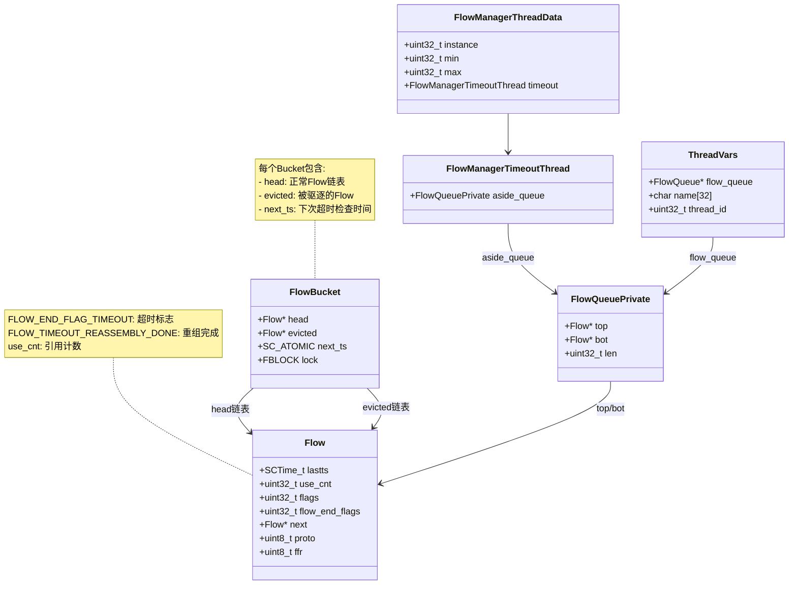

### 6.1.2 流老化整体流程图

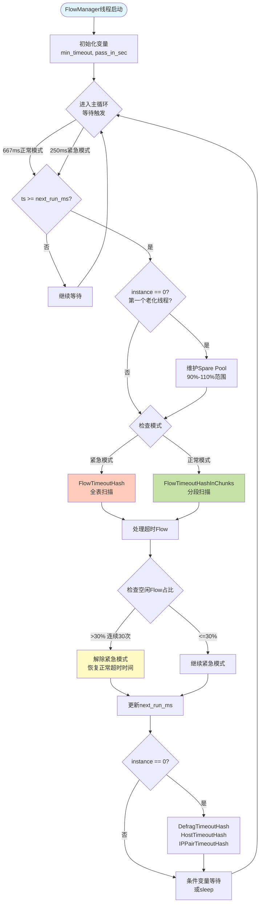

## 6.2 FlowManager 详细分析

### 6.2.1 FlowManager 完整序列图

**代码位置：** [src/flow-manager.c](../src/flow-manager.c)

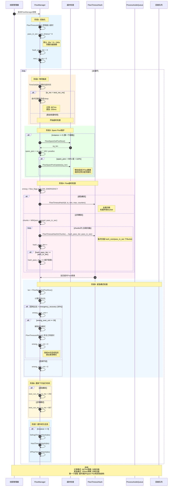

### 6.2.2 FlowManager 决策流程图

```mermaid
flowchart TD
    Start([FlowManager主循环]) --> GetTime[获取当前时间 ts]

    GetTime --> CheckReady{ts >= next_run_ms?}

    CheckReady -->|否| Wait[条件变量等待]
    Wait --> Start

    CheckReady -->|是| Instance0{instance == 0?}

    Instance0 -->|是| GetPoolSize[FlowSpareGetPoolSize]
    GetPoolSize --> CalcPerc[计算 spare_perc]
    CalcPerc --> CheckRange{90% <= spare_perc <= 110%?}

    CheckRange -->|否| UpdatePool[FlowSparePoolUpdate<br/>调整Pool大小]
    CheckRange -->|是| CheckEmerg

    UpdatePool --> CheckEmerg{紧急模式?}

    Instance0 -->|否| CheckEmerg

    CheckEmerg -->|是| EmergMode[全表扫描模式]
    CheckEmerg -->|否| NormalMode[分段扫描模式]

    EmergMode --> FullScan[FlowTimeoutHash<br/>扫描 min 到 max]
    NormalMode --> CalcChunks[chunks = MIN(secs_passed, pass_in_sec)]

    CalcChunks --> PartialScan[循环 chunks 次<br/>FlowTimeoutHashInChunks]

    FullScan --> CalcSpare
    PartialScan --> UpdateIter[hash_pass_iter++]

    UpdateIter --> CheckWrap{iter == pass_in_sec?}
    CheckWrap -->|是| ResetIter[hash_pass_iter = 0]
    CheckWrap -->|否| CalcSpare

    ResetIter --> CalcSpare[计算空闲Flow占比]

    CalcSpare --> CheckSpareRatio{占比 > 30%?}

    CheckSpareRatio -->|是| IncCounter[emerg_over_cnt++]
    CheckSpareRatio -->|否| ResetCounter[emerg_over_cnt = 0]

    IncCounter --> CheckCount{emerg_over_cnt >= 30?}

    CheckCount -->|是| ExitEmerg[解除紧急模式<br/>FlowTimeoutsReset]
    CheckCount -->|否| UpdateTime

    ResetCounter --> UpdateTime[更新 next_run_ms]
    ExitEmerg --> UpdateTime

    UpdateTime --> EmergCheck{紧急模式?}

    EmergCheck -->|是| Set250[next_run_ms += 250ms]
    EmergCheck -->|否| Set667[next_run_ms += 667ms]

    Set250 --> ExtraTasks
    Set667 --> ExtraTasks{instance == 0?}

    ExtraTasks -->|是| DoExtra[DefragTimeoutHash<br/>HostTimeoutHash<br/>IPPairTimeoutHash]
    ExtraTasks -->|否| Sleep

    DoExtra --> Sleep[Sleep或条件变量等待]

    Sleep --> Start

    style Start fill:#e1f5ff
    style EmergMode fill:#ffccbc
    style NormalMode fill:#c5e1a5
    style ExitEmerg fill:#fff9c4
```

## 6.3 FlowTimeoutHash 详细分析

### 6.3.1 FlowTimeoutHash 完整序列图

**代码位置：** [src/flow-manager.c](../src/flow-manager.c) `FlowTimeoutHash()`

```mermaid
sequenceDiagram
    autonumber
    participant Caller as FlowManager
    participant Timeout as FlowTimeoutHash
    participant Bucket as FlowBucket
    participant RowTimeout as FlowManagerHashRowTimeout
    participant Evicted as 处理Evicted
    participant Aside as aside_queue
    participant Process as ProcessAsideQueue

    Caller->>Timeout: FlowTimeoutHash(td, ts, hash_min, hash_max)

    rect rgb(230, 245, 255)
        Note over Timeout: 阶段1: 初始化
        Timeout->>Timeout: emergency = flow_flags & FLOW_EMERGENCY
        Timeout->>Timeout: rows_checked = hash_max - hash_min
        Timeout->>Timeout: ts_secs = SCTIME_SECS(ts)
    end

    loop 遍历Bucket (idx = hash_min; idx < hash_max; idx += 64)
        rect rgb(255, 243, 224)
            Note over Timeout: 阶段2: 批量检查64个Bucket
            Timeout->>Timeout: check_bits = 0

            loop 检查64个Bucket (i = 0; i < 64; i++)
                Timeout->>Bucket: fb = &flow_hash[idx+i]
                Timeout->>Bucket: 读取 fb->next_ts

                alt next_ts <= ts_secs
                    Timeout->>Timeout: check_bits |= (1 << i)
                    Note right of Timeout: 设置位图标记<br/>第i个Bucket有超时
                end
            end

            alt check_bits == 0
                Note over Timeout: 64个Bucket都没超时<br/>跳过处理
            else check_bits != 0
                Note over Timeout: 有Bucket超时,逐个处理
            end
        end

        rect rgb(230, 255, 230)
            Note over Timeout,RowTimeout: 阶段3: 处理有超时的Bucket

            loop 遍历64个Bucket (i = 0; i < 64; i++)
                alt check_bits & (1 << i) != 0
                    Timeout->>Bucket: FBLOCK_LOCK(fb)
                    Note right of Bucket: 锁定Bucket

                    alt fb->evicted != NULL
                        Note over Timeout,Evicted: 处理evicted链表
                        Timeout->>Timeout: evicted = fb->evicted
                        Timeout->>Bucket: fb->evicted = NULL
                    end

                    alt fb->head != NULL
                        Note over Timeout,RowTimeout: 处理head链表
                        Timeout->>RowTimeout: FlowManagerHashRowTimeout(td, fb->head, ts, emergency, counters, &next_ts)

                        loop 遍历Flow链表
                            RowTimeout->>RowTimeout: FlowManagerFlowTimeout(f, ts)

                            alt Flow超时且use_cnt==0
                                RowTimeout->>RowTimeout: RemoveFromHash(f, prev_f)
                                RowTimeout->>Aside: FlowQueuePrivateAppendFlow(&td->aside_queue, f)
                                Note right of Aside: 加入aside_queue<br/>Flow仍然锁定
                            else Flow未超时或被引用
                                RowTimeout->>RowTimeout: 继续下一个Flow
                            end
                        end

                        RowTimeout->>Bucket: SC_ATOMIC_SET(fb->next_ts, next_ts)
                        Note right of Bucket: 更新下次超时时间
                    end

                    alt fb->evicted == NULL && fb->head == NULL
                        Timeout->>Bucket: SC_ATOMIC_SET(fb->next_ts, UINT_MAX)
                        Note right of Bucket: Bucket为空<br/>不需要再检查
                    end

                    Timeout->>Bucket: FBLOCK_UNLOCK(fb)

                    alt evicted != NULL
                        Timeout->>Evicted: FlowManagerHashRowClearEvictedList(td, evicted, ts)
                        Note right of Evicted: 处理驱逐的Flow<br/>加入aside_queue
                    end
                end
            end
        end

        rect rgb(255, 240, 245)
            Note over Timeout,Process: 阶段4: 处理aside_queue
            alt td->aside_queue.len > 0
                Timeout->>Process: ProcessAsideQueue(td, counters)

                Process->>Process: 遍历aside_queue

                loop 每个Flow
                    alt TCP且需要重组
                        Process->>Process: FlowForceReassemblyForFlow(f)
                        Note right of Process: 发回原线程处理
                    else 不需要重组
                        Process->>Process: 加入recycle队列

                        alt recycle.len == 100
                            Process->>Process: FlowQueueAppendPrivate(&flow_recycle_q, &recycle)
                            Process->>Process: FlowWakeupFlowRecyclerThread()
                            Note right of Process: 唤醒回收线程
                        end
                    end
                end

                alt recycle.len > 0
                    Process->>Process: 剩余Flow加入flow_recycle_q
                    Process->>Process: 唤醒回收线程
                end

                Process-->>Timeout: 返回处理数量
            end
        end
    end

    Timeout-->>Caller: 返回总超时Flow数量

    Note over Caller,Process: 总结:<br/>1. 64个Bucket批量检查(位图优化)<br/>2. 处理evicted和head链表<br/>3. 超时Flow加入aside_queue<br/>4. 批量移入回收队列
```

### 6.3.2 FlowTimeoutHash 处理流程图

```mermaid
flowchart TD
    Start([FlowTimeoutHash开始]) --> Init[初始化<br/>emergency, ts_secs]

    Init --> OuterLoop{idx < hash_max?}

    OuterLoop -->|否| Return([返回cnt])
    OuterLoop -->|是| InitBits[check_bits = 0]

    InitBits --> InnerLoop1[循环64次检查]

    InnerLoop1 --> CheckBucket[检查fb->next_ts]

    CheckBucket --> Timeout{next_ts <= ts_secs?}

    Timeout -->|是| SetBit[check_bits |= 1 << i]
    Timeout -->|否| NextCheck1

    SetBit --> NextCheck1{i < 64?}

    NextCheck1 -->|是| InnerLoop1
    NextCheck1 -->|否| CheckBits{check_bits == 0?}

    CheckBits -->|是| Skip[跳过这64个Bucket]
    Skip --> IncrIdx[idx += 64]
    IncrIdx --> OuterLoop

    CheckBits -->|否| InnerLoop2[遍历64个Bucket]

    InnerLoop2 --> CheckBitSet{check_bits & 1<<i?}

    CheckBitSet -->|否| NextBucket
    CheckBitSet -->|是| LockBucket[FBLOCK_LOCK fb]

    LockBucket --> CheckEvicted{fb->evicted != NULL?}

    CheckEvicted -->|是| SaveEvicted[evicted = fb->evicted<br/>fb->evicted = NULL]
    CheckEvicted -->|否| CheckHead

    SaveEvicted --> CheckHead{fb->head != NULL?}

    CheckHead -->|是| RowTimeout[FlowManagerHashRowTimeout<br/>处理head链表]
    CheckHead -->|否| CheckEmpty

    RowTimeout --> UpdateNextTs[更新 fb->next_ts]
    UpdateNextTs --> CheckEmpty{fb为空?}

    CheckEmpty -->|是| SetMax[fb->next_ts = UINT_MAX]
    CheckEmpty -->|否| UnlockBucket

    SetMax --> UnlockBucket[FBLOCK_UNLOCK fb]

    UnlockBucket --> ProcessEvicted{evicted != NULL?}

    ProcessEvicted -->|是| ClearEvicted[FlowManagerHashRowClearEvictedList<br/>处理evicted链表]
    ProcessEvicted -->|否| NextBucket

    ClearEvicted --> NextBucket{i < 64?}

    NextBucket -->|是| InnerLoop2
    NextBucket -->|否| CheckAside{aside_queue.len > 0?}

    CheckAside -->|是| ProcessAside[ProcessAsideQueue<br/>处理超时Flow]
    CheckAside -->|否| IncrIdx2[idx += 64]

    ProcessAside --> IncrIdx2
    IncrIdx2 --> OuterLoop

    style Start fill:#e1f5ff
    style Return fill:#c5e1a5
    style RowTimeout fill:#fff9c4
    style ProcessAside fill:#ffccbc
```

## 6.4 分段扫描 vs 全表扫描

### 6.4.1 FlowTimeoutHashInChunks 原理图

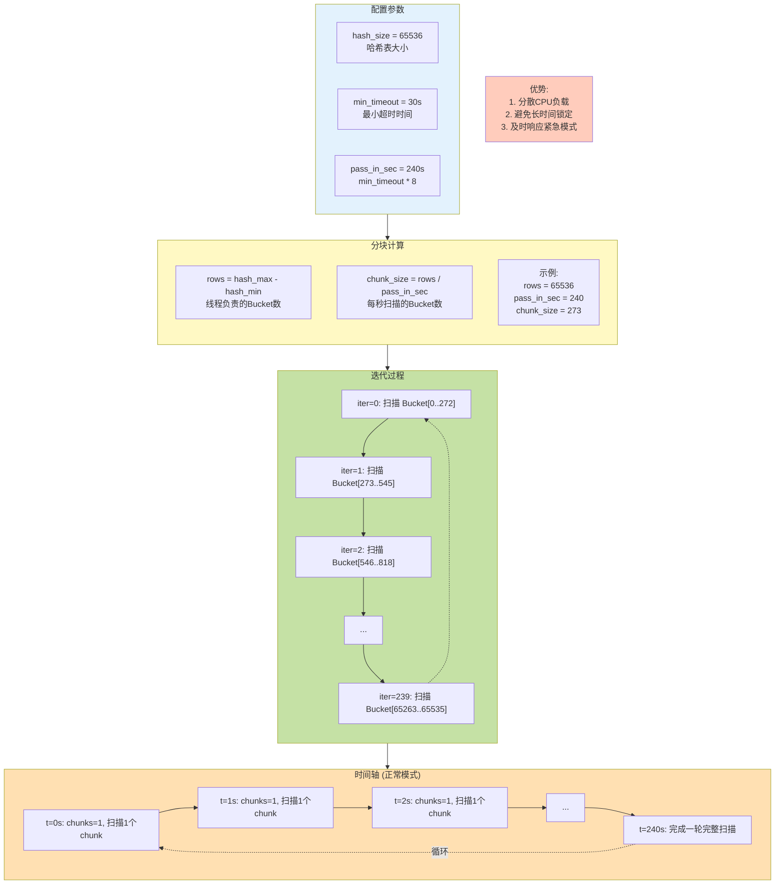

### 6.4.2 正常模式 vs 紧急模式对比

```mermaid
graph TB
    subgraph Normal["正常模式"]
        direction TB
        N1[检查周期: 667ms]
        N2[扫描方式: 分段扫描<br/>FlowTimeoutHashInChunks]
        N3[每次扫描: chunk_size个Bucket<br/>约273个 65536/240]
        N4[完整扫描: 240秒 4分钟]
        N5[超时时间: 正常超时<br/>TCP EST: 3600s<br/>UDP EST: 300s]
        N6[触发条件: 默认运行模式]

        N1 --> N2
        N2 --> N3
        N3 --> N4
        N4 --> N5
        N5 --> N6
    end

    subgraph Emergency["紧急模式"]
        direction TB
        E1[检查周期: 250ms]
        E2[扫描方式: 全表扫描<br/>FlowTimeoutHash]
        E3[每次扫描: 所有Bucket<br/>65536个]
        E4[完整扫描: 250ms 立即]
        E5[超时时间: 紧急超时<br/>TCP EST: 300s<br/>UDP EST: 100s]
        E6[触发条件: 内存超限<br/>空闲Flow不足]

        E1 --> E2
        E2 --> E3
        E3 --> E4
        E4 --> E5
        E5 --> E6
    end

    subgraph Transition["模式切换"]
        direction LR
        Enter[进入紧急模式<br/>flow_flags |= FLOW_EMERGENCY]
        Exit[退出紧急模式<br/>空闲Flow > 30%<br/>连续30次]

        Enter -->|内存不足| Emergency
        Emergency -->|空闲充足| Exit
        Exit --> Normal
        Normal -->|内存不足| Enter
    end

    Normal -.-> Transition
    Emergency -.-> Transition

    Comparison["对比:<br/>紧急模式扫描速度快2.7倍 (667ms vs 250ms)<br/>紧急模式覆盖范围大240倍 (273 vs 65536)<br/>紧急模式超时时间短12倍 (3600s vs 300s)"]

    style Normal fill:#c5e1a5
    style Emergency fill:#ffccbc
    style Transition fill:#fff9c4
    style Comparison fill:#e3f2fd
```

## 6.5 ProcessAsideQueue 详细分析

### 6.5.1 ProcessAsideQueue 序列图

**代码位置：** [src/flow-manager.c](../src/flow-manager.c) `ProcessAsideQueue()`

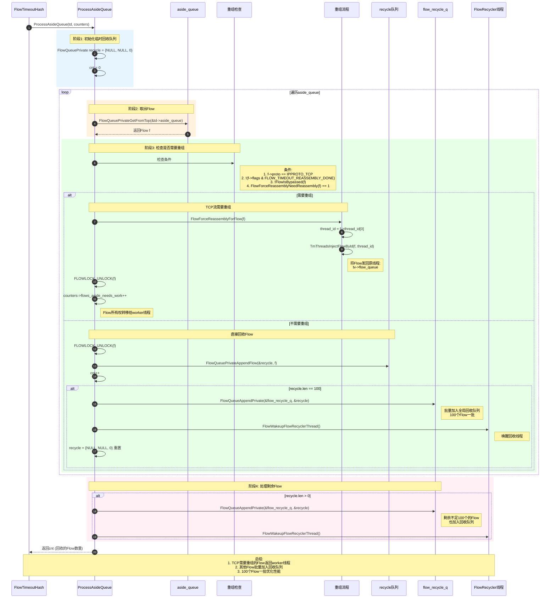

### 6.5.2 ProcessAsideQueue 流程图

```mermaid
flowchart TD
    Start([ProcessAsideQueue开始]) --> InitRecycle[初始化 recycle 队列]

    InitRecycle --> GetFlow[从aside_queue取Flow]

    GetFlow --> CheckNull{Flow == NULL?}

    CheckNull -->|是| CheckRemain{recycle.len > 0?}
    CheckNull -->|否| CheckTCP{TCP流?}

    CheckTCP -->|否| AddRecycle[加入recycle队列]
    CheckTCP -->|是| CheckReassembly{需要重组?}

    CheckReassembly -->|否| AddRecycle
    CheckReassembly -->|是| CheckConditions[检查重组条件]

    CheckConditions --> AllConditions{所有条件满足?}

    AllConditions -->|否| AddRecycle
    AllConditions -->|是| SendBack[FlowForceReassemblyForFlow]

    SendBack --> GetThreadID[获取 f->thread_id]
    GetThreadID --> Inject[TmThreadsInjectFlowById<br/>加入 tv->flow_queue]
    Inject --> Unlock1[FLOWLOCK_UNLOCK]
    Unlock1 --> IncCounter[counters->flows_aside_needs_work++]
    IncCounter --> GetFlow

    AddRecycle --> Unlock2[FLOWLOCK_UNLOCK]
    Unlock2 --> AppendRecycle[FlowQueuePrivateAppendFlow<br/>&recycle, f]
    AppendRecycle --> IncCnt[cnt++]
    IncCnt --> CheckLen{recycle.len == 100?}

    CheckLen -->|是| FlushRecycle[FlowQueueAppendPrivate<br/>&flow_recycle_q, &recycle]
    FlushRecycle --> Wakeup[FlowWakeupFlowRecyclerThread<br/>唤醒回收线程]
    Wakeup --> ResetRecycle[recycle = {NULL, NULL, 0}]
    ResetRecycle --> GetFlow

    CheckLen -->|否| GetFlow

    CheckRemain -->|是| FlushFinal[将剩余Flow加入<br/>flow_recycle_q]
    FlushFinal --> WakeupFinal[唤醒回收线程]
    WakeupFinal --> Return([返回cnt])

    CheckRemain -->|否| Return

    style Start fill:#e1f5ff
    style Return fill:#c5e1a5
    style SendBack fill:#fff9c4
    style FlushRecycle fill:#ffccbc
```

## 6.6 重组流处理详细分析

### 6.6.1 重组流完整处理流程

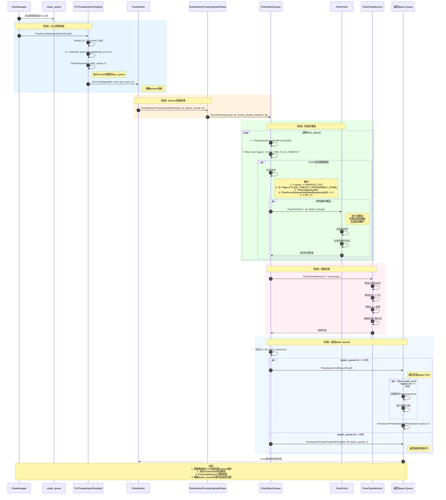

### 6.6.2 重组流判断条件图

```mermaid
flowchart TD
    Start([检查Flow是否需要重组]) --> Check1{协议是TCP?<br/>f->proto == IPPROTO_TCP}

    Check1 -->|否| NoReassembly[不需要重组]
    Check1 -->|是| Check2{未完成重组?<br/>!(flags & FLOW_TIMEOUT_REASSEMBLY_DONE)}

    Check2 -->|否| NoReassembly
    Check2 -->|是| Check3{未被绕过?<br/>!FlowIsBypassed f}

    Check3 -->|否| NoReassembly
    Check3 -->|是| Check4{需要强制重组?<br/>FlowForceReassemblyNeedReassembly == 1}

    Check4 -->|否| NoReassembly
    Check4 -->|是| Context{在哪个上下文?}

    Context -->|FlowManager| SendBack[发回Worker线程<br/>TmThreadsInjectFlowById]
    Context -->|Worker线程| Check5{f->ffr != 0?}

    Check5 -->|否| NoAction[不执行重组]
    Check5 -->|是| DoReassembly[执行FlowFinish<br/>完成重组]

    SendBack --> Queue[加入tv->flow_queue]
    Queue --> End1([等待Worker处理])

    DoReassembly --> ProcessData[处理应用层数据]
    ProcessData --> DetectEvents[生成检测事件]
    DetectEvents --> End2([重组完成])

    NoReassembly --> DirectRecycle[直接加入回收队列]
    DirectRecycle --> End3([等待回收])

    NoAction --> ClearMem[FlowClearMemory]
    ClearMem --> ReturnSpare[返回Spare Queue]
    ReturnSpare --> End4([回收完成])

    style Start fill:#e1f5ff
    style End1 fill:#fff9c4
    style End2 fill:#c5e1a5
    style End3 fill:#ffccbc
    style End4 fill:#e1f5ff
    style DoReassembly fill:#ffe0b2
```

## 6.7 完整流老化架构图

### 6.7.1 流老化多层次架构

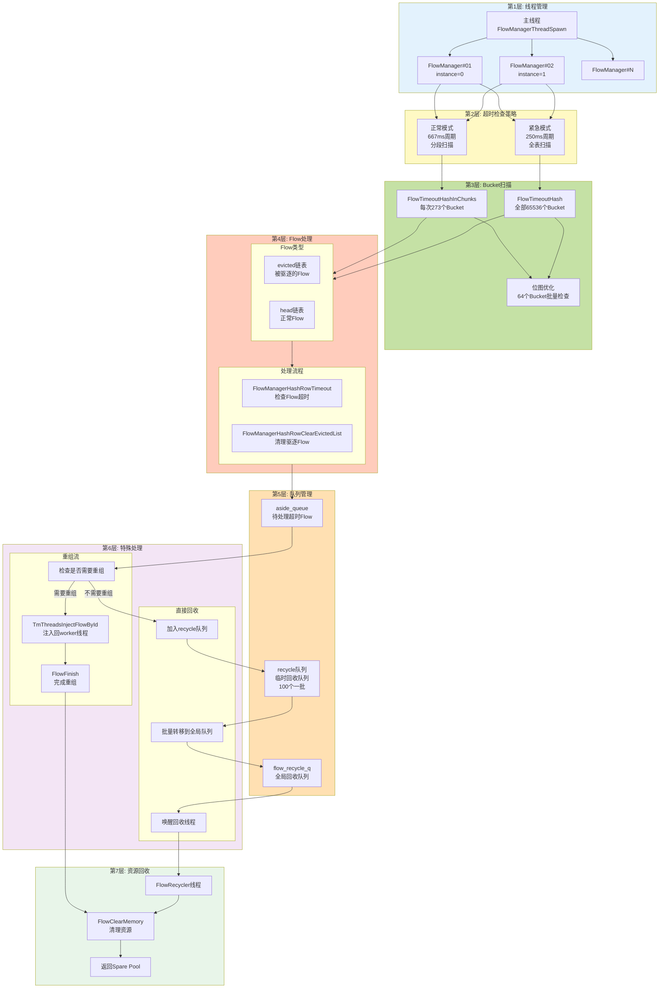

### 6.7.2 Flow状态转换图(老化视角)

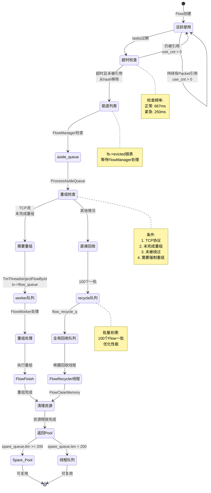

## 6.8 性能优化策略

### 6.8.1 老化优化技术

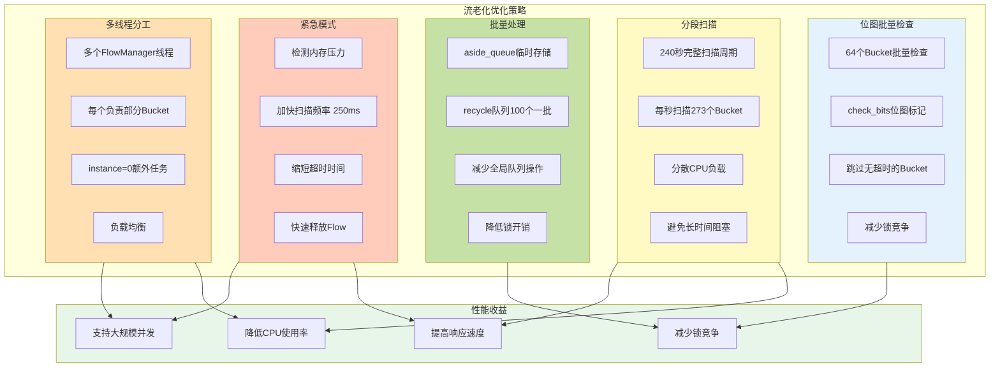

### 6.8.2 Bucket next_ts优化

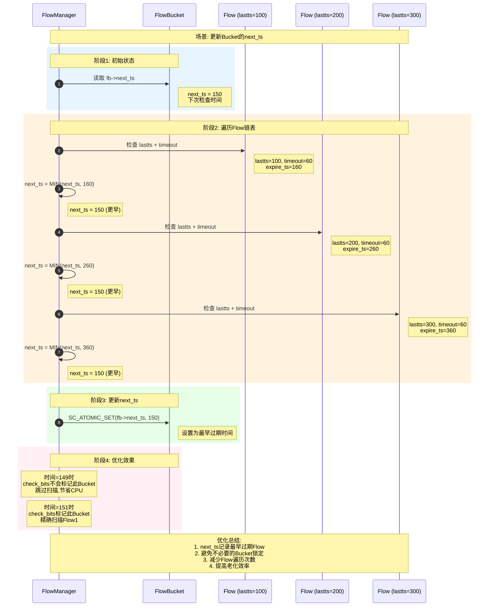

## 6.9 调试与监控

### 6.9.1 关键统计计数器

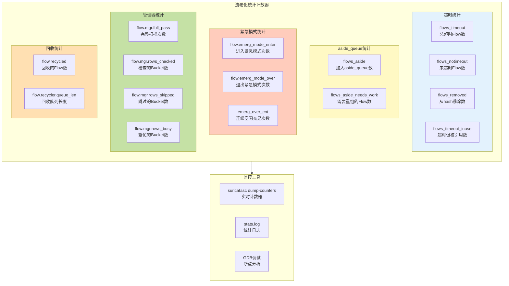

### 6.9.2 GDB调试技巧

```bash
# 启动GDB
gdb --args suricata -c suricata.yaml -i eth0

# 流老化相关断点
b FlowManager                      # 老化线程入口
b FlowTimeoutHash                  # 超时检查
b FlowTimeoutHashInChunks          # 分段扫描
b FlowManagerHashRowTimeout        # 行超时处理
b FlowManagerFlowTimeout           # Flow超时判断
b ProcessAsideQueue                # 处理aside_queue
b FlowForceReassemblyForFlow      # 重组流处理
b CheckWorkQueue                   # Worker处理重组流
b FlowSparePoolUpdate             # Spare Pool维护

# 运行
run

# 查看FlowManagerThreadData
p *ftd
p ftd->instance
p ftd->min
p ftd->max
p ftd->timeout.aside_queue.len

# 查看FlowBucket
p flow_hash[0]
p flow_hash[0].next_ts
p *flow_hash[0].head
p *flow_hash[0].evicted

# 查看Flow超时信息
p *f
p f->lastts
p f->use_cnt
p f->flags
p f->flow_end_flags

# 查看超时时间
p flow_timeouts_normal[FLOW_PROTO_TCP]
p flow_timeouts_emerg[FLOW_PROTO_TCP]

# 查看全局变量
p flow_flags
p flow_spare_pool_flow_cnt
p hash_pass_iter
p next_run_ms

# 查看队列
p aside_queue.len
p recycle.len
p flow_recycle_q

# 监控函数调用
watch hash_pass_iter
watch emerg_over_cnt
```

## 6.10 常见问题与解答

**Q1: 为什么正常模式使用分段扫描而不是全表扫描?**

A: 性能优化考虑:
- **分散CPU负载**: 每次只扫描273个Bucket (65536/240)
- **避免长时间锁定**: 减少单次扫描时间
- **及时响应**: 可以快速切换到紧急模式
- **240秒完整周期**: 足够覆盖最小超时时间(30s)

**Q2: 为什么使用64个Bucket批量检查的位图优化?**

A: 高效的批量处理:
- **减少原子操作**: 一次读取64个next_ts
- **快速跳过**: check_bits==0直接跳过64个Bucket
- **位运算高效**: 位图查找比循环判断快
- **缓存友好**: 连续访问提高缓存命中率

**Q3: evicted链表的作用是什么?**

A: 临时存储机制:
- **场景**: FlowGetFlowFromHash中发现超时Flow
- **问题**: 当时正在处理Packet,不能立即释放
- **解决**: 从hash移除,加入fb->evicted链表
- **处理**: FlowManager下次扫描时统一处理
- **优势**: 避免在关键路径上执行耗时操作

**Q4: 为什么TCP流需要重组处理而其他流不需要?**

A: TCP协议特性:
- **有序传输**: TCP保证数据有序到达
- **流重组**: 需要将分片重组成完整应用层数据
- **检测需求**: 应用层协议解析和检测依赖完整数据
- **超时时机**: 流老化时可能还有未重组的数据
- **处理**: 必须先完成重组,生成检测事件,才能释放

**Q5: aside_queue和recycle队列的区别?**

A: 不同层次的队列:
- **aside_queue**:
  - FlowManager线程本地队列
  - 存储从hash移除的超时Flow
  - 需要判断是否重组
- **recycle队列**:
  - 临时批量队列
  - 100个Flow一批
  - 用于转移到全局flow_recycle_q
- **优势**: 减少全局队列操作,降低锁竞争

**Q6: 紧急模式如何触发和退出?**

A: 动态切换机制:
- **触发**:
  - FlowGetNew时内存超限
  - 设置 FLOW_EMERGENCY 标志
  - 立即生效
- **退出**:
  - 空闲Flow占比 > 30%
  - 连续检查30次 (约20秒)
  - 清除标志,恢复正常超时
- **目的**: 快速释放Flow,缓解内存压力

## 6.11 总结

Suricata流老化是一个高度优化的多层次系统:

1. **双模式运行**:
   - 正常模式: 667ms周期,分段扫描,长超时
   - 紧急模式: 250ms周期,全表扫描,短超时

2. **多重优化**:
   - 位图批量检查 (64个Bucket)
   - 分段扫描 (240秒周期)
   - 批量处理 (100个Flow一批)
   - next_ts智能更新

3. **特殊处理**:
   - TCP流重组注入回worker线程
   - evicted链表延迟处理
   - 多线程负载均衡

4. **资源管理**:
   - Spare Pool动态维护 (90%-110%)
   - 连续30次检查退出紧急模式
   - FlowRecycler线程异步回收

5. **架构特点**:
   - 7层处理架构
   - 清晰的职责分离
   - 高效的队列管理
   - 完善的统计监控

通过这些机制,Suricata能够在保证及时释放超时Flow的同时,最小化对正常流量处理的影响,实现高效的流生命周期管理。
