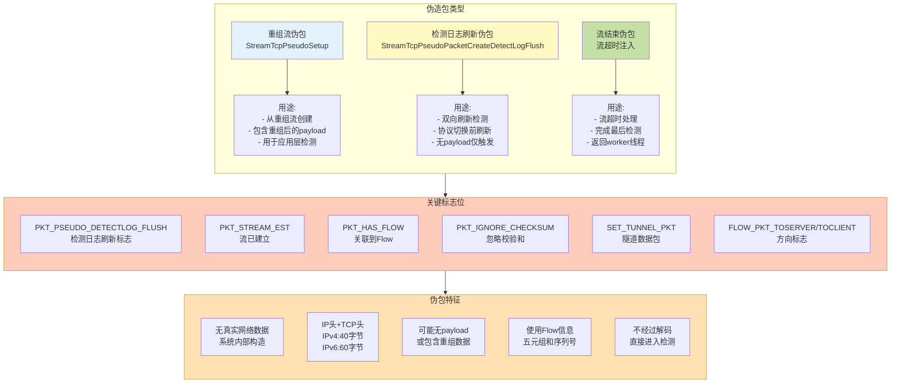
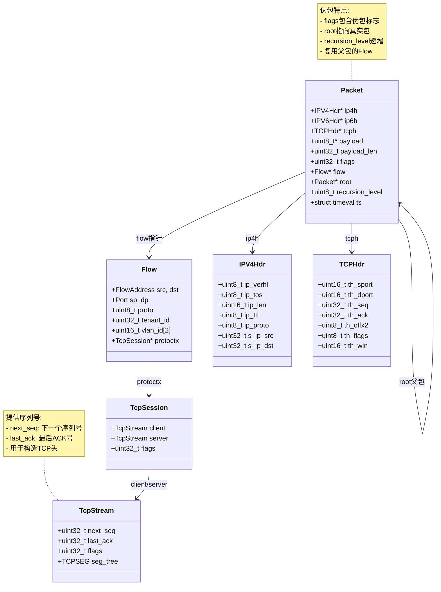
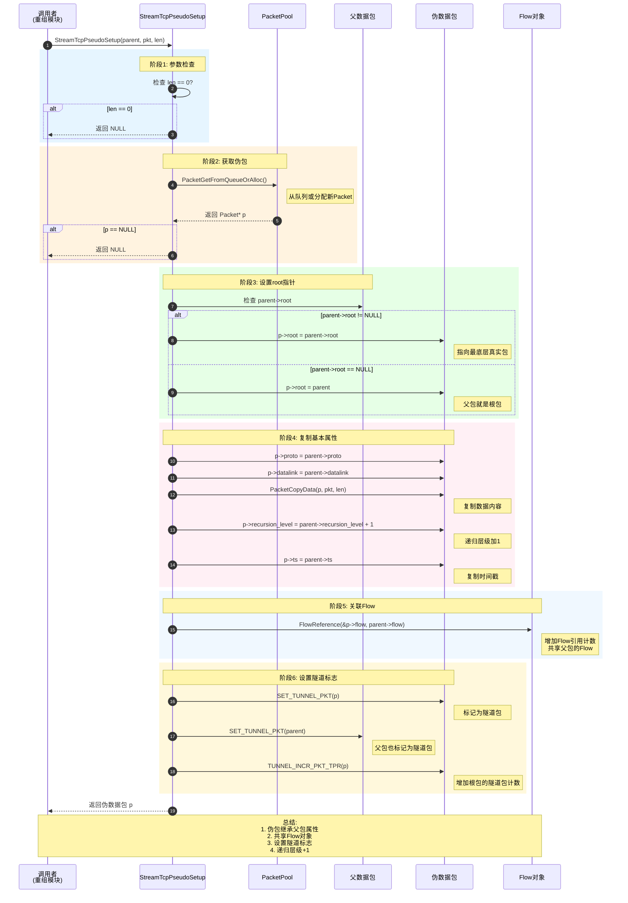
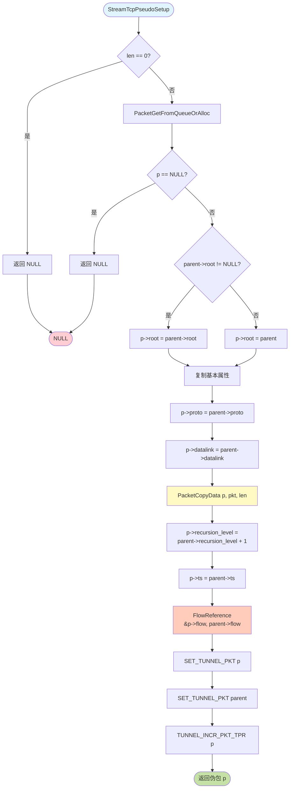
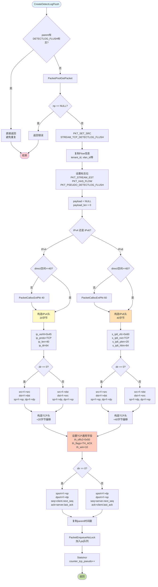
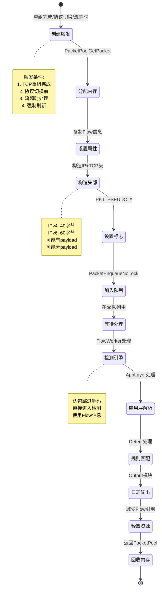
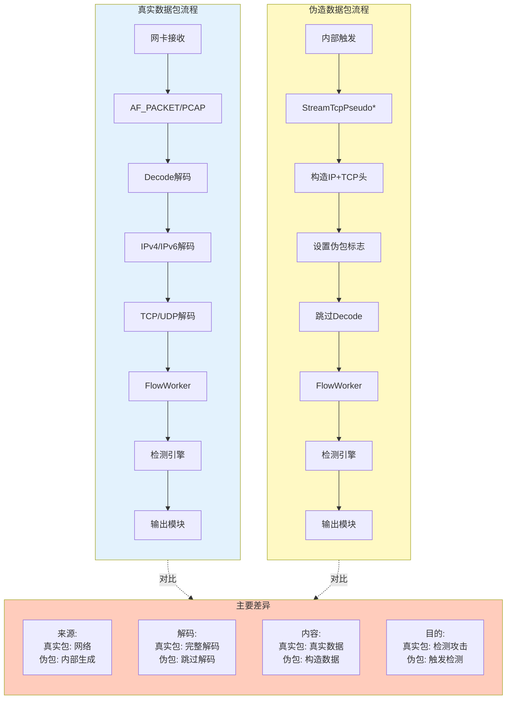
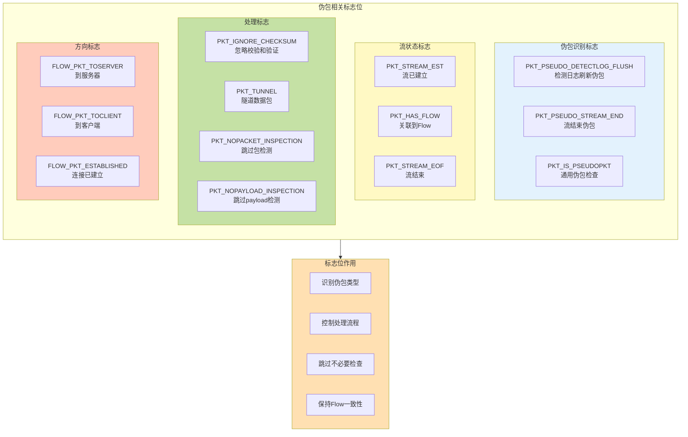
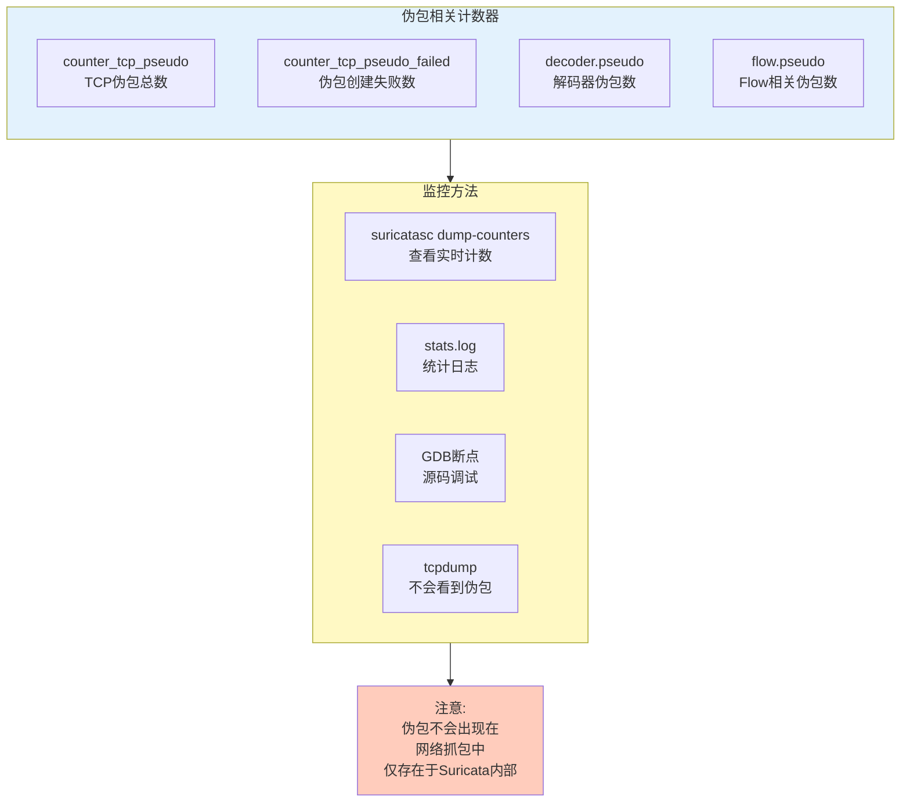

# 七、Suricata 伪造包详细图解（基于源代码）

本章节通过多个 Mermaid 图表深入分析 Suricata 伪造包的完整过程。

## 7.1 伪造包概览

### 7.1.1 伪造包核心概念

Suricata 中的伪造包（Pseudo Packet）是系统内部创建的虚拟数据包，主要用于：

1. **TCP 流重组后的检测**：从重组的 TCP 流中创建伪包用于检测引擎
2. **双向检测触发**：在协议切换或流结束时触发双向检测和日志记录
3. **流结束处理**：在流超时或关闭时注入伪包完成最后的检测和日志

### 7.1.2 伪造包类型与标志



### 7.1.3 伪造包数据结构关系图



## 7.2 StreamTcpPseudoSetup 详细分析

### 7.2.1 StreamTcpPseudoSetup 完整序列图

**代码位置：** [src/stream-tcp.c:6050](../src/stream-tcp.c#L6050)



### 7.2.2 StreamTcpPseudoSetup 流程图



## 7.3 StreamTcpPseudoPacketCreateDetectLogFlush 详细分析

### 7.3.1 DetectLogFlush 伪包完整序列图

**代码位置：** [src/stream-tcp.c:6099](../src/stream-tcp.c#L6099)

```mermaid
sequenceDiagram
    autonumber
    participant Caller as StreamTcpDetectLogFlush
    participant Create as CreateDetectLogFlush
    participant Pool as PacketPool
    participant Flow as Flow对象
    participant Session as TcpSession
    participant Pseudo as 伪数据包
    participant Queue as PacketQueue

    Caller->>Create: StreamTcpPseudoPacketCreateDetectLogFlush(tv, stt, parent, ssn, pq, dir)

    rect rgb(230, 245, 255)
        Note over Create: 阶段1: 检查是否需要创建
        Create->>Create: 检查 parent->flags & PKT_PSEUDO_DETECTLOG_FLUSH?

        alt 父包已有此标志
            Create-->>Caller: 直接返回(避免重复)
        end
    end

    rect rgb(255, 243, 224)
        Note over Create,Pool: 阶段2: 获取数据包
        Create->>Pool: PacketPoolGetPacket()
        Pool-->>Create: 返回 Packet* np

        alt np == NULL
            Create-->>Caller: 返回
        end

        Create->>Pseudo: PKT_SET_SRC(np, PKT_SRC_STREAM_TCP_DETECTLOG_FLUSH)
        Note right of Pseudo: 设置数据包来源
    end

    rect rgb(230, 255, 230)
        Note over Create,Flow: 阶段3: 复制Flow属性
        Create->>Flow: 获取Flow信息
        Create->>Pseudo: np->tenant_id = f->tenant_id
        Create->>Pseudo: np->datalink = DLT_RAW
        Create->>Pseudo: np->proto = IPPROTO_TCP
        Create->>Flow: FlowReference(&np->flow, f)
        Note right of Flow: 增加Flow引用

        Create->>Pseudo: np->vlan_id[0] = f->vlan_id[0]
        Create->>Pseudo: np->vlan_id[1] = f->vlan_id[1]
        Create->>Pseudo: np->vlan_idx = f->vlan_idx
        Create->>Pseudo: np->livedev = f->livedev
    end

    rect rgb(255, 240, 245)
        Note over Create,Pseudo: 阶段4: 设置标志位
        Create->>Pseudo: np->flags |= PKT_STREAM_EST
        Create->>Pseudo: np->flags |= PKT_HAS_FLOW
        Create->>Pseudo: np->flags |= PKT_IGNORE_CHECKSUM
        Create->>Pseudo: np->flags |= PKT_PSEUDO_DETECTLOG_FLUSH
        Note right of Pseudo: 关键标志:<br/>标识为伪造的刷新包

        alt f->flags & FLOW_NOPACKET_INSPECTION
            Create->>Pseudo: DecodeSetNoPacketInspectionFlag(np)
        end

        alt f->flags & FLOW_NOPAYLOAD_INSPECTION
            Create->>Pseudo: DecodeSetNoPayloadInspectionFlag(np)
        end

        alt dir == 0 (to_server)
            Create->>Pseudo: np->flowflags |= FLOW_PKT_TOSERVER
        else dir == 1 (to_client)
            Create->>Pseudo: np->flowflags |= FLOW_PKT_TOCLIENT
        end

        Create->>Pseudo: np->flowflags |= FLOW_PKT_ESTABLISHED
        Create->>Pseudo: np->payload = NULL
        Create->>Pseudo: np->payload_len = 0
        Note right of Pseudo: 无payload<br/>仅用于触发检测
    end

    rect rgb(240, 248, 255)
        Note over Create,Session: 阶段5: 构造IP头
        alt FLOW_IS_IPV4(f)
            Note over Create: IPv4 伪包构造

            Create->>Pseudo: 检查 direct data 空间 >= 40?
            alt 空间不足
                Create->>Pseudo: PacketCallocExtPkt(np, 40)
            end

            Create->>Pseudo: 设置 np->ip4h 指针
            Create->>Pseudo: ip4h->ip_verhl = 0x45 (v4, 20字节)
            Create->>Pseudo: ip4h->ip_tos = 0
            Create->>Pseudo: ip4h->ip_len = htons(40)
            Create->>Pseudo: ip4h->ip_ttl = 64
            Create->>Pseudo: ip4h->ip_proto = IPPROTO_TCP

            alt dir == 0
                Create->>Pseudo: ip4h->s_ip_src = f->src
                Create->>Pseudo: ip4h->s_ip_dst = f->dst
            else dir == 1
                Create->>Pseudo: ip4h->s_ip_src = f->dst
                Create->>Pseudo: ip4h->s_ip_dst = f->src
            end

            Create->>Pseudo: SET_PKT_LEN(np, 40)
            Note right of Pseudo: IP头20字节 + TCP头20字节

        else FLOW_IS_IPV6(f)
            Note over Create: IPv6 伪包构造

            Create->>Pseudo: 检查 direct data 空间 >= 60?
            alt 空间不足
                Create->>Pseudo: PacketCallocExtPkt(np, 60)
            end

            Create->>Pseudo: 设置 np->ip6h 指针
            Create->>Pseudo: ip6h->s_ip6_vfc = 0x60 (v6)
            Create->>Pseudo: ip6h->s_ip6_nxt = IPPROTO_TCP
            Create->>Pseudo: ip6h->s_ip6_plen = htons(20)
            Create->>Pseudo: ip6h->s_ip6_hlim = 64

            alt dir == 0
                Create->>Pseudo: ip6h->s_ip6_src = f->src (4 * 32bit)
                Create->>Pseudo: ip6h->s_ip6_dst = f->dst (4 * 32bit)
            else dir == 1
                Create->>Pseudo: ip6h->s_ip6_src = f->dst
                Create->>Pseudo: ip6h->s_ip6_dst = f->src
            end

            Create->>Pseudo: SET_PKT_LEN(np, 60)
            Note right of Pseudo: IPv6头40字节 + TCP头20字节
        end
    end

    rect rgb(255, 248, 220)
        Note over Create,Session: 阶段6: 构造TCP头
        Create->>Pseudo: 设置 np->tcph 指针位置
        Note right of Pseudo: IPv4: +20字节<br/>IPv6: +40字节

        Create->>Pseudo: tcph->th_offx2 = 0x50 (20字节头长)
        Create->>Pseudo: tcph->th_flags |= TH_ACK
        Create->>Pseudo: tcph->th_win = 10
        Create->>Pseudo: tcph->th_urp = 0

        alt dir == 0 (to_server)
            Create->>Session: 获取 client/server 状态
            Create->>Pseudo: tcph->th_sport = htons(f->sp)
            Create->>Pseudo: tcph->th_dport = htons(f->dp)
            Create->>Pseudo: tcph->th_seq = htonl(ssn->client.next_seq)
            Create->>Pseudo: tcph->th_ack = htonl(ssn->server.last_ack)
            Note right of Session: 客户端发送<br/>使用client的seq

        else dir == 1 (to_client)
            Create->>Pseudo: tcph->th_sport = htons(f->dp)
            Create->>Pseudo: tcph->th_dport = htons(f->sp)
            Create->>Pseudo: tcph->th_seq = htonl(ssn->server.next_seq)
            Create->>Pseudo: tcph->th_ack = htonl(ssn->client.last_ack)
            Note right of Session: 服务端发送<br/>使用server的seq
        end

        Create->>Pseudo: memcpy(&np->ts, &parent->ts)
        Note right of Pseudo: 使用父包时间戳
    end

    rect rgb(230, 245, 255)
        Note over Create,Queue: 阶段7: 加入队列
        Create->>Queue: PacketEnqueueNoLock(pq, np)
        Note right of Queue: 无锁队列<br/>后续处理

        Create->>Create: StatsIncr(tv, stt->counter_tcp_pseudo)
        Note right of Create: 统计计数器递增
    end

    Create-->>Caller: 返回

    Note over Caller,Queue: 总结:<br/>1. 构造完整IP+TCP头<br/>2. 无payload仅触发<br/>3. 使用Flow和Session信息<br/>4. 序列号来自TcpStream状态
```

### 7.3.2 DetectLogFlush 伪包构造细节



## 7.4 StreamTcpDetectLogFlush 双向刷新

### 7.4.1 双向刷新序列图

**代码位置：** [src/stream-tcp.c:6288](../src/stream-tcp.c#L6288)

```mermaid
sequenceDiagram
    autonumber
    participant Caller as 调用者<br/>(协议切换/流结束)
    participant Flush as StreamTcpDetectLogFlush
    participant Session as TcpSession
    participant Create as CreateDetectLogFlush
    participant Queue as PacketQueue

    Caller->>Flush: StreamTcpDetectLogFlush(tv, stt, f, p, pq)

    rect rgb(230, 245, 255)
        Note over Flush,Session: 阶段1: 设置触发标志
        Flush->>Session: ssn = f->protoctx
        Flush->>Session: ssn->client.flags |= STREAMTCP_STREAM_FLAG_TRIGGER_RAW
        Flush->>Session: ssn->server.flags |= STREAMTCP_STREAM_FLAG_TRIGGER_RAW
        Note right of Session: 标记客户端和服务端<br/>需要触发原始数据处理
    end

    rect rgb(255, 243, 224)
        Note over Flush: 阶段2: 确定创建顺序
        Flush->>Flush: ts = PKT_IS_TOSERVER(p) ? true : false
        Note right of Flush: 判断原始包方向

        Flush->>Flush: ts ^= StreamTcpInlineMode()
        Note right of Flush: IDS模式: 保持顺序<br/>IPS模式: 反转顺序
    end

    rect rgb(230, 255, 230)
        Note over Flush,Create: 阶段3: 创建第一个伪包
        Flush->>Create: CreateDetectLogFlush(tv, stt, p, ssn, pq, ts^0)
        Note right of Create: ts^0: <br/>IDS: 原包方向<br/>IPS: 反向

        Create->>Create: 构造伪包(详见7.3.1)
        Create->>Queue: PacketEnqueueNoLock(pq, pseudo1)
        Create-->>Flush: 返回
    end

    rect rgb(255, 240, 245)
        Note over Flush,Create: 阶段4: 创建第二个伪包
        Flush->>Create: CreateDetectLogFlush(tv, stt, p, ssn, pq, ts^1)
        Note right of Create: ts^1: 反向<br/>触发对端检测

        Create->>Create: 构造伪包(详见7.3.1)
        Create->>Queue: PacketEnqueueNoLock(pq, pseudo2)
        Create-->>Flush: 返回
    end

    Flush-->>Caller: 返回

    Note over Caller,Queue: 结果:<br/>队列中有两个伪包<br/>分别触发双向检测和日志

    Note over Flush: IDS vs IPS 顺序:<br/>IDS: 先原方向,后反方向<br/>IPS: 先反方向,后原方向
```

### 7.4.2 双向刷新顺序对比

```mermaid
graph TB
    subgraph IDS["IDS模式 (非inline)"]
        direction TB

        IDS_Packet[原始数据包<br/>TOSERVER]

        IDS_Order[创建顺序:<br/>ts = true<br/>ts ^= false (inline=false)<br/>结果: ts = true]

        IDS_First[第一个伪包<br/>ts^0 = true^0 = true<br/>方向: TOSERVER]

        IDS_Second[第二个伪包<br/>ts^1 = true^1 = false<br/>方向: TOCLIENT]

        IDS_Packet --> IDS_Order
        IDS_Order --> IDS_First
        IDS_First --> IDS_Second
    end

    subgraph IPS["IPS模式 (inline)"]
        direction TB

        IPS_Packet[原始数据包<br/>TOSERVER]

        IPS_Order[创建顺序:<br/>ts = true<br/>ts ^= true (inline=true)<br/>结果: ts = false]

        IPS_First[第一个伪包<br/>ts^0 = false^0 = false<br/>方向: TOCLIENT]

        IPS_Second[第二个伪包<br/>ts^1 = false^1 = true<br/>方向: TOSERVER]

        IPS_Packet --> IPS_Order
        IPS_Order --> IPS_First
        IPS_First --> IPS_Second
    end

    subgraph Reason["顺序原因"]
        R1[IDS模式:<br/>先检测原方向流量<br/>再检测反方向响应]

        R2[IPS模式:<br/>先检测反方向<br/>确保双向数据都检测<br/>再放行]
    end

    IDS -.-> Reason
    IPS -.-> Reason

    style IDS fill:#e3f2fd
    style IPS fill:#fff9c4
    style Reason fill:#ffccbc
```

## 7.5 伪造包使用场景

### 7.5.1 完整场景架构图

```mermaid
graph TB
    subgraph Scenarios["伪造包使用场景"]
        direction TB

        subgraph Reassembly["场景1: TCP流重组"]
            R1[TCP流重组完成]
            R2[StreamTcpPseudoSetup]
            R3[创建包含重组数据的伪包]
            R4[应用层协议解析]
            R5[检测引擎处理]

            R1 --> R2
            R2 --> R3
            R3 --> R4
            R4 --> R5
        end

        subgraph Protocol["场景2: 协议切换"]
            P1[检测到协议升级<br/>例如: STARTTLS]
            P2[StreamTcpDetectLogFlush]
            P3[创建双向伪包]
            P4[刷新当前协议检测]
            P5[切换到新协议]

            P1 --> P2
            P2 --> P3
            P3 --> P4
            P4 --> P5
        end

        subgraph Timeout["场景3: 流超时"]
            T1[FlowManager检测流超时]
            T2[需要TCP重组的流]
            T3[TmThreadsInjectFlowById]
            T4[注入回worker线程]
            T5[FlowFinish处理]
            T6[创建伪包完成检测]

            T1 --> T2
            T2 --> T3
            T3 --> T4
            T4 --> T5
            T5 --> T6
        end

        subgraph Forced["场景4: 强制刷新"]
            F1[应用层解析完成]
            F2[需要立即检测]
            F3[创建伪包]
            F4[触发检测引擎]
            F5[生成告警/日志]

            F1 --> F2
            F2 --> F3
            F3 --> F4
            F4 --> F5
        end
    end

    subgraph Benefits["伪包优势"]
        B1[无需等待真实数据包]
        B2[及时触发检测]
        B3[完整的双向检测]
        B4[支持协议切换]
        B5[流结束前完成检测]
    end

    Scenarios --> Benefits

    style Reassembly fill:#e3f2fd
    style Protocol fill:#fff9c4
    style Timeout fill:#c5e1a5
    style Forced fill:#ffccbc
    style Benefits fill:#ffe0b2
```



### 7.5.2 伪包生命周期



## 7.6 伪包 vs 真实包对比

### 7.6.1 处理流程对比



### 7.6.2 特征对比表

| 特征 | 真实数据包 | 伪造数据包 |
|------|-----------|-----------|
| **来源** | 网络接口捕获 | 系统内部创建 |
| **大小** | 实际网络数据大小 | IPv4:40字节, IPv6:60字节<br/>或包含重组数据 |
| **解码** | 完整解码流程 | 跳过Decode,直接进检测 |
| **校验和** | 需要验证 | 忽略校验和(PKT_IGNORE_CHECKSUM) |
| **Payload** | 真实网络数据 | 可能无payload或重组数据 |
| **Flow关联** | 查找或创建Flow | 继承父包Flow |
| **时间戳** | 实际接收时间 | 复制父包时间戳 |
| **标志位** | 根据内容设置 | 带有PKT_PSEUDO_*标志 |
| **处理流程** | Capture→Decode→Detect | Create→Detect |
| **用途** | 检测真实攻击 | 触发检测/刷新日志 |

## 7.7 伪包标志位详解

### 7.7.1 关键标志位说明



### 7.7.2 标志位检查示例

```c
// 检查是否为伪包
#define PKT_IS_PSEUDOPKT(p) \
    ((p)->flags & (PKT_PSEUDO_DETECTLOG_FLUSH | PKT_PSEUDO_STREAM_END))

// StreamTcpSegmentForEach 中的使用
if (PKT_IS_PSEUDOPKT(p)) {
    /* 伪包使用未ACK的数据 */
} else {
    /* 真实包只使用已ACK的数据 */
    if (SEQ_GT(seg->seq + seg->payload_len, stream->last_ack))
        break;
}

// 避免重复创建
if (parent->flags & PKT_PSEUDO_DETECTLOG_FLUSH) {
    return; // 已经创建过,避免重复
}
```

## 7.8 调试与监控

### 7.8.1 统计计数器



### 7.8.2 GDB 调试技巧

```bash
# 启动GDB
gdb --args suricata -c suricata.yaml -i eth0

# 伪包创建断点
b StreamTcpPseudoSetup                       # 重组伪包
b StreamTcpPseudoPacketCreateDetectLogFlush  # 刷新伪包
b StreamTcpDetectLogFlush                    # 双向刷新

# 伪包处理断点
b FlowWorker                                 # Worker处理
b CheckWorkQueue                             # 重组流处理
b StreamTcpSegmentForEach                    # 段遍历

# 运行
run

# 查看伪包信息
p *np
p np->flags
p/x np->flags & PKT_PSEUDO_DETECTLOG_FLUSH
p np->payload_len
p np->flow
p *np->ip4h
p *np->tcph

# 查看TCP Session
p *ssn
p ssn->client.next_seq
p ssn->server.last_ack
p ssn->client.flags
p ssn->server.flags

# 查看队列
p pq->len
p pq->top
p pq->bot

# 监控标志变化
watch np->flags
watch ssn->client.flags

# 条件断点
break StreamTcpPseudoSetup if len > 1000
break PacketEnqueueNoLock if pq->len > 10
```

## 7.9 常见问题与解答

**Q1: 为什么需要伪造包?**

A: 关键原因:
- **及时检测**: TCP流重组完成后,不需要等待新包到达即可触发检测
- **双向刷新**: 协议切换前确保双向数据都被检测和日志记录
- **流结束处理**: 流超时时完成最后的检测和清理工作
- **强制触发**: 某些场景需要立即触发检测引擎,不能等待真实包

**Q2: 伪包为什么没有payload或payload很小?**

A: 取决于用途:
- **DetectLogFlush伪包**: 无payload,仅用于触发检测和日志刷新
- **重组伪包**: 包含重组后的应用层数据,可能较大
- **流结束伪包**: 通常无payload,只触发最后处理

**Q3: IDS和IPS模式下伪包创建顺序为什么不同?**

A: 模式差异:
- **IDS模式**: 先原方向后反方向,符合数据流动自然顺序
- **IPS模式**: 先反方向后原方向,确保在放行前双向都检测
- **目的**: IPS需要更严格的双向检测保证

**Q4: 伪包的序列号从哪里来?**

A: 来自TcpSession状态:
- **to_server**: 使用 `ssn->client.next_seq` 和 `ssn->server.last_ack`
- **to_client**: 使用 `ssn->server.next_seq` 和 `ssn->client.last_ack`
- **保证**: 序列号符合TCP状态机,不会被丢弃

**Q5: 伪包会被重复检测吗?**

A: 有保护机制:
- 检查 `PKT_PSEUDO_DETECTLOG_FLUSH` 标志
- 父包已有此标志则不再创建
- 避免无限递归创建伪包

**Q6: 伪包如何回收?**

A: 正常Packet回收流程:
1. 检测和日志处理完成
2. FlowDeReference 减少Flow引用
3. PacketPoolReturnPacket 返回PacketPool
4. 内存可复用

## 7.10 总结

Suricata 伪造包是一个精巧的设计:

1. **两种主要类型**:
   - **重组伪包**: 包含重组数据,用于应用层检测
   - **刷新伪包**: 无payload,用于触发检测和日志

2. **关键特性**:
   - 跳过Decode,直接进检测
   - 继承父包Flow信息
   - 设置特殊标志位识别
   - 使用TcpSession状态构造TCP头

3. **主要用途**:
   - TCP流重组后的检测
   - 协议切换前的双向刷新
   - 流超时的最后处理
   - 强制触发检测引擎

4. **核心函数**:
   - `StreamTcpPseudoSetup`: 创建重组伪包
   - `StreamTcpPseudoPacketCreateDetectLogFlush`: 创建刷新伪包
   - `StreamTcpDetectLogFlush`: 双向刷新触发

5. **优势**:
   - 无需等待真实包即可触发检测
   - 确保完整的双向检测覆盖
   - 支持复杂的协议切换场景
   - 流结束前完成所有检测

通过伪造包机制,Suricata 能够在不依赖真实网络包的情况下,及时完成检测和日志记录,提高了IDS/IPS的检测能力和响应速度。
