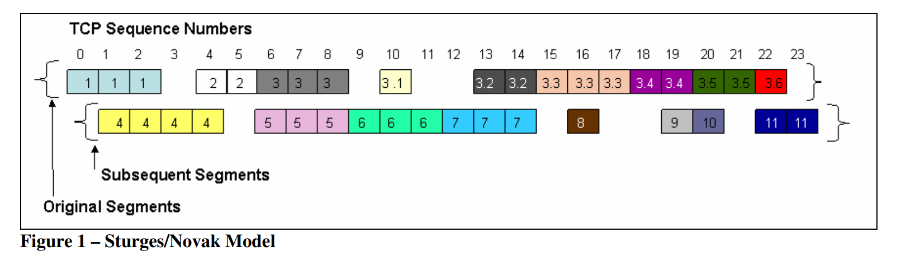
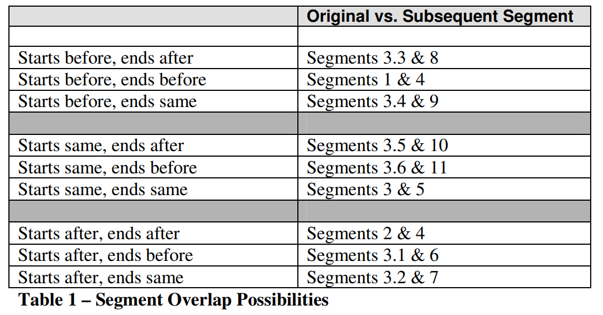
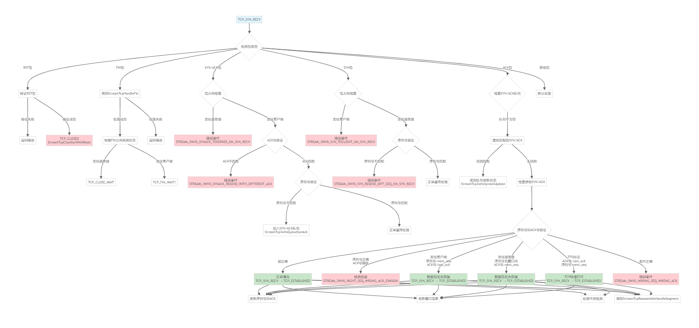
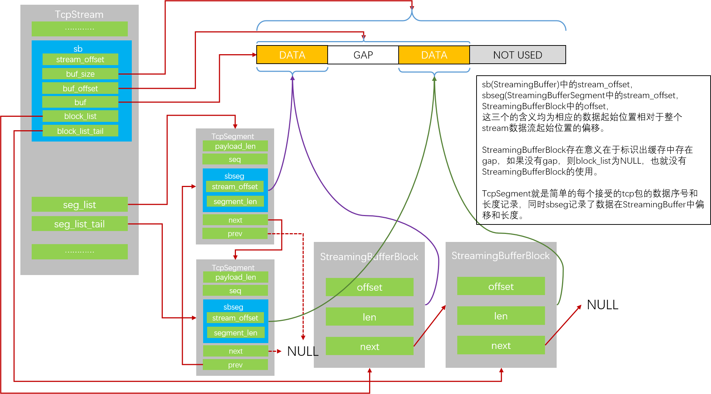
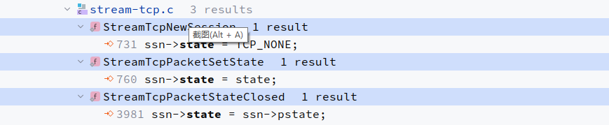
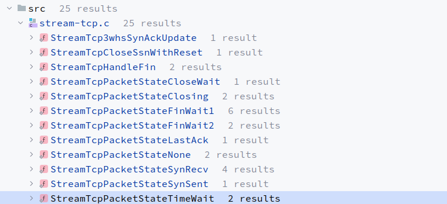

先列举提纲，然后再开始写文章，源代码分析采用哪个版本的源代码呢？

https://deepwiki.com/OISF/suricata/3.4-tcp-stream-reassembly

文档生成是生成了，但是真正是否是不是这么回事，还需要自己亲自去看源代码来验证真伪，否则就是填鸭式教育，而不是真正的学习。


# 零、提出问题

## 1、tcp流重组 和 协议识别 的衔接

## 2、tcp流重组的入口函数

## 3、流重组使用什么样的数据结构呢？


# 一、流重组多种场景分析

## 1、1 场景分析-理论篇

参考论文中的**Sturges/Novak Model**模型



  

**分段覆盖的各种情况**



术语：

origin segment：原始段，按时间顺序在后续片段之前发送的片段。

subsequent segment : 后续段，在原始段之后发送并与原始段重叠的段。


0~23的序号：tcp的相对序列号


带有颜色的segment段上的标签，代表发送分段时的发送顺序，如111-22-333-3.1等，和tcp的相对序列号无关。

table1中左侧第一列中，展示tcp segment 重叠的情况，第二列从原始段与后续段的角度考虑段重叠。


上图带有3.1-3.6标签segment段是ip分片，可遵循Paxson/Shankar model模型来实现ip分片重组。  

原始段 1、2、3、3.1、3.2、3.3、3.4、3.5 和 3.6 位于第一行，相对 TCP 序列号范围从 0 到 22。这些按时间顺序排在第一位。

接下来，我们发送后续片段 4-11 与原始段重叠，相对 TCP 序列号范围从 1 到 23。


segment部分或全部重叠。图中segment 5和segment 3完全重叠，都从tcp相对序列号6开始，有三个字节长度的payload。

他们仅在内容上有所不同，不同的操作系统对于不同内容有不同的选择策略。大多数段是部分重叠，不以相同的tcp相对序列号开始。


segment 4是很特殊的，因为它重叠了2个段（segment 1和segment 2）：

- 大于段 1 的起始相对序列号 0 - **starts after**  
- 小于段 2 的起始相对序号 4 - **starts before**

接收端操作系统将根据报文时序和重叠情况，在原始报文和后续报文间进行选择。起始和结尾都存在before、after和same的情况。例如，Windows倾向于选择原始报文，除了后续报文起始序列号在原始报文之前的情况。


下面来列举几种不同的重组策略：

- Windows/BSD倾向于原始报文，除了后续报文起始序列号在原始报文前这种情况。
- First/Windows Vista倾向于原始报文段。
- Linux倾向于原始报文，除了后续报文起始序列号在原始报文之前，或后续报文起始序列号相同但终止序列号在原始报文后的情况。
- Solaris倾向于后续报文，除了原始报文终止序列号在后续报文之后，或起始序列号在原始序列号之前并且终止序列号相同或在其之后。
- Linux-old倾向于后续报文，除了原始报文起始序列号在后续报文之前，或原始报文起始序列号和后续报文相同但终止序列号在其之后。


## 1、2 场景分析-实战篇

static void SBBUpdate(StreamingBuffer *sb,uint32_t rel_offset, uint32_t data_len)

SBB是StreamBufferBlock的简称。

打开IDE定位到SBBUpdate函数，进行分析。


**设置不同操作系统对于tcp segment的接收策略。**

StreamTcpSetOSPolicy函数


# 二、TCP状态机

## 2、1 TCP状态切换基础知识

TCP状态在连接建立、数据传输和连接关闭过程中起到关键作用，不同的状态反映了TCP连接在不同阶段的行为。以下是TCP状态在各个阶段的作用：

三次握手的状态变迁


**连接建立：**

- LISTEN：服务器端进入此状态，监听来自客户端的连接请求。
- SYN_SENT：客户端发送SYN报文，等待服务器确认，表示连接请求已发出。
- SYN_RECV：服务器收到SYN报文，发送ACK报文进行确认，并发送自己的SYN报文，等待客户端确认。
- ESTABLISHED：客户端和服务器端都收到了对方的SYN和ACK报文，连接建立成功，可以开始数据传输。

四次挥手的状态变迁


**连接关闭：**

- **FIN_WAIT1**：主动关闭端发送FIN报文，表示请求关闭连接，等待对方确认。
- **FIN_WAIT2**：主动关闭端收到ACK报文确认，等待对方发送FIN报文。
- **CLOSE_WAIT（被动关闭端）**：被动关闭端收到FIN报文，发送ACK报文，并等待上层应用关闭连接。
- **CLOSING**：双方都发送了FIN报文，但主动关闭端仍在等待对方的ACK报文确认。
- **LAST_ACK**：被动关闭端发送FIN报文，等待主动关闭端的ACK报文确认。
- **TIME_WAIT(主动关闭端)**：主动关闭端收到FIN报文，发送ACK报文，并等待一段时间以确保对方收到ACK报文确认。
- **CLOSED**：连接关闭完成，双方都收到了对方的FIN和ACK报文，TCP连接回到空闲状态。

通过这些状态，TCP协议能够在连接建立、数据传输和连接关闭过程中实现可靠的、面向连接的通信。各个状态之间的转换遵循一定的规则，以确保连接的正确建立、维护和关闭。

参考链接

https://developer.aliyun.com/article/1463856?userCode=okjhlpr5


## 2、2 状态切换的核心函数

```
static void StreamTcpPacketSetState(Packet *p, TcpSession *ssn, uint8_t state)
{
    if (state == ssn->state || PKT_IS_PSEUDOPKT(p))
        return;

    ssn->pstate = ssn->state;  // 保存前一个状态
    ssn->state = state;        // 设置新状态

    // 更新Flow状态
    switch(ssn->state) {
        case TCP_ESTABLISHED:
        case TCP_FIN_WAIT1:
        case TCP_FIN_WAIT2:
        case TCP_CLOSING:
        case TCP_CLOSE_WAIT:
            FlowUpdateState(p->flow, FLOW_STATE_ESTABLISHED);
            break;
        case TCP_LAST_ACK:
        case TCP_TIME_WAIT:
        case TCP_CLOSED:
            FlowUpdateState(p->flow, FLOW_STATE_CLOSED);
            break;
    }
}
```


## 2、3 完整的状态切换路径

| 当前状态        | 触发条件        | 目标状态        | 切换函数                        | 特殊条件       |
| :-------------- | :-------------- | :-------------- | :------------------------------ | :------------- |
| TCP_NONE        | 收到SYN包       | TCP_SYN_SENT    | StreamTcpPacketStateNone()      | 创建新会话     |
| TCP_NONE        | 收到ACK包(中流) | TCP_ESTABLISHED | StreamTcpPacketStateNone()      | 中流检测启用   |
| TCP_SYN_SENT    | 收到SYN/ACK     | TCP_SYN_RECV    | StreamTcp3whsSynAckUpdate()     | 序列号验证     |
| TCP_SYN_RECV    | 收到ACK包       | TCP_ESTABLISHED | StreamTcpPacketStateSynRecv()   | 序列号+ACK验证 |
| TCP_ESTABLISHED | 收到FIN(客户端) | TCP_FIN_WAIT1   | StreamTcpHandleFin()            | 序列号+ACK验证 |
| TCP_ESTABLISHED | 收到FIN(服务器) | TCP_CLOSE_WAIT  | StreamTcpHandleFin()            | 序列号+ACK验证 |
| TCP_FIN_WAIT1   | 收到FIN+ACK     | TCP_TIME_WAIT   | StreamTcpPacketStateFinWait1()  | 序列号验证     |
| TCP_FIN_WAIT1   | 收到FIN         | TCP_CLOSING     | StreamTcpPacketStateFinWait1()  | 序列号验证     |
| TCP_FIN_WAIT1   | 收到ACK         | TCP_FIN_WAIT2   | StreamTcpPacketStateFinWait1()  | 序列号验证     |
| TCP_FIN_WAIT2   | 收到FIN         | TCP_TIME_WAIT   | StreamTcpPacketStateFinWait2()  | 序列号验证     |
| TCP_CLOSE_WAIT  | 收到FIN(客户端) | TCP_LAST_ACK    | StreamTcpPacketStateCloseWait() | 序列号验证     |
| TCP_CLOSING     | 收到ACK         | TCP_TIME_WAIT   | StreamTcpPacketStateClosing()   | 序列号验证     |
| TCP_LAST_ACK    | 收到ACK         | TCP_CLOSED      | StreamTcpPacketStateLastAck()   | 序列号验证     |
| TCP_TIME_WAIT   | 收到ACK         | TCP_CLOSED      | StreamTcpPacketStateTimeWait()  | 序列号验证     |
| 任意状态        | 收到RST         | TCP_CLOSED      | StreamTcpCloseSsnWithReset()    | RST验证通过    |


### 1. TCP_NONE → TCP_SYN_SENT (连接建立阶段)

触发条件: 收到SYN包

```
// 在 StreamTcpPacketStateNone() 函数中
} else if (p->tcph->th_flags & TH_SYN) {
    // 创建新会话
    ssn = StreamTcpNewSession(p, stt->ssn_pool_id);
    
    // 设置状态为 SYN_SENT
    StreamTcpPacketSetState(p, ssn, TCP_SYN_SENT);
    
    // 初始化序列号
    ssn->client.isn = TCP_GET_SEQ(p);
    ssn->client.next_seq = ssn->client.isn + 1;
}
```

验证条件:

- SYN包验证通过

- 时间戳验证通过 (StateSynSentValidateTimestamp())

### 2. TCP_SYN_SENT → TCP_SYN_RECV (三次握手)

触发条件: 收到SYN/ACK包

```
// 在 StreamTcpPacketStateSynSent() 函数中
} else if ((p->tcph->th_flags & (TH_SYN|TH_ACK)) == (TH_SYN|TH_ACK)) {
	//入所数据包为发往服务端的方向，则直接退出
    if (PKT_IS_TOSERVER(p)) {
            StreamTcpSetEvent(p, STREAM_3WHS_SYNACK_IN_WRONG_DIRECTION);
            SCLogDebug("ssn %p: SYN/ACK received in the wrong direction", ssn);
            return -1;
    }
    // 更新会话状态
    StreamTcp3whsSynAckUpdate(ssn, p, NULL);
}
```

StreamTcpPacketStateSynSent函数调用了StreamTcp3whsSynAckUpdate函数;

StreamTcp3whsSynAckUpdate函数中调用了StreamTcpPacketSetState(p, ssn, TCP_SYN_RECV);

验证条件:

- SYN/ACK包方向正确 (发往客户端)

- 时间戳验证通过

- 序列号和ACK号验证通过

### 3. TCP_SYN_RECV → TCP_ESTABLISHED (连接建立完成)

触发条件: 收到ACK包

```
// 在 StreamTcpPacketStateSynRecv() 函数中
static int StreamTcpPacketStateSynRecv(ThreadVars *tv, Packet *p,
        StreamTcpThread *stt, TcpSession *ssn,
        PacketQueueNoLock *pq)
{
    // ----------------------- ACK包处理 - 核心状态转换逻辑-----------------------
    else if (p->tcph->th_flags & TH_ACK) {
        // 核心状态转换：TCP_SYN_RECV → TCP_ESTABLISHED
        // 情况1：正常的ACK包 - 序列号和ACK号都正确
        if ((SEQ_EQ(TCP_GET_SEQ(p), ssn->client.next_seq)) &&
            SEQ_EQ(TCP_GET_ACK(p), ssn->server.next_seq)) {
            
            // 更新序列号和ACK号
            StreamTcpUpdateLastAck(ssn, &ssn->server, TCP_GET_ACK(p));
            StreamTcpUpdateNextSeq(ssn, &ssn->client, (ssn->client.next_seq + p->payload_len));   
            
            // 关键：状态转换到 ESTABLISHED
            StreamTcpPacketSetState(p, ssn, TCP_ESTABLISHED);
            
            // 处理数据段重组
            StreamTcpReassembleHandleSegment(tv, stt->ra_ctx, ssn, &ssn->client, p, pq);
        }
        // 情况2：丢失数据包后的ACK - 发往客户端
        else if (PKT_IS_TOCLIENT(p) &&
                 SEQ_GT(TCP_GET_SEQ(p), ssn->client.next_seq) &&
                 SEQ_GT(TCP_GET_ACK(p), ssn->client.last_ack)) {
            
            // 状态转换到 ESTABLISHED
            StreamTcpPacketSetState(p, ssn, TCP_ESTABLISHED);
            
            StreamTcpReassembleHandleSegment(tv, stt->ra_ctx, ssn, &ssn->server, p, pq);
        }
        // 情况3：丢失数据包后的ACK - 发往服务器
        else if (SEQ_GT(TCP_GET_SEQ(p), ssn->client.next_seq) &&
                 SEQ_LEQ(TCP_GET_SEQ(p), ssn->client.next_win) &&
                 SEQ_EQ(TCP_GET_ACK(p), ssn->server.next_seq)) {

            // 状态转换到 ESTABLISHED
            StreamTcpPacketSetState(p, ssn, TCP_ESTABLISHED);
            
            StreamTcpReassembleHandleSegment(tv, stt->ra_ctx, ssn, &ssn->client, p, pq);
        }
    }

    return 0;
}
```

验证条件:

- ACK包的序列号等于客户端的next_seq

- ACK包的ACK号等于服务器的next_seq

- 窗口大小验证通过

针对上述情况2和情况3，我们再详细说明下。

**具体场景分析**

#### 1. 网络丢包：正常的ACK包在网络传输过程中丢失

**场景A：客户端ACK丢失，服务器发送数据**

```
正常流程：
Client ----SYN----> Server
Client <--SYN/ACK-- Server  
Client ----ACK----> Server  ← 这个ACK丢失了
Client <--DATA---- Server   ← 服务器直接发送数据

Suricata处理：
- 检测到发往客户端的数据包
- 发现序列号 > client.next_seq (说明有数据)
- 发现ACK号 > client.last_ack (说明服务器确认了SYN)
- 推断ACK包丢失，直接建立连接
```

**场景B：客户端ACK丢失，客户端发送数据**

```
正常流程：
Client ----SYN----> Server
Client <--SYN/ACK-- Server  
Client ----ACK----> Server  ← 这个ACK丢失了
Client ----DATA----> Server ← 客户端直接发送数据

Suricata处理：
- 检测到发往服务器的数据包
- 发现序列号在窗口内且 > client.next_seq
- 发现ACK号 = server.next_seq (客户端确认了SYN/ACK)
- 推断ACK包丢失，直接建立连接
```


#### 2. 包乱序：数据包到达顺序与发送顺序不一致

由于网络路由、负载均衡等原因，数据包可能不按发送顺序到达。

**场景C：ACK包延迟到达**

```
发送顺序：
Client ----SYN----> Server
Client <--SYN/ACK-- Server  
Client ----DATA----> Server  ← 先到达
Client ----ACK----> Server   ← 后到达

Suricata处理：
- 先收到DATA包，检测到ACK信息
- 推断连接已建立，进入ESTABLISHED状态
- 后续收到ACK包时，已经是ESTABLISHED状态，正常处理
```


#### 3. 快速重传：应用程序在ACK丢失后立即发送数据包

**场景E：TCP快速打开(TFO)**

```
TFO流程：
Client ----SYN+Data----> Server  ← 在SYN中携带数据
Client <--SYN/ACK------ Server  
Client ----ACK+Data----> Server  ← 立即发送更多数据

Suricata处理：
- 检测到TFO标志
- 发现ACK号 = client.last_ack (确认了SYN/ACK)
- 发现序列号 = server.next_seq (期望的序列号)
- 直接建立连接并处理数据
```



用文字表达的话，就是

```
TCP_SYN_RECV
    │
    ├── 收到RST包
    │   └── → TCP_CLOSED (异常关闭)
    │
    ├── 收到FIN包
    │   ├── 发往服务器 → TCP_CLOSE_WAIT
    │   └── 发往客户端 → TCP_FIN_WAIT1
    │
    ├── 收到SYN/ACK包
    │   ├── 发往服务器 → 错误处理 (STREAM_3WHS_SYNACK_TOSERVER_ON_SYN_RECV)
    │   ├── ACK号不匹配 → 错误处理 (STREAM_3WHS_SYNACK_RESEND_WITH_DIFFERENT_ACK)
    │   ├── 序列号不匹配 → 加入SYN/ACK队列
    │   └── 正常重传 → 保持SYN_RECV
    │
    ├── 收到SYN包
    │   ├── 发往客户端 → 错误处理 (STREAM_3WHS_SYN_TOCLIENT_ON_SYN_RECV)
    │   ├── 序列号不匹配 → 错误处理 (STREAM_3WHS_SYN_RESEND_DIFF_SEQ_ON_SYN_RECV)
    │   └── 正常重传 → 保持SYN_RECV
    │
    └── 收到ACK包
        ├── 序列号=next_seq && ACK号=next_seq → TCP_ESTABLISHED (正常情况)
        ├── 序列号正确 && ACK号错误 → 检测逃避 (STREAM_3WHS_RIGHT_SEQ_WRONG_ACK_EVASION)
        ├── 发往客户端 && 序列号>next_seq && ACK号>last_ack → TCP_ESTABLISHED (数据包丢失恢复)
        ├── 发往服务器 && 序列号在窗口内 && ACK号=next_seq → TCP_ESTABLISHED (数据包丢失恢复)
        ├── TFO标志 && ACK号=last_ack && 序列号=next_seq → TCP_ESTABLISHED (TCP快速打开)
        └── 序列号和ACK号都不正确 → 错误处理 (STREAM_3WHS_WRONG_SEQ_WRONG_ACK)
```


### 4. TCP_ESTABLISHED → TCP_FIN_WAIT1 (主动关闭)

触发条件: 收到FIN包 (发往客户端)

```
// 在 StreamTcpHandleFin() 函数中
} else { /* 发往客户端 */
    // 验证ACK和序列号
    if (StreamTcpValidateAck(ssn, &ssn->client, p) == -1) {
        return -1;
    }
    
    // 设置状态为 FIN_WAIT1
    StreamTcpPacketSetState(p, ssn, TCP_FIN_WAIT1);
    
    // 更新序列号
    if (SEQ_EQ(TCP_GET_SEQ(p), ssn->server.next_seq))
        ssn->server.next_seq = TCP_GET_SEQ(p) + p->payload_len;
}
```

验证条件:

- FIN包验证通过

- ACK号验证通过

- 序列号在窗口范围内

### 5. TCP_ESTABLISHED → TCP_CLOSE_WAIT (被动关闭)

触发条件: 收到FIN包 (发往服务器)

```
// 在 StreamTcpHandleFin() 函数中
if (PKT_IS_TOSERVER(p)) {
    // 验证ACK和序列号
    if (StreamTcpValidateAck(ssn, &ssn->server, p) == -1) {
        return -1;
    }
    
    // 设置状态为 CLOSE_WAIT
    StreamTcpPacketSetState(p, ssn, TCP_CLOSE_WAIT);
    
    // 更新序列号
    if (SEQ_EQ(TCP_GET_SEQ(p), ssn->client.next_seq))
        ssn->client.next_seq = TCP_GET_SEQ(p) + p->payload_len;
}
```

验证条件:

- FIN包验证通过

- ACK号验证通过

- 序列号在窗口范围内

### 6. TCP_FIN_WAIT1 → TCP_FIN_WAIT2 (等待ACK)

```
int StreamTcpPacketStateFinWait1(ThreadVars *tv, Packet *p,
        StreamTcpThread *stt, TcpSession *ssn, PacketQueueNoLock *pq)
{
    // RST包处理 - 直接关闭连接
    if (p->tcph->th_flags & TH_RST) {
        if (!StreamTcpValidateRst(ssn, p))
            return -1;
        StreamTcpCloseSsnWithReset(p, ssn);
    }
    // 收到FIN+ACK包处理 - FIN_WAIT1 → TIME_WAIT
    else if ((p->tcph->th_flags & (TH_FIN|TH_ACK)) == (TH_FIN|TH_ACK)) {
        if (PKT_IS_TOSERVER(p)) {
            // 验证序列号和ACK
            if (StreamTcpValidateAck(ssn, &ssn->server, p) == -1) {
                return -1;
            }
            
            // 状态转换：FIN_WAIT1 → TIME_WAIT
            StreamTcpPacketSetState(p, ssn, TCP_TIME_WAIT);
        } else {
            // 验证序列号和ACK
            if (StreamTcpValidateAck(ssn, &ssn->client, p) == -1) {
                return -1;
            }
            
            // 状态转换：FIN_WAIT1 → TIME_WAIT
            StreamTcpPacketSetState(p, ssn, TCP_TIME_WAIT);
        }
    }
    // FIN包处理 - 同时关闭 FIN_WAIT1 → CLOSING
    else if (p->tcph->th_flags & TH_FIN) {
        if (PKT_IS_TOSERVER(p)) {
            // 验证序列号和ACK
            if (StreamTcpValidateAck(ssn, &ssn->server, p) == -1) {
                return -1;
            }
            
            // 状态转换：FIN_WAIT1 → CLOSING
            StreamTcpPacketSetState(p, ssn, TCP_CLOSING);
        } else {
            // 验证序列号和ACK
            if (StreamTcpValidateAck(ssn, &ssn->client, p) == -1) {
                return -1;
            }
            
            // 状态转换：FIN_WAIT1 → CLOSING
            StreamTcpPacketSetState(p, ssn, TCP_CLOSING);
        }
    }
    // ACK包处理 - 核心状态转换逻辑
    else if (p->tcph->th_flags & TH_ACK) {
        if (PKT_IS_TOSERVER(p)) {
            // 验证ACK
            if (StreamTcpValidateAck(ssn, &ssn->server, p) == -1) {
                return -1;
            }
            
            // 检查序列号是否在窗口内
            if (SEQ_LEQ(TCP_GET_SEQ(p) + p->payload_len, ssn->client.next_win) ||
                (ssn->flags & (STREAMTCP_FLAG_MIDSTREAM))) {
                
                // 关键：状态转换：FIN_WAIT1 → FIN_WAIT2
                if (TCP_GET_SEQ(p) == ssn->client.next_seq) {
                    StreamTcpPacketSetState(p, ssn, TCP_FIN_WAIT2);
                }
            }
        } else {
            // 验证ACK
            if (StreamTcpValidateAck(ssn, &ssn->client, p) == -1) {
                return -1;
            }
            
            // 检查序列号是否在窗口内，状态转换：FIN_WAIT1 → FIN_WAIT2
            if (SEQ_LEQ(TCP_GET_SEQ(p) + p->payload_len, ssn->server.next_win) ||
                (ssn->flags & (STREAMTCP_FLAG_MIDSTREAM))) {
                if (TCP_GET_SEQ(p) == ssn->server.next_seq) {
                    StreamTcpPacketSetState(p, ssn, TCP_FIN_WAIT2);
                }
            }
        }
    }

    return 0;
}
```

验证条件:

- ACK包验证通过

- 序列号等于期望的下一个序列号

- 数据在窗口接收范围内

其状态切换的流程图

```
TCP_FIN_WAIT1
    │
    ├── 收到ACK包 (确认FIN)
    │   ├── 序列号 = next_seq → TCP_FIN_WAIT2
    │   └── 序列号 ≠ next_seq → 继续等待
    │
    ├── 收到FIN+ACK包 (同时关闭)
    │   └── → TCP_TIME_WAIT
    │
    ├── 收到FIN包 (同时关闭)
    │   └── → TCP_CLOSING
    │
    └── 收到RST包 (异常关闭)
        └── → TCP_CLOSED
```


### 7. TCP_FIN_WAIT1 → TCP_TIME_WAIT (同时关闭)

触发条件: 收到FIN+ACK包

```
// 在 StreamTcpPacketStateFinWait1() 函数中
} else if ((p->tcph->th_flags & (TH_FIN|TH_ACK)) == (TH_FIN|TH_ACK)) {
    if (PKT_IS_TOSERVER(p)) {
        // 验证序列号和ACK
        if (StreamTcpValidateAck(ssn, &ssn->server, p) == -1) {
            return -1;
        }
        
        if (!retransmission) {
            // 设置状态为 TIME_WAIT
            StreamTcpPacketSetState(p, ssn, TCP_TIME_WAIT);
        }
    }
}
```

验证条件:

- FIN+ACK包验证通过

- 不是重传包

- ACK号验证通过

### 8. TCP_FIN_WAIT1 → TCP_CLOSING (同时关闭)

触发条件: 收到FIN包 (在FIN_WAIT1状态下)

```
// 在 StreamTcpPacketStateFinWait1() 函数中
} else if (p->tcph->th_flags & TH_FIN) {
    if (PKT_IS_TOSERVER(p)) {
        // 验证序列号和ACK
        if (StreamTcpValidateAck(ssn, &ssn->server, p) == -1) {
            return -1;
        }
        
        if (!retransmission) {
            // 设置状态为 CLOSING
            StreamTcpPacketSetState(p, ssn, TCP_CLOSING);
        }
    }
}
```

验证条件:

- FIN包验证通过

- 不是重传包

- ACK号验证通过

### 9. TCP_CLOSE_WAIT → TCP_LAST_ACK (发送FIN)

```
static int StreamTcpPacketStateCloseWait(ThreadVars *tv, Packet *p,
        StreamTcpThread *stt, TcpSession *ssn, PacketQueueNoLock *pq)
{
	//TCP_CLOSE_WAIT → TCP_CLOSED 突然收到rst数据包，异常关闭
	if (p->tcph->th_flags & TH_RST) {
        if (!StreamTcpValidateRst(ssn, p))
            return -1;
        // 直接关闭连接
        StreamTcpCloseSsnWithReset(p, ssn);
	}
    // FIN包处理 - 核心状态转换逻辑
    else if (p->tcph->th_flags & TH_FIN) {
        if (PKT_IS_TOSERVER(p)) { //发往服务器的数据包
            // 发往服务器的FIN包 - 验证但不转换状态
            if (StreamTcpValidateAck(ssn, &ssn->server, p) == -1) {
                return -1;
            }
            
            // 注意：这里不转换状态，注释说明需要发往客户端的FIN
            // 保持TCP_CLOSE_WAIT状态
        } else {
            // 发往客户端的FIN包 - 关键状态转换
            if (StreamTcpValidateAck(ssn, &ssn->client, p) == -1) {
                return -1;
            }
            
            // 核心：状态转换 TCP_CLOSE_WAIT → TCP_LAST_ACK
            StreamTcpPacketSetState(p, ssn, TCP_LAST_ACK);
            
            // 更新序列号和ACK
            StreamTcpUpdateLastAck(ssn, &ssn->client, TCP_GET_ACK(p));
            StreamTcpReassembleHandleSegment(tv, stt->ra_ctx, ssn, &ssn->server, p, pq);
        }
    }
    // ACK包处理 - 正常数据传输，TCP_CLOSE_WAIT阶段可能会发生数据传输的，所以也需要调用流重组函数
    else if (p->tcph->th_flags & TH_ACK) {
        if (PKT_IS_TOSERVER(p)) {
            // 发往服务器的ACK包 - 验证ACK
            if (StreamTcpValidateAck(ssn, &ssn->server, p) == -1) {
                return -1;
            }
            
            // 更新序列号和ACK
            StreamTcpUpdateLastAck(ssn, &ssn->server, TCP_GET_ACK(p));
            StreamTcpReassembleHandleSegment(tv, stt->ra_ctx, ssn, &ssn->client, p, pq);
        } else {
            // 发往客户端的ACK包 - 验证ACK
            if (StreamTcpValidateAck(ssn, &ssn->client, p) == -1) {
                return -1;
            }
            
            // 更新序列号和ACK
            StreamTcpUpdateLastAck(ssn, &ssn->client, TCP_GET_ACK(p));
            StreamTcpReassembleHandleSegment(tv, stt->ra_ctx, ssn, &ssn->server, p, pq);
        }
    }

    return 0;
}
```

状态切换流程图

```
TCP_CLOSE_WAIT
    │
    ├── 收到RST包
    │   └── → TCP_CLOSED (异常关闭)
    │
    ├── 收到FIN包
    │   ├── 发往服务器 → 保持CLOSE_WAIT (验证但不转换)
    │   └── 发往客户端 → TCP_LAST_ACK (核心转换)
    │
    ├── 收到ACK包
    │   └── 保持CLOSE_WAIT (正常数据传输)
    │
    └── 收到SYN包
        └── 错误处理 (异常情况)
```


### 10. TCP_LAST_ACK → TCP_CLOSED (连接关闭)

触发条件: 收到ACK包 (确认FIN)

```
static int StreamTcpPacketStateLastAck(ThreadVars *tv, Packet *p,
        StreamTcpThread *stt, TcpSession *ssn, PacketQueueNoLock *pq)
{
    // RST包处理 - 直接关闭连接
    if (p->tcph->th_flags & TH_RST) {
        if (!StreamTcpValidateRst(ssn, p))
            return -1;
        StreamTcpCloseSsnWithReset(p, ssn);
    }
    // FIN包处理 - 暂未实现
    else if (p->tcph->th_flags & TH_FIN) {
        SCLogDebug("ssn (%p): FIN pkt on LastAck", ssn);
    }
    // SYN包处理 - 异常情况
    else if (p->tcph->th_flags & TH_SYN) {
        StreamTcpSetEvent(p, STREAM_SHUTDOWN_SYN_RESEND);
        return -1;
    }
    // ACK包处理 - 核心状态转换逻辑
    else if (p->tcph->th_flags & TH_ACK) {
        if (PKT_IS_TOSERVER(p)) {
            // 验证ACK
            if (StreamTcpValidateAck(ssn, &ssn->server, p) == -1) {
                StreamTcpSetEvent(p, STREAM_LASTACK_INVALID_ACK);
                return -1;
            }
            
            // 序列号验证和状态转换
            if (SEQ_LT(TCP_GET_SEQ(p), ssn->client.next_seq)) {
                // 包在next_seq之前，不更新状态
                SCLogDebug("ssn %p: not updating state as packet is before next_seq", ssn);
            } else if (TCP_GET_SEQ(p) != ssn->client.next_seq && 
                       TCP_GET_SEQ(p) != ssn->client.next_seq + 1) {
                // 序列号不匹配
                StreamTcpSetEvent(p, STREAM_LASTACK_ACK_WRONG_SEQ);
                return -1;
            } else {
                // 核心：状态转换 TCP_LAST_ACK → TCP_CLOSED
                StreamTcpPacketSetState(p, ssn, TCP_CLOSED);
            }
            
            // 更新序列号和ACK
            StreamTcpUpdateLastAck(ssn, &ssn->server, TCP_GET_ACK(p));
            StreamTcpReassembleHandleSegment(tv, stt->ra_ctx, ssn, &ssn->client, p, pq);
        }
    }

    return 0;
}
```

#### 1） TCP_LAST_ACK → TCP_CLOSED (核心状态转换)

触发条件: 收到发往服务器的ACK包

```
else if (p->tcph->th_flags & TH_ACK) {
    if (PKT_IS_TOSERVER(p)) {
        // 验证ACK号
        if (StreamTcpValidateAck(ssn, &ssn->server, p) == -1) {
            return -1;
        }
        
        // 序列号验证
        if (TCP_GET_SEQ(p) == ssn->client.next_seq || 
            TCP_GET_SEQ(p) == ssn->client.next_seq + 1) {
            // 核心状态转换：LAST_ACK → CLOSED
            StreamTcpPacketSetState(p, ssn, TCP_CLOSED);
        }
    }
}
```

验证条件:

- 包包含ACK标志

- 包方向是发往服务器 (PKT_IS_TOSERVER(p))

- ACK号验证通过

- 序列号等于 next_seq 或 next_seq + 1


#### 2） TCP_LAST_ACK → TCP_CLOSED (异常关闭)

触发条件: 收到RST包

```
if (p->tcph->th_flags & TH_RST) {
    if (!StreamTcpValidateRst(ssn, p))
        return -1;
    // 直接关闭连接
    StreamTcpCloseSsnWithReset(p, ssn);
}
```

StreamTcpCloseSsnWithReset函数中会调用StreamTcpPacketSetState设置为TCP_CLOSED状态。

```
static inline void StreamTcpCloseSsnWithReset(Packet *p, TcpSession *ssn)
{
    ssn->flags |= STREAMTCP_FLAG_CLOSED_BY_RST;
    StreamTcpPacketSetState(p, ssn, TCP_CLOSED);
}
```


### 11. TCP_TIME_WAIT → TCP_CLOSED (超时)

触发条件: 收到ACK包 (任意方向)

```
static int StreamTcpPacketStateTimeWait(ThreadVars *tv, Packet *p,
        StreamTcpThread *stt, TcpSession *ssn, PacketQueueNoLock *pq)
{
    if (ssn == NULL)
        return -1;

    // RST包处理 - 直接关闭连接
    if (p->tcph->th_flags & TH_RST) {
        if (!StreamTcpValidateRst(ssn, p))
            return -1;
        StreamTcpCloseSsnWithReset(p, ssn);
    }
    // FIN包处理 - 暂未实现
    else if (p->tcph->th_flags & TH_FIN) {
        /** \todo */
    }
    // SYN包处理 - 异常情况
    else if (p->tcph->th_flags & TH_SYN) {
        StreamTcpSetEvent(p, STREAM_SHUTDOWN_SYN_RESEND);
        return -1;
    }
    // ACK包处理 - 核心状态转换逻辑
    else if (p->tcph->th_flags & TH_ACK) {
        if (PKT_IS_TOSERVER(p)) {
            // 发往服务器的ACK包
            if (StreamTcpValidateAck(ssn, &ssn->server, p) == -1) {
                StreamTcpSetEvent(p, STREAM_TIMEWAIT_INVALID_ACK);
                return -1;
            }
            
            // 核心：状态转换 TCP_TIME_WAIT → TCP_CLOSED
            StreamTcpPacketSetState(p, ssn, TCP_CLOSED);
            
            // 更新序列号和ACK
            StreamTcpUpdateLastAck(ssn, &ssn->server, TCP_GET_ACK(p));
            StreamTcpReassembleHandleSegment(tv, stt->ra_ctx, ssn, &ssn->client, p, pq);
        } else {
            // 发往客户端的ACK包
            if (StreamTcpValidateAck(ssn, &ssn->client, p) == -1) {
                StreamTcpSetEvent(p, STREAM_TIMEWAIT_INVALID_ACK);
                return -1;
            }
            
            // 核心：状态转换 TCP_TIME_WAIT → TCP_CLOSED
            StreamTcpPacketSetState(p, ssn, TCP_CLOSED);
            
            // 更新序列号和ACK
            StreamTcpUpdateLastAck(ssn, &ssn->client, TCP_GET_ACK(p));
            StreamTcpReassembleHandleSegment(tv, stt->ra_ctx, ssn, &ssn->server, p, pq);
        }
    }

    return 0;
}
```

状态转换的流程图

```
TCP_TIME_WAIT
    │
    ├── 收到RST包
    │   └── → TCP_CLOSED (异常关闭)
    │
    ├── 收到FIN包
    │   └── 保持TIME_WAIT (暂未实现)
    │
    ├── 收到SYN包
    │   └── 错误处理 (异常情况)
    │
    └── 收到ACK包
        ├── 发往服务器 → TCP_CLOSED (核心转换)
        └── 发往客户端 → TCP_CLOSED (核心转换)
```


# 三、重组的流程

## 3、1 核心结构体


## 3、2 流的segment存储




核心数据结构有四个：

- TcpStream
- TcpSegment
- StreamBuffer
- StreamingBufferBlock


TcpSession分为client和server两个方向的TcpStream。

TcpStream中seg_list链表用于存储一个流的多个tcp segment。seg_list_tail是指向链表的尾节点。

TcpSegment中的sbseg记录segment数据在StreamBuffer中的偏移和长度。

```
typedef struct StreamingBuffer_ {
    const StreamingBufferConfig *cfg;
    //buf数据相对于整个stream数据的偏移
    uint64_t stream_offset; /**< offset of the start of the memory block */

    uint8_t *buf;           /*用于重组的内存块 */
    uint32_t buf_size;      /* buf的长度 */
    uint32_t buf_offset;    /* buf已使用的字节数 */

	//StreamingBufferBlock就是
    StreamingBufferBlock *block_list; //StreamingBufferBlock链表
    StreamingBufferBlock *block_list_tail;
} StreamingBuffer;
```

TcpSegment结构体

```
typedef struct TcpSegment_ {
    PoolThreadReserved res;
    uint16_t payload_len;       /**< actual size of the payload */
    uint32_t seq;
    StreamingBufferSegment sbseg;//标记此Segment写入到StreamBuffer中的位置
    struct TcpSegment_ *next;
    struct TcpSegment_ *prev;
} TcpSegment;

typedef struct StreamingBufferSegment_ {
    uint64_t stream_offset; //segment data的起始位置，相对于整个stream数据流位置的偏移量，下标从0开始
    uint32_t segment_len;	//从起始位置开始的数据长度
} __attribute__((__packed__)) StreamingBufferSegment;
```

TcpSegment中的sbseg记录segment数据在StreamBuffer中的偏移和长度。


**StreamingBufferBlock存在的意义是什么？**

标识出缓存中是否存在gap，如果没有gap，则block_list为NULL。


6.x版本中如下

```
typedef struct StreamingBuffer_ {
    const StreamingBufferConfig *cfg;
    uint64_t stream_offset; /**< offset of the start of the memory block */

    uint8_t *buf;           /**< memory block for reassembly */
    uint32_t buf_size;      /**< size of memory block */
    uint32_t buf_offset;    /**< how far we are in buf_size */

	//由链表换成红黑树
    struct SBB sbb_tree;    /**< red black tree of Stream Buffer Blocks */
    StreamingBufferBlock *head; /**< head, should always be the same as RB_MIN */
    uint32_t sbb_size;          /**< data size covered by sbbs */
} StreamingBuffer;
```

先看懂低版本，然后从低版本进化到高版本，从3.x-4.x-6.x版本摸清其差异化，一点点摸清脉络。

## 3、3 检测空洞Gap

检测空洞Gap是CheckGap函数负责，是通过判断StreamingBufferBlock链表中的数据来判断的。


## 3、4 StreamBuffer缓存扩容

在6.0.10版本时，将存储segment和stream buffer block的链表换成了红黑树。高版本的重新画一张图。

# 四、重组的调用流程

suricata是采用**StreamTcpReassembleHandleSegment**函数处理tcp stream中的数据。

## 4、1 StreamTcpStateDispatch消息分发函数

分别处理tcp处于状态机的不同状态时，需要调用不同的函数。

| tcp状态         | 处理函数                        | 状态 |
| --------------- | ------------------------------- | ---- |
| TCP_SYN_SENT    | StreamTcpPacketStateSynSent     | 已看 |
| TCP_SYN_RECV    | StreamTcpPacketStateSynRecv     | 已看 |
| TCP_ESTABLISHED | StreamTcpPacketStateEstablished | 已看 |
| TCP_FIN_WAIT1   | StreamTcpPacketStateFinWait1    | 未看 |
| TCP_FIN_WAIT2   | StreamTcpPacketStateFinWait2    | 未看 |
| TCP_CLOSING     | StreamTcpPacketStateClosing     | 未看 |
| TCP_CLOSE_WAIT  | StreamTcpPacketStateCloseWait   | 未看 |
| TCP_LAST_ACK    | StreamTcpPacketStateLastAck     | 未看 |
| TCP_TIME_WAIT   | StreamTcpPacketStateTimeWait    | 未看 |
| TCP_CLOSED      | StreamTcpPacketStateClosed      | 未看 |
|                 |                                 |      |


## 4、2  StreamTcpReassembleHandleSegment重组

这里整理了下调用栈，会在tcp状态转换时，去调StreamTcpReassembleHandleSegment来控制重组后的数据何时排出。

```
int StreamTcpReassembleHandleSegment(ThreadVars *tv, TcpReassemblyThreadCtx *ra_ctx,
                                     TcpSession *ssn, TcpStream *stream,
                                     Packet *p, PacketQueueNoLock *pq)
{
	......//省略代码
	if (p->payload_len > 0 && !(stream->flags & STREAMTCP_STREAM_FLAG_NOREASSEMBLY)) {
	SCLogDebug("calling StreamTcpReassembleHandleSegmentHandleData");

	//调用StreamTcpReassembleHandleSegmentHandleData函数
	if (StreamTcpReassembleHandleSegmentHandleData(tv, ra_ctx, ssn, stream, p) != 0) {
			/* failure can only be because of memcap hit, so see if this should lead to a drop */
			ExceptionPolicyApply(
					p, stream_config.reassembly_memcap_policy, PKT_DROP_REASON_STREAM_MEMCAP);
			SCReturnInt(-1);
		}

		SCLogDebug("packet %"PRIu64" set PKT_STREAM_ADD", p->pcap_cnt);
		p->flags |= PKT_STREAM_ADD;
	}
	......//省略代码
}
```

我来看一下StreamTcpReassembleHandleSegmentHandleData函数


对于DoHandleDataCheckBackwards和DoHandleDataCheckForward函数的理解，我理解的不是很到位，这里再好好理解下。

首先，我们需要理解TCP流重组中的"段"（segments）是如何排列的：

- TCP段按照序列号（sequence number）排序在红黑树中

- 每个段有一个起始序列号（seg->seq）和长度（TCP_SEG_LEN(seg)）

- 段的右边界（right edge）是起始序列号加上长度


为什么suricata采用红黑树作为tcp重组的数据结构呢？

我没太想明白这个问题。


## 4、3  StreamTcpReassembleHandleSegment调用堆栈

### 4、3、1 TCP_ESTABLISHED状态

**具体路径：**

StreamTcpPacketStateEstablished -> HandleEstablishedPacketToServer -> StreamTcpReassembleHandleSegment

StreamTcpPacketStateEstablished -> HandleEstablishedPacketToClient -> StreamTcpReassembleHandleSegment

**调用条件：**

- 数据包在窗口范围内 (SEQ_LEQ(TCP_GET_SEQ(p) + p->payload_len, ssn->client.next_win))

- 不是零窗口探测包

- ACK验证通过

- 序列号验证通过

你是否好奇以下内容：

0窗口的探测包是什么？

到底是如何验证seq和ack号的呢？


### 4、3、2 TCP_FIN_WAIT1 状态

**具体路径：**

StreamTcpPacketStateFinWait1 -> StreamTcpReassembleHandleSegment

**调用条件:**

- 收到RST包时

- 收到FIN+ACK包时

- 收到FIN包时

**目的：**处理连接关闭中的数据重组


### 4、3、3 TCP_FIN_WAIT2 状态

和TCP_FIN_WAIT1状态的流程一样


### 4、3、4 TCP_CLOSING 状态

StreamTcpPacketStateClosing -> StreamTcpReassembleHandleSegment

**调用条件:**

**1、收到RST数据包，无条件调用**

```
if (p->tcph->th_flags & TH_RST) {
	//检测是否是有效的rst
    if (!StreamTcpValidateRst(ssn, p))
        return -1;
    //关闭session连接
    StreamTcpCloseSsnWithReset(p, ssn);
    
    // 无条件调用重组函数
    if (PKT_IS_TOSERVER(p)) {
        StreamTcpReassembleHandleSegment(tv, stt->ra_ctx, ssn, &ssn->client, p, pq);
    } else {
        StreamTcpReassembleHandleSegment(tv, stt->ra_ctx, ssn, &ssn->server, p, pq);
    }
}
```

数据包包含RST标志，并且通过验证，根据客户端和服务端方向调用流重组。


**2、收到ACK数据包**

```
if (PKT_IS_TOSERVER(p)) {
    // 序列号必须匹配
    if (TCP_GET_SEQ(p) != ssn->client.next_seq) {
        StreamTcpSetEvent(p, STREAM_CLOSING_ACK_WRONG_SEQ);
        return -1;
    }
    
    // ACK 验证必须通过
    if (StreamTcpValidateAck(ssn, &ssn->server, p) == -1) {
        StreamTcpSetEvent(p, STREAM_CLOSING_INVALID_ACK);
        return -1;
    }
    
    // 调用重组函数
    StreamTcpReassembleHandleSegment(tv, stt->ra_ctx, ssn, &ssn->client, p, pq);
}else { /* implied to client */
    // 序列号必须匹配
    if (TCP_GET_SEQ(p) != ssn->server.next_seq) {
        StreamTcpSetEvent(p, STREAM_CLOSING_ACK_WRONG_SEQ);
        return -1;
    }
    
    // ACK 验证必须通过
    if (StreamTcpValidateAck(ssn, &ssn->client, p) == -1) {
        StreamTcpSetEvent(p, STREAM_CLOSING_INVALID_ACK);
        return -1;
    }
    
    // 调用重组函数
    StreamTcpReassembleHandleSegment(tv, stt->ra_ctx, ssn, &ssn->server, p, pq);
}
```

调用条件：

- 包包含 ACK 标志 (TH_ACK)

- 序列号必须匹配：TCP_GET_SEQ(p) == ssn->client.next_seq

- ACK 验证通过：StreamTcpValidateAck(ssn, &ssn->server, p) != -1


### 4、3、5 TCP_CLOSE_WAIT 状态

#### **1、收到 RST 包时**

```
if (p->tcph->th_flags & TH_RST) {
    if (!StreamTcpValidateRst(ssn, p))
        return -1;
    
    StreamTcpCloseSsnWithReset(p, ssn);
    
    // 无条件调用重组函数
    if (PKT_IS_TOSERVER(p)) {
        StreamTcpReassembleHandleSegment(tv, stt->ra_ctx, ssn, &ssn->client, p, pq);
    } else {
        StreamTcpReassembleHandleSegment(tv, stt->ra_ctx, ssn, &ssn->server, p, pq);
    }
}
```

RST包要通过校验。


#### **2、收到 FIN 包时**

```
if (PKT_IS_TOSERVER(p)) {
    // 非重传包的序列号验证
    if (!retransmission) {
        if (SEQ_LT(TCP_GET_SEQ(p), ssn->client.next_seq) ||
            SEQ_GT(TCP_GET_SEQ(p), (ssn->client.last_ack + ssn->client.window))) {
            StreamTcpSetEvent(p, STREAM_CLOSEWAIT_FIN_OUT_OF_WINDOW);
            return -1;
        }
    }
    
    // ACK 验证必须通过
    if (StreamTcpValidateAck(ssn, &ssn->server, p) == -1) {
        StreamTcpSetEvent(p, STREAM_CLOSEWAIT_INVALID_ACK);
        return -1;
    }
    
    // 调用重组函数
    StreamTcpReassembleHandleSegment(tv, stt->ra_ctx, ssn, &ssn->client, p, pq);
}else { /* implied to client */
    // 非重传包的序列号验证
    if (!retransmission) {
        if (SEQ_LT(TCP_GET_SEQ(p), ssn->server.next_seq) ||
            SEQ_GT(TCP_GET_SEQ(p), (ssn->server.last_ack + ssn->server.window))) {
            StreamTcpSetEvent(p, STREAM_CLOSEWAIT_FIN_OUT_OF_WINDOW);
            return -1;
        }
    }
    
    // ACK 验证必须通过
    if (StreamTcpValidateAck(ssn, &ssn->client, p) == -1) {
        StreamTcpSetEvent(p, STREAM_CLOSEWAIT_INVALID_ACK);
        return -1;
    }
    
    // 调用重组函数
    StreamTcpReassembleHandleSegment(tv, stt->ra_ctx, ssn, &ssn->server, p, pq);
}
```

不管是客户端方向还是服务端方向，其调用条件都一样。

调用条件：

- 数据包包含 FIN 标志
- 非重传包时序列号必须在窗口内
- ACK 验证通过

#### 3、收到ACK包时

```
if (PKT_IS_TOSERVER(p)) {
    // 数据包不能早于 last_ack
    if (p->payload_len > 0 && (SEQ_LEQ((TCP_GET_SEQ(p) + p->payload_len), ssn->client.last_ack))) {
        StreamTcpSetEvent(p, STREAM_CLOSEWAIT_PKT_BEFORE_LAST_ACK);
        return -1;
    }
    
    // 序列号不能超出窗口
    if (SEQ_GT(TCP_GET_SEQ(p), (ssn->client.last_ack + ssn->client.window))) {
        StreamTcpSetEvent(p, STREAM_CLOSEWAIT_ACK_OUT_OF_WINDOW);
        return -1;
    }
    
    // ACK 验证必须通过
    if (StreamTcpValidateAck(ssn, &ssn->server, p) == -1) {
        StreamTcpSetEvent(p, STREAM_CLOSEWAIT_INVALID_ACK);
        return -1;
    }
    
    // 调用重组函数
    StreamTcpReassembleHandleSegment(tv, stt->ra_ctx, ssn, &ssn->client, p, pq);
}else { /* implied to client */
    // 数据包不能早于 last_ack
    if (p->payload_len > 0 && (SEQ_LEQ((TCP_GET_SEQ(p) + p->payload_len), ssn->server.last_ack))) {
        StreamTcpSetEvent(p, STREAM_CLOSEWAIT_PKT_BEFORE_LAST_ACK);
        return -1;
    }
    
    // 序列号不能超出窗口
    if (SEQ_GT(TCP_GET_SEQ(p), (ssn->server.last_ack + ssn->server.window))) {
        StreamTcpSetEvent(p, STREAM_CLOSEWAIT_ACK_OUT_OF_WINDOW);
        return -1;
    }
    
    // ACK 验证必须通过
    if (StreamTcpValidateAck(ssn, &ssn->client, p) == -1) {
        StreamTcpSetEvent(p, STREAM_CLOSEWAIT_INVALID_ACK);
        return -1;
    }
    
    // 调用重组函数
    StreamTcpReassembleHandleSegment(tv, stt->ra_ctx, ssn, &ssn->server, p, pq);
}
```

调用条件：

- 数据包包含 ACK 标志
- 数据包不能早于 last_ack
- 序列号不能超过窗口
- ACK 验证通过


### 4、3、6 TCP_LAST_ACK 状态

#### 1、收到 RST 包时

```
if (p->tcph->th_flags & TH_RST) {
    if (!StreamTcpValidateRst(ssn, p))
        return -1;
    
    StreamTcpCloseSsnWithReset(p, ssn);
    
    // 无条件调用重组函数
    if (PKT_IS_TOSERVER(p)) {
        StreamTcpReassembleHandleSegment(tv, stt->ra_ctx, ssn, &ssn->client, p, pq);
    } else {
        StreamTcpReassembleHandleSegment(tv, stt->ra_ctx, ssn, &ssn->server, p, pq);
    }
}
```

调用条件：

- RST包通过验证

#### 2、收到 ACK 包时

```
if (PKT_IS_TOSERVER(p)) {
    // ACK 验证必须通过
    if (StreamTcpValidateAck(ssn, &ssn->server, p) == -1) {
        StreamTcpSetEvent(p, STREAM_LASTACK_INVALID_ACK);
        return -1;
    }
    
    // 非重传包的序列号验证
    if (!retransmission) {
        if (SEQ_LT(TCP_GET_SEQ(p), ssn->client.next_seq)) {
            // 不更新状态，包在 next_seq 之前
        } else if (TCP_GET_SEQ(p) != ssn->client.next_seq && TCP_GET_SEQ(p) != ssn->client.next_seq + 1) {
            StreamTcpSetEvent(p, STREAM_LASTACK_ACK_WRONG_SEQ);
            return -1;
        } else {
            StreamTcpPacketSetState(p, ssn, TCP_CLOSED);
        }
    }
    
    // 调用重组函数
    StreamTcpReassembleHandleSegment(tv, stt->ra_ctx, ssn, &ssn->client, p, pq);
}
```

调用条件：

- ACK数据包
- 包发往服务器端
- ACK验证通过
- 非重传包时序列号必须匹配

### 4、3、7 TCP_TIME_WAIT 状态

#### 1.、收到 RST 包时

```
if (p->tcph->th_flags & TH_RST) {
    if (!StreamTcpValidateRst(ssn, p))
        return -1;
    
    StreamTcpCloseSsnWithReset(p, ssn);
    
    // 无条件调用重组函数
    if (PKT_IS_TOSERVER(p)) {
        StreamTcpReassembleHandleSegment(tv, stt->ra_ctx, ssn, &ssn->client, p, pq);
    } else {
        StreamTcpReassembleHandleSegment(tv, stt->ra_ctx, ssn, &ssn->server, p, pq);
    }
}
```

调用条件：

- RST 包验证通过


#### 2、收到 ACK 包时

```
if (PKT_IS_TOSERVER(p)) {
    // 非重传包的序列号验证
    if (!retransmission) {
        if (TCP_GET_SEQ(p) != ssn->client.next_seq && TCP_GET_SEQ(p) != ssn->client.next_seq+1) {
            StreamTcpSetEvent(p, STREAM_TIMEWAIT_ACK_WRONG_SEQ);
            return -1;
        }
    }
    
    // ACK 验证必须通过
    if (StreamTcpValidateAck(ssn, &ssn->server, p) == -1) {
        StreamTcpSetEvent(p, STREAM_TIMEWAIT_INVALID_ACK);
        return -1;
    }
    
    // 调用重组函数
    StreamTcpReassembleHandleSegment(tv, stt->ra_ctx, ssn, &ssn->client, p, pq);
}else { /* implied to client */
    // 非重传包的序列号验证
    if (!retransmission) {
        if (TCP_GET_SEQ(p) != ssn->server.next_seq && TCP_GET_SEQ(p) != ssn->server.next_seq+1) {
            if (p->payload_len > 0 && TCP_GET_SEQ(p) == ssn->server.last_ack) {
                // 重传包，直接返回
                return 0;
            } else {
                StreamTcpSetEvent(p, STREAM_TIMEWAIT_ACK_WRONG_SEQ);
                return -1;
            }
        }
    }
    
    // ACK 验证必须通过
    if (StreamTcpValidateAck(ssn, &ssn->client, p) == -1) {
        StreamTcpSetEvent(p, STREAM_TIMEWAIT_INVALID_ACK);
        return -1;
    }
    
    // 调用重组函数
    StreamTcpReassembleHandleSegment(tv, stt->ra_ctx, ssn, &ssn->server, p, pq);
}
```

不管是服务端还是客户端方向，其调用条件都一致。

调用条件：

- 包包含 ACK 标志
- 非重传包时序列号必须匹配
- ACK 验证通过


### 4、3、7 TCP_CLOSED 状态

从代码分析可以看出，StreamTcpPacketStateClosed 函数本身不会直接调用 StreamTcpReassembleHandleSegment 函数。但是，它有一个特殊的处理机制：**间接调用机制**。

在 TCP_CLOSED 状态下，StreamTcpReassembleHandleSegment 可能通过以下方式被调用：

#### 1、通过状态回退机制

```
if ((stream->flags & STREAMTCP_STREAM_FLAG_RST_RECV) == 0) {
    if (ostream->flags & STREAMTCP_STREAM_FLAG_RST_RECV) {
        // 回退到之前的状态进行处理
        if (StreamTcpStateDispatch(tv, p, stt, ssn, &stt->pseudo_queue, ssn->pstate) < 0)
            return -1;
    }
}
```

调用条件：

- 当前方向没有收到 RST 包 (stream->flags & STREAMTCP_STREAM_FLAG_RST_RECV == 0)
- 对向已经收到 RST 包 (ostream->flags & STREAMTCP_STREAM_FLAG_RST_RECV != 0)

则回退到之前的状态(ssn->pstate)进行处理，然后在之前的处理函数中可能会调用StreamTcpReassembleHandleSegment。


#### 2、通过伪包处理机制

在StreamTcpPacket函数中，TCP_CLOSED 状态的包也会经过伪包处理：

```
/* deal with a pseudo packet that is created upon receiving a RST
 * segment. To be sure we process both sides of the connection, we
 * inject a fake packet into the system, forcing reassembly of the
 * opposing direction. */
if (ssn != NULL) {
    while (stt->pseudo_queue.len > 0) {
        Packet *np = PacketDequeueNoLock(&stt->pseudo_queue);
        if (np != NULL) {
            if (PKT_IS_TOSERVER(np)) {
                StreamTcpReassembleHandleSegment(tv, stt->ra_ctx, ssn, &ssn->client, np, NULL);
            } else {
                StreamTcpReassembleHandleSegment(tv, stt->ra_ctx, ssn, &ssn->server, np, NULL);
            }
        }
    }
}
```


最后再出一个整体的调用流程。


理论上，对于每个使用到的变量，都要弄明白两件事

1、变量是如何赋值的？

2、变量在不同场景对应的函数中，是如何使用的？

3、suricata和neuvector中相同变量的获取有什么异同？


幸好suricata的重组功能涉及的代码中和多线程无关，否则还真不好弄。

### 4、2、1 isn初始序列号

isn变量的改变从两个地方开始

StreamTcp3whsSynAckUpdate 在接收到syn/ack数据包后，更新isn

StreamTcpPacketStateNone

```
/* set the sequence numbers and window */
ssn->client.isn = TCP_GET_SEQ(p);
ssn->client.next_seq = ssn->client.isn + 1;//置syn标志的包会消耗一个序列号
```


### 4、2、2 tcp状态state

通过函数参数state来判断如上多种状态，state是如何获取的呢？



其调用函数分别为

StreamTcpNewSession(新建会话)

StreamTcpPacketStateClosed

StreamTcpPacketSetState

其StreamTcpPacketSetState函数的调用栈如下



也就是说基本上每个tcp状态图中的状态都调用StreamTcpPacketSetState设置了新状态。


### 4、2、3 base_seq重组开始的seq序列号

```
uint32_t base_seq;       //seq where we are left with reassebly. Matches STREAM_BASE_OFFSET below
```


做事情，先不要着急，好好想下这些事情要如何开展，然后一步步的去完成。


### 4、2、4 flowflags

```
#define PKT_IS_TOSERVER(p)  (((p)->flowflags & FLOW_PKT_TOSERVER))
#define PKT_IS_TOCLIENT(p)  (((p)->flowflags & FLOW_PKT_TOCLIENT))
```


待解决的问题：

需要明确的几点内容

可能dp代码中还有一些字段的名称需要修改为suricata的样子。

packet后面的所有处理都转为了suricata。


流跟踪这块涉及的细节太多，所以最好还是以suricat为蓝本进行程序的编写。


STREAMTCP_FLAG_APP_LAYER_DISABLED这个标志何时来设置呢？

其中suricata都用到了哪些变量

p->tcph->th_flags tcp的标志位


版本选择，不纠结，采用suricata-6.0.10版本。

因为后面还要移植suricata的规则引擎，packet字段和session字段以suricata的为蓝本。


HandleEstablishedPacketToClient

处理已建立连接状态下，发往Client的数据包。


HandleEstablishedPacketToServer

处理已建立连接状态下，发往Server的数据包。


sb->stream_offset的值初始化时是零，除非sb->buf缓冲区不够用会扩容修改sb->stream_offset.


​    


StreamTcpReassembleHandleSegmentHandleData处理当前packet的数据，加入到本端的stream缓存中。

tcp重组插入segment，使用**红黑树**来存储tcp segment，为什么要选择红黑树来存储segment呢？


# 五、移植suricata和neuvector的代码到现有系统

分为几步来进行呢？

1、红黑树移植，存储tcp segment

2、移植StreamBuffering,util-streaming-buffer.c和util-streaming-buffer.h这两个文件，依赖很少，好移植。

3、移植StreamBufferingSegment结构体

4、检测空洞情况，这种情况如何更好的测试呢？

5、准备流重组需要的变量，以及这些变量是如何赋值的？


这玩意一定能搞定的，反正都能进行debug，还能有多难。

想移植，首先是要看懂之前代码，然后移植到现在的平台上。


# 六、参考链接

**解析Snort的TCP流重组**

https://blog.csdn.net/u013032097/article/details/95472640


**suricata 4.0.3 tcp reassembly**

https://www.hyuuhit.com/2018/05/28/suricata-4-0-3-tcp-reassembly/


**suricata-stream引擎分析**

https://www.jianshu.com/p/6e65c7fc3904