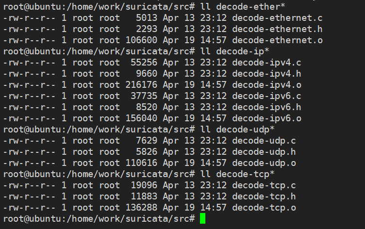

# 一、协议解析文件概览

在src源代码目录中，以decode-*前缀开头的都是解析协议的源文件。

decode-ethernet.c (解析以太网)

decode-ipv4.c (解析网络层协议)

decode-tcp.c (解析传输层协议)

decode-udp.c (解析传输层协议)




协议调用栈如下：（为便捷只保留了ethernet、ip、tcp、udp的部分）

```
DecodeAFP（解码模块入口）
    -->DecodeLinkLayer
        -->DecodeEthernet（以太网层）
            -->DecodeNetworkLayer（网络层）
                -->DecodeIPV4
                    -->DecodeIPV4Packet（IP报文解析）
                    -->Defrag（IPv4分片包做重组）
                    -->DecodeTCP
                        -->DecodeTCPPacket（TCP报文解析）
                        -->FlowSetupPacket（设置建流标记和哈希值）
                    -->DecodeUDP
                        -->DecodeUDPPacket（UDP报文解析）
                        -->FlowSetupPacket（设置建流标记和哈希值）
```


# 二、数据包解析入口

以AF_PACKET抓包方式的解析函数DecodeAFP为例。

```
TmEcode DecodeAFP(ThreadVars *tv, Packet *p, void *data)
{
    SCEnter();
    DecodeThreadVars *dtv = (DecodeThreadVars *)data;

    BUG_ON(PKT_IS_PSEUDOPKT(p));

    /* update counters */
    DecodeUpdatePacketCounters(tv, dtv, p);

    /* If suri has set vlan during reading, we increase vlan counter */
    if (p->vlan_idx) {
        StatsIncr(tv, dtv->counter_vlan);
    }

    /* 重点，调用解码器 */
    DecodeLinkLayer(tv, dtv, p->datalink, p, GET_PKT_DATA(p), GET_PKT_LEN(p));

    PacketDecodeFinalize(tv, dtv, p);

    SCReturnInt(TM_ECODE_OK);
}
```

DecodeLinkLayer是所有数据包解包的入口函数。

```
static inline void DecodeLinkLayer(ThreadVars *tv, DecodeThreadVars *dtv,
        const int datalink, Packet *p, const uint8_t *data, const uint32_t len)
{
    /* call the decoder */
    switch (datalink) {
        case LINKTYPE_ETHERNET:
            DecodeEthernet(tv, dtv, p, data, len);
            break;
            
        ......//省略无关代码
        
        default:
            SCLogError(SC_ERR_DATALINK_UNIMPLEMENTED, "datalink type "
                    "%"PRId32" not yet supported", datalink);
            break;
    }
}
```

在这里我们只关心LINKTYPE_ETHERNET类型的数据，也就是**以太网帧数据**。

# 三、 以太网解码

2、1 

以太网头部结构定义如下：

```
typedef struct EthernetHdr_ {
    uint8_t eth_dst[6];    //目的MAC
    uint8_t eth_src[6];    //源MAC
    uint16_t eth_type;    //协议类型
} __attribute__((__packed__)) EthernetHdr;
```

DecodeEthernet以太网解析函数如下所示：

```
int DecodeEthernet(ThreadVars *tv, DecodeThreadVars *dtv, Packet *p,
                   uint8_t *pkt, uint16_t len, PacketQueue *pq)
{
    StatsIncr(tv, dtv->counter_eth);

    if (unlikely(len < ETHERNET_HEADER_LEN)) {
        ENGINE_SET_INVALID_EVENT(p, ETHERNET_PKT_TOO_SMALL);
        return TM_ECODE_FAILED;
    }

    p->ethh = (EthernetHdr *)pkt;
    if (unlikely(p->ethh == NULL))
        return TM_ECODE_FAILED;

    SCLogDebug("p %p pkt %p ether type %04x", p, pkt, ntohs(p->ethh->eth_type));

    switch (ntohs(p->ethh->eth_type)) {
        case ETHERNET_TYPE_IP:
            //解析ip层
            DecodeIPV4(tv, dtv, p, pkt + ETHERNET_HEADER_LEN,
                       len - ETHERNET_HEADER_LEN, pq);
            break;
        }

    return TM_ECODE_OK;
}
```


# 四、 网络层ip解码

IPV4头部结构定义如下：

```
typedef struct IPV4Hdr_
{
    uint8_t ip_verhl;     /**< version & header length */
    uint8_t ip_tos;       /**< type of service */
    uint16_t ip_len;      /**< length */
    uint16_t ip_id;       /**< id */
    uint16_t ip_off;      /**< frag offset */
    uint8_t ip_ttl;       /**< time to live */
    uint8_t ip_proto;     /**< protocol (tcp, udp, etc) */
    uint16_t ip_csum;     /**< checksum */
    union {
        struct {
            struct in_addr ip_src;/**< source address */
            struct in_addr ip_dst;/**< destination address */
        } ip4_un1;
        uint16_t ip_addrs[4];
    } ip4_hdrun1;
} IPV4Hdr;
```

IPV4协议解析函数如下所示：

```
int DecodeIPV4(ThreadVars *tv, DecodeThreadVars *dtv, Packet *p, uint8_t *pkt, uint16_t len, PacketQueue *pq)
{
    /* do the actual decoding */
    //解析ipv4数据包的各个字段
    if (unlikely(DecodeIPV4Packet (p, pkt, len) < 0)) {
        SCLogDebug("decoding IPv4 packet failed");
        p->ip4h = NULL;
        return TM_ECODE_FAILED;
    }
    p->proto = IPV4_GET_IPPROTO(p);//获取ip下层的传输层协议类型

    /* If a fragment, pass off for re-assembly. */
    //处理ip分片重组
    ......

    /* check what next decoder to invoke */
    switch (IPV4_GET_IPPROTO(p)) {
        case IPPROTO_TCP://解析tcp
            DecodeTCP(tv, dtv, p, pkt + IPV4_GET_HLEN(p),
                      IPV4_GET_IPLEN(p) - IPV4_GET_HLEN(p), pq);//解码tcp协议字段
            break;
        case IPPROTO_UDP://解析udp
            DecodeUDP(tv, dtv, p, pkt + IPV4_GET_HLEN(p),
                      IPV4_GET_IPLEN(p) - IPV4_GET_HLEN(p), pq);//解码udp协议字段
            break;
    }

    return TM_ECODE_OK;
}
```

**DecodeIPV4Packet**：解析ipv4数据包的各个字段

通过IPV4_GET_IPPROTO宏来获取ip数据包中的协议类型字段，来判断上层传输层协议是tcp还是udp，然后相应的调用DecodeUDP或

DecodeTCP函数。

# 五、 传输层解码

## 5、1 TCP解码

TCP头部结构定义如下：

```
typedef struct TCPHdr_
{
    uint16_t th_sport;  /* 源端口 */
    uint16_t th_dport;  /* 目的端口 */
    uint32_t th_seq;    /* 序列号 */
    uint32_t th_ack;    /* 确认号 */
    uint8_t th_offx2;   /* 偏移量 */
    uint8_t th_flags;   /* 数据标识 */
    uint16_t th_win;    /* 窗口大小 */
    uint16_t th_sum;    /* 校验和 */
    uint16_t th_urp;    /* 紧急指针 */
} __attribute__((__packed__)) TCPHdr;
```

传输层协议解析函数DecodeTCP如下：

```
int DecodeTCP(ThreadVars *tv, DecodeThreadVars *dtv, Packet *p, uint8_t *pkt, uint16_t len, PacketQueue *pq)
{
    StatsIncr(tv, dtv->counter_tcp);

	//解析tcp数据包的各个字段，头部长度，源端口，目的端口，可选字段等
    if (unlikely(DecodeTCPPacket(tv, p,pkt,len) < 0)) {
        SCLogDebug("invalid TCP packet");
        p->tcph = NULL;
        return TM_ECODE_FAILED;
    }

    FlowSetupPacket(p);

    return TM_ECODE_OK;
}
```

其中FlowSetupPacket是开始为tcp数据包建立会话流表。

```
void FlowSetupPacket(Packet *p)
{
    p->flags |= PKT_WANTS_FLOW;
    p->flow_hash = FlowGetHash(p);
}
```

对于待加入流表的数据包，会设置PKT_WANTS_FLOW标记，以便后续流表进行处理。

并会调用FlowGetHash计算哈希值，赋值给p->flow_hash。


## 5、2 udp解码

UDP头部结构定义如下：

```
/* UDP header structure */
typedef struct UDPHdr_
{
	uint16_t uh_sport;  /* source port */
	uint16_t uh_dport;  /* destination port */
	uint16_t uh_len;    /* length */
	uint16_t uh_sum;    /* checksum */
} __attribute__((__packed__)) UDPHdr;
```


传输层解码函数为DecodeUDP

```
int DecodeUDP(ThreadVars *tv, DecodeThreadVars *dtv, Packet *p, uint8_t *pkt, uint16_t len, PacketQueue *pq)
{
    StatsIncr(tv, dtv->counter_udp);

    if (unlikely(DecodeUDPPacket(tv, p,pkt,len) < 0)) {
        p->udph = NULL;
        return TM_ECODE_FAILED;
    }

    if (unlikely(DecodeTeredo(tv, dtv, p, p->payload, p->payload_len, pq) == TM_ECODE_OK)) {
        /* Here we have a Teredo packet and don't need to handle app
         * layer */
        FlowSetupPacket(p);
        return TM_ECODE_OK;
    }

    FlowSetupPacket(p);

    return TM_ECODE_OK;
}
```

其中FlowSetupPacket是开始为udp数据包建立会话流表。
