# ThreadVars 队列字段深入解析

本文档深入分析 Suricata ThreadVars 结构体中与队列相关的字段，以及它们在数据包处理流程中的作用。

## 一、ThreadVars 队列字段概览

### 1.1 字段定义

**源代码位置：** [src/threadvars.h:84-107](../src/threadvars.h#L84-L107)

```c
typedef struct ThreadVars_ {
    // ... 其他字段 ...

    /** 输入队列相关字段 */
    uint8_t inq_id;                              // 输入队列处理器的ID
    Tmq *inq;                                    // 输入队列指针
    struct Packet_ * (*tmqh_in)(struct ThreadVars_ *);  // 输入队列处理函数

    /** 线程本地ID */
    int id;                                      // 线程的本地唯一ID

    /** 输出队列相关字段 */
    uint8_t outq_id;                             // 输出队列处理器的ID
    Tmq *outq;                                   // 输出队列指针
    void *outctx;                                // 输出队列上下文（用于特殊队列）
    void (*tmqh_out)(struct ThreadVars_ *, struct Packet_ *);  // 输出队列处理函数

    // ... 其他字段 ...
} ThreadVars;
```

### 1.2 Tmq 队列结构定义

**源代码位置：** [src/tm-queues.h:29-37](../src/tm-queues.h#L29-L37)

```c
typedef struct Tmq_ {
    char *name;              // 队列名称（如 "pickup1", "pickup2"）
    bool is_packet_pool;     // 是否是数据包池队列
    uint16_t id;             // 队列ID
    uint16_t reader_cnt;     // 读取此队列的线程数量
    uint16_t writer_cnt;     // 写入此队列的线程数量
    PacketQueue *pq;         // 实际的数据包队列
    TAILQ_ENTRY(Tmq_) next;  // 链表指针（全局 tmq_list）
} Tmq;
```

## 二、字段详细说明

### 2.1 字段含义与作用

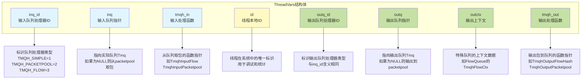
```mermaid
graph TB
    subgraph ThreadVars结构体
        A[inq_id<br/>输入队列处理器ID]
        B[inq<br/>输入队列指针]
        C[tmqh_in<br/>输入处理函数]
        D[id<br/>线程本地ID]
        E[outq_id<br/>输出队列处理器ID]
        F[outq<br/>输出队列指针]
        G[outctx<br/>输出上下文]
        H[tmqh_out<br/>输出处理函数]
    end

    A --> A1[标识队列处理器类型<br/>TMQH_SIMPLE=1<br/>TMQH_PACKETPOOL=2<br/>TMQH_FLOW=3]
    B --> B1[指向实际队列Tmq<br/>如果为NULL则从packetpool取包]
    C --> C1[从队列取包的函数指针<br/>如TmqhInputFlow<br/>TmqhInputPacketpool]
    D --> D1[线程在系统中的唯一标识<br/>用于调试和统计]
    E --> E1[标识输出队列处理器类型<br/>与inq_id含义相同]
    F --> F1[指向输出队列Tmq<br/>如果为NULL则输出到packetpool]
    G --> G1[特殊队列的上下文数据<br/>如FlowQueue的TmqhFlowCtx]
    H --> H1[输出包到队列的函数指针<br/>如TmqhOutputFlowHash<br/>TmqhOutputPacketpool]

    style A fill:#e1f5ff
    style B fill:#e1f5ff
    style C fill:#e1f5ff
    style E fill:#c5e1a5
    style F fill:#c5e1a5
    style G fill:#c5e1a5
    style H fill:#c5e1a5
    style D fill:#fff9c4
```

### 2.2 字段分组说明

| 字段分组 | 字段名 | 类型 | 作用描述 |
|---------|--------|------|---------|
| **输入队列组** | `inq_id` | `uint8_t` | 输入队列处理器的类型ID（SIMPLE/PACKETPOOL/FLOW） |
| | `inq` | `Tmq*` | 指向输入队列结构的指针 |
| | `tmqh_in` | 函数指针 | 从输入队列取包的处理函数 |
| **输出队列组** | `outq_id` | `uint8_t` | 输出队列处理器的类型ID |
| | `outq` | `Tmq*` | 指向输出队列结构的指针 |
| | `outctx` | `void*` | 输出队列的上下文数据（用于复杂队列） |
| | `tmqh_out` | 函数指针 | 输出包到队列的处理函数 |
| **线程标识** | `id` | `int` | 线程的本地唯一标识符 |

## 三、数据包处理流程中的作用

### 3.1 单线程内的数据包流动

#### 3.1.1 完整流程图（上游→当前→下游）

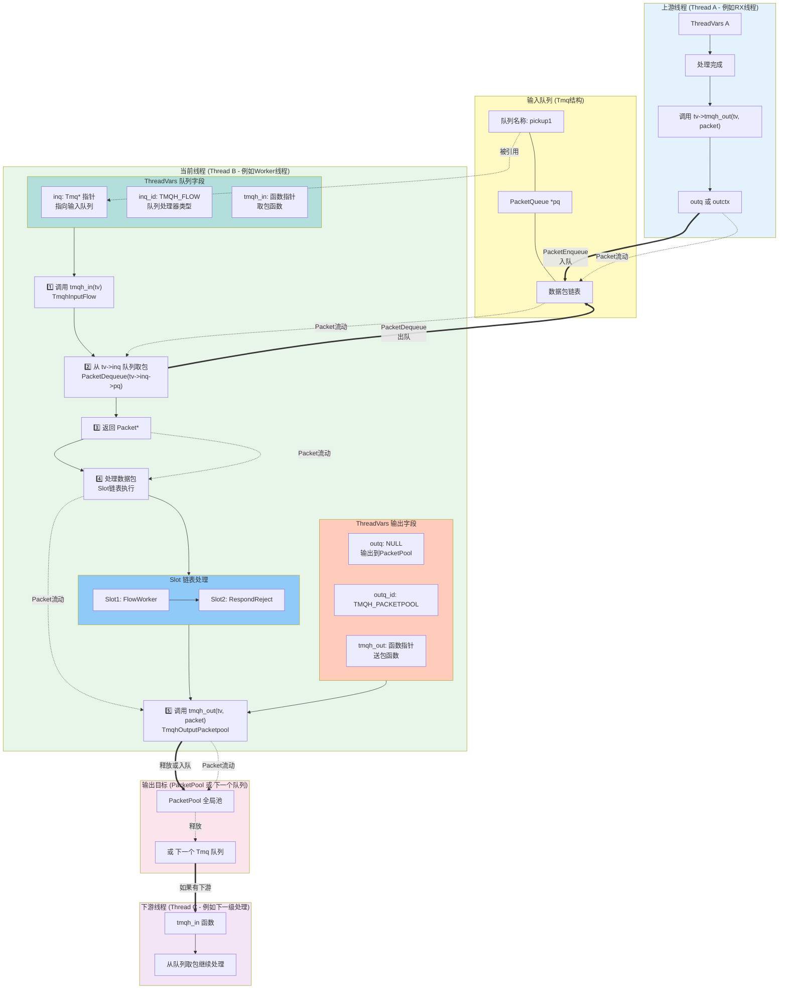
```mermaid
flowchart TB
    subgraph UP["上游线程 (Thread A - 例如RX线程)"]
        direction TB
        UP1[ThreadVars A]
        UP2[处理完成]
        UP3["调用 tv->tmqh_out(tv, packet)"]
        UP4["outq 或 outctx"]

        UP1 --> UP2 --> UP3 --> UP4
    end

    subgraph Q1["输入队列 (Tmq结构)"]
        direction TB
        Q1A["队列名称: pickup1"]
        Q1B["PacketQueue *pq"]
        Q1C["数据包链表"]

        Q1A --- Q1B --- Q1C
    end

    subgraph CURRENT["当前线程 (Thread B - 例如Worker线程)"]
        direction TB

        subgraph CURRENT_FIELDS["ThreadVars 队列字段"]
            direction LR
            C1["inq: Tmq* 指针<br/>指向输入队列"]
            C2["inq_id: TMQH_FLOW<br/>队列处理器类型"]
            C3["tmqh_in: 函数指针<br/>取包函数"]
        end

        C4["1️⃣ 调用 tmqh_in(tv)<br/>TmqhInputFlow"]
        C5["2️⃣ 从 tv->inq 队列取包<br/>PacketDequeue(tv->inq->pq)"]
        C6["3️⃣ 返回 Packet*"]
        C7["4️⃣ 处理数据包<br/>Slot链表执行"]

        subgraph SLOTS["Slot 链表处理"]
            direction LR
            S1[Slot1: FlowWorker] --> S2[Slot2: RespondReject]
        end

        C8["5️⃣ 调用 tmqh_out(tv, packet)<br/>TmqhOutputPacketpool"]

        subgraph CURRENT_OUT["ThreadVars 输出字段"]
            direction LR
            C9["outq: NULL<br/>输出到PacketPool"]
            C10["outq_id: TMQH_PACKETPOOL"]
            C11["tmqh_out: 函数指针<br/>送包函数"]
        end

        CURRENT_FIELDS --> C4
        C4 --> C5
        C5 --> C6
        C6 --> C7
        C7 --> SLOTS
        SLOTS --> C8
        CURRENT_OUT --> C8
    end

    subgraph Q2["输出目标 (PacketPool 或 下一个队列)"]
        direction TB
        Q2A["PacketPool 全局池"]
        Q2B["或 下一个 Tmq 队列"]

        Q2A -.释放.-> Q2B
    end

    subgraph DOWN["下游线程 (Thread C - 例如下一级处理)"]
        direction TB
        DOWN1["tmqh_in 函数"]
        DOWN2["从队列取包继续处理"]

        DOWN1 --> DOWN2
    end

    %% 连接关系
    UP4 ==>|"PacketEnqueue<br/>入队"| Q1C
    Q1A -.被引用.-> C1
    C5 ==>|"PacketDequeue<br/>出队"| Q1C
    C8 ==>|"释放或入队"| Q2A
    Q2B ==>|"如果有下游"| DOWN1

    %% 数据流标注
    UP4 -.Packet流动.-> Q1C
    Q1C -.Packet流动.-> C5
    C6 -.Packet流动.-> C7
    C7 -.Packet流动.-> C8
    C8 -.Packet流动.-> Q2A

    style UP fill:#e3f2fd
    style Q1 fill:#fff9c4
    style CURRENT fill:#e8f5e9
    style Q2 fill:#fce4ec
    style DOWN fill:#f3e5f5
    style CURRENT_FIELDS fill:#b2dfdb
    style CURRENT_OUT fill:#ffccbc
    style SLOTS fill:#90caf9
```

#### 3.1.2 关键字段作用示意图

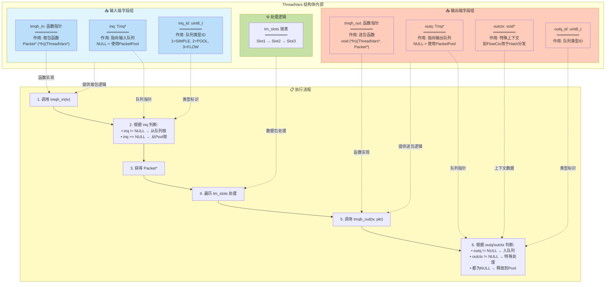
```mermaid
graph TB
    subgraph TV["ThreadVars 结构体内部"]
        direction TB

        subgraph INPUT["📥 输入端字段组"]
            I1["inq: Tmq*<br/>════════<br/>作用: 指向输入队列<br/>NULL = 使用PacketPool"]
            I2["inq_id: uint8_t<br/>════════<br/>作用: 队列类型ID<br/>1=SIMPLE, 2=POOL, 3=FLOW"]
            I3["tmqh_in: 函数指针<br/>════════<br/>作用: 取包函数<br/>Packet* (*fn)(ThreadVars*)"]
        end

        subgraph PROCESS["⚙️ 处理逻辑"]
            P1["tm_slots 链表<br/>════════<br/>Slot1 → Slot2 → Slot3"]
        end

        subgraph OUTPUT["📤 输出端字段组"]
            O1["outq: Tmq*<br/>════════<br/>作用: 指向输出队列<br/>NULL = 使用PacketPool"]
            O2["outctx: void*<br/>════════<br/>作用: 特殊上下文<br/>如FlowCtx用于Hash分发"]
            O3["outq_id: uint8_t<br/>════════<br/>作用: 队列类型ID"]
            O4["tmqh_out: 函数指针<br/>════════<br/>作用: 送包函数<br/>void (*fn)(ThreadVars*, Packet*)"]
        end
    end

    subgraph EX["📋 执行流程"]
        E1["1. 调用 tmqh_in(tv)"]
        E2["2. 根据 inq 判断:<br/>• inq != NULL → 从队列取<br/>• inq == NULL → 从Pool取"]
        E3["3. 获得 Packet*"]
        E4["4. 遍历 tm_slots 处理"]
        E5["5. 调用 tmqh_out(tv, pkt)"]
        E6["6. 根据 outq/outctx 判断:<br/>• outq != NULL → 入队列<br/>• outctx != NULL → 特殊处理<br/>• 都为NULL → 释放到Pool"]

        E1 --> E2 --> E3 --> E4 --> E5 --> E6
    end

    INPUT -.提供取包逻辑.-> E1
    I1 -.队列指针.-> E2
    I2 -.类型标识.-> E2
    I3 -.函数实现.-> E1

    PROCESS -.数据包处理.-> E4

    OUTPUT -.提供送包逻辑.-> E5
    O1 -.队列指针.-> E6
    O2 -.上下文数据.-> E6
    O3 -.类型标识.-> E6
    O4 -.函数实现.-> E5

    style INPUT fill:#e1f5ff
    style PROCESS fill:#c5e1a5
    style OUTPUT fill:#ffccbc
    style EX fill:#fff9c4
    style I1 fill:#bbdefb
    style I2 fill:#bbdefb
    style I3 fill:#bbdefb
    style O1 fill:#ffccbc
    style O2 fill:#ffccbc
    style O3 fill:#ffccbc
    style O4 fill:#ffccbc
```

#### 3.1.3 数据包生命周期视图

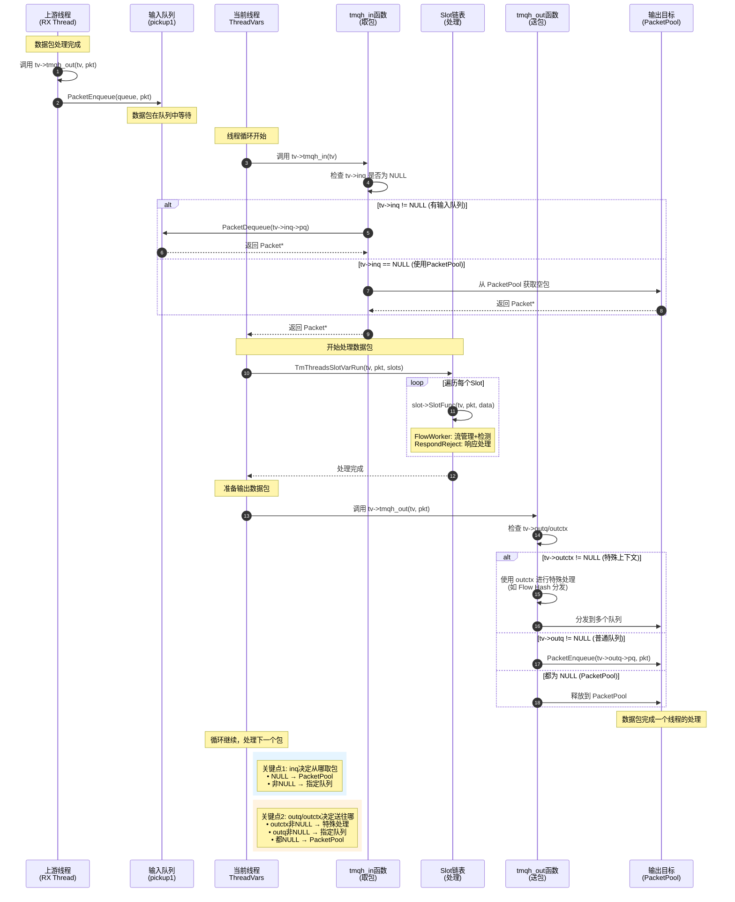
```mermaid
sequenceDiagram
    autonumber
    participant UpThread as 上游线程<br/>(RX Thread)
    participant InputQ as 输入队列<br/>(pickup1)
    participant CurrentTV as 当前线程<br/>ThreadVars
    participant InHandler as tmqh_in函数<br/>(取包)
    participant Slots as Slot链表<br/>(处理)
    participant OutHandler as tmqh_out函数<br/>(送包)
    participant OutputQ as 输出目标<br/>(PacketPool)

    Note over UpThread: 数据包处理完成
    UpThread->>UpThread: 调用 tv->tmqh_out(tv, pkt)
    UpThread->>InputQ: PacketEnqueue(queue, pkt)
    Note over InputQ: 数据包在队列中等待

    Note over CurrentTV: 线程循环开始
    CurrentTV->>InHandler: 调用 tv->tmqh_in(tv)
    InHandler->>InHandler: 检查 tv->inq 是否为 NULL

    alt tv->inq != NULL (有输入队列)
        InHandler->>InputQ: PacketDequeue(tv->inq->pq)
        InputQ-->>InHandler: 返回 Packet*
    else tv->inq == NULL (使用PacketPool)
        InHandler->>OutputQ: 从 PacketPool 获取空包
        OutputQ-->>InHandler: 返回 Packet*
    end

    InHandler-->>CurrentTV: 返回 Packet*

    Note over CurrentTV,Slots: 开始处理数据包
    CurrentTV->>Slots: TmThreadsSlotVarRun(tv, pkt, slots)

    loop 遍历每个Slot
        Slots->>Slots: slot->SlotFunc(tv, pkt, data)
        Note over Slots: FlowWorker: 流管理+检测<br/>RespondReject: 响应处理
    end

    Slots-->>CurrentTV: 处理完成

    Note over CurrentTV: 准备输出数据包
    CurrentTV->>OutHandler: 调用 tv->tmqh_out(tv, pkt)
    OutHandler->>OutHandler: 检查 tv->outq/outctx

    alt tv->outctx != NULL (特殊上下文)
        OutHandler->>OutHandler: 使用 outctx 进行特殊处理<br/>(如 Flow Hash 分发)
        OutHandler->>OutputQ: 分发到多个队列
    else tv->outq != NULL (普通队列)
        OutHandler->>OutputQ: PacketEnqueue(tv->outq->pq, pkt)
    else 都为 NULL (PacketPool)
        OutHandler->>OutputQ: 释放到 PacketPool
    end

    Note over OutputQ: 数据包完成一个线程的处理
    Note over CurrentTV: 循环继续，处理下一个包

    rect rgb(230, 245, 255)
        Note right of CurrentTV: 关键点1: inq决定从哪取包<br/>• NULL → PacketPool<br/>• 非NULL → 指定队列
    end

    rect rgb(255, 243, 224)
        Note right of CurrentTV: 关键点2: outq/outctx决定送往哪<br/>• outctx非NULL → 特殊处理<br/>• outq非NULL → 指定队列<br/>• 都NULL → PacketPool
    end
```

#### 3.1.4 三种典型场景对比


```mermaid
graph TB
    subgraph S1["场景1: Single/Workers模式"]
        direction LR
        S1A["PacketPool"] -->|tmqh_in<br/>取空包| S1B["ThreadVars<br/>inq=NULL<br/>outq=NULL"]
        S1B -->|Slot处理| S1C["Receive→Decode<br/>→FlowWorker"]
        S1C -->|tmqh_out<br/>释放| S1A
    end

    subgraph S2["场景2: AutoFP - RX线程"]
        direction LR
        S2A["PacketPool"] -->|tmqh_in<br/>取空包| S2B["ThreadVars<br/>inq=NULL<br/>outctx=FlowCtx"]
        S2B -->|Slot处理| S2C["Receive→Decode"]
        S2C -->|tmqh_out<br/>FlowHash| S2D["pickup队列<br/>1,2,3...N"]
    end

    subgraph S3["场景3: AutoFP - Worker线程"]
        direction LR
        S3A["pickup1队列"] -->|tmqh_in<br/>取包| S3B["ThreadVars<br/>inq=pickup1<br/>outq=NULL"]
        S3B -->|Slot处理| S3C["FlowWorker<br/>→Respond"]
        S3C -->|tmqh_out<br/>释放| S3D["PacketPool"]
    end

    style S1 fill:#fff9c4
    style S2 fill:#e1f5ff
    style S3 fill:#c5e1a5
    style S1B fill:#ffeb3b
    style S2B fill:#ffeb3b
    style S3B fill:#ffeb3b
```

### 3.2 不同运行模式下的队列配置

#### 3.2.1 Single 模式

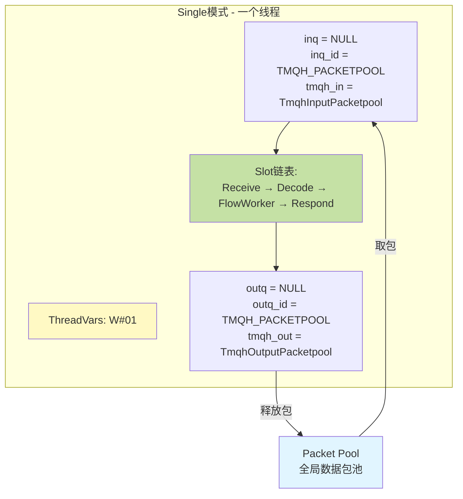
```mermaid
graph TB
    subgraph "Single模式 - 一个线程"
        Thread[ThreadVars: W#01]

        InQ["inq = NULL<br/>inq_id = TMQH_PACKETPOOL<br/>tmqh_in = TmqhInputPacketpool"]

        Slots["Slot链表:<br/>Receive → Decode → FlowWorker → Respond"]

        OutQ["outq = NULL<br/>outq_id = TMQH_PACKETPOOL<br/>tmqh_out = TmqhOutputPacketpool"]
    end

    Pool[Packet Pool<br/>全局数据包池]

    Pool -->|取包| InQ
    InQ --> Slots
    Slots --> OutQ
    OutQ -->|释放包| Pool

    style Thread fill:#fff9c4
    style Pool fill:#e1f5ff
    style Slots fill:#c5e1a5
```

**特点：**
- `inq = NULL`，`outq = NULL`：不使用队列，直接从/到 Packet Pool
- `inq_id = outq_id = TMQH_PACKETPOOL`：使用 Packet Pool 处理器
- 单线程内串行处理所有模块

#### 3.2.2 AutoFP 模式 - RX 线程

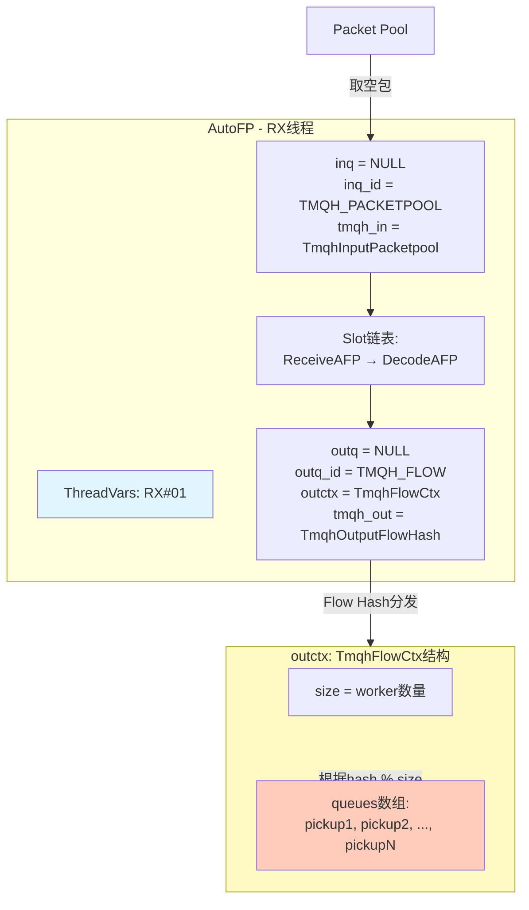
```mermaid
graph TB
    subgraph "AutoFP - RX线程"
        RXThread[ThreadVars: RX#01]

        RXInQ["inq = NULL<br/>inq_id = TMQH_PACKETPOOL<br/>tmqh_in = TmqhInputPacketpool"]

        RXSlots["Slot链表:<br/>ReceiveAFP → DecodeAFP"]

        RXOutQ["outq = NULL<br/>outq_id = TMQH_FLOW<br/>outctx = TmqhFlowCtx<br/>tmqh_out = TmqhOutputFlowHash"]
    end

    Pool[Packet Pool]

    subgraph FlowCtx["outctx: TmqhFlowCtx结构"]
        Size[size = worker数量]
        Queues["queues数组:<br/>pickup1, pickup2, ..., pickupN"]
    end

    Pool -->|取空包| RXInQ
    RXInQ --> RXSlots
    RXSlots --> RXOutQ
    RXOutQ -->|Flow Hash分发| FlowCtx
    FlowCtx -->|根据hash % size| Queues

    style RXThread fill:#e1f5ff
    style FlowCtx fill:#fff9c4
    style Queues fill:#ffccbc
```

**特点：**
- `inq = NULL`：从 Packet Pool 取空包
- `outq = NULL`，但 `outctx != NULL`：使用 Flow 上下文进行分发
- `outq_id = TMQH_FLOW`：使用 Flow Hash 处理器
- `tmqh_out = TmqhOutputFlowHash`：根据 Flow 五元组哈希分发到不同 Worker 队列

#### 3.2.3 AutoFP 模式 - Worker 线程

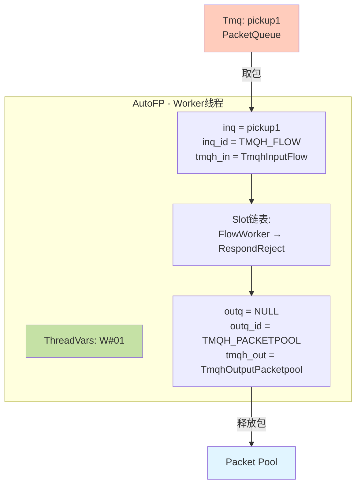
```mermaid
graph TB
    subgraph "AutoFP - Worker线程"
        WorkerThread[ThreadVars: W#01]

        WorkerInQ["inq = pickup1<br/>inq_id = TMQH_FLOW<br/>tmqh_in = TmqhInputFlow"]

        WorkerSlots["Slot链表:<br/>FlowWorker → RespondReject"]

        WorkerOutQ["outq = NULL<br/>outq_id = TMQH_PACKETPOOL<br/>tmqh_out = TmqhOutputPacketpool"]
    end

    Pickup1[Tmq: pickup1<br/>PacketQueue]
    Pool[Packet Pool]

    Pickup1 -->|取包| WorkerInQ
    WorkerInQ --> WorkerSlots
    WorkerSlots --> WorkerOutQ
    WorkerOutQ -->|释放包| Pool

    style WorkerThread fill:#c5e1a5
    style Pickup1 fill:#ffccbc
    style Pool fill:#e1f5ff
```

**特点：**
- `inq = pickup1`：从专属的 pickup 队列取包
- `inq_id = TMQH_FLOW`：使用 Flow 输入处理器
- `outq = NULL`：处理完成后释放回 Packet Pool
- 每个 Worker 绑定到独立的 pickup 队列

#### 3.2.4 Workers 模式

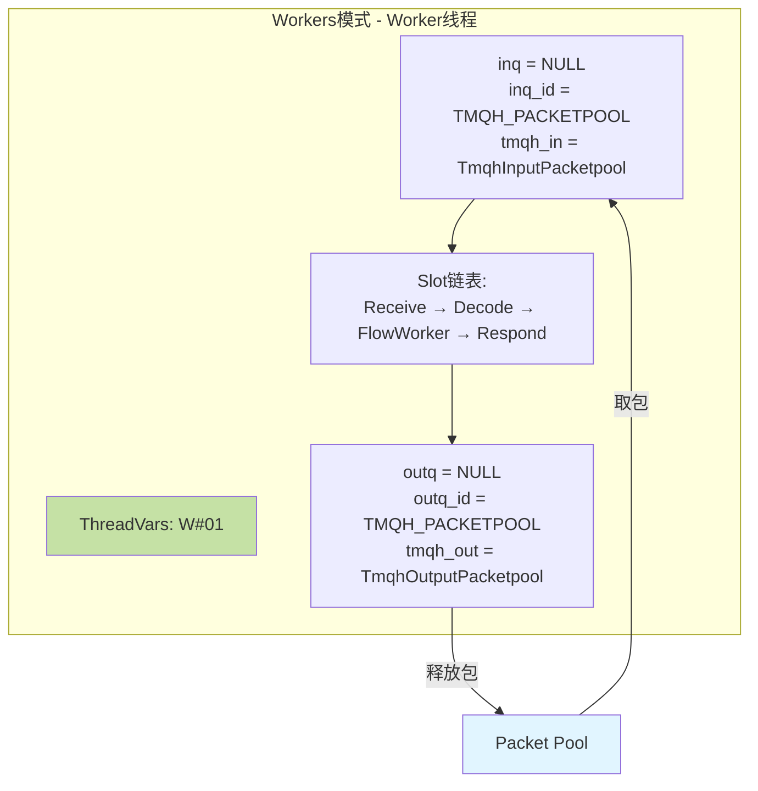
```mermaid
graph TB
    subgraph "Workers模式 - Worker线程"
        WorkerThread[ThreadVars: W#01]

        WorkerInQ["inq = NULL<br/>inq_id = TMQH_PACKETPOOL<br/>tmqh_in = TmqhInputPacketpool"]

        WorkerSlots["Slot链表:<br/>Receive → Decode → FlowWorker → Respond"]

        WorkerOutQ["outq = NULL<br/>outq_id = TMQH_PACKETPOOL<br/>tmqh_out = TmqhOutputPacketpool"]
    end

    Pool[Packet Pool]

    Pool -->|取包| WorkerInQ
    WorkerInQ --> WorkerSlots
    WorkerSlots --> WorkerOutQ
    WorkerOutQ -->|释放包| Pool

    style WorkerThread fill:#c5e1a5
    style Pool fill:#e1f5ff
```

**特点：**
- 与 Single 模式类似，但有多个并行的 Worker 线程
- 每个 Worker 独立完成全流程
- 所有队列字段都指向 Packet Pool

## 四、队列字段的初始化过程

### 4.1 初始化流程详解

#### 4.1.1 输入队列初始化流程图

**代码位置：** [src/tm-threads.c:975-1004](../src/tm-threads.c#L975-L1004)

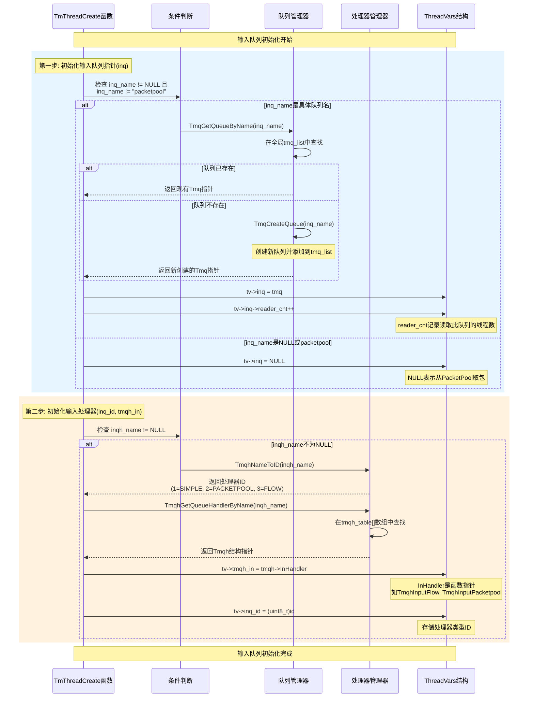
```mermaid
sequenceDiagram
    participant Func as TmThreadCreate函数
    participant Check as 条件判断
    participant QMgr as 队列管理器
    participant HMgr as 处理器管理器
    participant TV as ThreadVars结构

    Note over Func,TV: 输入队列初始化开始

    rect rgb(230, 245, 255)
        Note over Func: 第一步: 初始化输入队列指针(inq)
        Func->>Check: 检查 inq_name != NULL 且<br/>inq_name != "packetpool"

        alt inq_name是具体队列名
            Check->>QMgr: TmqGetQueueByName(inq_name)
            QMgr->>QMgr: 在全局tmq_list中查找

            alt 队列已存在
                QMgr-->>Func: 返回现有Tmq指针
            else 队列不存在
                QMgr->>QMgr: TmqCreateQueue(inq_name)
                Note over QMgr: 创建新队列并添加到tmq_list
                QMgr-->>Func: 返回新创建的Tmq指针
            end

            Func->>TV: tv->inq = tmq
            Func->>TV: tv->inq->reader_cnt++
            Note over TV: reader_cnt记录读取此队列的线程数
        else inq_name是NULL或packetpool
            Func->>TV: tv->inq = NULL
            Note over TV: NULL表示从PacketPool取包
        end
    end

    rect rgb(255, 243, 224)
        Note over Func: 第二步: 初始化输入处理器(inq_id, tmqh_in)
        Func->>Check: 检查 inqh_name != NULL

        alt inqh_name不为NULL
            Check->>HMgr: TmqhNameToID(inqh_name)
            HMgr-->>Func: 返回处理器ID<br/>(1=SIMPLE, 2=PACKETPOOL, 3=FLOW)

            Func->>HMgr: TmqhGetQueueHandlerByName(inqh_name)
            HMgr->>HMgr: 在tmqh_table[]数组中查找
            HMgr-->>Func: 返回Tmqh结构指针

            Func->>TV: tv->tmqh_in = tmqh->InHandler
            Note over TV: InHandler是函数指针<br/>如TmqhInputFlow, TmqhInputPacketpool

            Func->>TV: tv->inq_id = (uint8_t)id
            Note over TV: 存储处理器类型ID
        end
    end

    Note over Func,TV: 输入队列初始化完成
```

**关键点说明：**
1. **队列指针初始化（行975-989）**：先设置 `tv->inq`，如果是具体队列名则创建/查找队列
2. **处理器初始化（行990-1004）**：后设置 `tv->inq_id` 和 `tv->tmqh_in`
3. **reader_cnt 计数器**：每个线程读取队列时递增，用于调试和监控

#### 4.1.2 输出队列初始化流程图

**代码位置：** [src/tm-threads.c:1007-1044](../src/tm-threads.c#L1007-L1044)

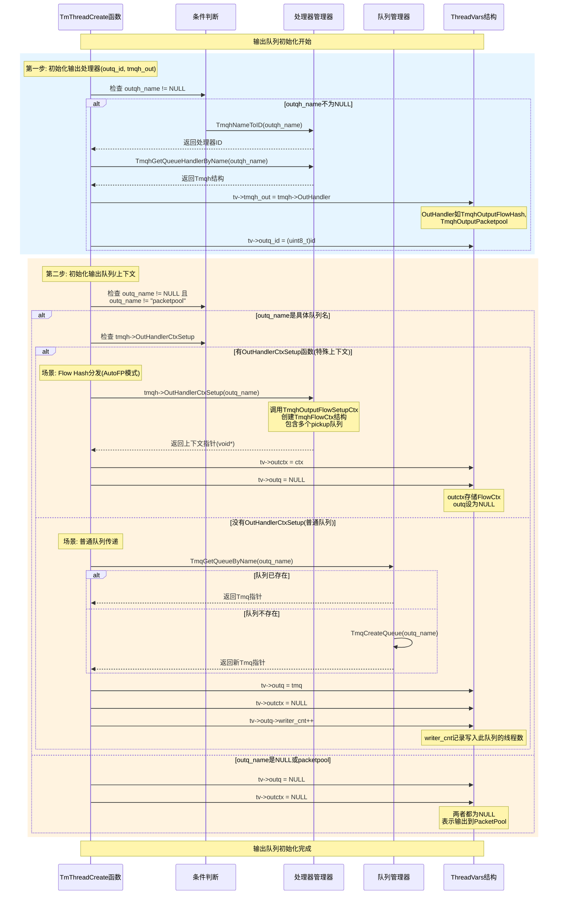
```mermaid
sequenceDiagram
    participant Func as TmThreadCreate函数
    participant Check as 条件判断
    participant HMgr as 处理器管理器
    participant QMgr as 队列管理器
    participant TV as ThreadVars结构

    Note over Func,TV: 输出队列初始化开始

    rect rgb(230, 245, 255)
        Note over Func: 第一步: 初始化输出处理器(outq_id, tmqh_out)
        Func->>Check: 检查 outqh_name != NULL

        alt outqh_name不为NULL
            Check->>HMgr: TmqhNameToID(outqh_name)
            HMgr-->>Func: 返回处理器ID

            Func->>HMgr: TmqhGetQueueHandlerByName(outqh_name)
            HMgr-->>Func: 返回Tmqh结构

            Func->>TV: tv->tmqh_out = tmqh->OutHandler
            Note over TV: OutHandler如TmqhOutputFlowHash,<br/>TmqhOutputPacketpool

            Func->>TV: tv->outq_id = (uint8_t)id
        end
    end

    rect rgb(255, 243, 224)
        Note over Func: 第二步: 初始化输出队列/上下文
        Func->>Check: 检查 outq_name != NULL 且<br/>outq_name != "packetpool"

        alt outq_name是具体队列名
            Func->>Check: 检查 tmqh->OutHandlerCtxSetup

            alt 有OutHandlerCtxSetup函数(特殊上下文)
                Note over Func: 场景: Flow Hash分发(AutoFP模式)
                Func->>HMgr: tmqh->OutHandlerCtxSetup(outq_name)
                Note over HMgr: 调用TmqhOutputFlowSetupCtx<br/>创建TmqhFlowCtx结构<br/>包含多个pickup队列

                HMgr-->>Func: 返回上下文指针(void*)

                Func->>TV: tv->outctx = ctx
                Func->>TV: tv->outq = NULL
                Note over TV: outctx存储FlowCtx<br/>outq设为NULL

            else 没有OutHandlerCtxSetup(普通队列)
                Note over Func: 场景: 普通队列传递
                Func->>QMgr: TmqGetQueueByName(outq_name)

                alt 队列已存在
                    QMgr-->>Func: 返回Tmq指针
                else 队列不存在
                    QMgr->>QMgr: TmqCreateQueue(outq_name)
                    QMgr-->>Func: 返回新Tmq指针
                end

                Func->>TV: tv->outq = tmq
                Func->>TV: tv->outctx = NULL
                Func->>TV: tv->outq->writer_cnt++
                Note over TV: writer_cnt记录写入此队列的线程数
            end

        else outq_name是NULL或packetpool
            Func->>TV: tv->outq = NULL
            Func->>TV: tv->outctx = NULL
            Note over TV: 两者都为NULL<br/>表示输出到PacketPool
        end
    end

    Note over Func,TV: 输出队列初始化完成
```

**关键点说明：**
1. **处理器先初始化（行1007-1020）**：先设置 `tv->outq_id` 和 `tv->tmqh_out`
2. **队列/上下文后初始化（行1022-1043）**：根据情况设置 `tv->outq` 或 `tv->outctx`
3. **特殊上下文场景**：Flow Queue 使用 `outctx`，包含多个队列的引用
4. **互斥关系**：`outq` 和 `outctx` 只有一个非 NULL

#### 4.1.3 初始化逻辑决策树

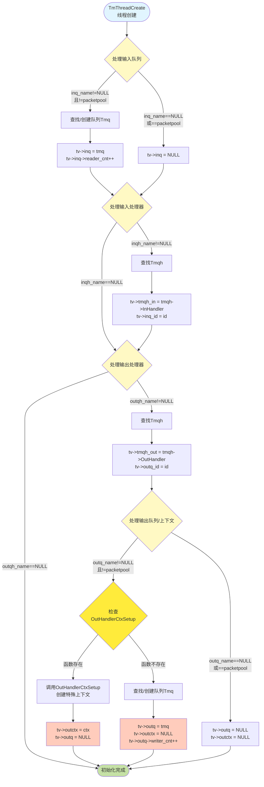
```mermaid
flowchart TD
    Start([TmThreadCreate<br/>线程创建])

    Start --> InQ{处理输入队列}

    InQ -->|inq_name!=NULL<br/>且!=packetpool| InQ1[查找/创建队列Tmq]
    InQ1 --> InQ2[tv->inq = tmq<br/>tv->inq->reader_cnt++]

    InQ -->|inq_name==NULL<br/>或==packetpool| InQ3[tv->inq = NULL]

    InQ2 --> InH{处理输入处理器}
    InQ3 --> InH

    InH -->|inqh_name!=NULL| InH1[查找Tmqh]
    InH1 --> InH2[tv->tmqh_in = tmqh->InHandler<br/>tv->inq_id = id]

    InH -->|inqh_name==NULL| OutQ

    InH2 --> OutQ{处理输出处理器}

    OutQ -->|outqh_name!=NULL| OutQ1[查找Tmqh]
    OutQ1 --> OutQ2[tv->tmqh_out = tmqh->OutHandler<br/>tv->outq_id = id]

    OutQ -->|outqh_name==NULL| Done

    OutQ2 --> OutCtx{处理输出队列/上下文}

    OutCtx -->|outq_name!=NULL<br/>且!=packetpool| CheckSetup{检查<br/>OutHandlerCtxSetup}

    CheckSetup -->|函数存在| Ctx1[调用OutHandlerCtxSetup<br/>创建特殊上下文]
    Ctx1 --> Ctx2[tv->outctx = ctx<br/>tv->outq = NULL]

    CheckSetup -->|函数不存在| Q1[查找/创建队列Tmq]
    Q1 --> Q2[tv->outq = tmq<br/>tv->outctx = NULL<br/>tv->outq->writer_cnt++]

    OutCtx -->|outq_name==NULL<br/>或==packetpool| OutQ3[tv->outq = NULL<br/>tv->outctx = NULL]

    Ctx2 --> Done([初始化完成])
    Q2 --> Done
    OutQ3 --> Done

    style Start fill:#e1f5ff
    style Done fill:#c5e1a5
    style InQ fill:#fff9c4
    style InH fill:#fff9c4
    style OutQ fill:#fff9c4
    style OutCtx fill:#fff9c4
    style CheckSetup fill:#ffeb3b
    style Ctx2 fill:#ffccbc
    style Q2 fill:#ffccbc
```

#### 4.1.4 典型初始化场景示例

##### 场景1: AutoFP RX 线程初始化

```c
// 代码调用
ThreadVars *tv = TmThreadCreatePacketHandler(
    "RX#01",         // 线程名
    "packetpool",    // inq_name
    "packetpool",    // inqh_name
    "pickup1,pickup2,...", // outq_name
    "flow",          // outqh_name
    "pktacqloop"
);
```

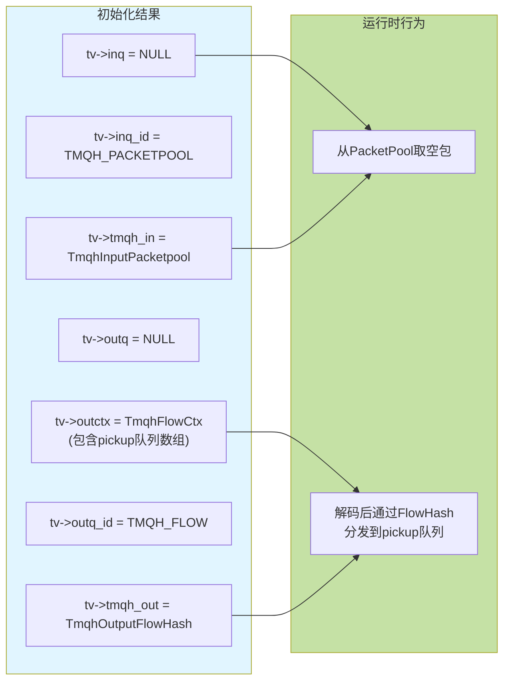
```mermaid
graph LR
    subgraph Init["初始化结果"]
        A["tv->inq = NULL"]
        B["tv->inq_id = TMQH_PACKETPOOL"]
        C["tv->tmqh_in = TmqhInputPacketpool"]
        D["tv->outq = NULL"]
        E["tv->outctx = TmqhFlowCtx<br/>(包含pickup队列数组)"]
        F["tv->outq_id = TMQH_FLOW"]
        G["tv->tmqh_out = TmqhOutputFlowHash"]
    end

    subgraph Behavior["运行时行为"]
        H["从PacketPool取空包"]
        I["解码后通过FlowHash<br/>分发到pickup队列"]
    end

    A --> H
    C --> H
    E --> I
    G --> I

    style Init fill:#e1f5ff
    style Behavior fill:#c5e1a5
```

##### 场景2: AutoFP Worker 线程初始化

```c
// 代码调用
ThreadVars *tv = TmThreadCreatePacketHandler(
    "W#01",          // 线程名
    "pickup1",       // inq_name
    "flow",          // inqh_name
    "packetpool",    // outq_name
    "packetpool",    // outqh_name
    "pktacqloop"
);
```

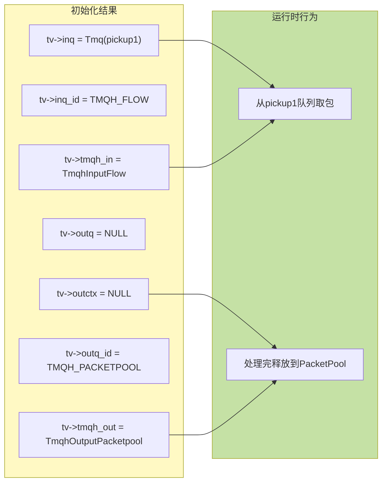
```mermaid
graph LR
    subgraph Init["初始化结果"]
        A["tv->inq = Tmq(pickup1)"]
        B["tv->inq_id = TMQH_FLOW"]
        C["tv->tmqh_in = TmqhInputFlow"]
        D["tv->outq = NULL"]
        E["tv->outctx = NULL"]
        F["tv->outq_id = TMQH_PACKETPOOL"]
        G["tv->tmqh_out = TmqhOutputPacketpool"]
    end

    subgraph Behavior["运行时行为"]
        H["从pickup1队列取包"]
        I["处理完释放到PacketPool"]
    end

    A --> H
    C --> H
    E --> I
    G --> I

    style Init fill:#fff9c4
    style Behavior fill:#c5e1a5
```

##### 场景3: Single/Workers 模式线程初始化

```c
// 代码调用
ThreadVars *tv = TmThreadCreatePacketHandler(
    "W#01",          // 线程名
    "packetpool",    // inq_name
    "packetpool",    // inqh_name
    "packetpool",    // outq_name
    "packetpool",    // outqh_name
    "pktacqloop"
);
```

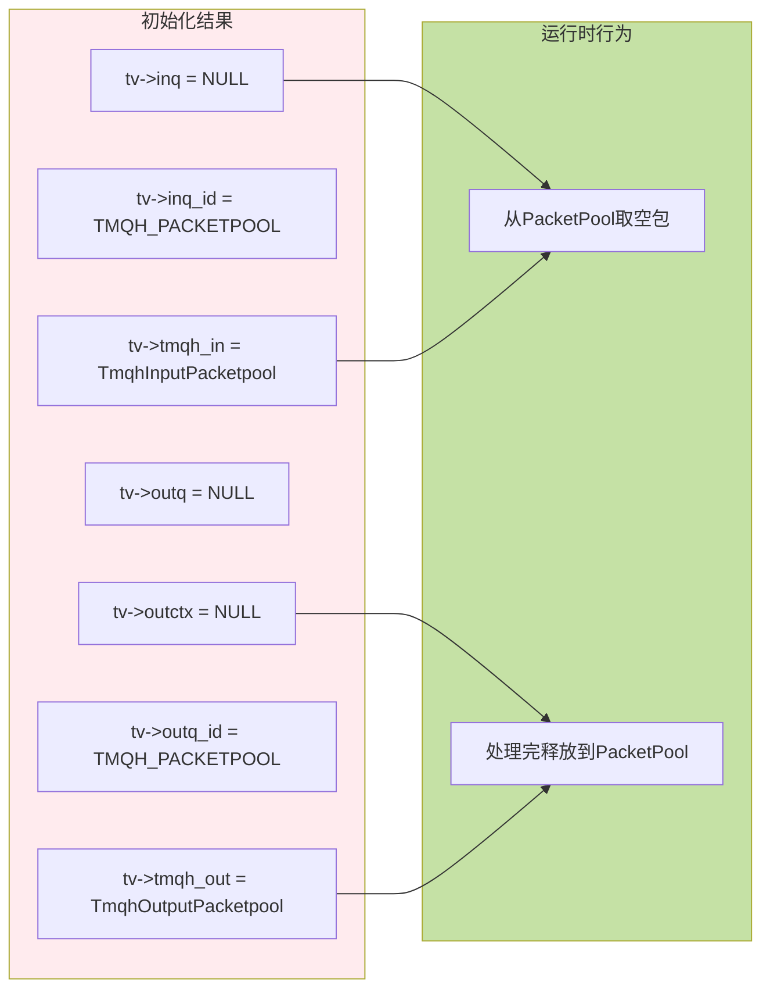
```mermaid
graph LR
    subgraph Init["初始化结果"]
        A["tv->inq = NULL"]
        B["tv->inq_id = TMQH_PACKETPOOL"]
        C["tv->tmqh_in = TmqhInputPacketpool"]
        D["tv->outq = NULL"]
        E["tv->outctx = NULL"]
        F["tv->outq_id = TMQH_PACKETPOOL"]
        G["tv->tmqh_out = TmqhOutputPacketpool"]
    end

    subgraph Behavior["运行时行为"]
        H["从PacketPool取空包"]
        I["处理完释放到PacketPool"]
    end

    A --> H
    C --> H
    E --> I
    G --> I

    style Init fill:#ffebee
    style Behavior fill:#c5e1a5
```

### 4.2 初始化代码逻辑

```c
// 初始化输入队列
if (inqh_name != NULL) {
    tmqh = TmqhGetQueueHandlerByName(inqh_name);
    tv->tmqh_in = tmqh->InHandler;        // 设置输入处理函数
    tv->inq_id = (uint8_t)id;             // 设置队列处理器ID

    if (inq_name != NULL && strcmp(inq_name, "packetpool") != 0) {
        tmq = TmqGetQueueByName(inq_name);
        tv->inq = tmq;                     // 设置输入队列指针
    }
}

// 初始化输出队列
if (outqh_name != NULL) {
    tmqh = TmqhGetQueueHandlerByName(outqh_name);
    tv->tmqh_out = tmqh->OutHandler;      // 设置输出处理函数
    tv->outq_id = (uint8_t)id;            // 设置队列处理器ID

    if (outq_name != NULL && strcmp(outq_name, "packetpool") != 0) {
        if (tmqh->OutHandlerCtxSetup != NULL) {
            tv->outctx = tmqh->OutHandlerCtxSetup(outq_name);  // 特殊上下文
            tv->outq = NULL;
        } else {
            tmq = TmqGetQueueByName(outq_name);
            tv->outq = tmq;                // 普通队列指针
            tv->outctx = NULL;
        }
    }
}
```

## 五、实际使用示例

### 5.1 从输入队列取包

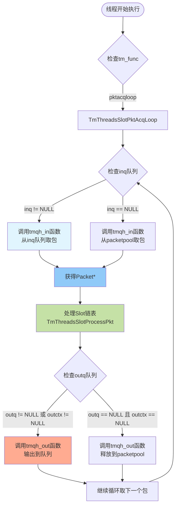
```mermaid
flowchart TD
    Start([线程开始执行]) --> CheckFunc{检查tm_func}
    CheckFunc -->|pktacqloop| AcqLoop[TmThreadsSlotPktAcqLoop]

    AcqLoop --> CheckInQ{检查inq队列}

    CheckInQ -->|inq != NULL| CallInHandler[调用tmqh_in函数<br/>从inq队列取包]
    CheckInQ -->|inq == NULL| CallPoolHandler[调用tmqh_in函数<br/>从packetpool取包]

    CallInHandler --> GetPacket[获得Packet*]
    CallPoolHandler --> GetPacket

    GetPacket --> ProcessSlots[处理Slot链表<br/>TmThreadsSlotProcessPkt]
    ProcessSlots --> CheckOutQ{检查outq队列}

    CheckOutQ -->|outq != NULL 或 outctx != NULL| CallOutHandler[调用tmqh_out函数<br/>输出到队列]
    CheckOutQ -->|outq == NULL 且 outctx == NULL| CallPoolOut[调用tmqh_out函数<br/>释放到packetpool]

    CallOutHandler --> Loop[继续循环取下一个包]
    CallPoolOut --> Loop
    Loop --> CheckInQ

    style GetPacket fill:#90caf9
    style ProcessSlots fill:#c5e1a5
    style CallInHandler fill:#e1f5ff
    style CallOutHandler fill:#ffab91
```

### 5.2 三种队列处理器的使用

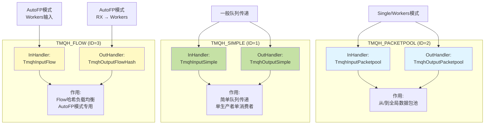
```mermaid
graph TB
    subgraph "TMQH_PACKETPOOL (ID=2)"
        PP1[InHandler:<br/>TmqhInputPacketpool]
        PP2[OutHandler:<br/>TmqhOutputPacketpool]
        PP3[作用:<br/>从/到全局数据包池]
        PP1 --> PP3
        PP2 --> PP3
    end

    subgraph "TMQH_SIMPLE (ID=1)"
        S1[InHandler:<br/>TmqhInputSimple]
        S2[OutHandler:<br/>TmqhOutputSimple]
        S3[作用:<br/>简单队列传递<br/>单生产者单消费者]
        S1 --> S3
        S2 --> S3
    end

    subgraph "TMQH_FLOW (ID=3)"
        F1[InHandler:<br/>TmqhInputFlow]
        F2[OutHandler:<br/>TmqhOutputFlowHash]
        F3[作用:<br/>Flow哈希负载均衡<br/>AutoFP模式专用]
        F1 --> F3
        F2 --> F3
    end

    Usage1[Single/Workers模式] --> PP1
    Usage1 --> PP2

    Usage2[一般队列传递] --> S1
    Usage2 --> S2

    Usage3[AutoFP模式<br/>RX → Workers] --> F2
    Usage4[AutoFP模式<br/>Workers输入] --> F1

    style PP1 fill:#e1f5ff
    style PP2 fill:#e1f5ff
    style S1 fill:#c5e1a5
    style S2 fill:#c5e1a5
    style F1 fill:#fff9c4
    style F2 fill:#fff9c4
```

## 六、关键代码片段分析

### 6.1 AutoFP 模式 RX 线程输出

**代码位置：** [src/util-runmodes.c:88-247](../src/util-runmodes.c#L88-L247)

```c
// 创建 RX 线程（AutoFP 模式）
char *outputs = RunmodeAutoFpCreatePickupQueuesString(thread_max);
// outputs = "pickup1,pickup2,pickup3,...,pickupN"

ThreadVars *tv_receive = TmThreadCreatePacketHandler(
    thread_name,
    "packetpool",    // inq_name: 从 packetpool 取空包
    "packetpool",    // inqh_name: 使用 TMQH_PACKETPOOL
    outputs,         // outq_name: "pickup1,pickup2,..."
    "flow",          // outqh_name: 使用 TMQH_FLOW (Flow Hash)
    "pktacqloop"
);

// 结果：
// tv_receive->inq = NULL
// tv_receive->inq_id = TMQH_PACKETPOOL
// tv_receive->tmqh_in = TmqhInputPacketpool
// tv_receive->outq = NULL
// tv_receive->outctx = TmqhFlowCtx结构（包含pickup队列数组）
// tv_receive->outq_id = TMQH_FLOW
// tv_receive->tmqh_out = TmqhOutputFlowHash
```

### 6.2 AutoFP 模式 Worker 线程输入

```c
// 创建 Worker 线程（AutoFP 模式）
for (int i = 0; i < thread_max; i++) {
    char inq_name[16];
    snprintf(inq_name, sizeof(inq_name), "pickup%d", i+1);

    ThreadVars *tv_worker = TmThreadCreatePacketHandler(
        worker_name,
        inq_name,        // inq_name: "pickup1", "pickup2", ...
        "flow",          // inqh_name: 使用 TMQH_FLOW
        "packetpool",    // outq_name: 输出到 packetpool
        "packetpool",    // outqh_name: 使用 TMQH_PACKETPOOL
        "pktacqloop"
    );

    // 结果：
    // tv_worker->inq = Tmq结构（名称为"pickup1"等）
    // tv_worker->inq_id = TMQH_FLOW
    // tv_worker->tmqh_in = TmqhInputFlow
    // tv_worker->outq = NULL
    // tv_worker->outctx = NULL
    // tv_worker->outq_id = TMQH_PACKETPOOL
    // tv_worker->tmqh_out = TmqhOutputPacketpool
}
```

### 6.3 Flow Hash 输出处理

**代码位置：** [src/tmqh-flow.c:210-245](../src/tmqh-flow.c#L210-L245)

```c
// AutoFP RX 线程调用此函数输出数据包
void TmqhOutputFlowHash(ThreadVars *t, Packet *p) {
    // 从 outctx 获取 Flow 上下文
    TmqhFlowCtx *ctx = (TmqhFlowCtx *)t->outctx;

    // 获取数据包的 Flow Hash（在 Decode 模块中已计算）
    uint32_t hash = p->flow_hash;

    // 计算目标队列索引
    uint32_t idx = hash % ctx->size;  // size = worker 数量

    // 获取对应的 pickup 队列
    PacketQueue *q = ctx->queues[idx].q;

    // 入队
    PacketEnqueue(q, p);
}
```

## 七、队列字段状态矩阵

### 7.1 不同模式下的字段配置对比

| 运行模式 | 线程类型 | inq | inq_id | tmqh_in | outq | outq_id | outctx | tmqh_out |
|---------|---------|-----|--------|---------|------|---------|--------|----------|
| **Single** | W#01 | NULL | PACKETPOOL | TmqhInputPacketpool | NULL | PACKETPOOL | NULL | TmqhOutputPacketpool |
| **Workers** | W#01-N | NULL | PACKETPOOL | TmqhInputPacketpool | NULL | PACKETPOOL | NULL | TmqhOutputPacketpool |
| **AutoFP** | RX#01-N | NULL | PACKETPOOL | TmqhInputPacketpool | NULL | FLOW | FlowCtx | TmqhOutputFlowHash |
| **AutoFP** | W#01-N | pickup1-N | FLOW | TmqhInputFlow | NULL | PACKETPOOL | NULL | TmqhOutputPacketpool |
| **IPS AutoFP** | RX | NULL | PACKETPOOL | TmqhInputPacketpool | NULL | FLOW | FlowCtx | TmqhOutputFlowHash |
| **IPS AutoFP** | Worker | pickupX | FLOW | TmqhInputFlow | verdict-queue | SIMPLE | NULL | TmqhOutputSimple |
| **IPS AutoFP** | Verdict | verdict-queue | SIMPLE | TmqhInputSimple | NULL | PACKETPOOL | NULL | TmqhOutputPacketpool |

### 7.2 队列字段判断逻辑

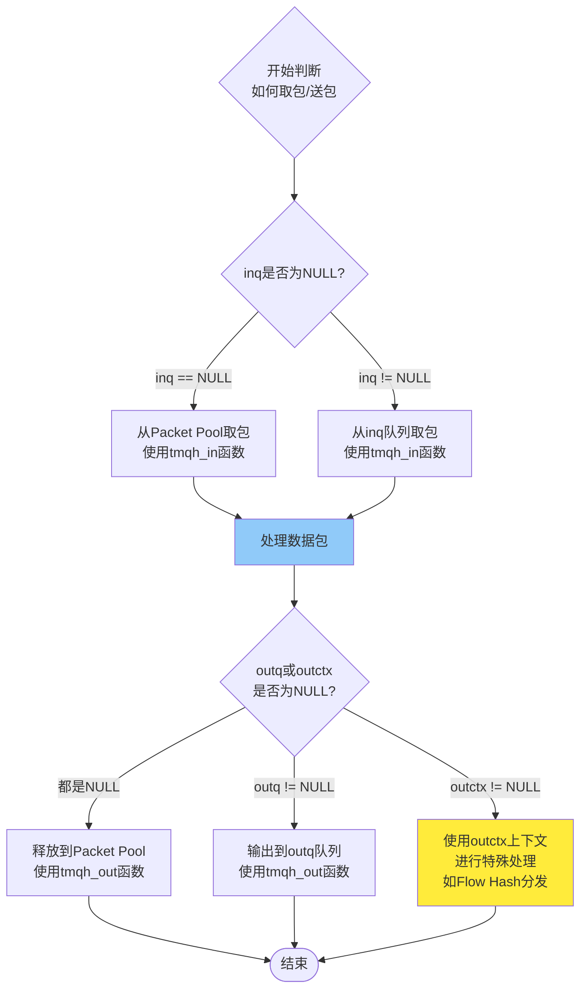
```mermaid
graph TD
    Start{开始判断<br/>如何取包/送包} --> CheckInQ{inq是否为NULL?}

    CheckInQ -->|inq == NULL| UsePool1[从Packet Pool取包<br/>使用tmqh_in函数]
    CheckInQ -->|inq != NULL| UseQueue1[从inq队列取包<br/>使用tmqh_in函数]

    UsePool1 --> Process[处理数据包]
    UseQueue1 --> Process

    Process --> CheckOutQ{outq或outctx<br/>是否为NULL?}

    CheckOutQ -->|都是NULL| UsePool2[释放到Packet Pool<br/>使用tmqh_out函数]
    CheckOutQ -->|outq != NULL| UseQueue2[输出到outq队列<br/>使用tmqh_out函数]
    CheckOutQ -->|outctx != NULL| UseCtx[使用outctx上下文<br/>进行特殊处理<br/>如Flow Hash分发]

    UsePool2 --> End([结束])
    UseQueue2 --> End
    UseCtx --> End

    style Process fill:#90caf9
    style UseCtx fill:#ffeb3b
```

## 八、调试技巧

### 8.1 GDB 查看队列字段

```bash
# 启动 GDB
gdb --args suricata -c suricata.yaml -i eth0 --runmode=autofp

# 断点在线程创建后
b TmThreadSpawn

# 运行到断点
run

# 查看 ThreadVars 结构
p *(ThreadVars*)tv

# 查看队列字段
p tv->inq_id
p tv->outq_id
p tv->inq
p tv->outq
p tv->outctx

# 如果 inq 不为 NULL，查看队列信息
p *tv->inq
p tv->inq->name
p tv->inq->reader_cnt
p tv->inq->writer_cnt

# 如果是 Flow 输出，查看 outctx
p *(TmqhFlowCtx*)tv->outctx
p ((TmqhFlowCtx*)tv->outctx)->size
```

### 8.2 常见调试场景

**场景1：Worker 线程不取包**
```bash
# 检查输入队列配置
p tv->inq
p tv->inq->name  # 应该是 "pickup1" 等
p tv->tmqh_in    # 应该不为 NULL
p tv->inq->pq->len  # 查看队列中的包数量
```

**场景2：RX 线程不分发包**
```bash
# 检查输出上下文
p tv->outctx  # 应该不为 NULL（AutoFP 模式）
p *(TmqhFlowCtx*)tv->outctx
p ((TmqhFlowCtx*)tv->outctx)->size  # 应该等于 worker 数量
p tv->tmqh_out  # 应该指向 TmqhOutputFlowHash
```

## 九、总结

### 9.1 队列字段的核心作用

1. **线程间数据传递**：通过 `inq` 和 `outq` 实现线程间的数据包传递
2. **处理函数抽象**：通过 `tmqh_in` 和 `tmqh_out` 实现不同队列处理逻辑的统一接口
3. **队列类型标识**：通过 `inq_id` 和 `outq_id` 标识使用的队列处理器类型
4. **特殊上下文支持**：通过 `outctx` 支持复杂的输出逻辑（如 Flow Hash 分发）

### 9.2 设计优势

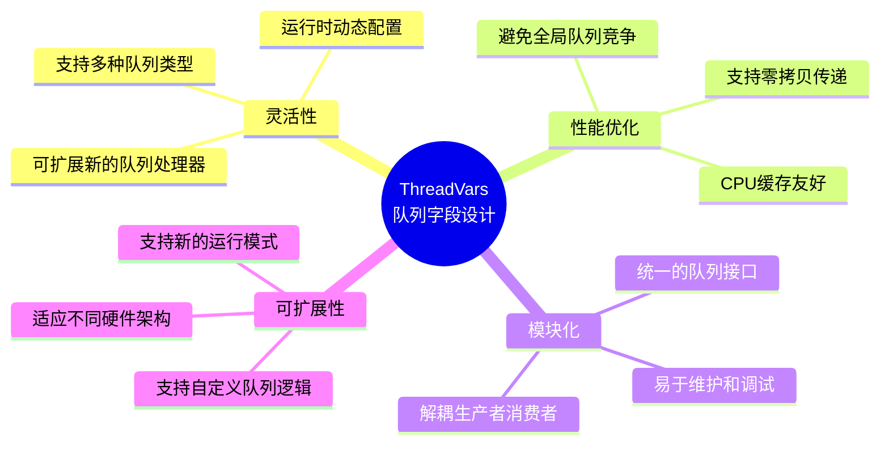
```mermaid
mindmap
    root((ThreadVars<br/>队列字段设计))
        灵活性
            支持多种队列类型
            可扩展新的队列处理器
            运行时动态配置
        性能优化
            避免全局队列竞争
            支持零拷贝传递
            CPU缓存友好
        模块化
            统一的队列接口
            解耦生产者消费者
            易于维护和调试
        可扩展性
            支持新的运行模式
            支持自定义队列逻辑
            适应不同硬件架构
```

### 9.3 关键要点

- **NULL 语义**：`inq/outq` 为 NULL 时表示使用 Packet Pool
- **上下文优先**：`outctx` 不为 NULL 时，`outq` 会被忽略
- **函数指针**：`tmqh_in/tmqh_out` 实现了队列操作的多态性
- **ID 标识**：`inq_id/outq_id` 用于快速识别队列处理器类型
- **懒加载**：队列在首次使用时才创建，存储在全局链表 `tmq_list` 中

通过这些字段的巧妙设计，Suricata 实现了高效、灵活、可扩展的多线程数据包处理架构。
