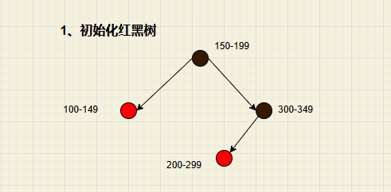
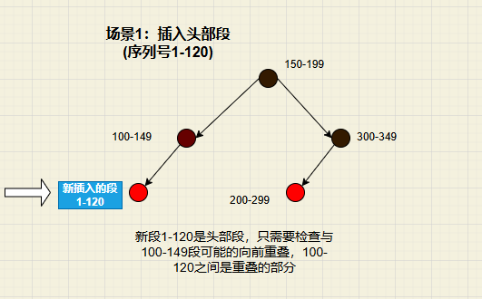
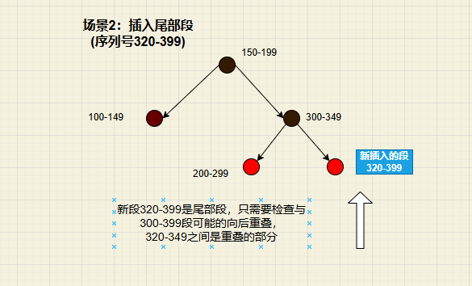
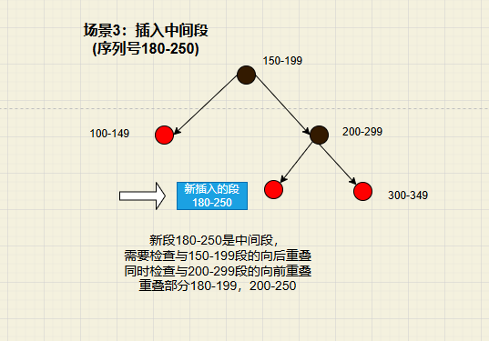

为什么采用红黑树作为tcp重组的数据结构呢？

红黑树的头部指的是seq元素最小的元素吗？

红黑树的尾部指的是seq元素最大的元素吗？


## 红黑树作为TCP重组数据结构的优势

TCP重组使用红黑树主要有以下几个原因：

**高效查找：**红黑树保证O(log n)的查找效率，对于需要快速找到特定序列号段的操作很有利

**自动排序：**红黑树自动按照序列号排序TCP段，减少代码复杂度

**高效插入：**插入新段的时间复杂度是O(log n)，比线性数据结构更高效

**平衡性：**作为自平衡树，即使在最坏情况下也能保持良好性能


## TCP段红黑树示例

假设我们有一个已包含4个TCP段的红黑树，段的序列号分别为：100-149, 150-199, 200-299, 300-349。

**红黑树初始化**




**场景1：插入头部段(序列号1-120)**




**场景2：插入尾部段(序列号320-399)**




**场景3：插入中间段(序列号180-250)**



## 重叠处理图解

让我们更直观地看一下各种重叠情况：

### 1. 向前重叠（Forward Overlap）- 场景1

```
已有段:                 100-----------------149
新插入段: 1-------------------120
                       |重叠区域|
```

这种情况下，新段1-120的尾部与已有段100-149的头部可能重叠。


### 2. 向后重叠（Backward Overlap）- 场景2

```
已有段:     300-----------------349
新插入段:               320-------------------399
                         |重叠区域|
```

这种情况下，新段320-399的头部与已有段300-349的尾部重叠。需要检查320-349区域的数据是否一致，并根据操作系统策略决定保留哪个数据版本。


### 3. 中间段同时存在前后重叠（Middle Overlap）- 场景3

```
已有段:     150-------------199   200----------299
新插入段:           180------------------250
                     |后重叠|       |前重叠|
```

对于插入的中间段180-250，它同时与前面的段150-199有后向重叠，与后面的段200-299有前向重叠。需要同时检查两个方向的重叠。


## 红黑树遍历与重叠检查

当插入新段并需要检查重叠时，红黑树提供了高效的遍历机制：

**向后检查：**使用TCPSEG_RB_PREV从当前段向"左"（序列号更小的方向）遍历

**向前检查：**使用TCPSEG_RB_NEXT从当前段向"右"（序列号更大的方向）遍历


- 红黑树的头部：指的是序列号最小的元素（树的最左侧节点）

- 红黑树的尾部：指的是序列号最大的元素（树的最右侧节点）

在 Suricata 的 TCP 重组中，红黑树是按照 TCP 段的序列号排序的，因此序列号越小的段越靠近树的"左侧"，序列号越大的段越靠近树的"右侧"。


## TCPSEG_RB_PREV 宏详解

```
#define TCPSEG_RB_PREV(elm) RB_PREV(TCPSEG, &stream->seg_tree, (elm))
```

功能：获取给定 TCP 段的"前一个"段（**序列号小于当前段的最大节点**）

参数：

- elm：一个指向 TcpSegment 的指针，表示当前段


返回值：

- 返回红黑树中序列号小于当前段且最接近当前段的节点（所有小土豆里面的大高个，哈哈）

- 如果没有更小的节点，则返回 NULL


**在 TCP 重组中的用途：**

- 用于查找序列号比当前段小的段

- 在处理重叠时，用于检查当前段与序列号较小的段的后向重叠


## TCPSEG_RB_NEXT 宏详解

功能：获取给定 TCP 段的"后一个"段（序列号大于当前段的最小节点）

参数：

- elm：一个指向 TcpSegment 的指针，表示当前段

返回值：

- 返回红黑树中序列号大于当前段且最接近当前段的节点

- 如果没有更大的节点，则返回 NULL


**在 TCP 重组中的用途：**

- 用于查找序列号比当前段大的段

- 在处理重叠时，用于检查当前段与序列号较大的段的前向重叠