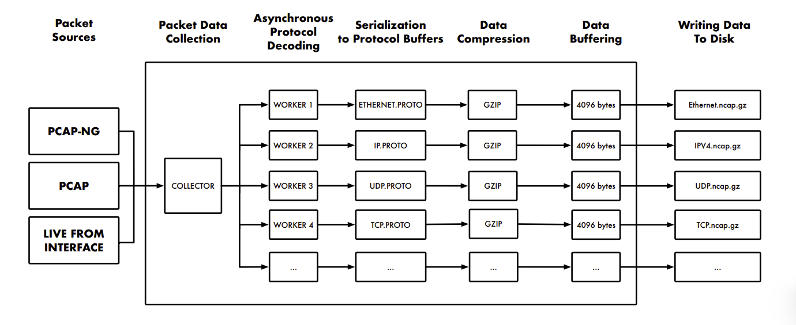
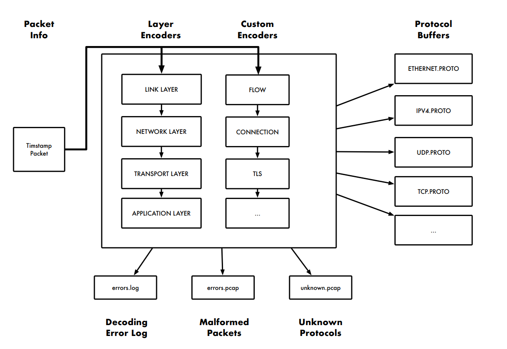
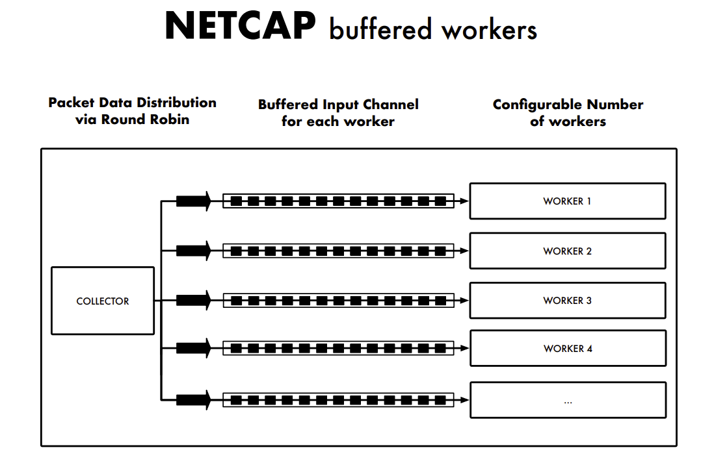
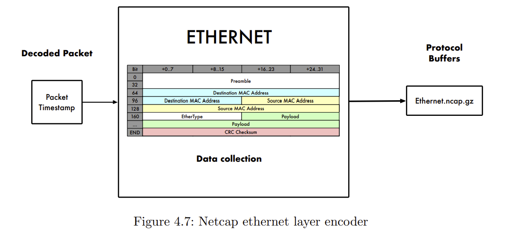
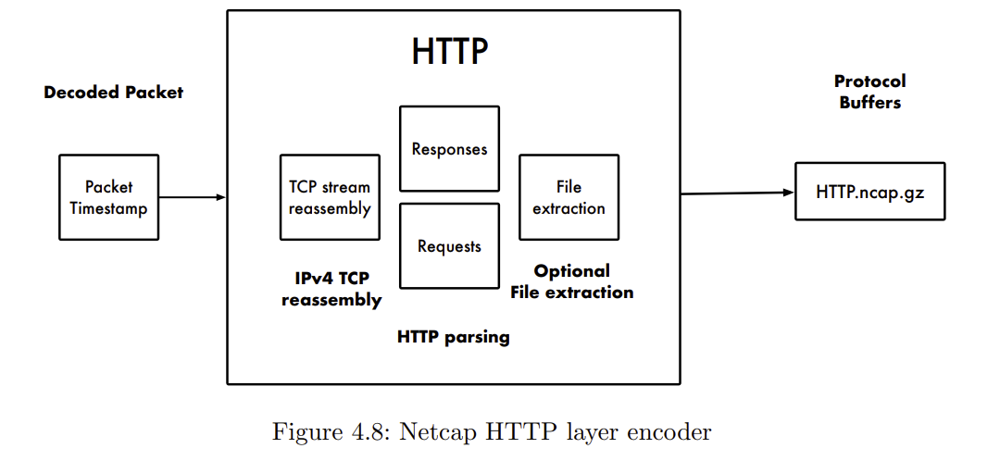
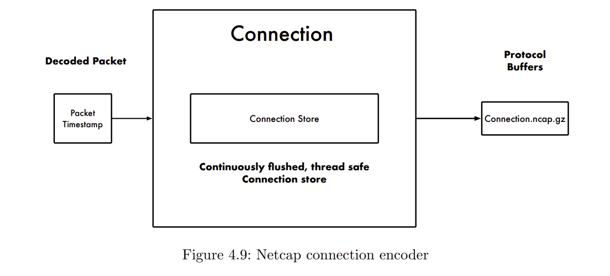
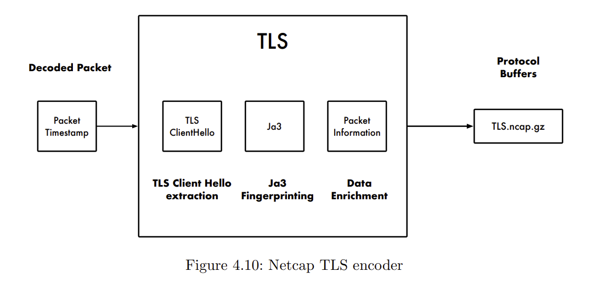

作者公布了他的论文，mied18.pdf，用于介绍框架、原理和技术架构。

## 1、1 设计目标

- 解析外部输入数据的内存安全性
- 易于扩展
- 输出格式能与多种编程语言交互

- 并发设计
- 输出数据占用磁盘存储空间小
- 收集一切，区分可以理解的和不能理解的
- 允许实现自定义的抽象层
- 丰富的平台和架构支持

## 1、2 框架组件

- capture - 捕获（实时获取或从转储文件中获取审计记录）
- dump - 转储（以各种格式导出审计记录）
- label - 标记（从 netcap 数据创建带标签的 CSV 数据集的工具）
- collect - 收集（用于分布式采集的收集服务器）
- agent - 探针（用于分布式采集的传感器探针）
- proxy - 代理（用于捕获网络服务流量的 HTTP 反向代理）
- util - 工具（用于验证审计记录和转换时间戳的实用工具）
- export - 导出（Prometheus 指标导出器）
- transform - 转换（Maltego 转换插件）

## 1、3 案例

- 监控蜜罐流量
- 监控医疗/工业设备
- 基于异常的检测机制研究
- 数据取证分析

## 1、4 深入学习

观看一个简短演示：使用深度神经网络对 LOKI Bot 的流量 PCAP 转储文件进行恶意行为分类。

netcap框架结构

Netcap 文件使用 .ncap 作为文件扩展名，如果使用 gzip 压缩则为 .ncap.gz，这些文件包含同一类型的序列化 Protocol Buffers 数据。文件命名遵循 gopacket 库的命名规范：

- 对于常见协议，使用大写字母缩写表示
- 对于不常见协议，使用驼峰式命名的完整单词表示

所有审计记录都使用 Protocol Buffers 进行建模。每个文件都包含一个头部，该头部明确指定：

- 文件中包含的审计记录类型
- 生成文件所使用的 Netcap 版本
- 所使用的输入源
- 文件的创建时间

每条审计记录都必须标记数据包被捕获时的时间戳，时间戳格式为"秒.微秒"。

输出内容会被写入到对应 Protocol Buffers 定义中各个数据结构的文件中，例如：

- TCP.ncap
- UDP.ncap

## 二、数据管道

## 2、1 Worker

从输入源获取的数据包通过轮询方式分发给Decode解码WorkerPool进行解码处理。

每个工作器负责解码数据包的所有协议层，并调用所有可用的自定义编码器；

解码完成后，生成的 Protocol Buffer 实例会写入 Netcap 数据管道；

对于解码过程中出错或包含未知协议的数据包，系统会将其记录到相应的日志文件并保存到pcap文件中。

每个工作器通过输入通道接收数据，该通道可以配置缓冲区，默认缓冲区大小为 100，这是基于开发机器测试效果最佳的配置。

当缓冲区大小设为零时，向通道写入数据包的操作会发生阻塞，直到负责处理的 goroutine 准备就绪才能继续写入。

这意味着一个 goroutine 在处理完手头的数据包之前，无法接收新的数据包。但是，如果我们给所有工作器都设置一个缓冲区，就能实现

更灵活的处理机制：即使某个工作器还在忙着处理数据，系统也能继续分发新来的数据包。这些新数据包会暂时存放在缓冲区里排队等待

处理，只有当缓冲区装满了，系统才会暂停分发新的数据包。

## 2、2 Decoders

编码器负责将已解码的数据包转换成**审计记录**所需的协议缓冲区格式。

系统中有两种编码器：

Layer编码器专门处理gopacket层类型的数据，而Custom编码器可以处理gopacket尚未支持的应用层协议和需要流重组的协议。

ethernet编码器会获取解码后的数据包，使用可用的路由信息，并计算有效负载数据的香农熵。

HTTP解码器实现了IPv4流重组功能，用于从重组后的数据流中提取HTTP请求和响应。

此外，还可以从HTTP响应中提取文件并将其保存到磁盘中。

Connection编码器维护着一个线程安全的连接存储器，用于跟踪所有已发现的连接及其属性。为了减少内存使用，它会按照配置的时间

间隔定期进行清理。

TLS编码器从握手过程中提取TLS Client Hello消息，计算JA3哈希值，并添加来自底层TCP数据包的路由信息。

## 2、3 未知协议

无法解码的协议流量都会被存储在 unknown.pcap 文件中供后续分析，因为这些未被系统识别的流量可能包含重要信息。通过将这些无

法识别的内容单独保存，我们可以更容易发现那些使用自定义协议的隐藏通信渠道。

# 三、流和会话连接

Flows and Connections
