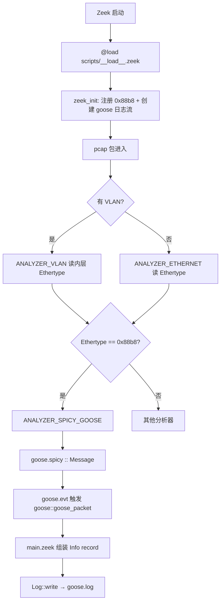

# 按数据流顺序读代码

建议按 **包从进入到写出日志** 的顺序读。

# 一、总览

```
Zeek 启动
    → 插件加载 & 注册路由 (main.zeek zeek_init)
    → pcap 包进入 Zeek
    → 以太网/VLAN 分发
    → Ethertype 0x88b8 命中
    → Spicy 解析 (goose.spicy)
    → 触发事件 (goose.evt)
    → Zeek 处理 (main.zeek 第 64–78 行)
    → 写入 goose.log
```

流程图（需 Markdown 渲染器支持 Mermaid，如 GitHub、Typora、VS Code 预览）：



# 二、剖析各个流程

## 2.1 Zeek 启动 → 插件加载

```
zeek -r GOOSE.pcap icsnpp-iec61850-goose
    → 加载包 scripts/__load__.zeek
    → @load ./main
    → zeek_init 注册路由、创建 goose 日志流
    → 逐包解析 pcap
```

**示例（包已通过 zkg 安装）：**

```bash
zeek -r /home/work/pcaps_dataset/iec61850-goose/GOOSE.pcap icsnpp-iec61850-goose
```

- `-r`：离线读取 pcap；测试常用 `-Cr`（额外做 checksum 校验）
- `goose.log` 写在**当前工作目录**，不在 pcap 同目录

两个文件的作用如下

| 文件                    | 作用                                     |
| :---------------------- | :--------------------------------------- |
| `scripts/__load__.zeek` | 入口，加载 `main.zeek`                   |
| `scripts/main.zeek`     | 定义日志结构、注册路由、实现事件 handler |

编译安装时，`goose.spicy` + `goose.evt` 已被编译进 Zeek，产生 `ANALYZER_SPICY_GOOSE`

## 2.2 zeek_init → 注册路由 & 创建日志流

文件： `scripts/main.zeek` 第 44–62 行

zeek_init函数的源代码如下：

```
event zeek_init() &priority=20
{
    print "Initializing IEC 61850 GOOSE analyzer";

    # Create the stream. This adds a default filter automatically.
    Log::create_stream(goose::LOG, [$columns=Info, $path="goose"]);

    if ( ! PacketAnalyzer::register_packet_analyzer(PacketAnalyzer::ANALYZER_VLAN, 0x88b8, PacketAnalyzer::ANALYZER_SPICY_GOOSE) ) {
        print "Cannot register GOOSE analyzer";
    } else {
        print "Registered IEC 61850 goose analyzer for VLAN";
    }

    if ( ! PacketAnalyzer::register_packet_analyzer(PacketAnalyzer::ANALYZER_ETHERNET, 0x88b8, PacketAnalyzer::ANALYZER_SPICY_GOOSE) ) {
        print "Cannot register GOOSE analyzer";
    } else {
        print "Registered IEC 61850 goose analyzer for ETHERNET";
    }
}
```

```
zeek_init 触发
    → Log::create_stream(goose::LOG, path="goose")     # 创建 goose.log
    → register_packet_analyzer(VLAN,     0x88b8, SPICY_GOOSE) #goose插件
    → register_packet_analyzer(ETHERNET, 0x88b8, SPICY_GOOSE) #goose插件
```

函数原型和使用方式如下：

```
register_packet_analyzer(parent, identifier, child)
                           │         │          │
                           │         │          └─ ANALYZER_SPICY_GOOSE（Spicy 解析器）分发给什么分析器？
                           │         └─ 0x88b8（GOOSE Ethertype）根据何标识分发？
                           └─ VLAN 或 ETHERNET（在哪一层做分发？）
```

调用PacketAnalyzer::register_packet_analyzer函数的这两行表示：

| 调用    | parent父分析器    | identifier | child子分析器        | 场景                                   |
| ------- | ----------------- | ---------- | -------------------- | -------------------------------------- |
| 第 1 行 | ANALYZER_VLAN     | 0x88b8     | ANALYZER_SPICY_GOOSE | VLAN 包，内层 Ethertype 是 GOOSE       |
| 第 2 行 | ANALYZER_ETHERNET | 0x88b8     | ANALYZER_SPICY_GOOSE | 无 VLAN，以太网 Ethertype 直接是 GOOSE |

`0x88b8` 是 IEC 61850 GOOSE 的标准 Ethertype。

```
pcap
  └─ ANALYZER_ROOT          (identifier = DLT，如 1=以太网)
       └─ ANALYZER_ETHERNET  (identifier = Ethertype)
            ├─ 0x8100 → ANALYZER_VLAN
            │              (identifier = 内层 Ethertype)
            │              └─ 0x88b8 → ANALYZER_SPICY_GOOSE  ← 你的插件
            └─ 0x88b8 → ANALYZER_SPICY_GOOSE               ← 你的插件
```

`register_packet_analyzer` 就是在 parent父解析器 的 dispatcher分发表里加一行：

```
identifier → child
```

GOOSE 插件本身只负责 注册路由；真正解析在 Spicy 的 `goose.spicy` + `goose.evt` 里完成。

## 2.3 pcap 包进入 → 以太网/VLAN 分发

```
pcap 帧
    → ANALYZER_ROOT（按 link type 选入口，以太网 pcap 通常是 DLT_EN10MB）
    → ANALYZER_ETHERNET（读 Ethertype）
         ├─ 0x8100 / 0x88a8 / 0x9100 → ANALYZER_VLAN（剥 VLAN 头）
         │                                  └─ 再读内层 Ethertype
         ├─ 0x0800 → IP
         ├─ 0x0806 → ARP
         └─ 0x88b8 → ANALYZER_SPICY_GOOSE  ← §2.2 中注册的路由
```

无 VLAN 时：`ETHERNET` 直接看到 `0x88b8` → 进 GOOSE。
有 VLAN 时：`ETHERNET` → `VLAN` → 内层 `0x88b8` → 进 GOOSE。

## 2.4 Ethertype 0x88b8 命中 → 交给 Spicy

```
Ethertype == 0x88b8
    → Zeek 调用 ANALYZER_SPICY_GOOSE
    → 把 GOOSE payload 交给 goose.spicy 的 Message unit
    → 同时保留 $packet（raw_pkt_hdr，含 MAC/VLAN）
```

此时 Spicy 收到的字节流结构：

```
┌─────────────────────────────────────────┐
│ appid (2) + length (2)                  │  ← 固定头
│ reserved1 (2) + reserved2 (2)           │
├─────────────────────────────────────────┤
│ ASN.1 外层 (goosePDU)                   │  ← APPLICATION 1 = goosePdu
│   └─ IECGoosePdu SEQUENCE (goosePDUdata)│  ← tag 0–11
│        └─ allData (tag 11, 未展开)       │
└─────────────────────────────────────────┘
```

## 2.5 Spicy 解析 (goose.spicy)

文件： `analyzer/goose.spicy`

`Message` **不是函数**，而是 Spicy 的 **`unit` 类型**——一套按顺序从字节流读取并解析的协议规则。

`goose.evt` 中 `parse with goose::Message` 表示：将 GOOSE payload 交给该 unit，按字段定义自上而下解析。

unit 内字段顺序即协议字段顺序；每读完一个字段，输入偏移自动移到下一字段。

固定头字段声明示例：

```spicy
appid: uint16;              # 读 2 字节 → 无符号整数 → self.appid
length: uint16;              # 再读 2 字节 → self.length
reserved1: bytes &size=2;   # 再读 2 字节原样保存
```

`appid: uint16` 一行同时表示「定义字段 `appid`」和「从当前位置读 2 字节，按大端 uint16 解析」。

例如字节 `00 01 00 91 ...` 得 `appid=1`、`length=145`（与 `goose.log` 一致），随后剩余字节交给 `goosePDU` 做 ASN.1 解析。

```
Message unit 顺序解析
    │
    ├─ ① 读固定头
    │      appid, length, reserved1, reserved2
    │
    ├─ ② goosePDU: ASN1::ASN1Message[] &eod
    │      解 ASN.1 外层，识别 goosePdu
    │
    ├─ ③ goosePDUdata: 从 goosePDU.application_data 继续解
    │      触发 on goosePDUdata 钩子
    │      按 tag 填入变量：
    │
    │      tag 0  → gocbRef
    │      tag 1  → timeAllowedtoLive
    │      tag 2  → datSet
    │      tag 3  → goID（可选，未传 Zeek）
    │      tag 4  → T → SecondSinceEpoch（UtcTime）
    │      tag 5  → stNum
    │      tag 6  → sqNum
    │      tag 7  → simulation
    │      tag 8  → confRev
    │      tag 9  → ndsCom
    │      tag 10 → numDatSetEntries
    │      tag 11 → allData（占位，未深入解析）
    │
    └─ ④ on %done → 解析完成，交给 goose.evt
```

## 2.6 触发事件 (goose.evt)

文件： `analyzer/goose.evt`

```
goose.spicy 解析完成 (Message unit %done)
    → goose.evt 执行映射
    → event goose::goose_packet(...)
```

看下goose.evt文件的源代码：

```
import goose;

packet analyzer spicy::goose:
    parse with goose::Message;

on goose::Message -> event goose::goose_packet($packet, self.appid, self.length, self.gocbRef, self.timeAllowedtoLive, self.datSet, self.SecondSinceEpoch, self.stNum, self.sqNum, self.simulation, self.confRev, self.ndsCom, self.numDatSetEntries);
```

**逐行含义（`packet analyzer` 声明）：**

| 行 | 含义 |
|----|------|
| `packet analyzer spicy::goose:` | 声明名为 `spicy::goose` 的 Packet Analyzer（编译后对应 `ANALYZER_SPICY_GOOSE`） |
| `parse with goose::Message;` | 收到包后，用 `goose.spicy` 中的 `Message` unit 解析 GOOSE payload |

**事件的分工：**

- **`goose.evt`**：解析完成后**触发** `goose::goose_packet` 事件，并把 Spicy 字段映射为事件参数（`self.xxx` → 事件实参，`$packet` → 包头元数据）
- **`main.zeek`（§2.7）**：**实现**该事件的 handler，负责组装 `goose::Info` record 并 `Log::write`
- Zeek 中事件可以「在 `.evt` 触发 + 在 `.zeek` 实现」，不必写在同一文件


## 2.7 Zeek 处理 (main.zeek 第 64–78 行)

```
event goose::goose_packet 被触发
    │
    ├─ ① 用 Spicy 字段组装 goose::Info record
    │      $ts = network_time()          ← Zeek 看到包的时间
    │      $appid, $gocbRef, $stNum …    ← 来自 Spicy（事件参数）
    │
    ├─ ② 从 pkt (raw_pkt_hdr) 补 L2 信息（optional 字段需先检查）
    │      pkt?$l2 为真？
    │          ├─ pkt$l2?$src  为真 → rec$src  = pkt$l2$src   ← 源 MAC
    │          ├─ pkt$l2?$dst  为真 → rec$dst  = pkt$l2$dst   ← 目的 MAC
    │          └─ pkt$l2?$vlan 为真 → rec$vlan = pkt$l2$vlan  ← VLAN ID（无则日志为 -）
    │
    └─ ③ Log::write(goose::LOG, rec)     → 进入 §2.8
```

对应源代码：

```zeek
if ( pkt?$l2 ) {
    if ( pkt$l2?$src )  rec$src  = pkt$l2$src;
    if ( pkt$l2?$dst )  rec$dst  = pkt$l2$dst;
    if ( pkt$l2?$vlan ) rec$vlan = pkt$l2$vlan;
}
```

**Zeek 语法说明：**

| 写法 | 含义 |
|------|------|
| `rec$src` | 访问 record 字段（读/写） |
| `pkt?$l2` | 判断 optional 字段 `l2` 是否存在 |
| `pkt$l2?$src` | 判断嵌套 optional 字段 `src` 是否存在 |

`src`、`dst`、`vlan` 在 `raw_pkt_hdr` 中均为 `&optional`，直接访问不存在的字段会报错，故需先用 `?$` 检查。

两类数据来源：

```
Spicy 解析 ──→ appid, gocbRef, stNum, sqNum, t, ...
$packet     ──→ src, dst, vlan
network_time() ──→ ts
```

## 2.8 写入 goose.log文件

```
Log::write(goose::LOG, rec)
    → 按 Info record 的 &log 字段输出 TSV
    → 文件：goose.log
```

# 三、改功能时按流程找改点

```
想改解析逻辑        → §2.5 goose.spicy
想改传给 Zeek 的字段  → §2.5 + §2.6 goose.evt
想改日志列           → §2.7 main.zeek (Info + handler)
想改 Ethertype/入口   → §2.2 main.zeek (register_packet_analyzer)
想解析 allData 内容   → §2.5 goose.spicy case 11
```

# 四、参考：字段映射与插件边界

## 4.1 字段映射（Spicy → `.evt` → Zeek → `goose.log`）

| Spicy 变量 | `.evt` 传参 | Zeek handler 参数 | goose.log 列 | 说明 |
|------------|------------|-------------------|--------------|------|
| `self.appid` | `self.appid` | `appid` | `appid` | 固定头 |
| `self.length` | `self.length` | `length` | `length` | 固定头 |
| `self.gocbRef` | `self.gocbRef` | `gocbRef` | `gocbRef` | ASN.1 tag 0 |
| `self.timeAllowedtoLive` | `self.timeAllowedtoLive` | `timeAllowedtoLive` | `timeAllowedtoLive` | ASN.1 tag 1 |
| `self.datSet` | `self.datSet` | `dataSet` | `dataSet` | 名称在 Zeek 侧改为 `dataSet` |
| `self.SecondSinceEpoch` | `self.SecondSinceEpoch` | `t` | `t` | ASN.1 tag 4，UtcTime 秒部分 |
| `self.stNum` | `self.stNum` | `stNum` | `stNum` | ASN.1 tag 5 |
| `self.sqNum` | `self.sqNum` | `sqNum` | `sqNum` | ASN.1 tag 6 |
| `self.simulation` | `self.simulation` | `simulation` | `simulation` | ASN.1 tag 7 |
| `self.confRev` | `self.confRev` | `confRev` | `confRev` | ASN.1 tag 8 |
| `self.ndsCom` | `self.ndsCom` | `ndsCom` | `ndsCom` | ASN.1 tag 9 |
| `self.numDatSetEntries` | `self.numDatSetEntries` | `numDatSetEntries` | `numDatSetEntries` | ASN.1 tag 10 |
| — | `$packet` | `pkt` | `src` / `dst` / `vlan` | L2 元数据，非 Spicy 解析 |
| — | — | `network_time()` | `ts` | Zeek 收包时间，非协议字段 |
| `self.goID` | （未传） | — | — | tag 3 已解析，当前未进日志 |

> **`ts` ≠ `t`：** `ts` 是 Zeek 处理该包时的网络时间；`t` 是 GOOSE PDU 里的 UtcTime（数据集时间戳）。

## 4.2 插件当前边界

| 项目 | 状态 |
|------|------|
| `goID`（tag 3） | Spicy 已解析，未传 Zeek / 未写日志 |
| `allData`（tag 11） | 占位，未展开具体数据元素 |
| UtcTime 小数部分 / 时间品质 | 已解析为 `FractionOfSecond`、`TimeQuality`，未进日志 |
| VLAN 路径 | 已在 §2.2 注册；测试 trace 无 VLAN（`vlan` 为 `-`） |
