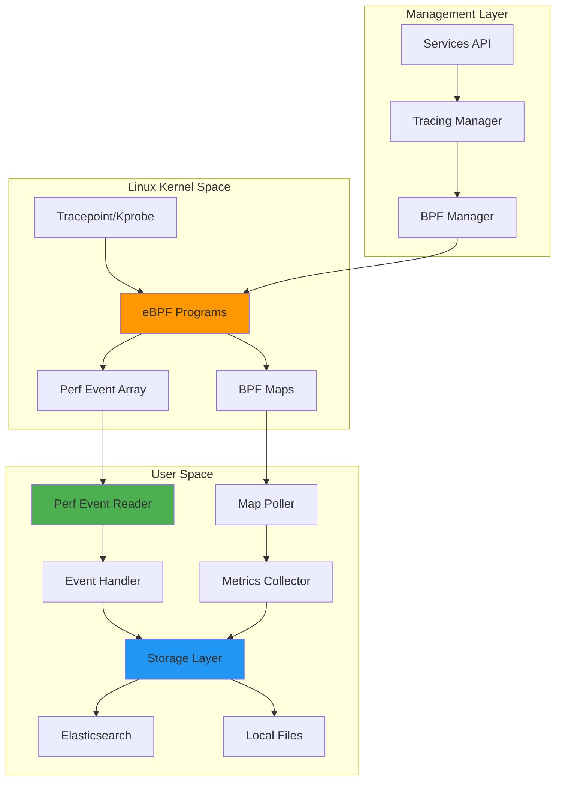
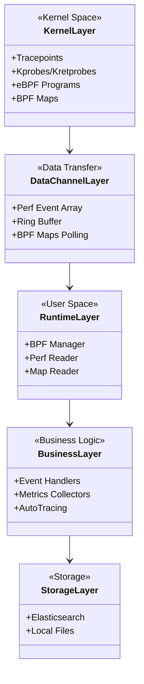
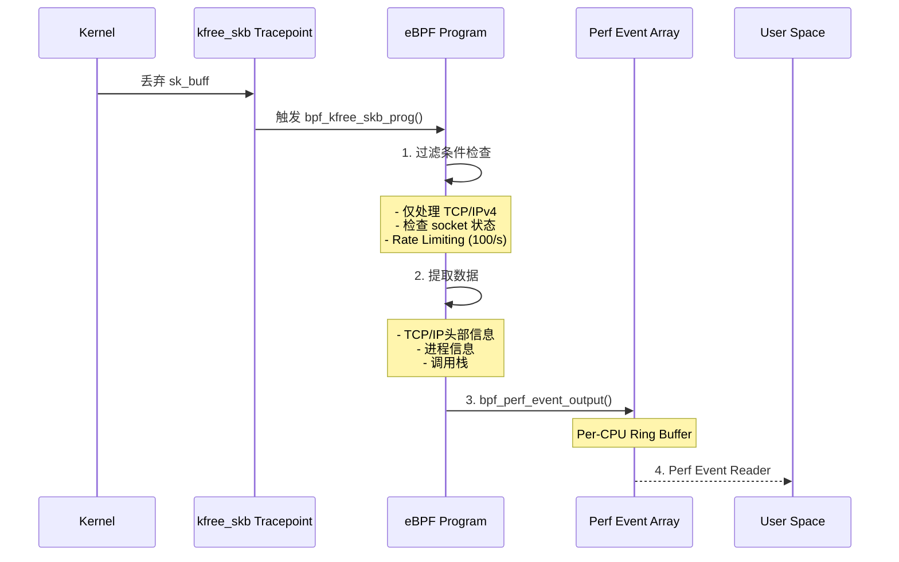
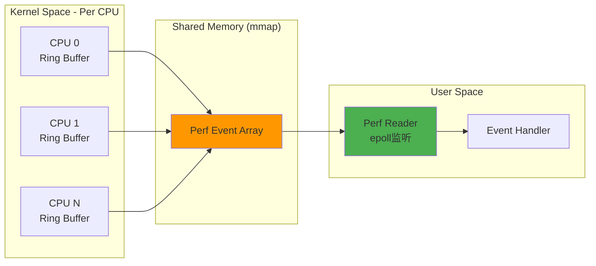
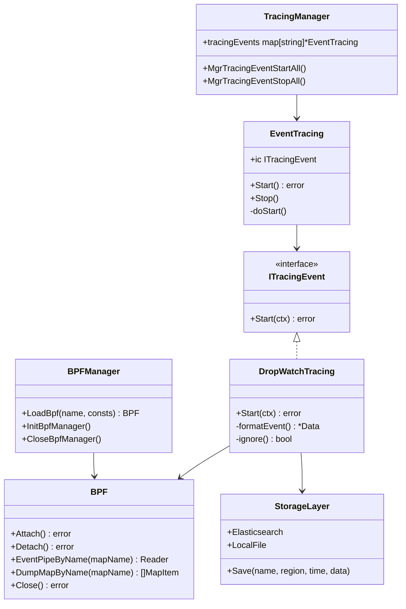
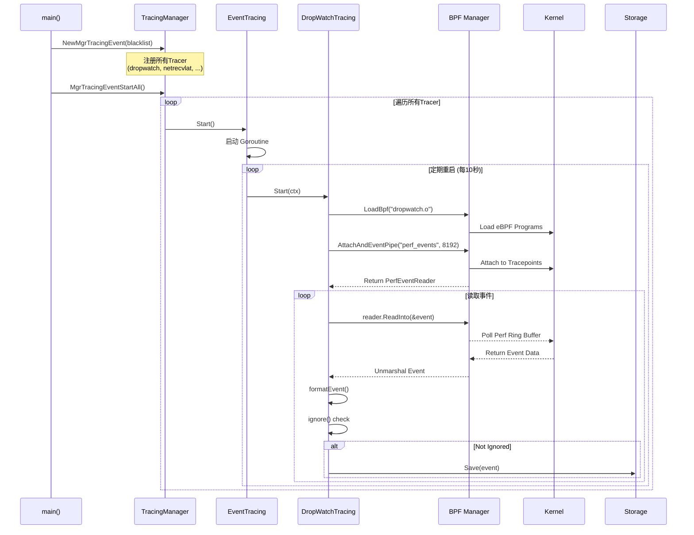
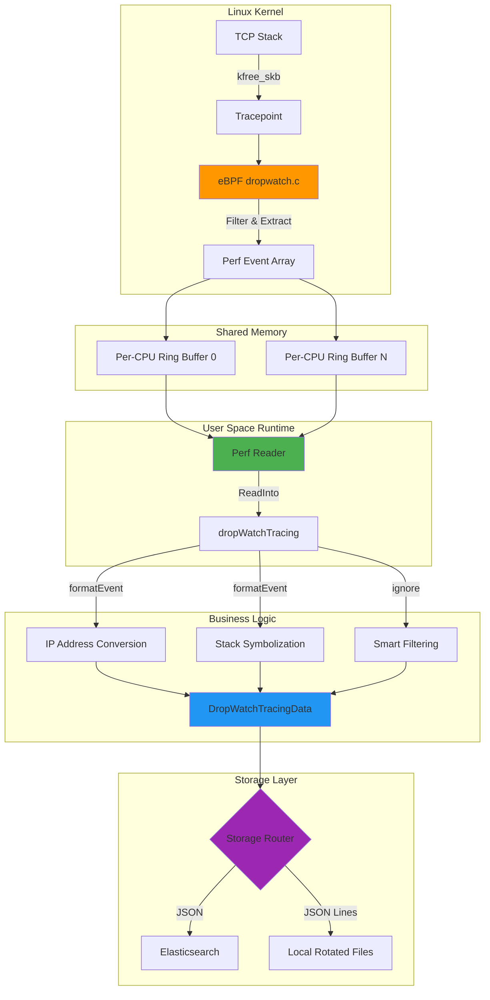
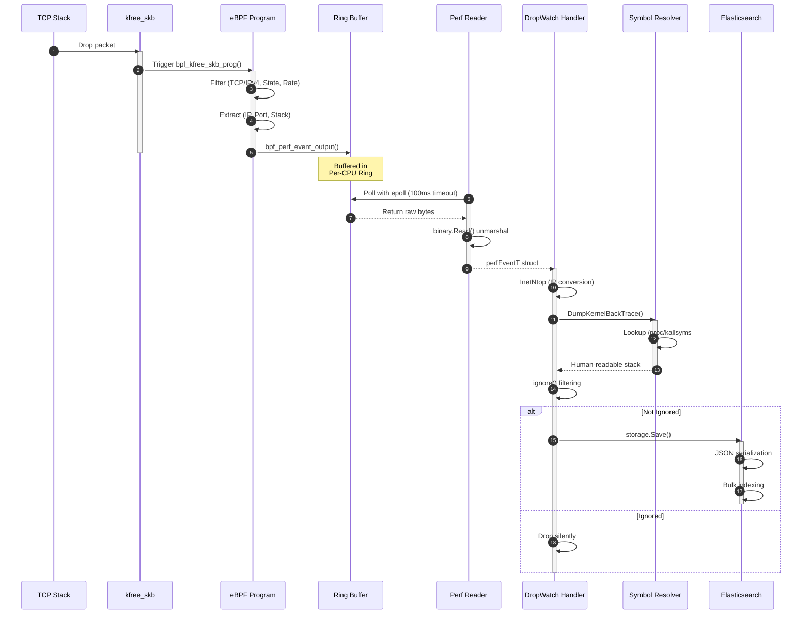

# Huatuo 源码深度分析

> **Huatuo** 是由滴滴开源、CCF孵化的云原生操作系统可观测性项目，专注于提供深度的内核级可观测能力。本文档从源码层面深入分析其架构设计与实现原理。

---

## 📋 目录

1. [项目概览](#1-项目概览)
2. [整体架构](#2-整体架构)
3. [内核态 eBPF 程序](#3-内核态-ebpf-程序)
4. [事件传递通道](#4-事件传递通道)
5. [用户态处理框架](#5-用户态处理框架)
6. [完整数据流](#6-完整数据流)
7. [核心组件详解](#7-核心组件详解)
8. [技术特点](#8-技术特点)

---

## 1. 项目概览

### 1.1 项目定位

Huatuo 是一个基于 **eBPF** 的 Linux 内核可观测性系统，提供：
- 🔍 **低开销内核观测** - 性能开销 < 1%
- 📊 **事件驱动上下文捕获** - 自动获取运行时上下文
- 🤖 **AutoTracing** - 启发式跟踪算法自动快照
- 📈 **持续性能剖析** - CPU/内存/IO/锁全方位剖析
- 🌐 **分布式追踪** - 以网络为中心的服务请求追踪

### 1.2 目录结构

```
huatuo/
├── bpf/                    # eBPF 内核态程序 (C代码)
│   ├── include/           # 公共头文件
│   ├── dropwatch.c        # 网络丢包监控
│   ├── netrecvlat.c       # 网络接收延迟
│   ├── runqlat_tracing.c  # 调度延迟追踪
│   └── ...
├── cmd/huatuo-bamai/      # 主程序入口
├── core/                  # 核心业务逻辑
│   ├── events/           # 事件处理器
│   ├── metrics/          # 指标采集器
│   └── autotracing/      # 自动追踪
├── internal/             # 内部包
│   ├── bpf/             # BPF管理层
│   ├── storage/         # 存储层
│   └── services/        # 服务层
└── pkg/                  # 公共包
    └── tracing/         # 追踪框架
```

---

## 2. 整体架构

### 2.1 架构图



### 2.2 分层架构



---

## 3. 内核态 eBPF 程序

### 3.1 eBPF 程序分类

| 分类 | 程序 | 功能 | 挂载点 |
|------|------|------|--------|
| **网络监控** | dropwatch.c (181行) | TCP丢包追踪 | tracepoint/skb/kfree_skb |
| | netrecvlat.c (177行) | 网络接收延迟 | tracepoint/net/netif_receive_skb<br>kprobe/tcp_v4_rcv |
| | netdev_hw.c (37行) | 网卡硬件信息 | - |
| | lacp.c (25行) | LACP协议监控 | - |
| **调度性能** | runqlat_tracing.c (337行) | 调度延迟与上下文切换 | tracepoint/sched/sched_wakeup<br>raw_tracepoint/sched_switch |
| | softirq.c (81行) | 软中断监控 | - |
| | perf.c (61行) | 性能事件 | - |
| **内存管理** | memory_free_compact.c (91行) | 内存压缩延迟 | tracepoint/vmscan/*<br>kprobe/try_to_compact_pages |
| | memory_reclaim.c (56行) | 内存回收 | - |
| | oom.c (56行) | OOM事件 | - |
| **系统异常** | hungtask.c (33行) | 挂起任务检测 | - |
| | softlockup.c (47行) | 软锁检测 | - |

### 3.2 典型程序解析：dropwatch.c

#### 3.2.1 数据结构定义

```c
// 事件数据结构
struct perf_event_t {
    u64 tgid_pid;              // 进程ID
    u32 saddr, daddr;          // 源/目标IP
    u16 sport, dport;          // 源/目标端口
    u32 seq, ack_seq;          // TCP序列号
    u64 pkt_len;               // 包长度
    u64 stack[PERF_MAX_STACK_DEPTH];  // 调用栈
    u8 state;                  // TCP状态
    u8 type;                   // 丢包类型
    char comm[16];             // 进程名
};

// Perf事件数组 - 用于内核到用户态传递
struct {
    __uint(type, BPF_MAP_TYPE_PERF_EVENT_ARRAY);
    __uint(key_size, sizeof(int));
    __uint(value_size, sizeof(u32));
} perf_events SEC(".maps");

// Per-CPU临时存储
struct {
    __uint(type, BPF_MAP_TYPE_PERCPU_ARRAY);
    __uint(max_entries, 1);
    __type(value, struct perf_event_t);
} dropwatch_stackmap SEC(".maps");
```

#### 3.2.2 核心逻辑流程



#### 3.2.3 关键代码片段

```c
SEC("tracepoint/skb/kfree_skb")
int bpf_kfree_skb_prog(struct trace_event_raw_kfree_skb *ctx)
{
    struct sk_buff *skb = ctx->skbaddr;

    // 1️⃣ 过滤条件
    if (ctx->protocol != ETH_P_IP)  // 仅IPv4
        return 0;

    bpf_probe_read(&iphdr, sizeof(iphdr), skb_network_header(skb));
    if (iphdr.protocol != IPPROTO_TCP)  // 仅TCP
        return 0;

    // 2️⃣ Rate Limiting (100事件/秒)
    if (bpf_ratelimited(&rate))
        return 0;

    // 3️⃣ 从Per-CPU数组获取临时存储
    data = bpf_map_lookup_elem(&dropwatch_stackmap, &stackmap_key);

    // 4️⃣ 填充事件数据
    data->tgid_pid = bpf_get_current_pid_tgid();
    bpf_get_current_comm(&data->comm, sizeof(data->comm));
    data->saddr = iphdr.saddr;
    data->sport = tcphdr.source;
    // ... 更多字段

    // 5️⃣ 获取调用栈 (最多127层)
    data->stack_size = bpf_get_stack(ctx, data->stack,
                                      sizeof(data->stack), 0);

    // 6️⃣ 发送到用户态 (通过Perf Event Array)
    bpf_perf_event_output(ctx, &perf_events,
                          COMPAT_BPF_F_CURRENT_CPU,
                          data, sizeof(*data));

    return 0;
}
```

### 3.3 内核版本兼容性

Huatuo 使用 **CO-RE (Compile Once Run Everywhere)** 技术适配多版本内核：

```c
// 示例：兼容不同内核版本的 socket 结构
static void sk_get_type_and_protocol(struct sock *sk, u16 *protocol, u16 *type)
{
    // kernel <= 4.18: __sk_flags_offset 字段存在
    if (bpf_core_field_exists(sk->__sk_flags_offset)) {
        u32 sk_flags;
        bpf_probe_read(&sk_flags, sizeof(sk_flags), &sk->__sk_flags_offset);
        *protocol = sk_flags >> SK_FL_PROTO_SHIFT;
        *type = sk_flags >> SK_FL_TYPE_SHIFT;
        return;
    }

    // kernel >= 5.10: 独立的 sk_type, sk_protocol 字段
    struct sock___5_10 *sk_new = (struct sock___5_10 *)sk;
    *protocol = BPF_CORE_READ(sk_new, sk_protocol);
    *type = BPF_CORE_READ(sk_new, sk_type);
}
```

### 3.4 性能优化技术

#### 3.4.1 Rate Limiting

```c
// bpf/include/bpf_ratelimit.h
BPF_RATELIMIT(rate, 1, 100);  // 1秒内最多100个事件

if (bpf_ratelimited(&rate))   // 超过限制则丢弃
    return 0;
```

#### 3.4.2 Per-CPU Maps

```c
// 每个CPU独立的数组，避免锁竞争
struct {
    __uint(type, BPF_MAP_TYPE_PERCPU_ARRAY);
    __uint(max_entries, 1);
    __type(value, struct perf_event_t);
} dropwatch_stackmap SEC(".maps");
```

---

## 4. 事件传递通道

### 4.1 Perf Event Array 机制



### 4.2 实现细节

#### 4.2.1 内核态发送事件

```c
// 发送事件到 Perf Event Array
bpf_perf_event_output(
    ctx,                        // 上下文
    &perf_events,              // Perf Event Array Map
    COMPAT_BPF_F_CURRENT_CPU,  // 当前CPU (避免跨CPU同步)
    data,                       // 事件数据指针
    sizeof(*data)              // 数据大小
);
```

#### 4.2.2 用户态创建 Reader

```go
// internal/bpf/perf_event_reader_default.go

func newPerfEventReader(ctx context.Context, array *ebpf.Map,
                        perCPUBuffer int) (PerfEventReader, error) {
    // 使用 Cilium eBPF 库创建 Reader
    // perCPUBuffer = 8192 页 (约32MB per CPU)
    rd, err := perf.NewReader(array, perCPUBuffer)
    if err != nil {
        return nil, fmt.Errorf("can't create perf reader: %w", err)
    }

    readerCtx, cancel := context.WithCancel(ctx)
    return &perfEventReader{
        ctx:       readerCtx,
        rd:        rd,
        cancelCtx: cancel,
    }, nil
}
```

#### 4.2.3 读取事件

```go
func (r *perfEventReader) ReadInto(pdata any) error {
    for {
        select {
        case <-r.ctx.Done():
            return types.ErrExitByCancelCtx
        default:
            // 设置100ms轮询超时
            r.rd.SetDeadline(time.Now().Add(100 * time.Millisecond))

            // 从 Ring Buffer 读取
            record, err := r.rd.Read()
            if err != nil {
                if errors.Is(err, os.ErrDeadlineExceeded) {
                    continue  // 超时重试
                }
                return err
            }

            if record.LostSamples != 0 {
                continue  // 跳过丢失的样本
            }

            // 二进制反序列化 (Zero-Copy)
            err = binary.Read(
                bytes.NewBuffer(record.RawSample),
                binary.NativeEndian,
                pdata
            )
            return err
        }
    }
}
```

### 4.3 性能特点

| 特性 | 说明 |
|------|------|
| **Zero-Copy** | mmap 共享内存，避免数据拷贝 |
| **Per-CPU Buffer** | 每CPU独立Ring Buffer，无锁竞争 |
| **Batch Processing** | 用户态100ms轮询批量处理 |
| **Binary Protocol** | 原生二进制格式，无序列化开销 |
| **Overflow Handling** | 记录 LostSamples 数量 |

---

## 5. 用户态处理框架

### 5.1 分层架构



### 5.2 启动流程



### 5.3 核心代码实现

#### 5.3.1 Tracing Manager

```go
// pkg/tracing/manager.go
type MgrTracingEvent struct {
    tracingEvents map[string]*EventTracing  // 所有注册的Tracer
    mu            sync.Mutex
    blackListed   []string                  // 黑名单
}

func NewMgrTracingEvent(blackListed []string) (*MgrTracingEvent, error) {
    // 创建所有已注册的Tracer实例
    tracings, err := NewRegister(blackListed)
    if err != nil {
        return nil, err
    }

    tracingEvents := make(map[string]*EventTracing)
    for key, trace := range tracings {
        if trace.Flag&FlagTracing == 0 {
            continue  // 跳过非Tracing类型
        }
        tracingEvents[key] = NewTracingEvent(trace, key)
    }

    return &MgrTracingEvent{
        tracingEvents: tracingEvents,
        blackListed:   blackListed,
    }, nil
}

func (mgr *MgrTracingEvent) MgrTracingEventStartAll() error {
    for name := range mgr.tracingEvents {
        if err := mgr.MgrTracingEventStart(name); err != nil {
            return err
        }
    }
    return nil
}
```

#### 5.3.2 Event Tracing 生命周期

```go
// pkg/tracing/tracing.go
type EventTracing struct {
    ic        ITracingEvent      // 具体实现 (如dropwatch)
    name      string
    interval  int                // 重启间隔 (秒)
    hitCount  int
    cancelCtx context.CancelFunc
    exit      bool
    isRunning bool
}

func (c *EventTracing) Start() error {
    c.isRunning = true
    c.exit = false

    // 启动 Goroutine
    go func() {
        for !c.exit {
            c.doStart()  // 执行一次追踪
            c.hitCount++

            if c.exit {
                break
            }

            // 间隔后重启 (默认10秒)
            time.Sleep(time.Duration(c.interval) * time.Second)
        }

        c.isRunning = false
        log.Infof("%s: tracing goroutine exited", c.name)
    }()

    return nil
}

func (c *EventTracing) doStart() {
    ctx, cancel := context.WithCancel(context.Background())
    c.cancelCtx = cancel
    defer c.cancelCtx()

    // 调用具体实现的 Start 方法
    if err := c.ic.Start(ctx); err != nil {
        if !errors.Is(err, types.ErrExitByCancelCtx) {
            log.Errorf("start tracing %s: %v", c.name, err)
        }
    }
}
```

#### 5.3.3 DropWatch 实现

```go
// core/events/dropwatch.go
type dropWatchTracing struct{}

func init() {
    // 注册到全局Registry
    tracing.RegisterEventTracing(tracerName, newDropWatch)
}

func (c *dropWatchTracing) Start(ctx context.Context) error {
    // 1️⃣ 加载 BPF 程序
    b, err := bpf.LoadBpf(bpf.ThisBpfOBJ(), nil)
    if err != nil {
        return fmt.Errorf("load bpf: %w", err)
    }
    defer b.Close()

    childCtx, cancel := context.WithCancel(ctx)
    defer cancel()

    // 2️⃣ Attach 并创建事件管道
    reader, err := b.AttachAndEventPipe(childCtx, "perf_events", 8192)
    if err != nil {
        return fmt.Errorf("attach and event pipe: %w", err)
    }
    defer reader.Close()

    // 3️⃣ 监听 Context 取消信号
    b.WaitDetachByBreaker(childCtx, cancel)

    // 4️⃣ 事件循环
    for {
        select {
        case <-childCtx.Done():
            log.Info("dropwatch: tracer is stopped.")
            return nil
        default:
            var event perfEventT

            // 5️⃣ 阻塞读取事件
            if err := reader.ReadInto(&event); err != nil {
                return fmt.Errorf("failed to read from perf: %w", err)
            }

            // 6️⃣ 格式化事件
            tracerData := c.formatEvent(&event)

            // 7️⃣ 过滤不需要的事件
            if c.ignore(tracerData) {
                log.Debugf("ignore dropwatch data: %v", tracerData)
                continue
            }

            // 8️⃣ 保存到存储层
            storage.Save(tracerName, "", time.Now(), tracerData)
        }
    }
}
```

#### 5.3.4 事件格式化

```go
func (c *dropWatchTracing) formatEvent(event *perfEventT) *DropWatchTracingData {
    // IP地址转换
    saddr := netutil.InetNtop(event.Saddr).String()
    daddr := netutil.InetNtop(event.Daddr).String()

    // DNS反向解析 (hostname)
    srcHostname := "<nil>"
    h, err := net.LookupAddr(saddr)
    if err == nil && len(h) > 0 {
        srcHostname = h[0]
    }

    // 解析内核调用栈 (通过 /proc/kallsyms)
    stacks := strings.Join(
        symbol.DumpKernelBackTrace(event.Stack[:], 127).BackTrace,
        "\n"
    )

    return &DropWatchTracingData{
        Type:          typeMap[event.Type],
        Comm:          strings.TrimRight(string(event.Comm[:]), "\x00"),
        Pid:           event.TgidPid >> 32,
        Saddr:         saddr,
        Sport:         netutil.InetNtohs(event.Sport),
        State:         tcpstateMap[event.State],
        Stack:         stacks,
        // ... 更多字段
    }
}
```

#### 5.3.5 智能过滤

```go
func (c *dropWatchTracing) ignore(data *DropWatchTracingData) bool {
    stack := strings.Split(data.Stack, "\n")

    // 忽略 CLOSE_WAIT 状态下的 skb_rbtree_purge
    if data.State == "CLOSE_WAIT" {
        if len(stack) >= 3 &&
           strings.HasPrefix(stack[2], "skb_rbtree_purge/") {
            return true
        }
    }

    // 忽略 neigh_invalidate (可配置)
    if conf.Get().Tracing.Dropwatch.IgnoreNeighInvalidate {
        if len(stack) >= 3 &&
           strings.HasPrefix(stack[2], "neigh_invalidate/") {
            return true
        }
    }

    // 忽略特定网卡驱动的正常丢包
    if len(stack) >= 3 &&
       (strings.HasPrefix(stack[2], "bnxt_tx_int/") ||
        strings.HasPrefix(stack[2], "__bnxt_tx_int/")) {
        return true
    }

    return false
}
```

### 5.4 BPF 管理层

```go
// internal/bpf/bpf_default.go
type defaultBPF struct {
    name            string
    mapSpecs        map[uint32]mapSpec        // Map ID -> Map
    programSpecs    map[uint32]programSpec    // Prog ID -> Program
    mapName2IDs     map[string]uint32         // Name -> Map ID
    programName2IDs map[string]uint32         // Name -> Prog ID
    innerPerfEvent  *perfEventPMU
}

func LoadBpf(bpfName string, consts map[string]any) (BPF, error) {
    // 1. 从文件加载 ELF
    f, err := os.Open(filepath.Join(DefaultBpfObjDir, bpfName))
    defer f.Close()

    // 2. 解析 eBPF Collection
    specs, err := ebpf.LoadCollectionSpecFromReader(f)

    // 3. 重写常量 (如配置参数)
    if consts != nil {
        specs.RewriteConstants(consts)
    }

    // 4. 加载到内核
    coll, err := ebpf.NewCollection(specs)

    // 5. 克隆 Maps 和 Programs (避免被自动关闭)
    for name, m := range coll.Maps {
        info, _ := m.Info()
        id, _ := info.ID()
        bMap, _ := m.Clone()
        b.mapSpecs[uint32(id)] = mapSpec{name: name, bMap: bMap}
    }

    for name, p := range coll.Programs {
        info, _ := p.Info()
        id, _ := info.ID()
        bProg, _ := p.Clone()
        b.programSpecs[uint32(id)] = programSpec{
            name: name,
            bProg: bProg,
            links: make(map[string]link.Link),
        }
    }

    return b, nil
}

func (b *defaultBPF) AttachAndEventPipe(ctx context.Context,
                                        mapName string,
                                        perCPUBuffer uint32) (PerfEventReader, error) {
    // 1. Attach 所有程序
    if err := b.Attach(); err != nil {
        return nil, err
    }

    // 2. 创建 Perf Event Reader
    return b.EventPipeByName(ctx, mapName, perCPUBuffer)
}
```

---

## 6. 完整数据流

### 6.1 端到端数据流



### 6.2 时序图



---

## 7. 核心组件详解

### 7.1 注册机制

```go
// pkg/tracing/register.go
var (
    eventTracingRegistry  = make(map[string]EventTracingConstructor)
    metricTracingRegistry = make(map[string]MetricTracingConstructor)
)

type EventTracingConstructor func() (*EventTracingAttr, error)

// 在 init() 中注册
func RegisterEventTracing(name string, constructor EventTracingConstructor) {
    eventTracingRegistry[name] = constructor
}

// 创建所有实例
func NewRegister(blackListed []string) (map[string]*EventTracingAttr, error) {
    tracings := make(map[string]*EventTracingAttr)

    for name, constructor := range eventTracingRegistry {
        if slices.Contains(blackListed, name) {
            continue
        }

        attr, err := constructor()
        if err != nil {
            return nil, err
        }
        tracings[name] = attr
    }

    return tracings, nil
}
```

### 7.2 存储抽象层

```go
// internal/storage/storage.go
type Storage interface {
    Write(index, region string, timestamp time.Time, data any) error
    Close() error
}

var defaultStorages []Storage

func Save(index, region string, timestamp time.Time, data any) {
    for _, storage := range defaultStorages {
        if err := storage.Write(index, region, timestamp, data); err != nil {
            log.Errorf("storage write error: %v", err)
        }
    }
}

func InitDefaultClients(ctx *InitContext) error {
    // Elasticsearch
    if len(ctx.EsAddresses) > 0 {
        es, err := NewElasticsearch(ctx)
        defaultStorages = append(defaultStorages, es)
    }

    // Local File (JSON Lines with rotation)
    if ctx.LocalPath != "" {
        local, err := NewLocalFile(ctx)
        defaultStorages = append(defaultStorages, local)
    }

    return nil
}
```

### 7.3 符号解析

```go
// internal/symbol/ksymbols.go
type KernelSymbol struct {
    Addr     uint64
    Symbol   string
    Module   string
}

var ksymCache map[uint64]*KernelSymbol

func DumpKernelBackTrace(stack []uint64, depth int) *BackTrace {
    bt := &BackTrace{BackTrace: make([]string, 0, depth)}

    for i := 0; i < depth; i++ {
        addr := stack[i]
        if addr == 0 {
            break
        }

        sym := lookupKsym(addr)
        if sym != nil {
            bt.BackTrace = append(bt.BackTrace,
                fmt.Sprintf("%s/%x", sym.Symbol, addr))
        } else {
            bt.BackTrace = append(bt.BackTrace,
                fmt.Sprintf("unknown/%x", addr))
        }
    }

    return bt
}
```

---

## 8. 技术特点

### 8.1 核心优势

| 特性 | 实现方式 | 优势 |
|------|----------|------|
| **低开销** | eBPF JIT + Per-CPU Maps | < 1% CPU开销 |
| **零侵入** | Kernel Tracepoint/Kprobe | 无需修改应用代码 |
| **实时性** | Perf Event Array | 微秒级事件延迟 |
| **可扩展** | 插件式注册机制 | 轻松添加新Tracer |
| **内核兼容** | CO-RE (BTF) | 一次编译，多版本运行 |
| **智能过滤** | Rate Limiting + 规则引擎 | 减少噪音事件 |

### 8.2 适用场景

- ✅ **生产环境故障诊断** - 实时捕获异常上下文
- ✅ **性能分析与优化** - CPU/内存/网络热点分析
- ✅ **SLO监控** - 调度延迟/网络延迟等指标
- ✅ **安全审计** - 系统调用追踪
- ✅ **容器监控** - Kubernetes集成

### 8.3 与传统方案对比

| 方案 | 开销 | 内核版本 | 动态性 | 安全性 |
|------|------|----------|--------|--------|
| **Huatuo (eBPF)** | < 1% | 4.x+ | ✅ | ✅ |
| SystemTap | 5-10% | All | ✅ | ⚠️ |
| ftrace | 2-5% | All | ❌ | ✅ |
| perf | 1-3% | All | ❌ | ✅ |
| LTTng | 1-2% | All | ❌ | ✅ |

---

## 9. 总结

Huatuo 通过 **eBPF + Perf Event Array** 构建了高效的内核可观测性系统：

1. **内核态** - 16个eBPF程序覆盖网络、调度、内存等子系统
2. **传递通道** - Perf Event Array实现零拷贝、Per-CPU事件传递
3. **用户态** - 插件式框架支持灵活的事件处理与存储

核心创新：
- 🎯 **CO-RE技术** - 实现内核版本兼容性
- 🚀 **智能过滤** - Rate Limiting + 规则引擎减少噪音
- 🔍 **上下文还原** - 调用栈符号化、DNS反向解析
- 📦 **模块化设计** - 易于扩展新的监控能力

适合在生产环境大规模部署，为云原生系统提供深度可观测性支撑。

---

**License**: Apache 2.0
**Repository**: https://github.com/ccfos/huatuo
**Documentation**: https://huatuo.tech

---

## 10. BPF 程序逐个深度分析

### 10.1 网络监控类

#### 10.1.1 netrecvlat.c - 网络接收延迟监控

**功能**: 在网络数据包接收路径的三个关键点监控延迟

**挂载点**:
- `tracepoint/net/netif_receive_skb` - 网卡接收层
- `kprobe/tcp_v4_rcv` - TCP协议栈处理层
- `tracepoint/skb/skb_copy_datagram_iovec` - 数据拷贝到用户空间

**核心数据结构**:
```c
struct perf_event_t {
    char comm[16];        // 进程名
    u64 latency;          // 延迟时间(纳秒)
    u64 tgid_pid;        // 进程ID
    u64 pkt_len;         // 包长度
    u16 sport, dport;    // 源/目标端口
    u32 saddr, daddr;    // 源/目标IP
    u32 seq, ack_seq;    // TCP序列号
    u8 state;            // TCP状态
    u8 where;            // 延迟发生位置
};

enum skb_rcv_where {
    TO_NETIF_RCV,      // 网卡接收层 (阈值5ms)
    TO_TCPV4_RCV,      // TCP处理层 (阈值10ms)
    TO_USER_COPY,      // 用户拷贝层 (阈值115ms)
};
```

**关键实现**:
```c
// 1. 计算延迟：当前时间 - skb->tstamp (内核时间戳)
static inline u64 delta_now_skb_tstamp(struct sk_buff *skb)
{
    u64 tstamp = BPF_CORE_READ(skb, tstamp);
    if (!tstamp) return 0;  // 虚拟设备可能没有时间戳
    
    return bpf_ktime_get_ns() + mono_wall_offset - tstamp;
}

// 2. 三个监控点的实现模式
SEC("tracepoint/net/netif_receive_skb")
int netif_receive_skb_prog(...) {
    delta = delta_now_skb_tstamp(skb);
    if (delta < to_netif)  // 5ms阈值过滤
        return 0;
    
    fill_and_output_event(args, skb, TO_NETIF_RCV);
}
```

**设计亮点**:
1. **分层监控**: 精确定位延迟发生在网络栈的哪一层
2. **动态阈值**: 可通过常量重写调整延迟阈值 (volatile const)
3. **时钟校准**: mono_wall_offset 用于 CLOCK_MONOTONIC 与 CLOCK_REALTIME 转换

**性能优化**:
- Rate Limiting: 100事件/秒
- 使用 `likely()` / `unlikely()` 优化分支预测
- 仅在 TO_USER_COPY 阶段读取进程信息 (减少开销)

---

#### 10.1.2 netdev_hw.c - 网卡硬件丢包统计

**功能**: 监控网卡硬件层面的接收丢包统计

**挂载点**:
- `kprobe/carrier_down_count_show` - 网卡状态变化时触发

**核心实现**:
```c
// Hash Map: ifindex -> rx_dropped count
struct {
    __uint(type, BPF_MAP_TYPE_HASH);
    __uint(max_entries, 64);      // 支持64个网卡
    __type(key, u32);             // 网卡索引
    __type(value, u64);           // 丢包计数
} rx_sw_dropped_stats SEC(".maps");

SEC("kprobe/carrier_down_count_show")
int BPF_KPROBE(carrier_down_count_show, struct device *dev)
{
    // 通过 container_of 从 device 获取 net_device
    struct net_device *netdev = container_of(dev, struct net_device, dev);
    u32 key   = BPF_CORE_READ(netdev, ifindex);
    u64 value = BPF_CORE_READ(netdev, rx_dropped.counter);
    
    bpf_map_update_elem(&rx_sw_dropped_stats, &key, &value, COMPAT_BPF_ANY);
    return 0;
}
```

**特点**:
- 极简实现 (仅37行)
- 使用 BPF Hash Map (非事件驱动，用户态轮询读取)
- `container_of` 宏实现结构体成员到整体的转换

---

#### 10.1.3 lacp.c - LACP 协议监控

**功能**: 监控 LACP (Link Aggregation Control Protocol) 链路聚合协议状态变化

**挂载点**:
- `kprobe/ad_disable_collecting_distributing` - LACP 禁用事件

**核心实现**:
```c
SEC("kprobe/ad_disable")
int ad_disable(struct pt_regs *ctx)
{
    // 仅通知用户空间，不传递具体数据
    // 因为 LACP 是内核模块(ko)，老内核不支持 CO-RE 重定位
    u64 nothing = 0;
    bpf_perf_event_output(ctx, &ad_event_map, 
                          COMPAT_BPF_F_CURRENT_CPU,
                          &nothing, sizeof(nothing));
    return 0;
}
```

**设计原因**:
- LACP 实现在内核模块 (bonding.ko)，不在 vmlinux
- 老内核不支持对内核模块的 CO-RE 重定位
- 仅发送事件通知，具体信息由用户态通过 sysfs 读取

---

### 10.2 调度性能类

#### 10.2.1 softirq.c - 软中断延迟监控

**功能**: 监控软中断从触发 (raise) 到执行 (entry) 的延迟分布

**挂载点**:
- `tracepoint/irq/softirq_raise` - 软中断触发
- `tracepoint/irq/softirq_entry` - 软中断开始执行

**核心数据结构**:
```c
enum lat_zone {
    LAT_ZONE0 = 0,   // 0 ~ 10us
    LAT_ZONE1,       // 10us ~ 100us
    LAT_ZONE2,       // 100us ~ 1ms
    LAT_ZONE3,       // 1ms ~ inf
    LAT_ZONE_MAX,
};

struct softirq_lat {
    u64 timestamp;                      // raise时刻
    u64 total_latency[LAT_ZONE_MAX];   // 各区间计数
};

// Per-CPU 数组：每种软中断独立统计
struct {
    __uint(type, BPF_MAP_TYPE_PERCPU_ARRAY);
    __uint(max_entries, NR_SOFTIRQS_MAX);  // 16种软中断
    __type(key, u32);
    __type(value, struct softirq_lat);
} softirq_percpu_lats SEC(".maps");
```

**实现逻辑**:
```c
// 1. softirq_raise: 记录触发时间戳
SEC("tracepoint/irq/softirq_raise")
int probe_softirq_raise(struct trace_event_raw_softirq *ctx)
{
    u32 vec = ctx->vec;  // 软中断类型 (0-15)
    lat = bpf_map_lookup_elem(&softirq_percpu_lats, &vec);
    
    if (!lat) {
        // 首次初始化
        struct softirq_lat lat_init = {
            .timestamp = bpf_ktime_get_ns(),
        };
        bpf_map_update_elem(&softirq_percpu_lats, &vec, &lat_init, ...);
    } else {
        lat->timestamp = bpf_ktime_get_ns();
    }
}

// 2. softirq_entry: 计算延迟并分区间统计
SEC("tracepoint/irq/softirq_entry")
int probe_softirq_entry(struct trace_event_raw_softirq *ctx)
{
    lat = bpf_map_lookup_elem(&softirq_percpu_lats, &ctx->vec);
    u64 latency = bpf_ktime_get_ns() - lat->timestamp;
    
    // 分区间累加计数 (使用原子操作)
    if (latency < 10 * NSEC_PER_USEC) {
        __sync_fetch_and_add(&lat->total_latency[LAT_ZONE0], 1);
    } else if (latency < 100 * NSEC_PER_USEC) {
        __sync_fetch_and_add(&lat->total_latency[LAT_ZONE1], 1);
    }
    // ... 其他区间
}
```

**设计亮点**:
1. **直方图统计**: 延迟分4个区间，比单一平均值更有价值
2. **Per-CPU**: 避免跨CPU同步，无锁设计
3. **原子操作**: `__sync_fetch_and_add` 保证并发安全
4. **用户态轮询**: 通过 DumpMap 读取统计数据

---

### 10.3 内存管理类

#### 10.3.1 oom.c - OOM Killer 监控

**功能**: 监控 OOM (Out Of Memory) 事件，记录触发者和被杀进程

**挂载点**:
- `kprobe/oom_kill_process` - OOM Killer 执行点

**核心数据结构**:
```c
struct oom_info {
    char trigger_comm[16];      // 触发OOM的进程名
    char victim_comm[16];       // 被杀进程名
    u32 trigger_pid;            // 触发者PID
    u32 victim_pid;             // 被杀者PID
    u64 trigger_memcg_css;      // 触发者cgroup (memory)
    u64 victim_memcg_css;       // 被杀者cgroup
};
```

**实现逻辑**:
```c
SEC("kprobe/oom_kill_process")
int BPF_KPROBE(oom_kill_process, struct oom_control *oc, const char *message)
{
    if (bpf_ratelimited_in_map(ctx, rate))  // 限速
        return 0;
    
    // 1. 获取触发者信息 (当前任务)
    trigger_task = (struct task_struct *)bpf_get_current_task();
    info.trigger_pid = BPF_CORE_READ(trigger_task, pid);
    BPF_CORE_READ_STR_INTO(&info.trigger_comm, trigger_task, comm);
    
    // 2. 获取被杀者信息 (oc->chosen)
    victim_task = BPF_CORE_READ(oc, chosen);
    info.victim_pid = BPF_CORE_READ(victim_task, pid);
    BPF_CORE_READ_STR_INTO(&info.victim_comm, victim_task, comm);
    
    // 3. 获取 Memory Cgroup 信息
    info.victim_memcg_css = 
        (u64)BPF_CORE_READ(victim_task, cgroups, subsys[memory_cgrp_id]);
    
    bpf_perf_event_output(ctx, &oom_perf_events, ...);
}
```

**设计亮点**:
1. **双向追踪**: 同时记录触发者和受害者
2. **Cgroup关联**: 便于容器环境定位问题
3. **Rate Limiting**: 防止OOM风暴导致事件洪水

**使用场景**:
- 容器 OOM 根因分析
- 内存泄漏检测
- Cgroup 内存限制调优

---

#### 10.3.2 hungtask.c - 挂起任务检测

**功能**: 检测长时间处于不可中断睡眠状态 (TASK_UNINTERRUPTIBLE) 的任务

**挂载点**:
- `tracepoint/sched/sched_process_hang` - 内核挂起任务检测器触发

**核心实现**:
```c
struct hungtask_info {
    int32_t pid;
    char comm[16];
};

SEC("tracepoint/sched/sched_process_hang")
int tracepoint_sched_process_hang(...) {
    struct hungtask_info info = {};
    
    info.pid = ctx->pid;
    BPF_CORE_READ_STR_INTO(&info.comm, ctx, comm);
    
    bpf_perf_event_output(ctx, &hungtask_perf_events, ...);
}
```

**特点**:
- 极简实现 (33行)
- 依赖内核 hung_task 机制 (默认120秒超时)
- 通常由 IO 阻塞、死锁引起

---

#### 10.3.3 softlockup.c - 软锁检测

**功能**: 检测 CPU 长时间不响应调度 (soft lockup)

**挂载点**:
- `kprobe/add_taint` - 内核标记污染状态时触发

**核心实现**:
```c
struct softlockup_info {
    u32 cpu;        // 发生锁的CPU
    u32 pid;        // 占用CPU的进程
    char comm[16];
};

SEC("kprobe/add_taint")
int kprobe_softlockup(struct pt_regs *ctx)
{
    // 只监听 TAINT_SOFTLOCKUP 标志
    if (PT_REGS_PARM1(ctx) != TAINT_SOFTLOCKUP)
        return 0;
    
    struct softlockup_info info = {
        .cpu = bpf_get_smp_processor_id(),
        .pid = bpf_get_current_pid_tgid() >> 32,
    };
    
    struct task_struct *task = bpf_get_current_task();
    BPF_CORE_READ_STR_INTO(&info.comm, task, comm);
    
    bpf_perf_event_output(ctx, &softlockup_perf_events, ...);
}
```

**设计说明**:
- 利用内核 soft lockup detector
- 默认阈值: 20秒无调度
- 通常由死循环、过长中断处理引起

---

### 10.4 性能对比总结

| 程序 | Map类型 | 数据传递 | 统计方式 | 适用场景 |
|------|---------|----------|----------|----------|
| **dropwatch** | Perf Event Array | 事件流 | 实时 | 故障诊断 |
| **netrecvlat** | Perf Event Array | 事件流 | 实时 | 延迟分析 |
| **netdev_hw** | Hash Map | 轮询 | 聚合 | 指标采集 |
| **lacp** | Perf Event Array | 事件通知 | 事件触发 | 状态监控 |
| **softirq** | Per-CPU Array | 轮询 | 直方图 | 性能分析 |
| **runqlat_tracing** | Hash Map | 轮询 | 直方图 | 调度分析 |
| **oom** | Perf Event Array | 事件流 | 实时 | 内存问题 |
| **hungtask** | Perf Event Array | 事件流 | 实时 | IO阻塞 |
| **softlockup** | Perf Event Array | 事件流 | 实时 | CPU死锁 |

### 10.5 公共头文件分析

#### bpf_common.h
```c
#define COMPAT_BPF_F_CURRENT_CPU 0xffffffffULL
#define COMPAT_TASK_COMM_LEN   16
#define PATH_MAX        4096
#define COMPAT_CPU_NUM 128
#define PERF_MAX_STACK_DEPTH	127  // 最大栈深度

// Map 操作标志
#define COMPAT_BPF_ANY		0  // 创建或更新
#define COMPAT_BPF_NOEXIST	1  // 仅创建
#define COMPAT_BPF_EXIST	2  // 仅更新
```

#### bpf_ratelimit.h
提供两种 Rate Limiting 实现：
```c
// 1. 简单版本：每秒最多N个事件
BPF_RATELIMIT(name, 1, 100);  // 100/秒

// 2. Per-CPU版本：使用Map存储状态
BPF_RATELIMIT_IN_MAP(name, 1, COMPAT_CPU_NUM * 10000, 0);
```

实现原理：
- 使用滑动时间窗口
- Per-CPU 计数器避免竞争
- 超限后直接返回，保护系统

---

**下一步建议**:
1. 查看用户态对应的 Go 代码 (core/events/*.go)
2. 理解 Map 数据如何被用户态读取
3. 分析存储层如何持久化这些事件
