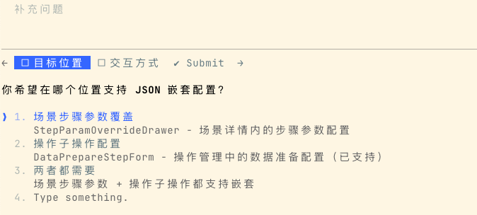

文档先行，之后给出多种方案，我来审核，确认方案或者补充，给出计划，执行计划，检查结果；

交互式审核节点，确保阻断所有关键执行操作；

其实就是 zcf，用 zcf 中的 workflow，再加上提示词，甚至不需要额外的约束，就嘎嘎用完事

**交互选项模式**：研究/构思/计划阶段的确认与补充，必须使用 AskUserQuestion 提供选项，禁止开放式问答

六步工作流 yyds

这个是真的牛逼，今晚回去必须尝试下。