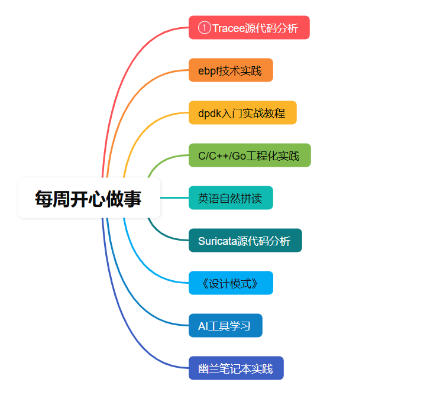

# Cloud Security Study

本仓库收集了关于云安全、网络安全、Golang 实践以及 AI 辅助编程相关的学习资料和实践笔记。

## 📚 目录

每周都做着自己喜欢做的事情，太开心了。

### 🔒 网络安全

如何加深对suricata的源代码的理解，当然是不断的调试代码，

- **Suricata 相关**
  - [Suricata 编译安装部署](./3-网络安全/Suricata%20编译安装部署.md) - Suricata IDS/IPS 系统编译安装指南
  - [suricata产品化调研](./3-网络安全/suricata产品化调研.md) - Suricata 产品化调研报告
  - [使用deepwiki辅助学习suricata](./3-网络安全/使用deepwiki辅助学习suricata.md) - 使用 AI 工具学习 Suricata
  - [Suricata实战教程](./3-网络安全/Suricata实战教程/) - Suricata 实战教程目录
  - **Suricata源代码分析** - Suricata 源码深度分析
    - [阅读总纲](./3-网络安全/Suricata源代码分析/0-suricata源代码-阅读总纲(非常重要).md) - Suricata 源码学习路线图
    - **数据包捕获与解析**
      - [AF_PACKET模式](./3-网络安全/Suricata源代码分析/1-suricata数据包捕获1-AF_PACKET模式.md) - AF_PACKET 数据包捕获机制
      - [DPDK模式](./3-网络安全/Suricata源代码分析/1-suricata数据包捕获2-dpdk模式.md) - DPDK 高性能数据包捕获
      - [PCAP模式](./3-网络安全/Suricata源代码分析/1-suricata数据包捕获3-pcap模式.md) - PCAP 文件数据包捕获
      - [IPv4解析](./3-网络安全/Suricata源代码分析/1-suricata数据包解析-ipv4.md) - IPv4 数据包解析机制
      - [运行模式详解](./3-网络安全/Suricata源代码分析/1-suricata运行模式详解.md) - Suricata 各种运行模式分析
    - **流表管理**
      - [流初始化](./3-网络安全/Suricata源代码分析/2-suricata流表管理1-流初始化.md) - 流表初始化机制
      - [流建立](./3-网络安全/Suricata源代码分析/2-suricata流表管理2-流建立.md) - 流建立过程分析
      - [流老化](./3-网络安全/Suricata源代码分析/2-suricata流表管理3-流老化.md) - 流老化机制
      - [伪造包处理](./3-网络安全/Suricata源代码分析/2-suricata流表管理4-伪造包.md) - 伪造包检测与处理
      - [Flow引用计数](./3-网络安全/Suricata源代码分析/2-suricata流表管理5-Flow引用计数.md) - 流引用计数管理
    - **流重组**
      - [基础概念及背景](./3-网络安全/Suricata源代码分析/3-suricata流重组1-基础概念及背景.md) - 流重组基础理论
      - [红黑树数据结构](./3-网络安全/Suricata源代码分析/3-suricata流重组2-红黑树数据结构.md) - 红黑树在流重组中的应用
      - [状态机](./3-网络安全/Suricata源代码分析/3-suricata流重组3-状态机.md) - 流重组状态机设计
      - [实际场景分析](./3-网络安全/Suricata源代码分析/3-suricata流重组4-实际场景分析.md) - 流重组实际应用场景
    - **应用层协议识别**
      - [探测解析器](./3-网络安全/Suricata源代码分析/4-suricata应用层协议识别1-探测解析器.md) - 协议探测机制
      - [模式匹配](./3-网络安全/Suricata源代码分析/4-suricata应用层协议识别2-模式匹配.md) - 协议模式匹配算法
      - [协议期望](./3-网络安全/Suricata源代码分析/4-suricata应用层协议识别3-协议期望.md) - 协议期望机制
    - **应用层协议解析**
      - [插件架构](./3-网络安全/Suricata源代码分析/5-suricata应用层协议解析1-插件架构.md) - 协议解析插件架构
      - [新协议添加流程](./3-网络安全/Suricata源代码分析/5-suricata应用层协议解析2-新协议添加流程.md) - 如何添加新协议支持
    - **规则检测引擎**
      - [AC自动机算法](./3-网络安全/Suricata源代码分析/6-suricata规则检测引擎1-AC自动机算法.md) - AC 自动机在规则检测中的应用
      - [Hyperscan算法](./3-网络安全/Suricata源代码分析/6-suricata规则检测引擎2-Hyperscan算法.md) - Hyperscan 高性能模式匹配
    - **基础组件**
      - [数据包队列](./3-网络安全/Suricata源代码分析/7-suricata基础组件1-数据包队列PacketQueue.md) - PacketQueue 数据包队列管理
      - [流队列](./3-网络安全/Suricata源代码分析/7-suricata基础组件2-流队列FlowQueue.md) - FlowQueue 流队列管理
    - [日志系统剖析](./3-网络安全/Suricata源代码分析/sruicata日志源代码剖析.md) - Suricata 日志系统源码分析
    - [流程图](./3-网络安全/Suricata源代码分析/流程图/) - 相关流程图和设计图
    - [图片资源](./3-网络安全/Suricata源代码分析/picture/) - 源码分析相关图片

- **网络流量分析**
  - [netcap](./3-网络安全/netcap/) - 网络流量分析工具研究
  - [qtap加密流量可视化平台](./3-网络安全/qtap加密流量可视化平台/) - 加密流量可视化分析平台

### 🚀 Golang 生产环境最佳实践
- [Golang Pipeline 模式](./Golang生产环境最佳实践/golang%20pipeline模式.md) - 详细介绍 Golang 中的 Pipeline 设计模式

### 🔧 eBPF 学习
- [kyanos parse_skb 函数流程解析](./ebpf学习/kyanos%20parse_skb函数流程解析.md) - 深入分析 eBPF 中的 parse_skb 函数实现
- [ebpf tail call尾调用学习](./ebpf学习/ebpf%20tail%20call尾调用学习.md) - eBPF 尾调用机制学习
- [cilium ebpf-go库学习](./ebpf学习/cilium%20ebpf-go库学习.md) - Cilium eBPF Go 库学习
- [ebpf文档编写](./ebpf学习/ebpf文档编写.md) - eBPF 文档编写指南
- [bfcli命令行使用](./ebpf学习/bfcli命令行使用.md) - bfcli 命令行工具使用

### 🤖 AI 辅助编程实战
- [AI 学习大纲](./AI辅助编程实战/AI学习大纲.md) - AI 学习路线图
- [AI 工具的一点思考](./AI辅助编程实战/AI工具的一点思考.emmx) - 关于 AI 工具的实践思考
- **AI 辅助编程实战系列**
  - [第三章 - 代码生成与优化](./AI辅助编程实战/AI辅助编程实战-第三章.md) - AI 辅助代码生成实践
  - [第五章 - 智能调试](./AI辅助编程实战/AI辅助编程实战-第五章.md) - AI 辅助调试技术
  - [第六章 - 自动化测试](./AI辅助编程实战/AI辅助编程实战-第六章.md) - AI 辅助测试自动化
  - [第八章 - 代码审查](./AI辅助编程实战/AI辅助编程实战-第八章.md) - AI 辅助代码审查
  - [第九章 - 性能优化](./AI辅助编程实战/AI辅助编程实战-第九章.md) - AI 辅助性能优化
- [picture](./AI辅助编程实战/picture/) - 相关图片资源

## 📖 使用说明

1. **文档结构**：每个分类下的文档都是独立的，可以根据需要单独阅读
2. **格式支持**：文档采用 Markdown 格式编写，可以使用任意 Markdown 阅读器查看
3. **资源路径**：部分文档包含图片资源，请确保在查看时保持相对路径不变
4. **学习建议**：
   - 网络安全：建议从 Suricata 编译安装开始，然后学习实战教程
   - eBPF：推荐先学习 tail call 机制，再深入 parse_skb 函数分析
   - AI 辅助编程：可以按照章节顺序学习，从基础到高级应用

## 🎯 学习路径推荐

### 网络安全方向
1. **Suricata 学习路径**：
   - 基础入门：编译安装部署 → 产品化调研
   - 实战应用：Suricata实战教程
   - 源码深入：按总纲顺序学习源码分析
     - 数据包捕获与解析（AF_PACKET/DPDK/PCAP）
     - 流表管理（初始化→建立→老化→引用计数）
     - 流重组（基础概念→红黑树→状态机→实际场景）
     - 协议识别与解析（探测→匹配→期望→插件架构）
     - 规则检测引擎（AC自动机→Hyperscan）
     - 基础组件（队列管理）
2. 掌握网络流量分析工具 netcap
3. 了解加密流量可视化平台 qtap

### eBPF 技术方向
1. 理解 eBPF 基础概念
2. 学习 tail call 尾调用机制
3. 深入分析 kyanos parse_skb 函数
4. 掌握 Cilium eBPF Go 库使用

### AI 辅助编程方向
1. 阅读 AI 学习大纲制定学习计划
2. 按章节顺序学习 AI 辅助编程实战
3. 结合实际项目应用 AI 工具

## 🤝 贡献

欢迎提交 Pull Request 来完善和补充内容。如果您发现任何问题或有改进建议，可添加微信 `hao1078285863` 提出 Issue，欢迎网络安全同行批评指正。

## 📄 许可证

本项目采用 MIT 许可证，详见 [LICENSE](./LICENSE) 文件。

## ⭐ 支持

如果这个项目对您有帮助，请给个 Star ⭐ 支持一下！
