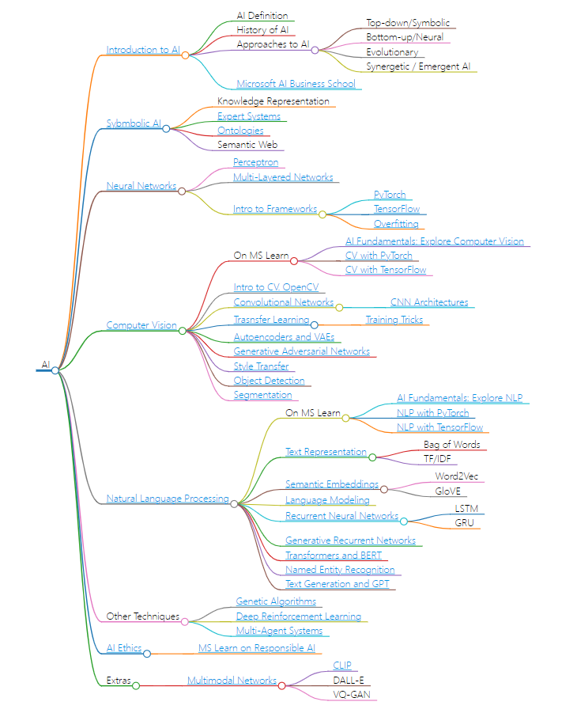

# 第一章：ChatGPT以及LLM基础入门

1.1 课程简介

1.2.1 ChatGPT定义、什么是语言模型？

1.2.2 GPT的运行原理

1.2.3 什么是Chat GPT、什么是Token？

1.3.1 注册账号，什么是Chat GPT Plus

1.3.2 什么是API

1.3.3 OpenAI的API是如何计费的？

1.3.4 什么是Playground？

1.3.4.1 详解Temperature和Top P

1.3.4.2 Frequency、Presence、Penalty、上下文

1.3.5 幻觉 Hallucnation

1.4 其他大语言模型

脑图提纲：第一章

# 第二章：Prompt Engineering基础

2.1 Prompt Engineering简介

2.2.1 简单提示

2.2.2 角色提示

2.2.3 引导提示

2.2.4 Shot Prompting

2.2.5 完整的Prompt的格式和元素

2.3.1 清晰明了重点明确

2.3.2 给GPT时间“思考”

2.3.3 ChatGPT和API的不同

脑图提纲：第二章

# 第三章：Prompt基础应用

3.1 LLM的核心优势以及OpenAI的例子

3.2 我最喜欢的应用 批评家

3.3 信息加工：如何高效利用ChatGPT进行内容整合

3.4 文案撰写和标题党模型

3.5 简单而重磅的应用

脑图提纲：第三章

# 第四章：高级Prompt技巧及应用案例

4.1 提示元素

4.2 终极Prompt模板

4.3.1 思维链 - 什么是思维链COT

4.3.2 零样本思维链

4.3.3 思维链例子

4.4 自洽性

4.5 阶梯提示Step Prompting

4.6 思维树

4.7 生成知识法

4.8 基线法

4.9 自我评估优化

4.10 让ChatGPT微调Prompt

4.11 Prompt生成器

4.12 JSON格式简介

脑图提纲：第四章

第五章：其他高级应用案例

5.1 VideoGenius可自定义的视频助手Prompt

5.2.1 实战演练-前言

5.2.2 实战演练-第一次尝试

5.2.3 实战演练-使用名字测试记忆

5.3.1 AI与自动化

5.3.2 自动批量Prompt

5.3.3 自动批量Prompt - 捷径版

5.4 自定义指令-高级数据分析

脑图提纲：第五章

附录：

YouTube公开视频
如何区别Chat GPT和GPT，每个人都必须了解的ChatGPT基础

多功能ChatGPT捷径，手把手教学如何集成常用的Chat GPT任务

揭秘OpenAI超级插件：Code Interpreter如何改变数据分析与可视化的游戏规则

ChatGPT Code Interpreter高级指南

参考文档：

https://www.promptingguide.ai/zh/techniques/fewshot

之前我还真没听过阶梯提示这东西。

**阶梯提示（Step Prompting）** 是一种通过分阶段、逐步引导AI生成更精准结果的提示技巧。它通过拆解复杂任务为多个简单步骤，逐步细化需求，能够显著提升输出质量。以下是阶梯提示的核心逻辑和示例：

------

### **一、阶梯提示的4个核心作用**

1. **降低认知负荷**：将复杂问题拆解为可操作的子任务
2. **建立思维链**（Chain-of-Thought）：引导AI模拟人类推理过程
3. **避免幻觉干扰**：通过分步验证减少错误累积
4. **提升可控性**：在每个关键节点给予修正机会

https://github.com/microsoft/AI-For-Beginners

微软AI路线的脑图如下所示：

照着上面的课程一节一节的做就行。

# 机器学习漫画小抄

https://book.douban.com/subject/37142144/

终于有人把机器学习整理成漫画书啦！轻松入门机器学习！

https://www.bilibili.com/video/BV1B14peREk5/?vd_source=553cfea04504936858081191fc1520dc

机器学习的

https://ai-bot.cn/ai-tools/
