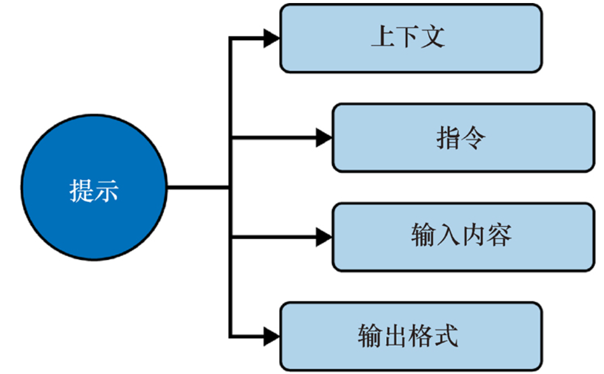

# 三、Prompt Engineering提示工程

## 3、1 初识提示工程

### 提示工程是什么？

专注于研究如何让计算机更准确的理解和解释人类的语言。

这个学科的核心目标是探索与LLM和复杂AI系统有效对话的方法，以便他们能够生成我们所需的答案。


### 为什么需要提示工程？

​	正如在向他人寻求建议时需要提供背景信息和明确的请求一样，LLM同样需要这样的上下文。

​	**沟通时添加帮助理解的上下文信息：**设计问题或提示时需要精心构思，有时甚至需要在问题中加入提示或附加信息，以确保LLM能够准确理解你的需求。

​	**多次沟通，逐步细化：**向LLM提问并不总是一次性的，有时更像是与LLM进行一系列对话，通过不断交流和调整问题，最终获得有价值的信息。


### 没有一成不变的提示词规则，只有不断学习、适应和完善

提示工程没有一劳永逸的解决方案，面上的许多课程、视频和图书声称揭示了提示工程的“秘诀”。对此，你需要保持谨慎。

随着人工智能和机器学习不断进化，固定不变的方法不可行，需持续学习和适应技术变化。


## 3、2 挑战（先不讲）

### 啰嗦

LLM有时会过于啰嗦。

你给出一个提示，它会提供一段很详尽的回答，而实际上你可能只需要一个简短的答案。


### 不可迁移

在一个LLM中表现出色的提示词，但在另一个LLM中可能效果不佳。

原因：不同的LLM采用模型不同，不同的模型是在不同的数据集和算法上训练出来的，对提示词的理解和解释也各不相同。


### 长度敏感

LLM可能会对过长的提示词感到困惑，开始忽略或误解你输入的部分内容。

**最佳实践**：尽量将提示词内容限制在一页之内，先不用提供过多的细节。


### 歧义

如果你的提示词不够明确，LLM可能会感到困惑，并提供与事实不符或完全虚构的回答。因此，提供清晰的提示至关重要。


## 3、3 提示词

提示(prompt)主要由4个部分组成：



在构建有效的提示词时，**上下文**是关键，它定义了LLM在回答问题时所扮演的角色。

紧接着是**具体的指令**，为了使LLM能够更准确地处理并给出恰当的回答，你需要提供相关的输入内容。

此外，明确指出你需要的输出格式也很重要。

代码-注释-单元测试-使用文档，都是需要在提示词中说明，LLM才会考虑输出这些内容。

向LLM提供的细节越具体，得到的回答往往越精准。

接下来的内容，将会分别介绍上述每个组件。


## 3、4 上下文

这通常包括指定LLM在回答时应该扮演的角色或身份。

**场景1：**调试代码，可采用下面的上下文：

提示词：**你是一位专注于Java应用程序调试的经验丰富的软件工程师。**


**场景2：**学习算法优化技术，可采用下面的上下文：

提示词：**你是一位擅长算法优化的资深软件开发人员**


提供清晰的上下文有助于引导LLM以合适的视角和专业知识来处理提示，从而以正确的方式给出回答。


## 3、5 指令

提示中至少应包含一个**明确**的指令。


尽量不要包含多个指令。**为什么呢？**

**首先，**指令不够清晰和自相矛盾，LLM可能会感到迷茫，不确定应优先考虑哪个指令。

**其次，**指令越多意味着LLM需要处理的信息量越大。LLM必须解析和理解提示的每个部分，然后确定如何综合这些部分，以形成一连贯的回答。

**最后，**LLM按顺序阅读指令。指令的排列方式会影响模型对提示的理解，进而影响得到的回答质量。


**专业建议是保持简单。与其一次性向LLM提出一系列复杂问题，不如尝试将问题拆分成一系列较小的提示。使查询过程更像是一次轻松的对话，而不是一段冗长的独白。**


下一个章节中，我们会详细说以下软件开发中常用的指令类型：

软件开发中常用的指令类型：

### 3、5、1 摘要

**一种摘要是浓缩，**将较长的文本浓缩为较短的形式，同时保留主要观点和要点。

| 用例         | 描述                                                         | 提示范例                                             |
| ------------ | ------------------------------------------------------------ | ---------------------------------------------------- |
| 代码文档     | 简明扼要的描述大量文件，重点介绍关键功能、依赖关系和结构     | 总结以下文档讨论的要点，快速概述代码库               |
| 缺陷报告     | 快速识别大量或冗长的缺陷报告中的主要问题                     | 总结以下缺陷报告中的常见问题，找出需要解决的主要问题 |
| 研究报告     | 从冗长的研究论文或技术文章中提取简介的见解，为用户提供最新的研究或技术信息 | 概述以下研究论文中讨论的关键结论和技术               |
| 变更日志     | 从冗长的变更日志中了解代码库或工具新版本中的关键变更         | 在以下1.1.2版本的变更日志中总结关键变更              |
| 电子邮件主题 | 从冗长的电子邮件列表中提取讨论或决策的要点                   | 总结以下电子邮件讨论的要点                           |

另一种摘要是主题建模，通过统计模型辨识文档集中出现的抽象”主题“。

以下是一些专为开发者设计的主题建模提示。

- 提示：请从以下文本中识别讨论的关键主题：{text}

- 提示：请从以下文本中提取关键词，以推断其主要话题：{text}

- 提示：请根据以下文本的内容，为其推荐标签：{text}


### 3、5、2 文本分类

文本分类是一项让计算机为文本分配标签的任务。

情感分析是文本分类的一种应用，LLM能够识别社交媒体帖子中表达的是积极、消极还是中性的情感倾向。


### 3、5、3 建议

你可以指导LLM提供建议，以下是一些实用的参考提示。

- 提示：调用以下代码片段时抛出NullPointerException异常。你能帮助我找出潜在原因并提出修复建议吗？

- 提示：这是我编写的一个函数，用于对整数列表进行排序。你能否提出一些优化建议，使其运行得更快或更具可读性？


让LLM来优化代码时，要给出具体的优化方向，比如指明要LLM使其运行得更快或更具可读性？


**优势：**

- 作为工作中的强大助力，帮你节省时间

- 想法比自己考虑的还周全


**劣势：**

回答过于简化，忽略了某些细节；

训练模型的数据时间不是最新的，所以无法掌握最新的信息。


## 3、6 输入内容（明确的示例）

在构建提示时，使用####或“”“等特殊符号来明确区分指令和希望LLM学习的内容或信息，是一种非常有效的策略。

这些符号充当边界或标记，旨在帮助LLM清晰的识别指令的结束点和内容的开始点。


在编码领域中使用特殊符号（如 `####` 或 `"""`）是为了**组织提示词的结构、明确指令的范围、优化模型的理解和输出**。


### 3、6、1 指令与输入内容的分离

在编码任务中，指令和输入内容分离是非常重要的，尤其是当需要 LLM 处理特定的输入时，使用特殊符号可以避免混淆。

**任务：对提供的代码进行优化。使用 `####` 分隔指令与代码输入。**

```
#### 指令 ####
以下是一段未优化的代码，请对其进行优化，提升性能和可读性。

#### 输入代码 ####
def calculate_sum(numbers):
    result = 0
    for i in range(len(numbers)):
        result += numbers[i]
    return result
```

`####` 明确分隔了指令和输入代码，避免模型将输入代码误解为任务要求的一部分。


### 3、6、2 使用边界标记分隔输入和生成内容

**最佳实践：**
始终使用边界标记（如 `####` 或 `"""`）明确区分 **输入内容** 和 **模型需要生成的内容**，避免混淆。
边界标记可以帮助 LLM 理解上下文，确保指令结束后仅生成用户期望的内容。


示例：

```
#### 输入内容 ####
请根据以下描述生成一个 C++ 类：
1. 定义一个 `Person` 类，包含两个属性：`name`（字符串）和 `age`（整数）。
2. 提供一个 `introduce` 方法，输出 "My name is [name], and I am [age] years old."。
3. 在 `main` 函数中创建一个 `Person` 对象并调用 `introduce` 方法。

#### 输出代码 ####
```

生成的结果：

```
#include <iostream>
#include <string>
using namespace std;

class Person {
private:
    string name;
    int age;

public:
    Person(const string& name, int age) : name(name), age(age) {}

    void introduce() const {
        cout << "My name is " << name << ", and I am " << age << " years old." << endl;
    }
};

int main() {
    Person p("Alice", 30);
    p.introduce();
    return 0;
}
```


### 3、6、3 支持复杂任务的逐步生成（演示此处）

任务：设计一个类 `Rectangle`，逐步完成类的定义、方法添加和主函数调用。

**第一步：**

```
#### 第一步：定义类 ####
请定义一个类 `Rectangle`，包含两个属性：`width` 和 `height`（均为 `double` 类型）。

#### 输出代码 ####
```


**第 1 步结果：**

```
class Rectangle {
private:
    double width;
    double height;

public:
    Rectangle(double w, double h) : width(w), height(h) {}
};
```


**第二步：**

```
#### 第二步：添加方法 ####
为类 `Rectangle` 添加一个方法 `area`，返回矩形的面积。

#### 输出代码 ####
```

**第2步结果：**

```
class Rectangle {
private:
    double width;
    double height;

public:
    Rectangle(double w, double h) : width(w), height(h) {}

    double area() const {
        return width * height;
    }
};
```


**第三步：**

```
#### 第三步：主函数调用 ####
请编写主函数，创建一个 `Rectangle` 对象并调用 `area` 方法，打印面积。

#### 输出代码 ####
```

**第 3 步结果：**

```
#include <iostream>
using namespace std;

class Rectangle {
private:
    double width;
    double height;

public:
    Rectangle(double w, double h) : width(w), height(h) {}

    double area() const {
        return width * height;
    }
};

int main() {
    Rectangle rect(5.0, 10.0);
    cout << "Area: " << rect.area() << endl;
    return 0;
}
```


备注：在描述任务要求时，以无序列表或无序列表的方式来进行描述，会显得条理很清晰，LLM也更容易理解我们提的任务要求。


## 3、7 输出格式

在提示词中，可以告诉LLM如何格式化输出。请看下面的例子。

**提示：创建一个Python函数，接收用户对象列表（每个对象包含一个用户的ID和姓名），并返回一个将用户ID映射到姓名的JSON对象。将输出转换为JSON格式。**


在构建提示时，可以通过指定**期望的回答长度**来进一步指导LLM。

例如，通过使用“请提供一个简短的概述”或“请写出一个详细的解释”等指令，可以帮助模型理解回答的深度和广度。

## 3、8 优秀实践

随着你和LLM交流的深入，你将逐渐发现一些适合自己的、更为有效的提问技巧。这些提问技巧是提示工程领域的重要组成部分。


### 3、8、1 越具体越好

提示词中的信息越详尽、越清晰越好。如果提示过于模糊，LLM就可能做出错误的假设，甚至产生不切实际的幻想。

场景需求：设计一个 C++ 程序，接收一组学生的成绩（每个学生有姓名和成绩），并将其转换为一个格式化的输出，显示每个学生的姓名及对应的成绩。


**正面示例：提示具体且明确**

请编写一个 C++ 程序，接收一组学生的成绩，并格式化输出如下内容：

- 每行显示一个学生的姓名及其成绩（例如：`Alice: 85`）。
- 输入应是一个包含学生姓名和成绩的向量。
- （**这句很值得学习**）请提供一个完整的程序，包括必要的头文件、输入数据的初始化，以及格式化输出的实现。
- 请附加适当的注释解释代码逻辑。


```
#include <iostream>
#include <vector>
#include <string>
using namespace std;

int main() {
    // 定义学生成绩的向量，包含学生姓名和成绩
    vector<pair<string, int>> students = {
        {"Alice", 85},
        {"Bob", 90},
        {"Charlie", 78}
    };

    // 遍历向量并格式化输出每个学生的姓名和成绩
    for (const auto& student : students) {
        cout << student.first << ": " << student.second << endl;
    }

    return 0;
}
```


**反面示例：提示模糊且无深度要求**

请写一个 C++ 程序来处理学生的成绩。


LLM模型可能生成的答案：

```
#include <iostream>
using namespace std;

int main() {
    cout << "学生成绩管理程序" << endl;
    return 0;
}
```

**模糊性：** 提示没有说明输入是什么、输出格式如何，也没有具体要求程序的功能，导致模型无法理解任务的深度和目标。

**生成代码质量：** 生成的代码没有任何具体实现，仅仅是一个占位程序，完全不符合场景需求。


**正反面对比总结**

| 比较点             | 正面示例                                                     | 反面示例                                   |
| ------------------ | ------------------------------------------------------------ | ------------------------------------------ |
| 提示的具体性       | 明确输入（向量）、输出格式（姓名: 成绩）以及程序构成（完整代码） | 未说明输入结构、输出内容或程序细节。       |
| 回答深度与广度要求 | 要求“完整的程序并附加注释”，引导模型生成有深度的代码及解释。 | 未指定回答范围，导致模型生成的代码过于简单 |
| 模型生成内容的质量 | 生成了完整的程序，包含数据初始化、逻辑实现和注释，可直接运行。 | 生成了无实际意义的代码，无法满足需求。     |


### 3、8、2 专业术语与缩略语

在构建提示时，明确专业术语和缩略语至关重要。缩略语在不同的语境中往往有不同的含义，这可能导致模型提供不相关或无效的回答。

假设你正在使用ChatGPT帮助解决数据库连接问题，以下是一个设计不当的提示。

```
提示：DB连接出现问题。如何解决？
```

在上述提示中，“DB”指代不清，因为它可能指MySQL、PostgreSQL或其他数据库系统，而且也没有说明数据库连接问题的细节。

```
提示：在尝试使用JDBC连接PostgreSQL数据库时，我遇到了连接超时问题。如何解决这个问题？
```

这个改进后的提示清楚地指明了正在使用的数据库系统(PostgreSQL)、连接的方法（使用JDBC）以及遇到的具体问题（连接超时）。


### 3、8、3 零样本学习和少样本学习

TODO：暂时没弄明白如何用示例来表达这个事情


### 3、8、4 引导词


### 3、8、5 思维链CoT提示

思维链技术是需要好好学习下的。


### 3、8、6 引导性问题


### 3、8、7 请求类比示例

设想你并不熟悉面向对象编程中继承的概念。打开ChatGPT并输入以下提示。

```
提示：解释面向对象编程中继承的概念。
```

你将得到一个详细的答复。如果你希望获得更易于理解的解释，一种有效的方法是让LLM使用类比来说明。

```
提示：通过类比解释面向对象编程中继承的概念。
```

Chatgpt可能给出的答案如下：

```
ChatGPT：把继承想象成一棵家谱树，孩子从父母那里继承某些特征和属性，而这些特征和属性也可能是孩子从祖父母那里继承的。
```


## 3、9 减少幻觉

什么是幻觉？

造成幻觉的原因有哪些？

如何减少LLM的幻觉呢？


## 3、10 安全和隐私


## 3、12 小结


将AI作为我的老师，在我学习过程中答疑解惑；

将AI作为总结和辅助读书的软件，帮你更好的读懂一本书。

对于开放性问题，我们要如何提问呢？比如如何优化数据库？


