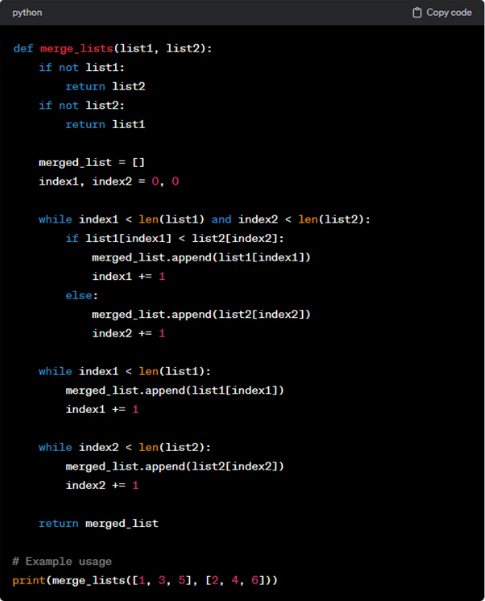

# 第八章 编写代码

## 8、1 现状：AI辅助编程工具能代替开发者吗？



上述chatGPT生成的代码，将两个已排序的列表合并为一个新的列表。上述代码虽然实现了功能，但是采用了低效繁琐的方式：使用两个额外的while循环来追加每个列表中剩余的元素。


这正是程序员发挥编程智慧作用的地方。你必须了解基础知识，并且知道在事情不太对劲时应该问什么问题以及对哪里进行探究。


**AI辅助编程工具的威力不容小觑，但是它的作用是辅助而非替代。**

在和AI辅助编程工具协作时，请时刻记住一点：开发者和AI辅助编程软件之间是伙伴关系，而不是把所有权利下放给AI。保持你的敏锐洞察力和无尽好奇心，审慎的审视AI辅助编程工具所提供给你的每一个建议。


## 8、2 决策，是否采用AI辅助编程工具

有时亲自动手编程可能比依赖AI辅助编程工具更为直接和简单。

毕竟想让AI准确理解需求，可能需要进行多次尝试和调整。然而，随着对AI辅助编程工具使用的深入，你将逐渐学会判断何时该利用它们的帮助，何时更适合独立完成任务。


**决策依据：解释一项任务给AI所需的时间 VS 亲自实现它所需的时间**


## 8、3 提升学习效率（AI是为了量身打造的专属老师）

学习新的编程语言、框架、库，可以极大的提升学习效率。

传统方式：看书、视频、动手搜索，缺少个性化和及时反馈

AI的教学是符合孔子的因材施教：

- 有人喜欢通过实践来学习，那么可以请求AI工具提供代码示例，帮助你理解如何更好的应用技术
  - 以适合自己的小项目来以战养战。
- 有人喜欢通过对比法来学习，不管是编程世界和真实世界的对比或类比学习法，或者是不同编程语言的对比或类比学习法，都能帮助你更快掌握新的编程语言或其他知识。
  - 面向对象的概念我理解的不好，请用C和C++语言分别编写下面向对象的代码实现，阐述他们的区别。
  - 我熟悉如何在C++中使用循环。你能通过比较来告诉我循环在Python中是如何工作的吗？
- 如果你是初学者，可以找AI帮你推荐适合入门的学习资料或者完整的技术路径。
  - 对于C++初学者，我应该首先学习哪些内容？
  - 查找5个有助于学习Rust的网络视频
- AI能在你准备LeetCode面试题时提供帮助。通过和AI进行交换，获得更多的解释和示例。

创建有用的学习指南，可以采用如下提示：

**提示：请为我制定一份学习计划表。我应该学习哪些主题？有哪些联系或测验？遇到编程问题如何处理？有哪些资源链接？**


## 8、4 高效注释

在紧张的项目截至日期的压力下，开发者可能会忽视编写代码注释，甚至完全不写。

然而，AI辅助编程工具可以轻松解决这一问题，帮助提升代码的可读性和可维护性。


如果想给某些代码添加注释，可以使用如下提示：

**提示：根据最佳编程实践添加清晰的注释。**


## 8、5 模块化编程

模块化编程好处

- 代码更有序
- 代码更易于理解
- 代码更适应
- 不同团队成员专注于各自的模块内工作，在协作时互不干扰，降低出错的概率


​	自从采用AI工具，我能够专注于问题本身及其解决方案，而不必深陷于编写代码的细节。面对技术难题，我会先将它分解为更小的部分，并确保每一部分的输入和输出都清晰明确。

​	我发现，如果只要求模型提供简单输入、单一功能、可验证输出的代码片段，调试和构建过程将变的更加顺畅。

​	对结果不满意，我会想AI重新描述我的问题，或者纠正它的错误，然后查看它重新提供的新代码并运行；

​	对结果满意，我会进一步细化前一步的输出，或者在现有函数中继续添加逻辑，以使其更接近我的最终目标。


## 8、6 快速启动项目

在编程项目的初期，开发者常常面临所谓的“空白页难题”。即没有一行代码，没有数据，更没有明确的行动方向。像泛在汪洋大海上的一叶扁舟，足以令人感到无力和迷茫。

启动项目时，面临的首要难题就是确定项目的架构、设计模式和技术栈。

AI可以帮你快速搭建应用程序的基础框架，并根据你心中的想法生成一个定制化的初始版本v0.1，哈哈。

你只需要提出具体的任务需求，然后让AI为你生成模板或初始代码即可。

提示词：

```
为web应用程序生成启动代码，该应用程序旨在将用户的社交媒体信息从多个平台聚合到一个单一的仪表盘界面上。对于编程语言和框架的选择，你有何建议？通用的文件结构又应该是怎么样的？
```


## 8、7 自动填充

### 1）相似的数据结构

对于一些数据或数据结构很相近时，此时可用AI来进行自动填充。

### 2）重复性操作

- 处理list、map等增删改查操作
- 业务的CRUD操作
- 对于表格的增删改查


# 8、8 重构

### 8、8、1 忍者代码

何为忍者代码？

炫技、晦涩难懂、错综复杂的代码，一句话总结：华而不实！！！

**计算列表中数字之和的忍者代码示例：**

```
s=lambda l:len(l)and(l[0]+s(l[1:]))if isinstance(l[0],(int,float))else(s(l[1:])if l else 0)
```

**计算列表中数字之和的标准代码示例：**

```
def sum_numbers(numbers):
    """计算列表中所有数字的和，忽略非数字元素"""
    total = 0
    for item in numbers:
        if isinstance(item, (int, float)):
            total += item
    return total
```

忍者代码可能展示了一些卓越的编程技巧，但他们往往与良好的编程实践不符。

良好的编程实践应该是保持代码整洁、简洁且易于理解。


忍者代码示例需要花费大量时间才能弄清楚逻辑。所以，为什么不让AI辅助工具来完成这项工作呢？

**提示词：请逐步解释这段代码的工作原理。另外，你能否以一种更简单、更易于维护的方式来重构这段代码？并添加上对应的单元测试呢？**


### 8.8.2 提炼函数

提炼函数是重构冗长函数/方法的常用技巧

主要步骤：

- 识别执行特定任务的代码片段(如数据验证、特定计算)
- 将该代码片段抽取形成新的函数/方法


提炼函数的优点：

- 代码复用性 - 避免重复编写相同逻辑
- 可读性强 - 函数名表达代码功能，易于理解
- 易维护 - 问题定位准确，修改影响可控
- 职责单一 - 每个函数专注特定任务
- 职责单一后，更便于编写单元测试代码


提示词1：我附上一些xxx语言的代码。请问哪些部分适合使用提炼函数进行重构？

提示词2：请比较原始函数和使用提炼函数后的重构班额不能，哪个效率更高？


### 8.8.3 分解条件表达式

#### 1）分解if条件语句

一个需要检查多个变量状态或调用其他函数的复杂if条件语句，与其每次都去解读这个复杂的条件，不如将其提炼到一个具有描述性名称的方法中，从而清晰的表达条件检查的目的。


#### 2）分解if-then-else语句

将if语句中的then和else代码块也分别提炼到不同的方法中，可以让程序的主流程更加清晰易读。

读者在阅读代码时，能够从高层次了解程序的走向：

如果条件成立，则执行一系列操作

如果条件不成立，则执行另一系列操作

### 8.8.4 重命名

随着代码的不断演进，原有的名称可能不再能够准确的反映函数、变量、类的功能，这时对他们进行重命名就显得尤为重要。


### 8.8.5 删除无用代码

**清除无用代码：**

- 提升可维护性 - 更整洁、易管理
- 降低认知负担 - 减少疑惑和猜测
- 优化代码质量 - 消除冗余实现


**提示词示例：**

```
提示：你能帮我识别JavaScript代码片段中潜在的无用代码吗？
提示：这是某Python项目中的一段代码。请指出其中未被使用或看起来多余的代码。
提示：请检查以下SQL存储过程，确认是否有代码可以安全移除。
```


使用AI辅助编程工具删除无用代码的风险：

- 误判 - 看似无用的代码可能处理特殊场景
- 依赖 - 移除代码可能触发连锁反应
- 局限 - AI难以完全理解代码间的复杂依赖

建议做法：

- 谨慎使用AI工具清理代码
- 人工确认代码依赖关系
- 等待AI工具更加成熟可靠
- 使用专门的工具，比如


深入挖掘函数和类的潜力；

代码重构：将杂乱无章的代码，重构为流畅、高效的代码结构；

自动生成前端界面的AI工具


想通过当前 AI 工具学习编程的人应该设定两个目标：

一是学会足够的编程知识以理解工具生成的内容；

二是扮演‘代码审核员’的角色，学会识别和改进劣质代码。

如何识别劣质代码呢？


首先，使用AI工具生成项目文件结构，

先总体使用AI工具将项目的轮廓大致构建出来，然后再深入到代码区一点点去完善每个模块和细节。

https://baoyu.io/translations/ai/if-you-use-ai-to-teach-you-how-to-code-remember-you-still-need-to-think-for-yourself


## 8、10 面向对象编程

帮助开发者设计类的初始结构。以下是一些设计类的提示范例：

```
使用C++语言，设计一个包含员工姓名(employeeName)、员工ID(employeeID)和部门等属性的Employee类。请实现一个方法来显示员工的详细信息，并包含一个构造函数来初始化这些属性。
```

AI工具生成的代码内容如下：

```
#include <iostream>
#include <string>
using namespace std;

class Employee {
private:
    string m_employeeName;  // 员工姓名
    int m_employeeID;       // 员工ID
    string m_department;    // 部门名称

public:
    // 构造函数，用于初始化成员变量
    Employee(const string& name, int id, const string& dept)
        : m_employeeName(name), m_employeeID(id), m_department(dept) {}

    // 方法：显示员工详细信息
    void displayDetails() const {
        cout << "Employee Details:" << endl;
        cout << "Name: " << m_employeeName << endl;  // 使用 m_ 命名成员变量
        cout << "ID: " << m_employeeID << endl;
        cout << "Department: " << m_department << endl;
    }
};

int main() {
    // 创建 Employee 对象并初始化
    Employee emp("John Doe", 1001, "Human Resources");

    // 显示员工详细信息
    emp.displayDetails();

    return 0;
}
```

## 8、11 框架和库

框架和库如果更新比较频繁的话，那么当AI工具的训练数据集并没有那么新时，可能会导致一些问题。


## 8、12 生成样本数据