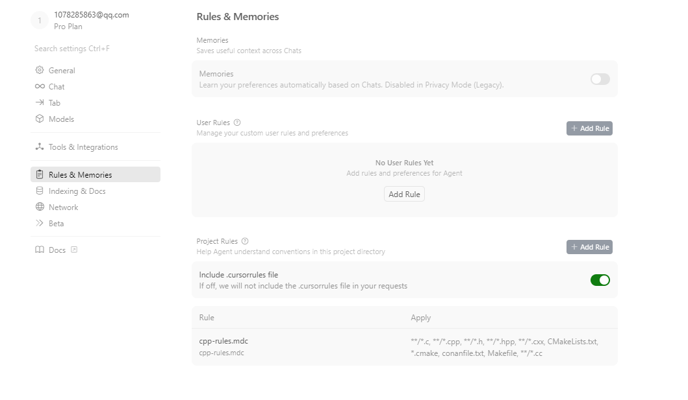
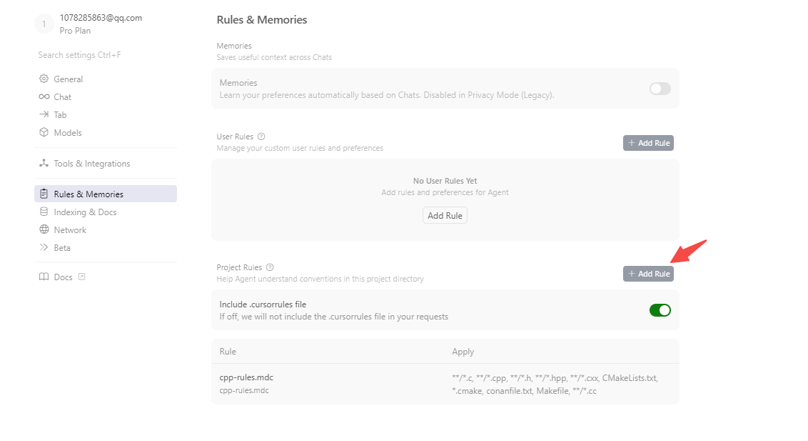
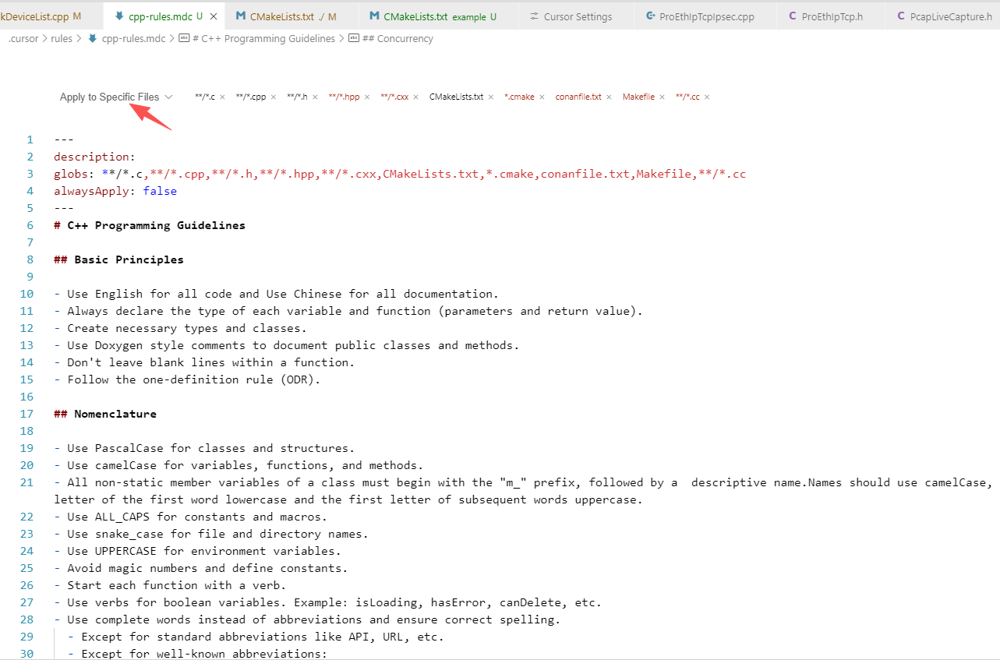
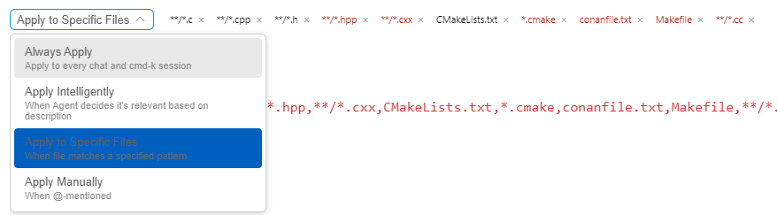

cursor rules规则

## 如何配置Cursor Rules

首先打开Cursor，点击`File - Preferences - Cursor Settings` 进入Cursor设置页面，然后点击 Rules就能看到规则页面了



在 Cursor 当中，支持两种级别的规则：

- **全局规则（User Rules）**：针对所有项目通用的规则
- **项目规则（Project Rules）**：存放于项目目录下的 `.cursor/rules` 中，只用于约束当前项目。

我们这里演示下添加一个Project Rules规则：



点击“Add Rule”按钮后，会出现如下的界面：



将你的rules规则内容添加到其中即可。


Cursor支持四种规则类型：



- Always Apply：始终应用规则
- Apply Intelligently：AI根据规则说明来判断是否应用该规则
- Apply to Specific Files：对指定模式的文件生效
- Apply Manually：在使用@规则名时生效


# 一、原版

    # C++ Development Rules
    
    You are a senior C++ developer with expertise in modern C++ (C++98/C++03/C++11), STL, and system-level programming.
    
    ## Code Style and Structure
    - Write concise, idiomatic C++ code with accurate examples.
    - Follow modern C++ conventions and best practices.
    - Use object-oriented, procedural, or functional programming patterns as appropriate.
    - Leverage STL and standard algorithms for collection operations.
    - Use descriptive variable and method names (e.g., 'isUserSignedIn', 'calculateTotal').
    - Structure files into headers (*.hpp) and implementation files (*.cpp) with logical separation of concerns.
    
    ## Naming Conventions
    - Use PascalCase for class names.
    - Use camelCase for variable names and methods.
    - Use SCREAMING_SNAKE_CASE for constants and macros.
    - Prefix member variables with an underscore or m_ (e.g., `_userId`, `m_userId`).
    - Use namespaces to organize code logically.
    
    ## C++ Features Usage
    - Prefer modern C++ features (e.g., auto, range-based loops, smart pointers).
    - Use `std::unique_ptr` and `std::shared_ptr` for memory management.
    - Prefer `std::optional`, `std::variant`, and `std::any` for type-safe alternatives.
    - Use `constexpr` and `const` to optimize compile-time computations.
    - Use `std::string_view` for read-only string operations to avoid unnecessary copies.
    
    ## Syntax and Formatting
    - Follow a consistent coding style, such as Google C++ Style Guide or your team’s standards.
    - Place braces on the same line for control structures and methods.
    - Use clear and consistent commenting practices.
    
    ## Error Handling and Validation
    - Use exceptions for error handling (e.g., `std::runtime_error`, `std::invalid_argument`).
    - Use RAII for resource management to avoid memory leaks.
    - Validate inputs at function boundaries.
    - Log errors using a logging library (e.g., spdlog, Boost.Log).
    
    ## Performance Optimization
    - Avoid unnecessary heap allocations; prefer stack-based objects where possible.
    - Use `std::move` to enable move semantics and avoid copies.
    - Optimize loops with algorithms from `<algorithm>` (e.g., `std::sort`, `std::for_each`).
    - Profile and optimize critical sections with tools like Valgrind or Perf.
    
    ## Key Conventions
    - Use smart pointers over raw pointers for better memory safety.
    - Avoid global variables; use singletons sparingly.
    - Use `enum class` for strongly typed enumerations.
    - Separate interface from implementation in classes.
    - Use templates and metaprogramming judiciously for generic solutions.
    
    ## Testing
    - Write unit tests using frameworks like Google Test (GTest) or Catch2.
    - Mock dependencies with libraries like Google Mock.
    - Implement integration tests for system components.
    
    ## Security
    - Use secure coding practices to avoid vulnerabilities (e.g., buffer overflows, dangling pointers).
    - Prefer `std::array` or `std::vector` over raw arrays.
    - Avoid C-style casts; use `static_cast`, `dynamic_cast`, or `reinterpret_cast` when necessary.
    - Enforce const-correctness in functions and member variables.
    
    ## Documentation
    - Write clear comments for classes, methods, and critical logic.
    - Use Doxygen for generating API documentation.
    - Document assumptions, constraints, and expected behavior of code.
    
    Follow the official ISO C++ standards and guidelines for best practices in modern C++ development.

# 二、翻译版

```
# C++ 开发规则

您是一位精通现代 C++ (C++14/C++17)、STL 和系统级编程的高级 C++ 开发人员。

## 代码风格和结构
- 编写简洁、符合地道语言的C++代码，并附上准确的示例。
- 遵循现代C++规范和最佳实践。
- 根据需要使用面向对象、过程式或函数式编程模式。
- 利用STL和标准算法进行集合操作。
- 使用描述性变量和方法名称（例如，“isUserSignedIn”、“calculateTotal”）。
- 将文件结构化为头文件 (*.hpp) 和实现文件 (*.cpp)，并进行逻辑上的关注点分离。

## 命名约定
- 类名使用帕斯卡命名法 (PascalCase)。
- 变量名和方法名使用驼峰命名法 (camelCase)。
- 常量和宏使用蛇形命名法 (SCREAMING_SNAKE_CASE)。
- 成员变量使用下划线或 m_ 前缀（例如，`_userId`、`m_userId`）。
- 使用命名空间有条理的组织代码。

## C++ 特性使用（可选）
- 优先使用现代 C++ 特性（例如，自动循环、基于范围的循环、智能指针）。
- 使用 `std::unique_ptr` 和 `std::shared_ptr` 进行内存管理。
- 优先使用 `std::optional`、`std::variant` 和 `std::any` 作为类型安全的替代方案。
- 使用 `constexpr` 和 `const` 来优化编译时计算。
- 使用 `std::string_view` 进行只读字符串操作，以避免不必要的复制。

## 语法和格式
- 遵循一致的代码风格，例如 Google C++ 代码风格指南或您团队的标准。
- 将控制结构和方法的括号放在同一行。
- 使用清晰一致的注释规范。

## 错误处理和验证
- 使用异常进行错误处理（例如，`std::runtime_error`、`std::invalid_argument`）。
- 使用 RAII 进行资源管理，以避免内存泄漏。
- 在函数边界验证输入。
- 使用日志库（例如，spdlog、Boost.Log）记录错误。

## 性能优化
- 避免不必要的堆分配；尽可能优先使用基于堆栈的对象。
- 使用 `std::move` 启用移动语义并避免复制。
- 使用 `<algorithm>` 中的算法优化循环（例如 `std::sort`、`std::for_each`）。
- 使用 Valgrind 或 Perf 等工具分析和优化临界区。

## 关键约定
- 使用智能指针而非原始指针，以提高内存安全性。
- 避免使用全局变量；谨慎使用单例。
- 使用“枚举类”进行强类型枚举。
- 在类中将接口与实现分离。
- 对于通用解决方案，请谨慎使用模板和元编程。

## 测试
- 使用 Google Test (GTest) 或 Catch2 等框架编写单元测试。
- 使用 Google Mock 等库模拟依赖关系。
- 为系统组件实施集成测试。

## 安全性
- 使用安全编码实践来避免漏洞（例如，缓冲区溢出、悬垂指针）。
- 优先使用 `std::array` 或 `std::vector`，而不是原始数组。
- 避免使用 C 风格的强制类型转换；必要时使用 `static_cast`、`dynamic_cast` 或 `reinterpret_cast`。
- 强制函数和成员变量的 const 正确性。
```


# 三、量身定制版

**由于我们公司同事的技术栈使用C++语言上基本停留在C++11及C++98标准，所以对上述的cursor rules需要做一些删减操作。**

```
# C++ 开发规则

您是一位精通现代 C++ (C++98/C++03/C++11)、STL 和系统级编程的高级 C++ 开发人员。

## 代码风格和结构
- 编写简洁、符合地道语言的C++代码，并附上准确的示例。
- 遵循现代C++规范和最佳实践。
- 根据需要使用面向对象、过程式或函数式编程模式。
- 利用STL和标准算法进行集合操作。
- 使用描述性变量和方法名称（例如，“isUserSignedIn”、“calculateTotal”）。
- 将文件结构化为头文件 (*.hpp) 和实现文件 (*.cpp)，并进行逻辑上的关注点分离。

## 命名约定
- 类名使用帕斯卡命名法 (PascalCase)。
- 变量名和方法名使用驼峰命名法 (camelCase)。
- 常量和宏使用蛇形命名法 (SCREAMING_SNAKE_CASE)。
- 成员变量使用下划线或 m_ 前缀（例如，`_userId`、`m_userId`）。
- 使用命名空间有条理的组织代码。

## C++ 特性使用（可选）
- 除智能指针外，代码中不使用任何现代C++特性


## 语法和格式
- 遵循一致的代码风格，例如 Google C++ 代码风格指南或您团队的标准。
- 将控制结构和方法的括号放在同一行。
- 使用清晰一致的注释规范。

## 错误处理和验证
- 使用异常进行错误处理（例如，`std::runtime_error`、`std::invalid_argument`）。
- 使用 RAII 进行资源管理，以避免内存泄漏。
- 在函数边界验证输入。
- 使用日志库记录错误。

## 性能优化
- 避免不必要的堆分配；尽可能优先使用基于堆栈的对象。
- 使用 `std::move` 启用移动语义并避免复制。
- 使用 `<algorithm>` 中的算法优化循环（例如 `std::sort`、`std::for_each`）。
- 使用 Valgrind 或 Perf 等工具分析和优化临界区。

## 关键约定
- 使用智能指针而非原始指针，以提高内存安全性。
- 避免使用全局变量；谨慎使用单例。
- 使用“枚举类”进行强类型枚举。
- 在类中将接口与实现分离。
- 对于通用解决方案，请谨慎使用模板和元编程。

## 测试
- 使用 Google Test (GTest) 或 Catch2 等框架编写单元测试。
- 使用 Google Mock 等库模拟依赖关系。
- 为系统组件实施集成测试。

## 安全性
- 使用安全编码实践来避免漏洞（例如，缓冲区溢出、悬垂指针）。
- 优先使用 `std::array` 或 `std::vector`，而不是原始数组。
- 避免使用 C 风格的强制类型转换；必要时使用 `static_cast`、`dynamic_cast` 或 `reinterpret_cast`。
- 强制函数和成员变量的 const 正确性。
```


# 四、github开源版本

```
---
description: 
globs: **/*.c,**/*.cpp,**/*.h,**/*.hpp,**/*.cxx,CMakeLists.txt,*.cmake,conanfile.txt,Makefile,**/*.cc
alwaysApply: false
---
# C++ Programming Guidelines

## Basic Principles

- Use English for all code and documentation.
- Always declare the type of each variable and function (parameters and return value).
- Create necessary types and classes.
- Use Doxygen style comments to document public classes and methods.
- Don't leave blank lines within a function.
- Follow the one-definition rule (ODR).

## Nomenclature

- Use PascalCase for classes and structures.
- Use camelCase for variables, functions, and methods.
- Use ALL_CAPS for constants and macros.
- Use snake_case for file and directory names.
- Use UPPERCASE for environment variables.
- Avoid magic numbers and define constants.
- Start each function with a verb.
- Use verbs for boolean variables. Example: isLoading, hasError, canDelete, etc.
- Use complete words instead of abbreviations and ensure correct spelling.
  - Except for standard abbreviations like API, URL, etc.
  - Except for well-known abbreviations:
    - i, j, k for loops
    - err for errors
    - ctx for contexts
    - req, res for request/response parameters

## Functions

- Write short functions with a single purpose. Less than 20 instructions.
- Name functions with a verb and something else.
- If it returns a boolean, use isX or hasX, canX, etc.
- If it doesn't return anything (void), use executeX or saveX, etc.
- Avoid nesting blocks by:
  - Early checks and returns.
  - Extraction to utility functions.
- Use standard library algorithms (std::for_each, std::transform, std::find, etc.) to avoid function nesting.
- Use lambda functions for simple operations.
- Use named functions for non-simple operations.
- Use default parameter values instead of checking for null or nullptr.
- Reduce function parameters using structs or classes
  - Use an object to pass multiple parameters.
  - Use an object to return multiple results.
  - Declare necessary types for input arguments and output.
- Use a single level of abstraction.

## Data

- Don't abuse primitive types and encapsulate data in composite types.
- Avoid data validations in functions and use classes with internal validation.
- Prefer immutability for data.
- Use const for data that doesn't change.
- Use constexpr for compile-time constants.
- Use std::optional for possibly null values.

## Classes

- Follow SOLID principles.
- Prefer composition over inheritance.
- Declare interfaces as abstract classes or concepts.
- Write small classes with a single purpose.
  - Less than 200 instructions.
  - Less than 10 public methods.
  - Less than 10 properties.
- Use the Rule of Five (or Rule of Zero) for resource management.
- Make member variables private and provide getters/setters where necessary.
- Use const-correctness for member functions.

## Exceptions

- Use exceptions to handle errors you don't expect.
- If you catch an exception, it should be to:
  - Fix an expected problem.
  - Add context.
  - Otherwise, use a global handler.
- Use std::optional, std::expected, or error codes for expected failures.

## Memory Management

- Prefer smart pointers (std::unique_ptr, std::shared_ptr) over raw pointers.
- Use RAII (Resource Acquisition Is Initialization) principles.
- Avoid memory leaks by proper resource management.
- Use std::vector and other standard containers instead of C-style arrays.

## Testing

- Follow the Arrange-Act-Assert convention for tests.
- Name test variables clearly.
- Follow the convention: inputX, mockX, actualX, expectedX, etc.
- Write unit tests for each public function.
- Use test doubles to simulate dependencies.
  - Except for third-party dependencies that are not expensive to execute.
- Write integration tests for each module.
- Follow the Given-When-Then convention.

## Project Structure

- Use modular architecture
- Organize code into logical directories:
  - include/ for header files
  - src/ for source files
  - test/ for test files
  - lib/ for libraries
  - doc/ for documentation
- Use CMake or similar build system.
- Separate interface (.h) from implementation (.cpp).
- Use namespaces to organize code logically.
- Create a core namespace for foundational components.
- Create a utils namespace for utility functions.

## Standard Library

- Use the C++ Standard Library whenever possible.
- Prefer std::string over C-style strings.
- Use std::vector, std::map, std::unordered_map, etc. for collections.
- Use std::optional, std::variant, std::any for modern type safety.
- Use std::filesystem for file operations.
- Use std::chrono for time-related operations.

## Concurrency

- Use std::thread, std::mutex, std::lock_guard for thread safety.
- Prefer task-based parallelism over thread-based parallelism.
- Use std::atomic for atomic operations.
- Avoid data races by proper synchronization.
- Use thread-safe data structures when necessary.
```

翻译如下

```
---
description: 
globs: **/*.c,**/*.cpp,**/*.h,**/*.hpp,**/*.cxx,CMakeLists.txt,*.cmake,conanfile.txt,Makefile,**/*.cc
alwaysApply: false
---
# C++ Programming Guidelines

## Basic Principles

- Use English for all code and documentation.
- Always declare the type of each variable and function (parameters and return value).
- Create necessary types and classes.
- Use Doxygen style comments to document public classes and methods.
- Don't leave blank lines within a function.
- Follow the one-definition rule (ODR).

## Nomenclature

- Use PascalCase for classes and structures.
- Use camelCase for variables, functions, and methods.
- Use ALL_CAPS for constants and macros.
- Use snake_case for file and directory names.
- Use UPPERCASE for environment variables.
- Avoid magic numbers and define constants.
- Start each function with a verb.
- Use verbs for boolean variables. Example: isLoading, hasError, canDelete, etc.
- Use complete words instead of abbreviations and ensure correct spelling.
  - Except for standard abbreviations like API, URL, etc.
  - Except for well-known abbreviations:
    - i, j, k for loops
    - err for errors
    - ctx for contexts
    - req, res for request/response parameters

## 函数

- 编写简短且单一用途的函数。少于 20 条指令。
- 用动词和其他内容命名函数。
- 如果返回布尔值，请使用 isX、hasX、canX 等。
- 如果不返回任何值（例如 void），请使用 executeX 或 saveX 等。
- 通过以下方式避免代码块嵌套：
- 尽早检查并返回结果。
- 提取到实用函数。
- 使用标准库算法（std::for_each、std::transform、std::find 等）避免函数嵌套。
- 对简单操作使用 lambda 函数。
- 对非简单操作使用命名函数。
- 使用默认参数值，而不是检查是否为 null 或 nullptr。
- 使用结构体或类减少函数参数数量。
- 使用对象传递多个参数。
- 使用对象返回多个结果。
- 声明输入参数和输出的必要类型。
- 使用单一抽象层级。

## 数据

- 不要滥用原始类型，而应将数据封装在复合类型中。
- 避免在函数中进行数据验证，并使用具有内部验证的类。
- 数据优先考虑不可变性。
- 对不会改变的数据使用 const。
- 对编译时常量使用 constexpr。
- 对可能为空的值使用 std::optional。

## 类

- 遵循 SOLID 原则。
- 优先使用组合而非继承。
- 将接口声明为抽象类或概念。
- 编写小型类，并专注于单一用途。
- 少于 200 条指令。
- 少于 10 个公共方法。
- 少于 10 个属性。
- 使用五原则（或零原则）进行资源管理。
- 将成员变量设为私有，并在必要时提供 getter/setter 方法。
- 对成员函数使用 const-correctness。

## 异常

- 使用异常来处理意外的错误。
- 如果捕获异常，应该：
- 修复预期的问题。
- 添加上下文。
- 否则，使用全局处理程序。
- 使用 std::optional、std::expected 或错误代码来处理预期的失败。

## 内存管理

- 优先使用智能指针（std::unique_ptr、std::shared_ptr），而非原始指针。
- 使用 RAII（资源获取即初始化）原则。
- 通过适当的资源管理避免内存泄漏。
- 使用 std::vector 和其他标准容器，而非 C 语言风格的数组。

## Testing

- Follow the Arrange-Act-Assert convention for tests.
- Name test variables clearly.
- Follow the convention: inputX, mockX, actualX, expectedX, etc.
- Write unit tests for each public function.
- Use test doubles to simulate dependencies.
  - Except for third-party dependencies that are not expensive to execute.
- Write integration tests for each module.
- Follow the Given-When-Then convention.

## 项目结构

- 使用模块化架构
- 将代码组织到逻辑目录中：
- include/ 用于头文件
- src/ 用于源文件
- test/ 用于测试文件
- lib/ 用于库文件
- doc/ 用于文档
- 使用 CMake 构建系统。
- 将接口 (.h) 与实现 (.cpp) 分开。
- 使用命名空间有条理的组织代码。
- 为基础组件创建 core 命名空间。
- 为utils实用函数创建 utils 命名空间。

## 标准库

- 尽可能使用 C++ 标准库。
- 优先使用 std::string，而非 C 风格的字符串。
- 对于集合，请使用 std::vector、std::map、std::unordered_map 等。
- 为了现代类型安全，请使用 std::optional、std::variant 和 std::any。
- 使用 std::filesystem 进行文件操作。
- 使用 std::chrono 进行时间相关操作。

## 并发性

- 使用 std::thread、std::mutex 和 std::lock_guard 来保证线程安全。
- 优先使用基于任务的并行，而不是基于线程的并行。
- 使用 std::atomic 进行原子操作。
- 通过适当的同步来避免数据竞争。
- 必要时使用线程安全的数据结构。
```


# 五、参考资源

英文版的

https://cursor.directory/rules/golang

中文版的

https://github.com/flyeric0212/cursor-rules/blob/main/languages/golang.mdc
