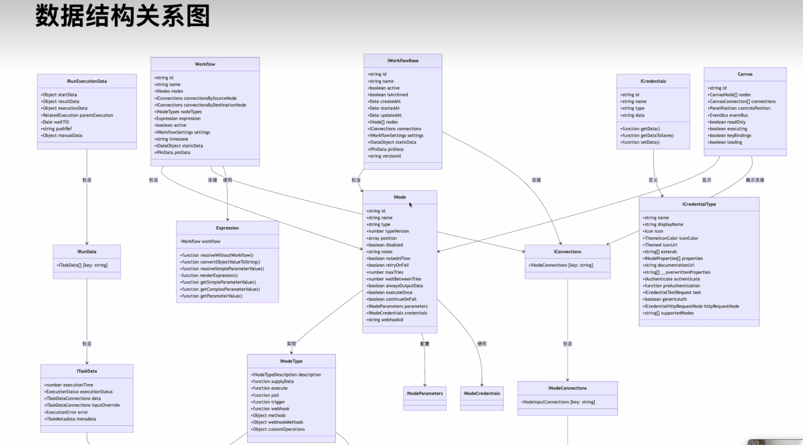

# Cursor 阅读开源项目指南

## 目录
- [一、背景与需求](#一背景与需求)
- [二、传统开发流程 vs AI辅助流程](#二传统开发流程-vs-ai辅助流程)
- [三、核心方法论：陈天老师的实践案例](#三核心方法论陈天老师的实践案例)
- [四、具体操作步骤](#四具体操作步骤)
- [五、关键技巧与注意事项](#五关键技巧与注意事项)
- [六、工具与资源](#六工具与资源)
- [七、实战案例与提示词](#七实战案例与提示词)

---

## 一、背景与需求

### 1.1 问题描述
公司项目经常需要借鉴多个开源项目的核心功能（包括主机安全和网络安全），组合成新的功能模块。如何使用 Cursor 高效地学习和借鉴开源项目的核心技术？


比如领导分配给我一个工作任务：

- 调研主机安全领域知名开源项目Elkeid和Tracee检测Rootkit的原理和优缺点对比
- 梳理其架构设计和实现思路，形成文档
- 根据上一步形成的文档，进行功能模块移植，或者自己实现

---

## 二、传统开发流程 vs AI辅助流程

之前没有ai工具时，程序实现上述需求的流程大致如下 

1、首先，公司项目借鉴A项目的某个功能模块，我先调研下此功能模块的技术选型，使用了什么技术，为啥使用这个技术 

2、其次，梳理这个功能模块的实现思路，整理成文档 

3、再次，根据梳理的技术实现思路和文档，再实现一个最小化的demo 

4、最后，把测试通过的功能模块demo代码，移植到公司项目中


### 2.1 传统流程（无AI工具时）
1. **技术调研**：分析功能模块的技术选型，了解使用的技术栈及其原因
2. **思路梳理**：整理功能模块的实现思路，形成技术文档
3. **原型开发**：根据梳理的技术方案，实现最小化demo
4. **代码移植**：将测试通过的功能模块集成到公司项目中

### 2.2 AI辅助流程的优势
- **快速理解**：AI能够快速分析大量代码，提取核心逻辑
- **自动文档生成**：生成需求文档和设计文档
- **跨语言转换**：支持不同编程语言间的代码转换
- **可视化分析**：自动生成流程图和架构图

---

## 五、关键技巧与注意事项

### 5.1 阅读重点
- **核心功能**：项目的主要功能特性
- **架构设计思路**：架构设计和实现理念
- **数据结构关系**：使用 Mermaid 图表可视化

### 5.2 文档组织规范
- 所有规格文档存储在 `./specs/` 目录
- 提示词模板存储在 `./specs/instructions/` 目录
- 遵循项目规范文件（design-patterns.mdc、code-quality.mdc 等）


### 5.3 推荐工具
- **Spec Kit**：适合从0到1的项目规划
  - 地址：https://github.com/github/spec-kit
- **Cursor Memory Bank**：增强AI记忆能力
  - 地址：https://cursor.zone/faq/how-to-use-cursor-memory-bank.html
- **DeepWiki**：项目初步了解（内容相对简单）


### 5.4 数据结构关系图



---

## 七、实战案例与提示词

### 7.1 n8n工作流分析提示词
```
现在请根据代码库，研究Workflow是怎么运行的，请创建新的文件specs/execution.md详细介绍运行流程，并使用mermaid绘制flow diagram，sequential diagram等图标清晰的帮助我理解[项目名]的workflow
```

**重点**：使用mermaid来绘制流程图和序列图来帮助理解项目的逻辑。

### 7.2 运行模式分析提示词
```
现在请根据代码库来深入了解[项目名]的[特定模式]运行模式，并使用mermaid绘制flow diagram，sequential diagram等图标清晰的帮助我理解[项目名]的[特定模式]运行模式
```

**实际案例**：

```
现在请根据代码库来深入了解suricata的Runmode运行模式，并使用mermaid绘制flow diagram，sequential diagram等图标清晰的帮助我理解suricata的Runmode运行模式
```

