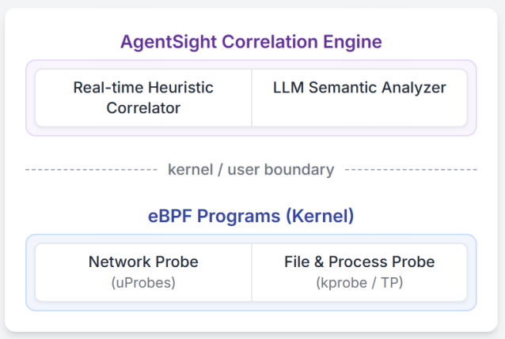

# AgentSight：基于 eBPF 的 AI 智能体系统级可观测性

> 原文：arXiv:2508.02736v2 [cs.OS] 2025年8月15日

**作者：**

- Yusheng Zheng — 加州大学圣克鲁兹分校，美国加州圣克鲁兹
- Yanpeng Hu — 上海科技大学，中国上海
- Tong Yu — eunomia-bpf 社区，中国
- Andi Quinn — 加州大学圣克鲁兹分校，美国加州圣克鲁兹

---

## 摘要

如今，越来越多的开发者开始使用 AI 编程助手（如 Claude Code、Gemini-cli）来写代码、维护系统。但这些 AI 智能体和传统软件完全不同——它们的行为不可预测，传统的监控手段很难应对。这就产生了一个关键的**语义鸿沟**：我们要么只能看到 AI "想做什么"（提示词层面），要么只能看到它"实际做了什么"（系统调用层面），但没办法把这两者关联起来。这种鸿沟让我们很难判断：AI 的操作到底是正常的，还是出了问题，甚至是被攻击了？

我们提出了 AgentSight，一个 AgentOps 可观测性框架，它采用混合方法来弥合这一语义鸿沟。我们的方法称为**边界追踪（boundary tracing）**，从应用代码外部、在稳定的系统接口上监控智能体，使用 eBPF 实现。AgentSight 拦截 TLS 加密的 LLM 流量以提取语义意图，监控内核事件以观测系统级影响，并通过实时引擎和二次 LLM 分析，跨进程边界对这两个流进行因果关联。这种无需代码插桩的技术与框架无关，能够适应快速的 API 变化，并且性能开销不到 3%。

我们的评估表明，AgentSight 能有效检测提示注入攻击、推理循环以及多智能体系统中的协调瓶颈。这种"用 AI 监控 AI"的方法为日益自主的 AI 系统的安全可靠部署提供了基础性方法论。

AgentSight 作为开源项目发布在 https://github.com/eunomia-bpf/agentsight。

---

## 1 引言

机器学习在系统中的角色正在经历一次根本性转变——从优化定义明确的任务（如数据库查询规划），转向一种全新的**智能体计算（agentic computing）**范式。从系统视角来看，AI 智能体将大语言模型（LLM）的推理能力与对系统工具的直接访问权限相结合，赋予其执行操作的能力，包括创建进程、修改文件系统和执行命令。这项技术正在快速融入生产环境，催生了 Claude Code、Cursor Agent 和 Gemini-CLI 等自主开发工具，它们能够独立处理复杂的软件工程和系统维护任务。从本质上说，我们正在部署非确定性的机器学习系统，这为系统可靠性、安全性和验证带来了前所未有的挑战。

这种范式转变产生了一个关键的语义鸿沟：智能体高层**意图**与其底层**系统操作**之间的鸿沟。与具有可预测执行路径的传统程序不同，智能体使用 LLM 和自主工具来动态生成代码并创建任意子进程。这使得现有可观测性工具难以区分正常操作和灾难性故障。考虑一个被分配代码重构任务的智能体——由于搜索结果中来自外部 URL 的恶意提示（间接提示注入），它读取到了后门指令。应用层监控可能只看到一次成功的"执行脚本"工具调用，而系统监控只看到一个 bash 进程在写入文件。两者都无法理解一个良性意图已被扭曲为恶意操作，从而使它们实际上处于盲区。

当前方法被困在语义鸿沟的某一侧。**应用层插桩**存在于 LangChain 和 AutoGen 等框架中，能够捕获智能体的推理和工具选择。虽然这些工具能看到**意图**，但它们是脆弱的、需要持续跟进 API 更新，且容易被绕过：一个 shell 命令就能逃脱它们的视野，在存在缺陷的信任模型下打破可见性链。相反，**通用系统级监控**能看到**操作**，追踪每个系统调用和文件访问。然而它缺乏语义上下文——对这类工具而言，一个正常编写数据分析脚本的智能体，和一个被入侵后编写恶意载荷的智能体，看起来毫无区别。如果不理解 LLM 指令（即"做了什么"背后的"为什么"），底层事件流就只是无意义的噪声。

我们提出**边界追踪**作为一种专门弥合语义鸿沟的新型可观测性方法。我们的关键洞察是：虽然智能体内部实现和框架是易变的，但它们与外界交互的接口——用于系统操作的内核和用于通信的网络——是稳定且不可回避的。通过从应用外部在这些边界上进行监控，我们可以同时捕获智能体的高层意图和底层系统影响。我们提出了 **AgentSight** 系统，它通过 eBPF 实现边界追踪：拦截 TLS 加密的 LLM 流量以获取意图信息，监控内核事件以获取影响信息。

其核心是一个新颖的两阶段关联过程：

实时引擎将 LLM 响应与其触发的系统行为进行关联，然后一个二级"观察者"LLM 对关联后的追踪进行深度语义分析，推断风险并解释一系列事件为何可疑。这种无需插桩、与框架无关的技术性能开销不到 3%。

我们的评估表明，AgentSight 能有效检测提示注入攻击、资源浪费型推理循环以及多智能体系统瓶颈。

总结而言，我们的贡献包括：

1. 我们提出了**边界追踪**作为 AI 智能体可观测性的原则性方法，通过在稳定的系统接口上监控来弥合语义鸿沟。
2. 我们提出了一种结合实时 eBPF 信号匹配和基于 LLM 语义分析的新型引擎，为理解智能体行为提供深度上下文。
3. 我们展示了 AgentSight 在检测提示注入攻击、推理循环和多智能体协调故障方面的有效性，且开销低于 3%。

---

## 2 背景与相关工作

本节概述 LLM 智能体架构，回顾现有可观测性工作以突出语义鸿沟，并介绍 eBPF 作为我们的基础技术。

### 2.1 LLM 智能体架构

引言中描述的智能体系统通常采用共同的架构实现。这些系统由三个核心组件组成：(1) 用于推理的 LLM 后端，(2) 用于系统交互的工具执行框架，(3) 编排提示、工具调用和状态管理的控制循环。LangChain、AutoGen、Cursor Agent、Gemini-CLI 和 Claude Code 等流行框架都实现了该模型的变体。这种架构使智能体能够基于高层自然语言目标，动态构建和执行复杂计划（例如自主编写和运行脚本来分析数据集）。多智能体 LLM 系统也已经出现在软件开发、协作问题解决、虚拟世界中的社会行为模拟等任务中。

### 2.2 LLM 智能体的可观测性

现有方法分别局限在语义鸿沟的某一侧。

​	**意图侧可观测性**由 Langfuse、LangSmith 和 Datadog 等行业工具支持，目前正在 OpenTelemetry GenAI 工作组和 AgentOps 概念下的学术分类体系推动下走向标准化。这类工具擅长追踪应用层事件，但对进程外的系统操作完全无能为力。

​	相反，**操作侧可观测性**借助 Falco 和 Tracee 等工具，能全面观察系统调用，但缺乏理解智能体**意图**的语义上下文，无法区分正常任务和恶意任务。关于推理层和可解释性的并行研究旨在通过重构认知追踪或启用解释性对话来使智能体的内部思维过程更加透明，但这些工作主要关注 LLM 本身，并未弥合智能体内部推理与其外部系统级影响之间的鸿沟。

### 2.3 扩展伯克利包过滤器（eBPF）

为了弥合语义鸿沟，我们的方法需要一种能够安全高效地同时观测网络通信和内核活动的技术。eBPF（扩展伯克利包过滤器）是内核可编程性的一项重大进步，正好提供了这种能力。eBPF 最初为包过滤而设计，现已发展成为通用的内核内虚拟机，驱动着现代可观测性和安全工具，且不限于 Linux。对于 AI 智能体可观测性，eBPF 具有独特优势：它允许在智能体与外界交互的精确边界上进行观测，既能通过 TLS 拦截获取语义**意图**，也能通过系统调用监控获取系统**操作**，且开销极低。关键的是，其内核强制的安全保证（包括经过验证的终止性和内存安全）使其适合生产环境，为我们的解决方案提供了稳定的基础。

---

## 3 设计

AgentSight 的设计由一个核心目标驱动：弥合智能体意图与其操作之间的语义鸿沟。我们通过一种新颖的可观测性方法——边界追踪来实现这一目标，并通过多因子关联引擎将其落地。

### 3.1 挑战

AI 智能体的涌现性和非确定性本质从根本上打破了传统程序可观测性范式，引入了两个传统可观测性无法解决的核心挑战。

**弥合意图与操作之间的语义鸿沟。** 第一个也是最重要的挑战是弥合智能体高层**意图**与其底层系统**操作**之间的巨大语义鸿沟。与意图编码在可预测源代码中的传统软件不同，智能体的意图以自然语言表达并由 LLM 解释，创建出在运行时生成的动态"源代码"。因此，静态分析器不可能确定智能体将做什么。例如，"找到并修复认证模块中的 bug"这一意图语义丰富但操作上模糊，可能产生一系列复杂的操作序列，如读取文件（openat2）、编译代码（execve -> gcc）和运行测试（execve -> python）。这产生了一个关键的可观测性问题：监控系统如何验证一系列系统调用是否是自然语言意图的合法实现？为解决这个问题，观察者必须超越简单的模式匹配，获得对智能体目标的语义理解，这就需要一种新的基于 LLM 的方法来解释关联后的追踪。

**从高容量系统噪声中隔离因果信号。** 第二个挑战源于智能体有权使用任何工具来实现其目标，导致不可预测的高容量系统事件流。智能体可能创建 shell、下载脚本或调用事先未知的编译器进程。这使得从操作系统的背景噪声中区分智能体的特定活动（"信号"）变得极其困难。静态预配置过滤器（例如只监控 git 命令的规则）本质上是脆弱的，一旦智能体使用 curl 和 bash 来实现类似结果就会失效。我们的设计通过积极的内核内 eBPF 过滤器来解决这个问题。通过追踪进程创建事件（fork、execve），过滤器构建智能体活动的完整血缘树，并在内核中动态应用规则，只传递来自智能体或其后代的事件。这种方法确保整个因果链在源头被高效捕获，大幅降低开销，并为关联和分析提供清洁、高保真的信号。

### 3.2 边界追踪：一种原则性方法

我们的关键洞察是：所有智能体交互都必须穿越定义明确且稳定的系统边界——用于系统操作的内核和用于与 LLM 服务后端通信的网络（图 1）。通过在这些边界上从应用外部进行监控（而非在易变的智能体代码内部），我们实现了不依赖于具体实现细节的全面监控。这种方法实现了**语义关联**——将高层意图与底层系统事件进行因果关联的能力。这由两个原则支撑：第一是**全面性**，内核级监控确保从进程创建到文件 I/O 的每个系统操作都不会遗漏，即使跨越衍生的子进程。第二是**稳定性**，系统调用 ABI 和网络协议的演化速度远慢于智能体框架，提供了持久且面向未来的解决方案。这种范式转变了信任模型：从假设智能体会配合监控，转变为在防篡改的边界上强制实施观测。

### 3.3 系统架构：观测边界

AgentSight 的架构同时接入两个关键边界。

如图 2 所示，我们使用 eBPF 部署非侵入式探针，从用户空间 SSL 函数捕获解密的**意图流**（LLM 提示/响应），同时从内核捕获**操作流**（系统调用、进程事件）。然后，关联引擎会把这两个数据流整合起来，建立"意图→操作"的因果链条。

多个关键组件使 AgentSight 能够有效弥合语义鸿沟：

**为什么选择 eBPF？** 我们选择 eBPF 是因为它安全、高性能，而且能同时访问用户空间和内核的数据流。我们的设计拦截智能体与 LLM 服务后端交互过程中的解密数据，这比网络级抓包或基于代理的方案更高效、更易管理。

**多因子关联引擎。** 系统的核心是把"意图"和"操作"关联起来。我们设计了一个多因子引擎，依赖三种关键机制：
- **进程血缘（Process Lineage）**：通过追踪 fork 和 execve 事件构建完整的进程树，将子进程中的操作关联回父智能体；
- **时间邻近性（Temporal Proximity）**：关联在 LLM 响应之后短时间窗口内发生的操作；
- **参数匹配（Argument Matching）**：将 LLM 响应中的内容（如文件名、URL 或命令）与后续系统调用的参数直接匹配。

这三种信号结合起来让 AgentSight 能够准确地把"AI 想做什么"和"系统实际发生了什么"对应起来，即使操作发生在子进程中也能追踪到。

**LLM 驱动的语义分析。** 传统的规则检测很容易被绕过，所以我们引入了一个二级 LLM 作为"观察者"。它接收关联后的事件追踪，能够理解上下文、推断因果关系，并用自然语言解释"这串操作为什么可疑"。这种"用 AI 监控 AI"的方法，让系统能发现那些不符合预设规则但确实异常的行为。

---

## 4 实现

AgentSight 作为用户空间守护进程实现，包含 6000 行 Rust/C 代码用于编排 eBPF 程序，以及 3000 行 TypeScript 前端用于分析。它专为高性能设计，将原始内核事件流处理为关联的、人类可读的数据。

### 4.1 边界处的数据采集

eBPF 探针负责从系统中采集两类原始数据：**意图流**和**操作流**。

**采集意图流：** 通过 uprobe 挂载到加密库（如 OpenSSL）的 SSL_read/SSL_write 函数，直接拦截解密后的 LLM 通信内容。由于 LLM API 通常使用流式协议（如 SSE），守护进程还实现了有状态的数据重组机制。

**采集操作流：** 通过 tracepoint（如 sched_process_exec）构建进程树，并用 kprobe 动态监控关键系统调用（如 openat2、connect、execve）。

**内核级过滤：** 为了应对高频的内核事件且不丢数据，我们在内核层面就做好过滤——只有来自目标智能体进程的事件才会被传到用户空间，大幅降低系统开销。

### 4.2 混合关联引擎

关联引擎分为两个阶段，由 Rust 编写的守护进程驱动。

**第一阶段：实时关联**
- 从 eBPF 环形缓冲区读取事件
- 补充上下文信息（比如把文件描述符还原为完整路径）
- 维护进程树，追踪父子关系
- 在 100-500 毫秒的时间窗口内，把 LLM 响应和随后的系统操作关联起来

**第二阶段：语义分析**
- 把关联后的事件整理成结构化日志
- 将日志输入给二级 LLM，让它扮演"安全分析师"的角色
- LLM 输出自然语言分析结果和置信度评分

**工程挑战：** LLM 分析会带来延迟和成本，我们通过异步处理和精心设计的提示词来优化。

---

## 5 评估

我们的评估围绕两个研究问题展开：第一，AgentSight 在实际工作流中的性能开销如何？第二，它在弥合语义鸿沟方面的效果如何——能否检测关键安全威胁和性能病理，同时揭示多智能体系统中的复杂动态？

### 5.1 性能评估

**表 1. AgentSight 引入的开销**

| 任务 | 基准时间 (秒) | AgentSight (秒) | 开销 |
|------|-------------|----------------|------|
| 理解仓库 | 127.98 | 132.33 | 3.4% |
| 代码编写 | 22.54 | 23.64 | 4.9% |
| 仓库编译 | 92.40 | 92.72 | 0.4% |

我们在一台服务器（Ubuntu 22.04，Linux 6.14.0）上使用 Claude Code 1.0.62（以 Claude 4 作为测试智能体）进行了评估。基准测试聚焦于三个真实开发者工作流，使用一个教程仓库：使用 `/init` 命令进行仓库理解、为 bpftrace 脚本生成代码，以及带并行构建的完整仓库编译。每个实验在有和无 AgentSight 的条件下各运行 3 次以测量运行时开销。表 1 量化了 AgentSight 在三个开发者工作流中的运行时开销，**平均开销为 2.9%**。

### 5.2 案例研究

我们通过案例研究评估了 AgentSight 的有效性，展示其检测安全威胁、识别性能问题以及洞察复杂多智能体系统的能力。

#### 5.2.1 案例研究 1：检测提示注入攻击

我们测试了 AgentSight 检测间接提示注入攻击的能力。在测试中，一个软件开发智能体被指示克隆并构建一个 C 项目。项目的 README 文件将智能体引导到一个提供含有隐藏提示的 HTML 的 URL。这个提示使智能体读取并将 /etc/passwd 发送到一个收集服务器，伪装成构建过程中的必要步骤。AgentSight 捕获了完整的关联攻击链：从初始 URL 获取到最终的网络数据外泄，521 个事件被关联引擎合并为 37 个事件。观察者 LLM 分析了这条追踪，返回了高置信度的攻击评分，并得出结论：智能体的行为与其既定目标在逻辑上不一致。这一结果证明了将意图因果关联到系统级操作能够实现有效的、上下文感知的威胁检测。

#### 5.2.2 案例研究 2：推理循环检测

尝试复杂任务的智能体可能由于常见的工具使用错误而进入无限循环。我们使用 crewai 和 gpt-4o-mini 实现了一个研究智能体，它反复使用错误参数调用 Web 搜索工具，收到错误后试图纠正，却反复重试完全相同的失败命令。AgentSight 的实时监控从 API 调用追踪中检测到了这种异常资源消耗，并传递给观察者 LLM。LLM 识别出根本原因是持续性工具错误，指出智能体陷入了"试错-再失败"的推理循环：它执行相同的失败命令，将相同的错误传回推理 LLM，却未能从工具输出中学习。

#### 5.2.3 案例研究 3：多智能体协调监控

AgentSight 监控了一个由 6 个协作软件开发智能体组成的团队，这些智能体使用 claude-code subagents 在我们的 GitHub 仓库上工作。经过关联引擎处理后，共捕获 3153 个事件。例如，前端智能体和测试智能体有时因顺序依赖而被阻塞，在并行开发和测试任务期间，文件锁定争用导致多次重试循环。分析表明，虽然智能体展现出了一些涌现性的协调行为，但更清晰地分离角色可以减少总运行时间和 token 消耗。这揭示了边界追踪独特地捕获了应用层监控无法跨进程边界观测到的多智能体系统动态。

---

## 6 结论

本文介绍了 AgentSight，旨在弥合 AI 智能体意图与其系统级操作之间的关键语义鸿沟，采用了新颖的**边界追踪**方法。通过利用 eBPF，系统在无需插桩的情况下监控网络和内核事件，通过混合关联引擎将 LLM 通信因果关联到其系统级影响。我们的评估表明，AgentSight 能有效检测提示注入攻击、推理循环和多智能体瓶颈，且性能开销不到 3%。这种"用 AI 监控 AI"的方法为日益自主的 AI 系统的安全可靠部署提供了基础性方法论。
