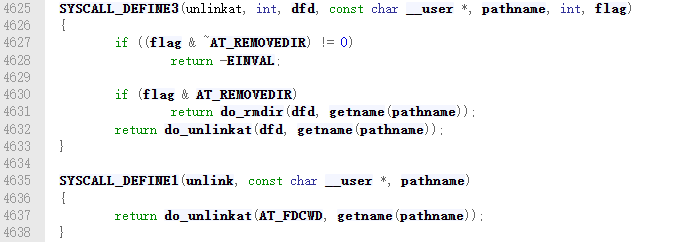
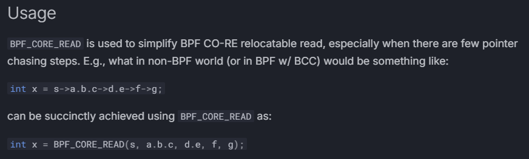

**初衷：通过ebpf技术监控unlink函数的执行**

需要一张ppt，大概枚举下写一个基于ebpf的kprobe程序的基本思路。

# 一、kprobe技术简介

简单介绍下理论知识，能够写代码了，我们就开始实战。

# 二、编码实践

## 2、1 查找跟踪点：找到unlink对应的内核函数

unlink 系统调用的功能是删除一个文件。

https://elixir.bootlin.com/linux/v6.14.5/source/fs/namei.c#L4553

从上述代码可以看出unlink系统调用其内部就是在调用**do_unlinkat**内核函数。该函数接受两个参数：`dfd`（文件描述符）和`name`（文件名结构体指针）。

## 2、2 `BPF_KPROBE`宏

**文档手册：**

https://docs.ebpf.io/ebpf-library/libbpf/ebpf/BPF_KPROBE/

**使用宏之前：**

程序编写者必须使用 PT_REGS_PARAM 宏从上下文中提取给定参数，然后手动将其转换为实际类型。

http://docs.ebpf.io/ebpf-library/libbpf/ebpf/PT_REGS_PARM/

**使用宏之后：**

BPF_KPROBE 宏允许你在程序中编写参数列表，宏会为你进行参数转换。这使得读写 kprobe 更加容易。

好处：让编写ebpf krpobe类型的程序更加的轻松。

用法：填写函数之前的原型，比如函数参数个数，函数参数类型，函数返回值等

## 2、3 `BPF_CORE_READ`宏

**文档手册：**

https://docs.ebpf.io/ebpf-library/libbpf/ebpf/BPF_CORE_READ/

**使用之前：**

**使用之后：**

简化了读取多级成员的操作，让程序员能够更专注的编写代码。