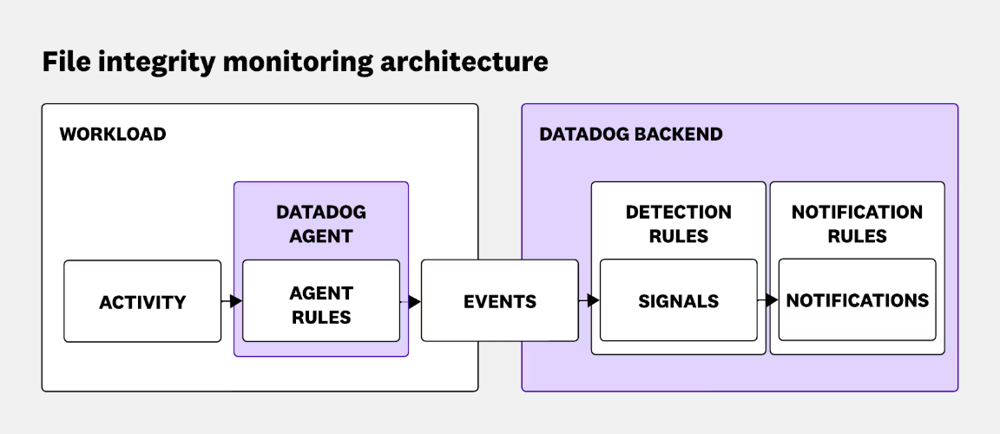
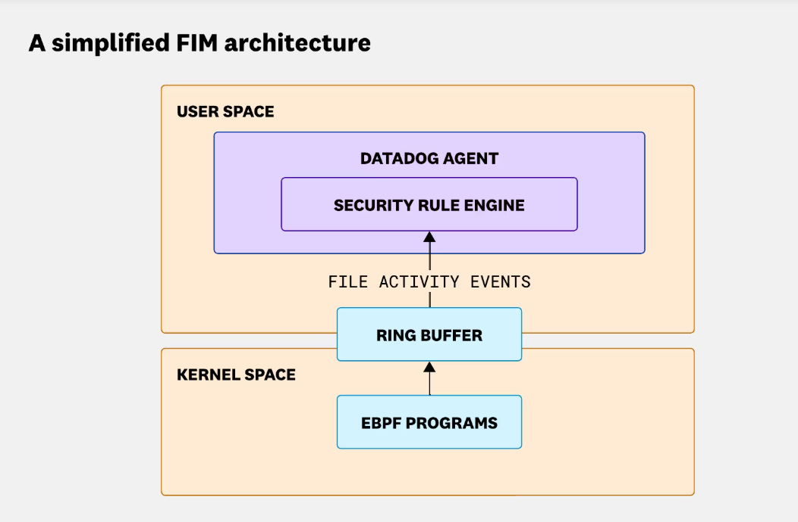
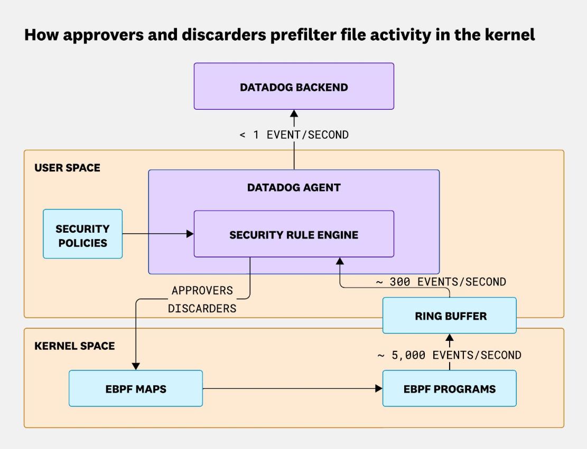

# 使用 eBPF 扩展实时文件监控

文件完整性监控（FIM）帮助团队检测对敏感文件的未授权更改，是任何安全态势的关键组成部分。然而，构建一个能够在现代大规模基础设施中可靠运行的 FIM 系统比看起来要困难得多。

当我们着手构建一个能够处理 Datadog 生产环境实际情况的 FIM 系统时，我们很快意识到现有方法无法满足需求。例如，定期文件系统扫描在理论上看起来简单可靠。但在实践中，它们会错过我们最关心的事件类型：如果攻击者篡改了一个文件并在下次扫描之前恢复了更改，那就像什么都没发生过一样。即使扫描确实捕获到了某些内容，它也只能告诉我们文件发生了更改——而不是如何更改���为什么更改或谁更改了它。对于一个专注于为安全团队提供可操作洞察的工程团队来说，这种可见性的缺失是不可接受的。

即使是传统的基于事件的 Linux 监控技术也存在显著的缺陷。`inotify` 缺乏将文件事件与进程和容器关联所需的系统级上下文，而 `auditd`——虽然更全面——通常在高系统负载下会面临性能开销大和可扩展性差的问题。

为了达到我们所需的上下文和可扩展性水平，我们转向了 [eBPF](https://ebpf.io/)。它为我们提供了一种直接从内核观察实时文件活动的方式，而不会牺牲稳定性或安全性。通过 eBPF，我们不仅可以看到文件被更改了，还可以看到是哪个进程触发了更改以及它在哪个容器中运行，为安全调查提供有意义的洞察。

这种可见性是有代价的。我们现在面对的是压倒性的数据量：在一个普通的周五下午，Datadog 整个基础设施每分钟产生超过 **100 亿个文件相关事件**。在不丢弃事件或降低主机性能的情况下处理这个数据流，成为我们必须解决的最困难的技术挑战之一。

在这篇文章中，我们将分享我们如何应对这一挑战，包括：

- 为什么 eBPF 在其他工具不足的地方为我们提供了所需的可观测性
- 我们如何在不压垮 Agent 或后端的情况下扩展到每分钟数十亿个事件
- 我们使用的技术如何直接在内核中预过滤 94% 的事件，而不丢失重要信号

## 在边缘管理负载：扩展 eBPF 驱动的文件监控

一旦我们通过 eBPF 解锁了对文件系统活动的深度可见性，我们就面临另一个挑战：规模。收集 Datadog 基础设施中的每个文件事件会产生海量数据，远远超出我们可以合理发送到后端的数量。

每个文件活动事件都携带关键上下文，例如触发它的进程、它运行的容器以及其他元数据。序列化后，这些上下文和文件信息每个事件大约 **5 KB**。在我们的规模下——每分钟超过 **100 亿个事件**——将所有内容发送到上游意味着每秒要通过网络推送数 TB 的数据。这些事件中的大多数不会匹配任何检测规则，最终会被丢弃，使得处理和存储成本无法接受。

挑战不仅限于后端。在 Agent 端，序列化和传输如此大量的数据流会导致 CPU 和内存使用率飙升，增加丢弃事件的风险——这恰恰与我们想要的相反。仅为安全监控就维持每台主机数百 Mbps 的出站流量根本不可行。

为了解决这个问题，我们引入了 **Agent 端规则**。我们不是将所有内容发送到上游，而是在每台主机上本地将文件活动与一组规则进行匹配。这使我们能够尽早丢弃噪音，只发送对安全调查重要的事件。通过在边缘过滤，我们大幅减少了需要序列化和传输的数据量——整个基础设施减少到大约 **每分钟 100 万个事件**——同时保持完整的检测覆盖范围。



*Datadog Agent 在将相关事件转发到后端进行检测和通知之前，会在本地过滤事件。*

## 在内核级别过滤 94% 的事件

当我们着手使用 eBPF 构建文件完整性监控解决方案时，我们很快意识到性能和覆盖范围之间的紧密联系。在 Agent 级别，eBPF 为我们提供了一种强大的方式来观察系统活动而不中断它，但这也意味着我们必须跟上不间断的事件流。在 Linux 环境中，几乎所有东西都被视为文件，系统调用和文件相关事件的数量是巨大的。实时处理这些数据洪流成为我们必须解决的核心工程挑战之一。

### 简化的 eBPF FIM 架构

乍一看，基本的基于 eBPF 的 FIM 解决方案背后的架构并不复杂。Agent 加载 eBPF 程序，这些程序挂载到系统中的关键点以观察活动。这些程序将数据推送到环形缓冲区，然后 Agent 从那里读取和分析每个事件。在理论上很简单。



*eBPF 程序在内核空间收集文件系统活动，并通过环形缓冲区将其发送到 Datadog Agent 的规则引擎。*

### 规模问题

现实很快就来了。我们一些更敏感的工作负载每秒生成 **多达 5,000 个相关系统调用**。这些不是背景噪音——它们是需要分析的安全相关事件。Agent 不仅要每秒解析数千个事件；它还必须在不丢弃任何事件且不在系统上留下明显性能足迹的情况下完成。处理这种数量本身不是困难的部分——在保持完整安全覆盖的同时做到零影响才是真正挑战的开始。

我们的第一次基准测试清楚地表明了规模问题。在某些主机上，Agent 难以跟上。流经环形缓冲区的事件流可能会超过 Agent 处理它们的能力，导致事件丢弃。每个错过的事件都意味着我们安全覆盖中的潜在盲点——这是专为检测篡改而设计的系统所不能承受的。

### 将逻辑移近内核

当我们分析性能瓶颈时，有一件事变得清晰：为了跟上高事件量并保持覆盖范围，我们需要重新思考逻辑的位置。我们做出了一个关键的架构转变——将尽可能多的事件评估移入我们的 eBPF 程序中。这使我们能够直接在内核中过滤掉不相关的事件，大幅减少通过环形缓冲区推送的数据量。只有真正重要的事件才会到达用户空间。

这种优化给了我们的 Agent 一个关键优势。即使被内核调度器抢占，它仍然可以在决定是否将事件发送到后端之前执行第二次更深入的评估。这是一个巨大的胜利，但它也带来了自己的一系列挑战。

## Approvers 和 Discarders：内核内预过滤

尽管 eBPF 功能强大，但它被有意限制以确保内核稳定性。这些限制，特别是在计算方面，保护系统免受失控程序的影响，但它们也使得运行复杂逻辑变得困难。在没有最新 eBPF 功能的旧内核上，这个挑战变得更加明显。

为了在这些限制内工作，我们采用了两阶段评估模型：

1. **内核内过滤：** 一个轻量级阶段，以最小的开销处理快速决策
2. **用户空间评估：** 一个更深入的阶段，执行完整评估——包含丰富的上下文、关联以及在内核中运行将是不可能（或不安全）的逻辑

为了使这种内核内过滤更有效，我们引入了两个核心概念：approvers（批准器）和 discarders（丢弃器）。

- **Approvers** 允许匹配某些条件的事件通过。
- **Discarders** 明确地尽早过滤掉噪音。

它们一起提供了一种精确高效的方式来管理事件流，而不会压垮 Agent 或其运行的系统。

### Approvers 的工作原理

Approvers 是在我们编译检测规则时生成的静态过滤器。通过分析每条规则的条件，我们可以识别出使事件值得在用户空间进行更深入查看的模式或特定值。

例如：

```
open.file.path == "/etc/passwd" && open.flags & O_CREAT > 0
```

在这种情况下，`passwd` 文件名是一个有意义的值。我们将其定义为 approver 并使用 eBPF maps 将其传递到内核中。这些 maps 在内核内实现快速、低开销的过滤，确保只有相关事件被转发到用户空间进行进一步分析。

### Discarders 如何补充它们

当然，事情不会一直这么简单。一条规则很容易，但当你管理��百条规则，每条规则在不同的系统调用中都有不同的字段和条件时，它很快就会变成一个复杂的优化问题。

根据规则表达式的不同，规则引擎可能并不总是能够生成 approvers。例如：

```
open.file.path == "/etc/*"
```

在这里，我们无法提取特定的文件名用作静态过滤器，因为 `*` 通配符匹配 `/etc/` 下的任何文件。没有具体的值可以提前批准。

这就是为什么我们还引入了 discarders，一种 approvers 的动态对应物。Discarders 由规则引擎在运行时创建。如果它确定某个特定的事件值永远不会匹配任何规则，它就会将该值标记为内核过滤的候选。

继续前面的例子，我们可以自信地说，任何对 `/tmp` 下文件的访问都永远不会匹配针对 `/etc/*` 的规则。在这种情况下，`/tmp` 成为一个 discarder。这些 discarders 通过 LRU eBPF maps 注入内核，使我们能够高效地过滤它们，同时控制内存使用。

与 approvers 一样，discarders 开始时很简单。但在具有大型且不断演变的规则集的现实环境中，弄清楚什么可以安全丢弃需要非平凡的算法。



*Approvers 和 discarders 在内核中协同工作，在将有意义的文件事件���递给 Datadog Agent 进行更深入分析之前过滤掉不相关的事件。*

Approvers 和 discarders 一起使我们能够**直接在内核中预过滤高达 94% 的事件**。这意味着在用户空间中需要处理的事件更少，CPU 使用率大幅降低，最重要的是，没有丢弃的事件。这种分层、自适应的过滤模型使我们的 FIM 解决方案即使在高负载下也能同时实现高性能和高覆盖率。

## 超越检测：用上下文丰富 FIM

在 eBPF 之上构建文件完整性监控既是挑战也是机遇。通过超越传统方法如定期扫描或 `inotify`，我们获得了捕获文件活动的实时、高保真洞察的能力，即使在短暂存在的进程和临时容器中也是如此。处理庞大的数据量迫使我们在内核内过滤、Agent 端规则以及 approvers 和 discarders 概念方面进行创新，这些一起使得在 Datadog 规模下同时保持性能和覆盖范围成为可能。

而 FIM 只是开始。检测到文件已更改很重要，但了解为什么更改、哪个进程或用户在幕后、以及当时系统上还发生了什么，才是将原始事件转化为可操作安全洞察的关键。我们的下一步是继续用尽可能多的上下文丰富 FIM，这样安全团队不仅知道发生了什么，而且拥有有效调查和响应所需的完整故事。
