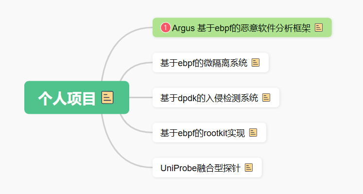
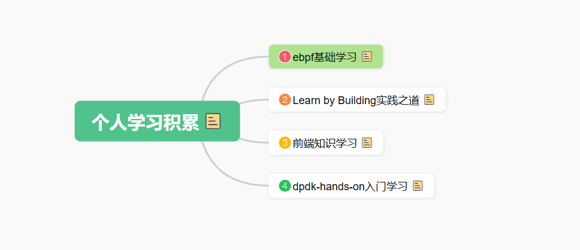

我最想做的一个开源是什么呢？

# 一、个人实战项目

## 优先做Argus项目的原因：

**1、收获github star，然后以个人项目放在明年的ebpf大会上展示会很酷，满满的成就感。**

**2、通过项目实战，能很好的磨练自己的ebpf技术，在实战中成长起来。**

**3、把golang开发知识捡起来，学习golang工程化实践技能。**

**4、学习前端知识，补齐我的技术栈，让自己在编程之路上越走越远。**

# 二、个人学习积累

现在的学习计划中，缺少对幽兰笔记本的使用，当时买这个笔记本，最大的愿望是希望能够把内核编程学习起来，起码能够调试编写的内核模块，但是现在这个事，你做了吗？我感觉你并没有做这个事啊，ebf的调试我也没做，多少是个遗憾。

把想做的事情驱动起来，现在已经有了做

使用AI + golang 或python学习各种机器学习算法

开源项目的方向是负责我网络安全的技术方向的；

学习开源代码是为了更好的实现自己的开源项目；

日常研究各种技术，

可以学习更多的AI算法，用以来分析高级威胁，不过我更推荐使用golang或者python的机器学习框架。

对我来说，可以很少的满足我的求知欲，