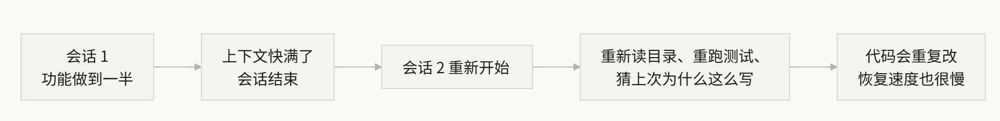
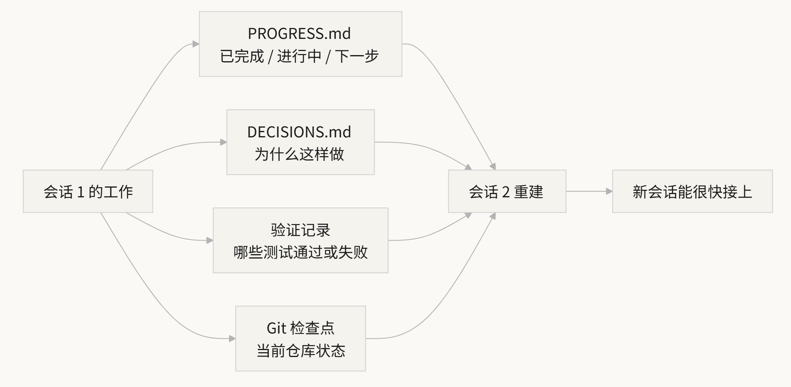

# 一、工作中遇到的问题

你让 Claude Code 帮你实现一个完整的功能，它跑了 30 分钟，做了大部分工作，但上下文快满了。

你开个新会话继续，然后发现：

它不记得上次做了什么决策、为什么选了方案 A 而不是方案 B、哪些文件已经改过、测试跑到什么状态了。

它得花 15 分钟重新探索一遍项目，而且可能跟上次的做法不一致。


上下文满了的原因：

agent 不只是在生成代码，它还要理解代码库、跟踪自己的决策历史、处理工具输出、维护对话上下文。


# 二、会话连续性流程

没有状态持久化文件的时候，每个新会话都要重新摸索：



有状态持久化文件的时候，新会话能快速接上：



状态持久化文件包括进度日志、决策日志、验证记录和Git检查点。


# 三、连续性断了以后会发生什么

## 3、1 决策错误

用户之前选择了方案A，会话断了后，AI可能基于不完整的信息重新做了决策，选择了方案B。


## 3、2 重复的代码实现

在没有进度记录的情况下，Agent 不确定某项工作是否已完成，重新做了一遍。更有甚者，做了一半发现跟已有的实现冲突，需要返工。


## 3、3 验证缺口

上个会话的验证结果（哪些测试通过、哪些失败、为什么失败）没有记录，新会话得重新跑一遍验证才能了解当前状态，很浪费宝贵的上下文。


# 四、状态持久化的实践方法

核心思路：**把 agent 当成一个每次会话都会清空短期记忆的工程师来管理。** 每次它要"下班"之前，必须把关键信息写下来，让下一个"接班"的 agent 能快速上手。

**工具 1：进度文件（PROGRESS.md）**。这是最基本的状态持久化文件：

```
# 项目进度

## 当前状态
- 最新 commit: abc1234 (feat: add user preferences endpoint)
- 测试状态: 42/43 通过 (test_pagination_edge_case 失败)
- Lint: 通过

## 已完成
- [x] 用户模型和数据库迁移
- [x] 基础 CRUD 端点
- [x] 认证中间件集成

## 进行中
- [ ] 分页功能 (90% - 边界条件测试失败)

## 已知问题
- test_pagination_edge_case 在空结果集时返回 500
- 需要确认是否要在列表中包含已删除用户

## 下一步
1. 修复分页边界条件 bug
2. 添加"是否包含已删除用户"的查询参数
3. 更新 API 文档
```

**工具 2：决策日志（DECISIONS.md）**。记录重要的设计决策和原因。不需要详细的设计文档，只需要"什么决策、为什么、什么时候做的"：

```
# 设计决策

## 2024-01-15: 使用 Redis 缓存用户偏好
- 原因: 读取频率高（每次 API 调用都需要），数据量小
- 否决方案: 用 PostgreSQL 物化视图（变更频率高，物化视图维护成本不划算）
- 约束: 缓存 TTL 设为 5 分钟，写入时主动失效
```

**工具 3：git 提交作为检查点。** 每完成一个工作单元就提交，commit message 要说清楚做了什么和为什么。这是免费的、自动版本化的状态快照。


**工具 4：init.sh 或 harness 的初始化流程。** 

在 `AGENTS.md` 里写明每次"上班"和"下班"的流程：

```
## 每次会话开始时（上班）
1. 读 PROGRESS.md 了解当前状态
2. 读 DECISIONS.md 了解重要决策
3. 跑 make check 确认仓库处于一致状态
4. 从 PROGRESS.md 的"下一步"部分继续工作

## 每次会话结束前（下班）
1. 更新 PROGRESS.md
2. 跑 make check 确认一致状态
3. 提交所有已完成的工作
```

**判断标准：如果任务需要的上下文超过窗口的 60%，就开始准备交接。**