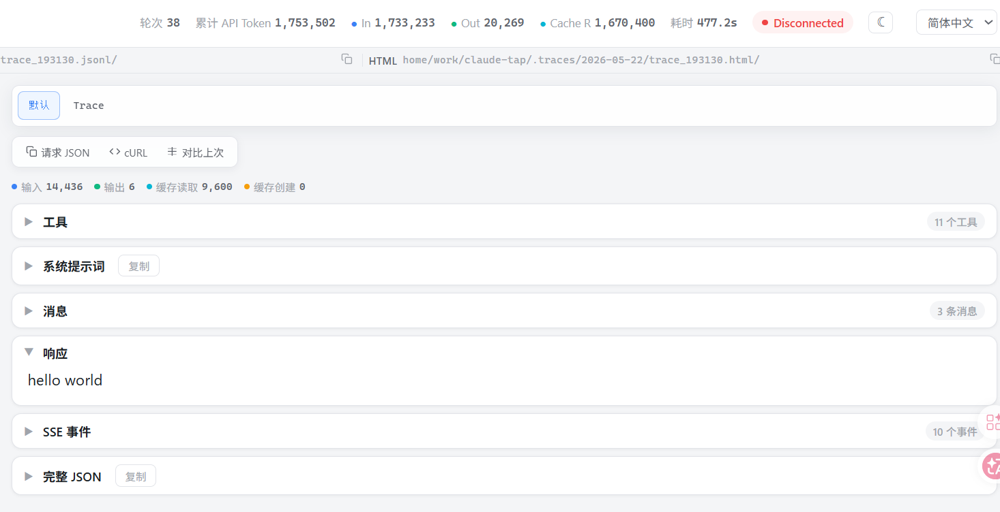

# 从一句 `hello world` 看 Codex 到底发了什么

我一开始以为，给 Codex 发一句 `hello world`，过程应该很简单：

```text
我输入 hello world
Codex 发给模型
模型回 hello world
```

看了这次的 trace 之后，发现里面大有玄机。


如果是一个最简单的聊天程序，它发出去的内容可能真的只有：

```json
{
  "message": "hello world"
}
```

但 Codex 不是这样。

## Codex  一次完整请求的生命周期

### 工具显示的截图如下所示：



我画了下流程图：

```
┌──────────────────────────────────────────────┐
│                 CodeX CLI 启动                │
└───────────────────────┬──────────────────────┘
                        │
                        ▼
┌──────────────────────────────────────────────┐
│    组装请求 Payload                           │
│  ┌────────────┐ ┌──────────┐ ┌────────────┐  │
│  │ 系统提示词   │ │ 工具 ×11 │ │ 消息列表     │  │
│  └────────────┘ └──────────┘ └────────────┘  │
└───────────────────────┬──────────────────────┘
                        │
                        ▼
┌──────────────────────────────────────────────┐
│    POST /v1/messages (prompt caching ~96%)   │
└───────────────────────┬──────────────────────┘
                        │
                        ▼
┌──────────────────────────────────────────────┐
│                 SSE 流式返回响应               │
└───────────────────────┬──────────────────────┘
                        │
                        ▼
                  ┌───────────┐
                  │ 响应类型？ │
                  └─────┬─────┘
                        │
            ┌───────────┴───────────┐
            ▼                       ▼
   ┌────────────────┐     ┌────────────────┐
   │ 纯文本 → 结束 ✅│     │      工具调用    │
   └────────────────┘     └───────┬────────┘
                                  │
                                  ▼
                        ┌────────────────┐
                        │  本地执行工具    │
                        └───────┬────────┘
                                │
                                ▼
                        ┌────────────────┐
                        │   追加结果到     │
                        │   消息列表       │
                        └───────┬────────┘
                                │
                                │ 🔄 回到 组装请求 Payload
                                ▼
                        ┌────────────────┐
                        │ 循环 N 轮(38)   │
                        └────────────────┘
```

一句话概述：每一轮请求，客户端将系统提示词、工具定义和完整对话历史拼成一个请求发给 API。

模型流式返回一个决策：要么是文本回复，要么是工具调用。若返回工具调用，客户端在本地沙箱中执行，将执行结果追加到对话历史，再发起下一轮请求。循环往复，直到模型返回纯文本，表示任务完成。

# 一、工具篇

| 名称               | 分类             | 作用                                                    |
| ------------------ | ---------------- | ------------------------------------------------------- |
| exec_command       | 执行类           | 帮你打开终端敲命令（ls、git、python 等）                |
| write_stdin        | 执行类           | 对正在运行的交互式程序输入内容                          |
| apply_patch        | 文件编辑类       | 精准修改代码中的某几行                                  |
| update_plan        | 计划与目标管理类 | 模型给自己列/更新 TODO 清单，让多步骤任务有条理         |
| get_goal           | 计划与目标管理类 | 模型"看看自己还剩多少预算"，避免超支                    |
| create_goal        | 计划与目标管理类 | 设定一个明确的任务目标作为完成标准                      |
| update_goal        | 计划与目标管理类 | 标记目标完成或调整目标内容                              |
| request_user_input | 交互类           | 向用户提 1-3 个简短问题，等待回复（仅 Plan 模式可用）   |
| view_image         | 感知类           | 查看本地文件系统中的图片                                |
| web_search         | 感知类           | 网络搜索                                                |
| tool_search        | 工具类           | 模型搜索是否有更多可用工具（可能是 MCP 扩展工具的入口） |

# 二、系统提示词

系统提示词是在对话开始前，由应用开发者注入给大语言模型的一段隐藏指令。用户通常看不到它，但它在每一轮对话中都会被发送给模型，作为模型行为的"宪法"。

**本质上它做三件事：**

1. **定义角色身份** — 告诉模型"你是谁"。上面这段提示词开头就声明了 "You are Codex, a coding agent based on GPT-5"，这决定了模型以什么人格、什么专业视角来回答问题。
2. **约束行为边界** — 规定模型能做什么、不能做什么、怎么做。例如上面规定了：优先用 `rg` 而非 `grep`、用 `apply_patch` 编辑文件而非 `cat`、不要 revert 用户的改动、不要用 emoji、不要说废话等等。这些约束让模型的输出风格和操作方式保持一致且可控。
3. **设定输出格式与交互协议** — 比如上面规定了最终回答不超过 50-70 行、中间更新走 `commentary` 通道、最终结果走 `final` 通道、markdown 格式规则等。这是应用层面的协议约定。

每一轮调用 API 时，系统提示词都作为 payload 的一部分被发送。由于它内容较长且不变，所以会利用 prompt caching 来避免重复计算（上面提到的命中率 ~96%）。


# 三、消息

请求消息和响应消息

3、1 System消息(Develop消息)

3、2 User消息

3、3 Assistant消息

参考链接：

https://cloud.tencent.com/developer/article/2643849


# 四、SSE事件

```
response.created{"type":"response.created","response":{"id":"resp_0901542f63e208f6016a103ea21c4881958a44fb6b7f58a475","object":"response","created_at":1779449506,"status":"in_progress","background":false,"completed_a...
response.in_progress{"type":"response.in_progress","response":{"id":"resp_0901542f63e208f6016a103ea21c4881958a44fb6b7f58a475","object":"response","created_at":1779449506,"status":"in_progress","background":false,"complet...
response.output_item.added{"type":"response.output_item.added","item":{"id":"msg_0901542f63e208f6016a103ea2bd088195b2c58e4c4f58d11b","type":"message","status":"in_progress","content":[],"phase":"final_answer","role":"assistant...
response.content_part.added{"type":"response.content_part.added","content_index":0,"item_id":"msg_0901542f63e208f6016a103ea2bd088195b2c58e4c4f58d11b","output_index":0,"part":{"type":"output_text","annotations":[],"logprobs":[],...
response.output_text.delta{"type":"response.output_text.delta","content_index":0,"delta":"hello","item_id":"msg_0901542f63e208f6016a103ea2bd088195b2c58e4c4f58d11b","logprobs":[],"obfuscation":"lftso3kWba4","output_index":0,"se...
response.output_text.delta{"type":"response.output_text.delta","content_index":0,"delta":" world","item_id":"msg_0901542f63e208f6016a103ea2bd088195b2c58e4c4f58d11b","logprobs":[],"obfuscation":"Qluch8Fjtj","output_index":0,"se...
response.output_text.done{"type":"response.output_text.done","content_index":0,"item_id":"msg_0901542f63e208f6016a103ea2bd088195b2c58e4c4f58d11b","logprobs":[],"output_index":0,"sequence_number":6,"text":"hello world"}
response.content_part.done{"type":"response.content_part.done","content_index":0,"item_id":"msg_0901542f63e208f6016a103ea2bd088195b2c58e4c4f58d11b","output_index":0,"part":{"type":"output_text","annotations":[],"logprobs":[],"...
response.output_item.done{"type":"response.output_item.done","item":{"id":"msg_0901542f63e208f6016a103ea2bd088195b2c58e4c4f58d11b","type":"message","status":"completed","content":[{"type":"output_text","annotations":[],"logpr...
response.completed{"type":"response.completed","response":{"id":"resp_0901542f63e208f6016a103ea21c4881958a44fb6b7f58a475","object":"response","created_at":1779449506,"status":"completed","background":false,"completed_a...
```

消息传输使用SSE协议，为什么使用这个协议呢？

## SSE（Server-Sent Events）是什么

SSE 是一种 HTTP 协议上的单向流式通信机制。客户端发起一个普通 HTTP 请求，服务端不是一次性返回完整响应然后关闭连接，而是保持连接打开，持续推送数据片段。

**为什么 LLM 需要 SSE：**

模型生成文本是逐 token 产出的，一次完整回答可能耗时数秒到数十秒。如果等全部生成完再返回，用户会长时间看到空白。用 SSE 把每个 token（或每小段文本）实时推送给客户端，用户就能看到文字"打字机效果"逐步显示。

捕获的 10 个事件的交互流程


```
客户端 (Codex CLI)                         服务端 (OpenAI API)
       │                                         │
       │  POST /v1/responses                     │
       │  {model, instructions, input}           │
       │────────────────────────────────────────▶│
       │                                         │
       │  HTTP 200, Content-Type: text/event-stream
       │◀────────────────────────────────────────│
       │                                         │
       │  ① response.created                     │
       │     (分配 response id, status=in_progress)
       │◀────────────────────────────────────────│
       │                                         │
       │  ② response.in_progress                 │
       │     (确认开始处理)                        │
       │◀────────────────────────────────────────│
       │                                         │
       │  ③ response.output_item.added           │
       │     (创建 message 容器, phase=final_answer)
       │◀────────────────────────────────────────│
       │                                         │
       │  ④ response.content_part.added          │
       │     (创建 output_text 内容块)             │
       │◀────────────────────────────────────────│
       │                                         │
       │  ⑤ response.output_text.delta           │
       │     delta = "hello"                     │
       │◀────────────────────────────────────────│
       │                                         │
       │  ⑥ response.output_text.delta           │
       │     delta = " world"                    │
       │◀────────────────────────────────────────│
       │                                         │
       │  ⑦ response.output_text.done            │
       │     text = "hello world" (完整文本)       │
       │◀────────────────────────────────────────│
       │                                         │
       │  ⑧ response.content_part.done           │
       │     (内容块关闭)                          │
       │◀────────────────────────────────────────│
       │                                         │
       │  ⑨ response.output_item.done            │
       │     (消息对象关闭)                        │
       │◀────────────────────────────────────────│
       │                                         │
       │  ⑩ response.completed                   │
       │     (整个 response 结束, 连接关闭)         │
       │◀────────────────────────────────────────│
       │                                         │
```


