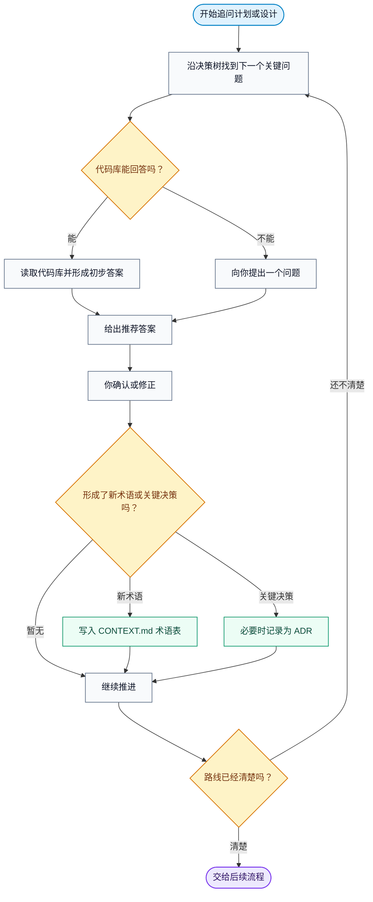

快速开始：

```bash
npx skills add mattpocock/skills --skill=grill-with-docs
```

```bash
npx skills update grill-with-docs
```

## 它做什么

`grill-with-docs` 会围绕一个计划或设计，对你进行一轮又一轮的追问。它一次只问一个问题，直到你和 agent 对问题形成共识，并在过程中记录已经对齐的术语和决策。

这种追问会**留下可追溯的记录**。普通访谈能让你的思路变清楚，但结果往往只停留在当次对话里。这个 skill 会在术语被明确下来的那一刻，把它写进 `CONTEXT.md` 术语表，并把那些已敲定的关键决策记录为 ADR。

共识不再只存在于你的脑子里，而是能在对话结束后继续保留下来。

## 什么时候用它

你需要手动输入 `/grill-with-docs` 来调用它，agent 不会自行选择这个 skill。

适合在一次改动刚开始时使用它。这个阶段，计划可能还模糊，领域语言也还没定下来；在写代码之前，先通过追问检验计划是否站得住、领域语言是否清楚一致。

- 如果你只想要访谈，不需要文档产物，用 [grilling](https://aihero.dev/skills-grilling)。
- 如果计划已经清楚，只需要明确或记录术语，用 [domain-modeling](https://aihero.dev/skills-domain-modeling)。
- 如果这次改动太大，一个会话无法完整推进，而且路线本身也还不清楚，比如全新项目或大型功能开发，那就先从上游的 [wayfinder](https://aihero.dev/skills-wayfinder) 开始。它会先把整件事梳理成一张决策地图；等路线清楚后，再交回这条主流程。

## 前置条件

这个 skill 是有状态的：它会一边追问，一边写入你的仓库。

它写入的内容主要有三类：

| 情况 | 写入位置 | 说明 |
| --- | --- | --- |
| 普通仓库中的术语 | 根目录的 `CONTEXT.md` | 用来保存已经明确的术语表。 |
| 按模块维护上下文的仓库 | 对应模块的 `CONTEXT.md` | 如果仓库里有 `CONTEXT-MAP.md`，说明不同模块可能有各自的上下文。 |
| 影响深远的决策 | `docs/adr/` | 作为 ADR 记录下来，方便之后理解当时的取舍。 |

这些文件都会按需创建：只有第一个术语或决策成形时才会出现，所以你不需要提前创建这些文件，但你确实需要处在一个可以安全写入的位置。

## 追问机制

它的核心是一个**追问机制**：

- 沿着决策树一步步深入，一次只推进一个问题。
- 它会先处理不同决策之间的依赖关系，再继续往下问；
- 每个问题也都会附带一个推荐答案，让你有明确的判断起点。

- 凡是代码库本身能回答的问题，它都会先去读代码库，形成初步判断，而不是把所有问题都抛给你。




这个变体之所以是一个独立的 skill，关键在于答案最终会沉淀到哪里。追问过程中，模糊的说法会被打磨成规范术语，并在确认后立刻写入术语表，而不是等到最后再统一整理。

术语表只记录术语，不写实现细节或规格说明。ADR 也会克制使用，只记录那些影响深远、需要背景解释，并且确实经过取舍的决策。

大多数会话的结果，应该是一份更清晰的术语表；ADR 通常很少，甚至没有。

## 它运行良好的表现

- 它一次只问一个问题并等待回答，而不是一次性丢出一份问卷。
- 术语一旦被明确，就会用你项目自己的语言写入 `CONTEXT.md`。
- 能从代码库里找到答案的问题，它会自己去读代码库。
- ADR 保持稀少，不会让你为那些随时可以调整的决定走形式。

## 它放在什么位置

`grill-with-docs` 是主构建链路的起点：

```txt
grill-with-docs → to-spec → to-tickets → implement → code-review
```

它位于流程最前面，在规格说明形成之前，先产出共识和已经明确的术语。

随后，[to-spec](https://aihero.dev/skills-to-spec) 会把这些内容整理成规格说明，而不需要重新访谈你。

它最接近的两个 skill 是 [grilling](https://aihero.dev/skills-grilling) 和 [domain-modeling](https://aihero.dev/skills-domain-modeling)：前者是没有文档产物的同类访谈，后者负责维护术语表，并记录必要的 ADR。

当你不确定该用哪个 skill 或哪条流程时，[ask-matt](https://aihero.dev/skills-ask-matt) 会帮你选择。


原文链接：

https://www.aihero.dev/skills-grill-with-docs
