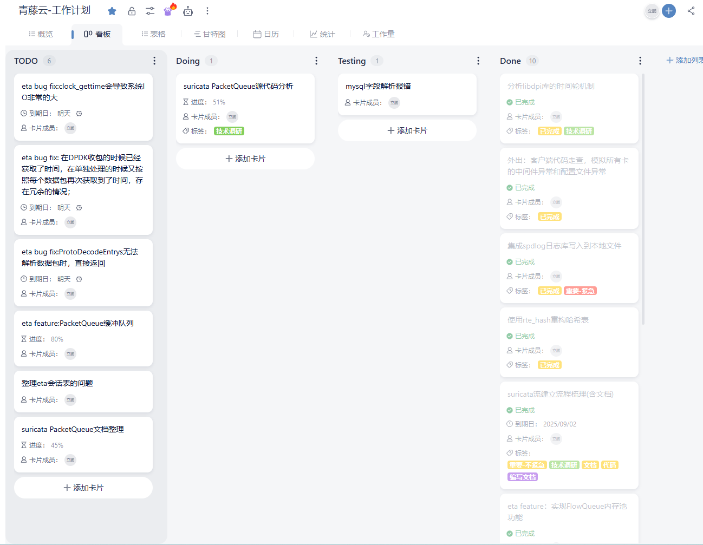
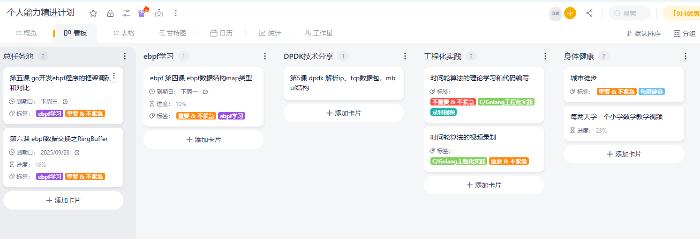
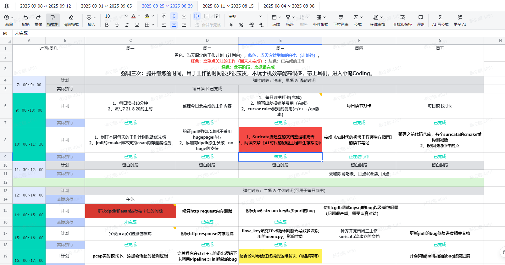
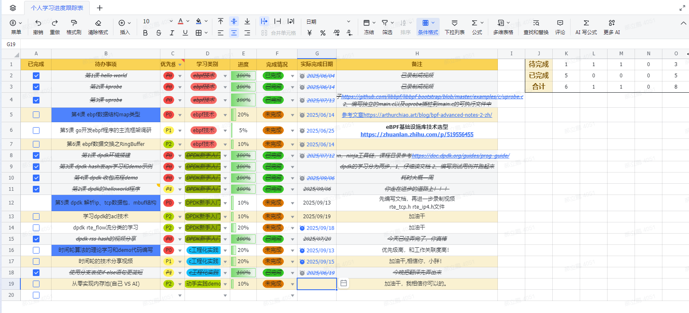
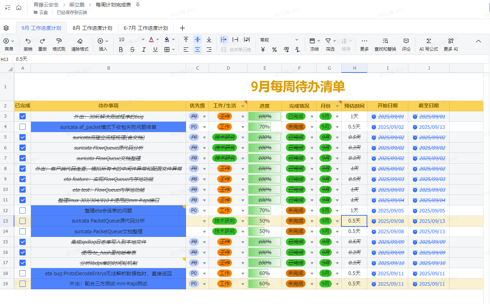

# 一、周计划-粗计划

周计划是包括个人的任务和工作的任务两部分的，总体计划我是放在看板里面的。

## 1、1 工作部分

## 1、2 个人学习部分

从上图中可以发现个人学习包括如下几个部分：

- 锻炼身体
- ebpf学习
- DPDK技术分享
- 工程化实践

多去想做一件事的意义和好处，以及不做这件事的坏处，在做事的过程中，会提升自己克服困难的决心和勇气。

# 二、周计划-细计划

那么具体每个任务是如何执行的呢？方法是列每周计划表的，把具体任务放置在每个时间段中。

一周时段分为四种：要事时段、计划外其他事项时段、留白时段和弹性时段。

一周事项分为三种类型：计划内的要事、计划外的紧急事项、计划内的其他事项。

我们需要比较妥善的给每一件任务分配到对应的时段中，这样才能更好的完成每日的任务。

上述是8.25 ~ 8.29这一周的工作内容的安排。但是这么没有统计的直观。

# 三、更新周计划进度

每天下班后，更新下当天事项的完成情况，

完成 or 未完成？

没完成的，是因为什么原因？接下来要如何开展？都要记录好。

聚焦在当下

## 3、1 个人技术提升跟踪表

其中标蓝是代表事项的优先级很高，是需要优先完成的事情，让我能够专注在当下的事情。

## 3、2 每周计划完成表

开始我是把个人事项和公司事项都放在同一个表格中的，结果我发现有点混淆，而且在给公司上级展示工作量时，不太好展示，毕竟涉及到隐私。