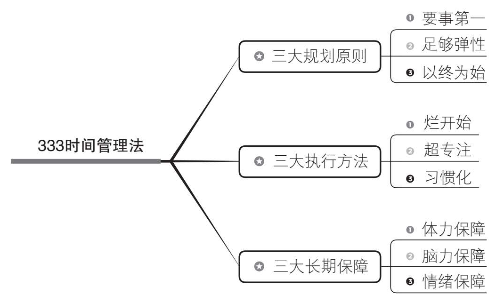
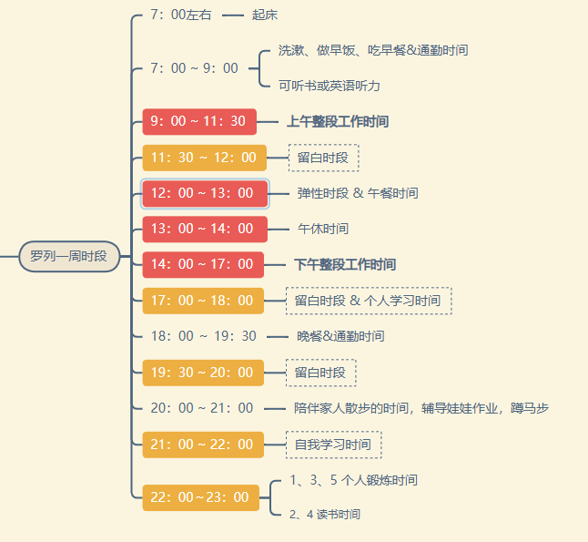
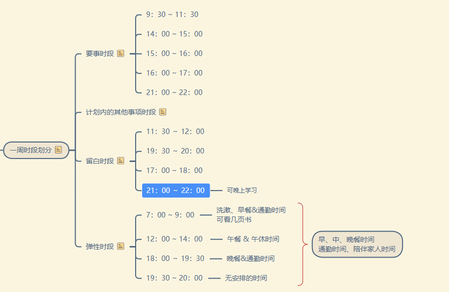

# 第一章：减少贪多求快

## 第一节：改掉假勤奋，变成真用功

### 一、计划要留白

在前一天晚上，花5-10分钟，想想今天未完成的工作，就能大致明确明天的要事。

计划留白的好处：

#### 1、要事第一，突出重点

每天能把要事做完，一天的收益就已经很好。

#### 2、计划有弹性，增强可执行性

计划赶不上变化，与周密计划的中看不中用相比，有留白的计划才更能完成。

### 二、自我管理要留白

周一到周五，每天给自己留一个小时的空白时间。留白时间做什么？

- 做点真正想做的事，比如看点书
- 复盘下最近做的好的地方有什么？做的不好的地方有哪些？

- 或者什么都不做。

## 第二节：为用而学：看似学得更少，实则用得更好

克服贪多的毛病，除了敢于留白，让自己闲下来，还要敢于减少所学的内容，做到为用而学。

**为用而学，就是从工作的实际需要出发，学习立马就能用到的知识。**

好处如下：

**好处1：工作和学习不冲突，合二为一。**

工作就是学习，学习就是工作，学习的时候也是大大方方的学。

否则，你会工作时会担心没学习提升，在学习时会担心工作被耽误。

**好处2：在工作中自然重复，抵抗遗忘曲线**

采用为用而学的策略，你学习的内容会自然而然的在工作中不断的重复，因为就是你平时工作要用到的，会磨练的更好。

**好处3：避免浅层学习，更深入的掌握方法和技能**

很多时候，你的学习只停留在表层，即“一看就会，一做就废”的状态。

采用为用而学的策略后，你会更深入的掌握你所学习的方法和技能。

既然为用而学有这么多优点，那么怎么做才能为用而学呢？

**步骤一：选问题，即选择一个工作中要解决的问题**

## 第三节：敢于放慢：似慢实快，真正学会学深

## 第四节：多用迭代：哪怕贪多求快，也能步步为营

# 第二章：减少过高期待

## 第一节：放下远大梦想，聚焦当下持续成长

## 第二节：降低他人期待，解除沉重的枷锁

## 第三节：无需目标实现，目标价值依然存在

## 第四节：承认运气制约，可能更会好运连连

# 第五章：综合应用  333时间管理法

333时间管理法由三个部分组成，每个部分由包含3个要素：

第一个部分包括三大规划原则：

- **要事第一**
- **足够弹性**
- **以终为始**

应用“减少贪多求快”、“减少过高期待”。

第二个部分包括三大执行方法：

- **烂开始**
- **专注**
- **习惯化**

应用“减少完美主义”、“减少意志力消耗”。

第三个部分包含三大长期保障：

- 体力保障
- 脑力保障
- 情绪保障

应用“减少体力消耗”、“减少脑力消耗”、“减少情绪消耗”。

333时间管理法的具体落地，由闭环的四项任务构成。

1）准备：适合自己的时段及事项划分；

2）规划：制订可行的周计划；

3）执行：更高效的执行周计划；

4）应变：灵活应对各种意外情况；

## 第一节：适合自己的时段和事项划分

一周时段分为四种：要事时段、计划外其他事项时段、留白时段和弹性时段。

一周事项分为三种类型：计划内的要事、计划外的紧急事项、计划内的其他事项。

**步骤一：划分时段**

日程安排规律化，会带来两个好处。

好处一：事情安排更符合自己生物钟

好处二：符合个人习惯，减少意志力消耗

**步骤二：归类时段**

将步骤一中划分的时段进行归类，要事阶段、计划内其他事项阶段、留白时段、弹性时段。

通过增加”留白时段“，评估工作量时失误，如时间不够用，可以使用留白时段来补充。

处理要事时，被计划外的紧急事项占用时，可以使用留白时段来处理没做完的要事。

**动作2.1 归类要事阶段**

要事阶段：不受干扰且精力充沛的大段时间；

**动作2.2 归类留白阶段**

将自己精力一般、通常不做什么安排、至少30分钟持续时长的时间段设为每天的留白时段

留白时段：不提前安排任何事项

用于应对两种情况：

1）有计划外的紧急事项发生

2）要事执行延迟后，需要时间补充来完成

没有上述两种情况：可用来休息、娱乐、个人学习

**动作2.3 归类弹性时段**

将已安排事项但可能不会用掉全部时间的时段，作为弹性时段。

例如：吃饭时，可以网购；通勤时，可以听音频，排队时，可以微信读书。

**动作2.4 归类计划内其他事项时段**

将前面三个动作都确定好后，剩下的时段就作为计划内的其他事项时段，用于处理需要整段时间处理的非要事。

步骤三：列出所有事项

