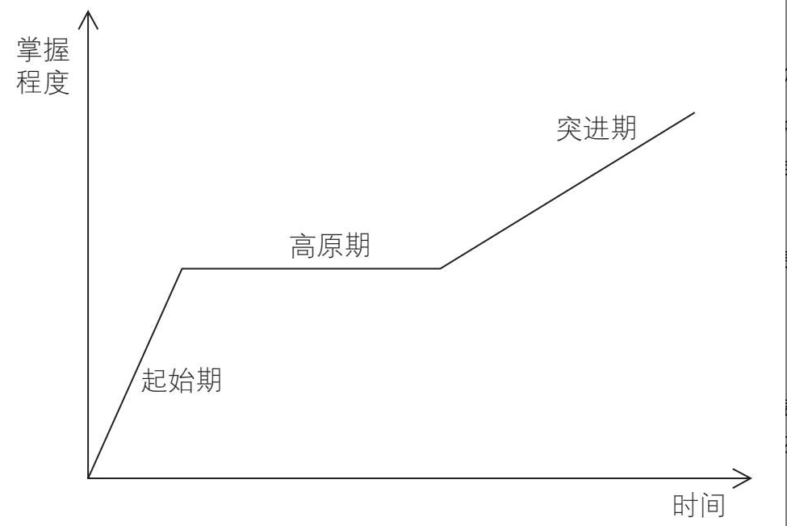
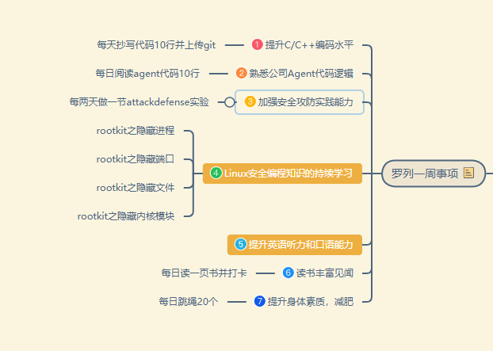

# 第一章：减少贪多求快

## 第一节：改掉假勤奋，变成真用功

### 一、计划要留白

在前一天晚上，花5-10分钟，想想今天未完成的工作，就能大致明确明天的要事。

新手在做计划时，会把一天的每个时间段都安排的满满当当的，导致本来安排在上午做完的事情，却因为被临时紧急的事情耽误，然后占用下午的时段来完成它。

这件原定在上午完成的活，如果在上午做，会有一种一切尽在掌握中的感觉，

占用下午的其他时间段来做，会感觉失控了，心里很烦闷。

**所以在一天中把重要的事情安排在上午，并且要留充足的时间，来保证它能在上午执行完成。**

**上午尽量把事情做完，下午再做其他的事情，比如技术学习，读书等等。**

在前一天，花5分钟，确定第二天的三个主要是想，只做粗略的计划，不仅节省制订计划的时间，而且发生意外心理状态也很好调整。

带着当日主要是想已经完成的成就感，会感觉很有效能感，因为还能够完成更多的任务。

计划留白的好处：

#### 1、要事第一，突出重点

每天能把要事做完，一天的收益就已经很好。

#### 2、计划有弹性，增强可执行性

计划赶不上变化，与周密计划的中看不中用相比，有留白的计划才更能完成。

### 二、自我管理要留白

周一到周五，每天给自己留一个小时的空白时间。留白时间做什么？

- 做点真正想做的事，比如看点书
- 复盘下最近做的好的地方有什么？做的不好的地方有哪些？

- 或者什么都不做。

## 第二节：为用而学：看似学得更少，实则用得更好

克服贪多的毛病，除了敢于留白，让自己闲下来，还要敢于减少所学的内容，做到为用而学。

**为用而学，就是从工作的实际需要出发，学习立马就能用到的知识。**

好处如下：

**好处1：工作和学习不冲突，合二为一。**

工作就是学习，学习就是工作，学习的时候也是大大方方的学。

否则，你会工作时会担心没学习提升，在学习时会担心工作被耽误。

**好处2：在工作中自然重复，抵抗遗忘曲线**

采用为用而学的策略，你学习的内容会自然而然的在工作中不断的重复，因为就是你平时工作要用到的，会磨练的更好。

**好处3：避免浅层学习，更深入的掌握方法和技能**

很多时候，你的学习只停留在表层，即“一看就会，一做就废”的状态。

采用为用而学的策略后，你会更深入的掌握你所学习的方法和技能。

既然为用而学有这么多优点，那么怎么做才能为用而学呢？

**步骤一：选问题，即选择一个工作中要解决的问题**

## 第三节：敢于放慢：似慢实快，真正学会学深

解决急于求成的问题，要明白学习的两个客观规律：

### 3、1 最低投入强度

任何事情，想掌握都需要有一个最低强度投入。

比如烧开一壶水，需要加热到100度，学习golang编程，最少需要3天时间。

从零做一个公司项目，投入2个人做1个月，就是最低投入强度不够。

我们要尊重事物的客观规律。

### 3、2 学习曲线中的“高原区”

**起始期：**学习热情高，学习内容相对简单，克服困难的毅力更足，此时进步速度最快。

**高原期：**进步缓慢，学习内容变的越来越难，遇到的困难越来越多，花更多时间来学习和提升技能，但是掌握程度却没有明显提升，甚至有下降的趋势。

**突进期：**对知识的掌握程度在稳步上升，但是没有起始期那么快。

进入突进期后，你能感受到学习带来的成就感和乐趣，但是急于求成的人，肯定无法突破学习的高原期进入突进期，因为基于求成的人，看到投入很长一段时间学习却没有进步，甚至来退步了，便会失去耐心不学了。

**如何做呢？**

- 练习要有目标

不要害怕目标订错了，目标的价值不在于目标本身，而在于给一万遍练习提供一个方向和可衡量的标准。

设定自己的总目标，月度目标，周计划的目标；

有了方向和可衡量的标准，能看到每天微不足道的进步，练习的动力就会更强，练习的效果会更好。

- 练习要有方法

在同等练习强度下，用更高效的方法来练习，效果会好很多。

使用更先进的学习方法论来指导自己学习，比如如何思考，如何复盘，如何记笔记，如何读书。

- 练习要有反馈

反馈的作用：告诉自己哪里做的对？哪里做的错？下次才知道如何调整

除了对练习内容的反馈，还关注练习者的情绪和心理状态。

失落、沮丧、毫无斗志、信心满满、缺少鼓励等，

通过各种小技巧，帮助练习者更好的度过学习曲线中的高原期阶段。

## 第四节：多用迭代：哪怕贪多求快，也能步步为营

### 4、1 利用由粗到细的迭代满足贪多心理

由粗到细的迭代，是先构建一个简单的框架或Demo，然后逐步完善和优化。

### 4、2 由小到大的迭代满足求快心理

由小到大的迭代是指先完成局部的核心功能，然后逐步扩展，直到完成所有功能。

这种迭代方式类似完成拼图，逐步拼成完整的图案。

之所以能满足求快的心理，在于它将庞大的目标分解为一系列从简单到复杂的小目标。

在将大目标分解为小目标时，要特别留意一点：确保每个小目标的实现周期，不超过你的最长耐心。

假如你的最长耐心是一天，那么这个周期就不能超过一天。

### 4、3 自我效能感

自己对于完成某项任务或达成某个目标的**自信程度**。

自我效能感的高低直接影响个体的动力、投入程度、耐心和信心。

小步迭代的方式，由于周期短难度低，会让你成功的完成第一个、第二个、第N个的小目标，你就有了不断成功的经验积累。

第一次小目标的成功，会给第二个目标的实践过程注入热情和动力。

即使后面遇到困难或者挫折，你也不会轻言放弃，更有韧性和耐心，坚信你能完成这件事。

# 第二章：减少过高期待

## 第一节：放下远大梦想，聚焦当下持续成长

聚焦于当下——小小进步——做的更多——实现梦想

如何做到聚焦当下，从多想转为多做呢？按照以下步骤来进行

**步骤一：先做加法**

将大脑中想做的事情都用纸笔写下来，释放大脑的内存空间，免的将来行动的时候总觉得有什么重要的事情没做。

**步骤一：再做减法**

划掉对当前影响不大的事，最后只留下一件必须要做的重要的事。

比如留下的是学习ebpf技术这件事。

**步骤三：逐步推进**

将必须要做的这件事（学习ebpf技术）分成多个阶段的小目标。

第一个月：ebpf基础知识

第二个月：yyy

第三个月：zzz

如果你保持耐心的时间是一周，将上面的每月改为每周目标。

然后聚焦当下，先完成第一个小目标。当第一个小目标完成后，再聚焦下一个小目标，逐步推进。这样你就更容易实现梦想。

格言：梦想不是一个人取得成功的方式，它是提供动力的方式之一。

## 第二节：降低他人期待，解除沉重的枷锁

### 2、1 过高期待的危害

1.对被期待者的危害

- 当期待过高时，一个人通过正常手段无法完成目标时，就会想着走捷径，投机取巧。
- 当期待过高时，即使不犯错误都很难完成，哪怕只犯一点错，都会导致目标无法完成。畏首畏尾，想赢怕输。
- 当期待过高时，你很难满足自己或他人的期待，从而会导致持续失败丧失自我效能感。

2.对期待者的危害

对人，期待越高，失望越大，影响人际关系的和谐。

对事，将关键任务安排出去期待对方能完成，但是对方却没完成，导致整体的进度和效率都大打折扣。

## 第三节：无需目标实现，目标价值依然存在

目标的最大价值不在于目标本身，而在于实现目标的过程中，你所获得的能力的提升。

实实在在：从手头的工作任务触发，设定一个月度、季度、半年的目标即可。

关键在于这个目标，能让你全力以赴地学习新技能、新知识，并积累更多资源。

什么样目标真正有这样的作用呢？以下四个标准可以帮助你判断。

### 3、1 高质量目标的四个标准

- 源自内心的渴望
  - 如果目标和你的兴趣、核心价值观一致，那么实现目标的可能性更大；即使没实现目标，努力的过程也充满了乐趣；
- 可衡量
  - 明确，具体，可衡量
- 有挑战性
  - 最好是点下脚尖就能够的到
- 高频反馈
  - 高频反馈，可以让你及时了解进度，从而增强自我效能感，并持续推进目标实现。

### 3、2 四步法制订高质量目标

**1、确立定性目标**

动词 + 挑战难度 + 可实现的修正目标

我想在2个月内，减肥15斤。

**2、用5why法验证目标的合理性**

用5why法追问目标的动机，以此来发现目标背后的驱动力。

目标也可能是因为外部原因，这时候就与本能欲望挂钩下。

**3、拆解出定量目标**

在确定定性目标后，需要拆解出定量目标。这些目标需要回答：哪些指标能证明目标已实现？

第一个月，瘦10斤，每周锻炼2-3次；

第二个月，瘦6斤，每周锻炼2-3次；

定量目标应有挑战性，让你“跳一跳”才能实现，这样实现起来才有乐趣。

**4、周期性反馈和更新**

进一步将目标拆解为适合自己的周期性检查频次。

我的周期性检查频次是以周为单位。

我觉得现在ebpf开源项目没做成，主要就是因为反馈周期的设置有问题，反馈周期太长了。

ebpf的学习计划，针对每一个阶段，我也拆分成了具体的小目标，但是每周我并没有检查这些小目标是否完成，从而导致自己的学习计划一再拖延。

## 第四节：承认运气制约，可能更会好运连连

# 第五章：综合应用  333时间管理法

333时间管理法由三个部分组成，每个部分由包含3个要素：

第一个部分包括三大规划原则：

- **要事第一**
- **足够弹性**
- **以终为始**

应用“减少贪多求快”、“减少过高期待”。

第二个部分包括三大执行方法：

- **烂开始**
- **专注**
- **习惯化**

应用“减少完美主义”、“减少意志力消耗”。

第三个部分包含三大长期保障：

- 体力保障
- 脑力保障
- 情绪保障

应用“减少体力消耗”、“减少脑力消耗”、“减少情绪消耗”。

333时间管理法的具体落地，由闭环的四项任务构成。

1）准备：适合自己的时段及事项划分；

2）规划：制订可行的周计划；

3）执行：更高效的执行周计划；

4）应变：灵活应对各种意外情况；

## 第一节：适合自己的时段和事项划分

一周时段分为四种：要事时段、计划外其他事项时段、留白时段和弹性时段。

一周事项分为三种类型：计划内的要事、计划外的紧急事项、计划内的其他事项。

### **步骤一：划分时段**

日程安排规律化，会带来两个好处。

好处一：事情安排更符合自己生物钟

好处二：符合个人习惯，减少意志力消耗

### **步骤二：归类时段**

将步骤一中划分的时段进行归类，要事阶段、计划内其他事项阶段、留白时段、弹性时段。

通过增加”留白时段“，评估工作量时失误，如时间不够用，可以使用留白时段来补充。

处理要事时，被计划外的紧急事项占用时，可以使用留白时段来处理没做完的要事。

**动作2.1 归类要事阶段**

要事阶段：不受干扰且精力充沛的大段时间；

**动作2.2 归类留白阶段**

将自己精力一般、通常不做什么安排、至少30分钟持续时长的时间段设为每天的留白时段

留白时段：不提前安排任何事项

用于应对两种情况：

1）有计划外的紧急事项发生

2）要事执行延迟后，需要时间补充来完成

没有上述两种情况：可用来休息、娱乐、个人学习

**动作2.3 归类弹性时段**

将已安排事项但可能不会用掉全部时间的时段，作为弹性时段。

例如：吃饭时，可以网购；通勤时，可以听音频，排队时，可以微信读书。

**动作2.4 归类计划内其他事项时段**

将前面三个动作都确定好后，剩下的时段就作为计划内的其他事项时段，用于处理需要整段时间处理的非要事。

### 步骤三：列出所有事项

在列出一周事项时，将能想到的事项都列上。

**动作3.1 罗列事项**

**动作3.2 分解事项**

将大的事项（如年度计划，重要项目），分解出以后走内要完成的具体事项。

这个分解，可以让你专注于当下，聚焦在具体的执行过程，减轻焦虑感。同时，保证你不会偏离方向。

### 步骤四：列出所有事项

具体做法是先对要事进行归类，然后再对其他事项进行归类。

**动作4.1 归类要事**

要事来自于年度计划、重要项目的分解，或者与你人生目标相关的重要事项。

大家每天忙于工作，很容易忽视和我人生目标相关的重要事项，比如如下：

- 每日编码锻炼个人编程能力
- 锻炼身体，强健体魄，让身体更好用
- 每日读书
- 录制视频教程，每周一更

**动作4.1 归类计划外的紧急事项和计划内的其他事项**

计划外的紧急事项，不需要提前计划。

将剩下的事项归类到“计划内的其他事项”。包括两个分类：

- 日历事项（执行时间固定）
- 待办事项（执行时间不固定或尚未确定）
