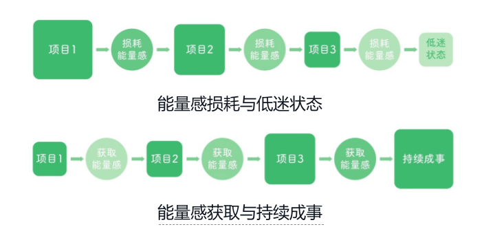
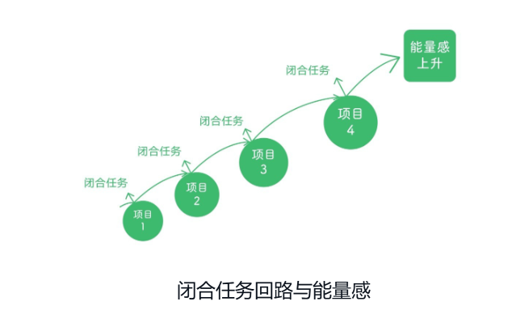

## 能量感定义

能量感：有干劲、充满力量，特别积极的状态。

具体体现为：

**身体上：**精神饱满，不累不困，身体舒服，浑身散发青春的气息；

**情绪上：**心情好，对很多事情感兴趣，容易开心和高兴；

**心理上：**觉得自己很厉害，对未来充满信心，想去做一件事并且相信自己能做成。

实现大目标带来的能量感，由于周期太长导致能量感回收太慢，事情做着做着就没了燃料，而做事情一直在消耗能量，能量消耗殆尽时，想象中的大能量感也没获得，人就放弃了目标的努力。

如果在实现大目标的路上，能不断用小目标的实现增加能量感（中途加油），如下图所示，那么系统更容易运转起来。

 

在持续做事的过程中，通过完成一个个的小目标，来获取能量感，给自己补充能量感，如此往复，持续成事也就可行了。

## 闭合任务回路  

就是创造一种“完结感”，一种“做完了”，“搞定了”的满足感。

就像电路一样，你开始做一件事（打开开关），然后把它踏踏实实的做完（电路闭合），这个过程就形成了一个完整的闭环。

不是为了得到表扬（寻求认可），不是为了证明自己厉害（追求成就感），就是单纯的“**这件事情有始有终了**”的踏实感觉。

从学校到社会的转换，为什么很多人有无力感和缺乏正反馈的挫败感？

学校的学生都有统一的完结点：期中考试、期末考试、中考、高考、大学毕业等，我们可以把这些完结点内化为自己的完结点，踏踏实实的跟着老师的安排走，只要努力学习，就能看到一个阶段的结果。

离开学校到了社会以后，这种边界清晰的“完结点”会越来越少，需要自己去安排一切。

- 规划生活
- 职业发展
- 家庭生活
- 身体健康
- 个人成长

所以一出社会，很多学生就蒙了，失去了方向。所以在个人成长领域，建立个人项目的“闭合任务回路”非常重要。

实现闭合任务回路，需要的是：

1、清晰的完结点；

2、仪式感触发；

3、个人心理上对完结点和仪式感出发的认可

**清晰的完结点：**一条清晰、阶段性的终点线，将大目标拆解为多个小目标，然后设置每个小目标完成的标准。

**模糊的目标：**

”我要减肥“-》“减到什么程度？”，什么时候算成功？

**清晰的完结点：**

"这个月减重2公斤" → 称重显示减了2公斤就达标

仪式感：用一个具体的动作或行为来告诉自己“这件事做完了”，事情告一段落了。

改变自己记录读书笔记的习惯，不是抄写，而是记录自己的想法。

# 第二章：立即行动 从内耗到产出

## 2、1 正确认识“碎碎念”

大脑在相对空闲时，会出现碎碎念的声音，比如焦虑、担忧、自责等负面情绪。

首先要意识到“你不等于碎碎念”

这些碎碎念的想法，是基于过去的陈芝麻烂谷子的事，而你在成长在进步。

这些想法是未经验证或证实的想法，不代表就是对的。

比如说，我的编程能力不够强，是基于刚毕业时连个俄罗斯方块程序都写不出来，在第一年工作中，还被领导指着鼻子骂了几次，给我骂的离职了，但是这几年通过我日积月累的编码训练，实战能力得到了很多的提升，但是我还依旧活在往事的阴影中。

ebpf技术难学吗？就必须要会内核编程才能学会ebpf编程吗？

我不会内核编程，而ebpf的学习需要linux内核编程知识，所以我学不会ebpf是正常的，慢慢我就接受了这个扭曲的思想。

反驳的事实：kyanos的开源作者原本是java语言，我看他用go + c写的kyanos开源也挺好的。

rust难学吗？因为之前有过rust学习困难并失败的经历，我大脑潜意识里就觉得rust入门好难啊，并形成了这个扭曲思想。

**反驳的事实：**认识的网友大哥陈诚，本职工作和计算机无关，利用cursor工具+rust开发了一个开源项目。

记录下碎碎念，然后问自己：

1、这个想法是真的吗？有事实依据吗？（假的，没有事实依据，是基于过去的老旧经验得出的错误想法）

2、有什么客观证据能反驳我的这个想法？（去年独立的完成了soc的agent的开发，在b站上录制新手实战视频，）

我们的过往经历（不管是成功的还是失败的经历）

**认知重构三步曲**

- 识别扭曲思想
- 挑战扭曲思想
- 用合理的思想替代扭曲思想

**使用“科学思维”可以实现认知重构。**

焦虑是什么？

​	当我们尝试突破舒适区、做自己陌生的事，缺乏经验来指导行动；或者做别人也没做过的事时，缺乏参照物，心里慌的一逼。

焦虑是人的本能，提醒你注意风险，避免失败或受伤。

​	迟迟不行动，没有真实的行动反馈进行校验和修正错误的想法，一旦迈出第一步，反而没时间去胡思乱想那么多。

焦虑的价值在提醒我们：

- 焦虑不是敌人，是大脑在面对未知风险时的自我保护机制。
- 缓解焦虑的真正方法不是逃避，而是小步行动，用行动去证实心中的恐惧是多余的，让内心更加强大。
- 用行动一次次证明恐惧和焦虑的点是错误的，你的自我效能感就会慢慢得到提升。大脑潜意识里觉得你做不到，但是你的行动做到了，大脑之前的想法就能得到纠正。

唯有识别他们、直面他们、保持行动，才能解决问题。

# 第三章：走出低迷状态的最佳起点

## 3、1 状态不好？因为没有闭合任务回路

人在低迷状态下，如果靠意志力来强求自己努力，批评自己不自律，反而会导致能量感越来越低，感到疲惫。

正确的做法：在处于低迷状态时，寻找能增加“能量感”的途径。

下面将介绍“**获得小胜**”和“**闭合任务回路**”的方法。

通过闭合任务回路拿回消耗的能量感，获得完结感和胜利感，最关键的是要亲自践行，别人再怎么言传身教，也代替不了自身的践行。

”低迷状态“是因为遗留了太多未填满的、不断消耗自己能量的坑。

- 同时启动了2-3个开源项目的编写，每个项目只开头写了一点，没有一个项目是完结的；
- 看似阅读过很多本书，其实没有一本书是完完整整读完的，每本书看了一点又翻开了下一本书；

**小道理：所有尚未闭合的任务都在消耗我们的能量。**

**从这个角度看，我们得到两点非常重要的启示：**

1、慎重的开启每一个新的项目，开启却没有完结，就会消耗你的能量

2、开启一个新项目就应该尽快把它做完，从而回收任务闭合后的能量感。

**从执行层面，我们应该：**

1、定期枚举出尚未完成的项目，清理无法做下去的项目

2、总结项目没有完结的原因，以后吸取教训

3、先把精力放在容易完成的项目上，不断闭合小回路提升自我效能感

**要点：**

要有勇气定期清理难以闭合的项目，并慎重的开始每一个项目。

## 3、2 闭合任务回路和自我效能感的提升

只有亲身实践、亲自闭合任务回路、用行动A取得效果B，才能从根本上改变一个人的自我效能——因为“你做过，你得到，你知道自己行”。

2024-2025年期间，我开始了减肥，吃减脂餐，大量的训练，成功从200斤的胖子减肥到140斤，有过这次成功的经验，我知道自己在减肥锻炼这块是行的，自我效能感满满，自我效能感是一次次小的任务闭合来提升的。

2024年，通过大量的编程实践，自我效能感，有了很大的提升。

1、soc agent（核心开发，go）  

2、mmj综合防护系统（核心开发，c） 

3、策略跳变系统（主力开发，windows和linux都是我）

2025年，哪些事情增加了我在编程领域的自我效能感

1、5月份的ebpf大会，进行了《ebpf技术在rootkit攻防实践中的应用》的主题演讲

2、8月份，参加了cursor大会，分享了《cursor在网络安全中的应用》的议题，认识了很多志同道合的小伙伴

3、《DPDK入门教程》更新到第8课（持续更新）https://github.com/haolipeng/dpdk-hands-on

4、《eBPF硬核入门》课程更新到第10课（持续更新）https://github.com/haolipeng/libbpf-ebpf-beginer

5、小白动手实践系列

- 状态机-编码实践（C/C++/Go版本） https://github.com/haolipeng/learn-by-building
- 时间轮-编码实践（C++版本）https://github.com/haolipeng/learn-by-building 把任务拆解的足够细，慢慢去吸收，这事急不得。

**源码阅读系列：**

1、Suricata源代码分析

2、tracee源代码分析

3、dpvs的源代码分析

哪些项目的任务容易闭合呢？

1、加密流量分析系统（增加单元测试），公司驱动做事，顺带着把核心技术应用到框架中

2、基于dpdk的融合suricata和zeek的系统，NetDefender项目

2、基于ebpf的恶意软件分析系统（为明年的ebpf大会准备的）

在编程领域，我的自我效能感没那么高，因为缺少大量成功的任务闭合，2024年只是小试牛刀，培养出了一部分自我效能感，我还需要继续。

所以要敢于停掉无法闭合的任务，集中精力做能提升自我效能感的任务上。

**要点：**

自我效能来源于“我做过，我得到，我知道自己能行”

## 3、3 怎样才能有效地闭合任务回路？

三个关键：

1、清晰的完结点

2、仪式感触发

3、个人心理上对完结点和仪式感触发的认可

高效的制定任务边界，并能成功地闭合自己的任务回路，就是一个人持续成事的关键。

尝试多问自己几个问题：

**1、任务的完结点是什么？清晰吗？可衡量吗？**

实现时间轮的添加定时任务的函数方法，并实现这个方法，然后测试实现的函数功能

**2、任务是否可以拆分为多个具体、可测量、边界清晰的小任务，完成每个小任务来回收能量感**

编写基础组建时间轮时，可以分为以下小任务：

- 定义核心数据结构
- 定义对外接口和内部方法
- 依次实现上述接口和方法

**3、你为完成任务设置奖励**

当任务完结点触发时，奖励自己“努力的过程”，而不只是“结果”。

比如连续锻炼一周，奖励自己吃一顿欺骗餐。

除了使用仪式感和庆祝来触发任务的完结感，还可以记录自己“付出努力的过程”，

并使用量化、可视化的方式将个人的努力、付出的过程外化出来。比如：

- 使用飞书文档，记录每天成功完成的一个个工作任务、学习任务、开始时间和截至时间（目前就如此）
- 和娃娃每日运动锻炼时，记录下每天蹲马步、打拳、做仰卧起坐的情况（目前就如此）
- 对于看过的书的每一个章节，记录其精华内容和自己的思考（目前就如此）
- 使用TODO清单app记录当天待办事项，每完成一件事后将其划掉，每周回顾自己本周所完成的工作。
- 每完成一件大任务之后会专门写一篇总结日志，列出这一次任务从开始到完结的收获。

要记住：越会为自己的每一次成功庆祝的人，越能收回更多的能量感，来奔赴下一程的冒险。

如果你长期习惯了自我苛责，可以采用下面的几个简单的方法来标记自己的点点滴滴：

- **每天睡前回想三件今天做的很好的事情**
  - 你真心觉得自己干的不错
  - 坚持了锻炼
  - 对老婆好
- **每天睡前回想三件今天比较艰难，但依然坚持做下去的事情**
  - 做了技术视频
  - 完成了技术文档的整理

- **每天睡前回想下三天自己给别人带来的积极影响**
  - 帮同事解决技术问题
  - 陪伴家人度过节日等

要记住：重要的不仅是持续付出努力，更是不断的闭合任务回路，并清晰的感受到闭合了这些任务回路。

感受到任务的完结、努力的回报，这样才可能持续的行动，更好的出发下一个征程。

## 3、4 “小胜”，行之有效的能量回收途径

当你状态不好时，不要一上来就给自己定太大的目标。相反，可以先从一些小的、容易完成的任务开始做，来回收能量感。

**小：**不大且对自己有意义的小事，每完成一件，你就有一种“我做成了”的感觉，随着不断的**做成**一件件小事，你的自我效能感会越来越强。

**小胜：**一点小进步、一点小成功。每个人的小胜可能不同，对我来说，独立写出ebpf的kprobe、uprobe代码是小胜。

**”小胜思维“的精髓：**

不要盯着一个庞大、模糊、周期长的大目标，而是要把目标拆分成能快速完成、可立即验证的小目标。

将精力聚焦在小目标的任务上，在任务上不断的迭代，你的大目标在自然而然的推进了。

**建立“小胜循环”**

1、将大任务拆解为小任务，任务要保证具体、可执行、可衡量是否完成

2、立即执行

将目标控制在1-2个小时就可以完成。

3、立即验证

小任务完成后可显示结果，跑单元测试，验证自己在朝着最终目标进发。

4、记录成功完成的事，并进行周期性复盘

**效果：从小胜道大成**

等你连续积累了几十次“小胜”后，你会发现：

- 专注度更高：因为每次任务都快速闭合
- 自信心更强：每次小胜，都在强化自我效能
- 擅长拆解复杂问题：习惯将复杂问题拆解成自己能力范围内可解决的多个简单问题，逐一去解决
- 学习节奏更持久：不再被“大目标”吓到

**要点1：**

从今天开始，放弃“全有或全无”的心态，学会利用小胜、标记小胜、庆祝小胜，人便可以在一点点进步的喜悦中提升能量感，从而摆脱坏状态。

**要点2：**

快速取得一个又一个小胜，而不是漫长地等待一次巨大的胜利。

# 第四章： 告别手机上瘾

# 第五章：打造适合自己的能量感路径

发

低能量感→想做事→完不成目标→自我苛责→更低能量感

给自己过高的期待、过多的目标，只会制造更多的压力和挫败感，让人陷入“低迷”状态。

**高能量的良性循环：**

高能量感→付出行动→完成目标→提升能量感→高能量感进一步行动

如何拥有持续的能量感呢？

**充分的了解自己能量感起伏的规律，知道如何在A点（此刻的你）和B点（达成目标的你）之间选择有效路径，以最佳方式激活能量感。**

有效路径就是让你觉得做起来兴奋、有热情、不觉得累的路径。

你先要发现自己是什么样的人、能量来源是什么，然后才可能找到合理的路径。

## 5、2 内源性动机 vs 外源性动机

哪些方法能让我们产生内源性动机呢？

**1、关注真实的个人爱好、兴趣、热情**

即：更了解自己的天性，更了解自己的价值观，从而知道喜欢做什么事情，不喜欢做什么事情。

知己知彼，百战不殆。

**2、关注自己对外界的影响力**

当我们做的事对他人有积极的影响，能够帮助到他人，是获取自我能量感的很不错的方式。

比如我做的技术视频能够帮助到希望提升自己编码水平的新手程序员。

我把学习心得也分享出来，也是希望能帮助到他人。

**3、关注专精感和成就感**

去尝试做一件你真正在乎的事,并且把它做成,你就会获得能量感.

给你成就感的事情不需要有多大，但一定是你“真正在乎的”。

减肥，我真正在乎的事，关乎我的身体健康，经过辛苦的努力，我做到了减肥。

在软件领域,我真正在乎的事是什么?

参加ebpf大会，参加cursor大会的确让我获得了能量感。

练习题：**观察身边的”高能量者“长期热爱工作、热爱学习、不断创业、不断探索的人，去了解他们努力行动的背后，是有哪些强大的内源性动机在支持。**

## 5、3 利用“自主感”提升能量感

《驱动力》一书中总结了三个内源性动机产生的条件：

- **自主感**
- **专精感**
- **目标感**

当人们可以自主选择、自主决定如何行动以及自主决定追求什么样的目标时，他们的内在动力不断增强。

**事实证明，自主选择不是那么重要，重要的是一种自主选择的感觉。**

幸运的是，自主选择的感觉可以十分轻松的营造。

事实表明，那些在工作中获得更高自主感、更多掌控感的员工，会更热爱自己的工作、产出更高的绩效，也更少选择离职。

那我们该如何做呢？

在有选择的情况下，多做那些给你较高自主性的工作或活动；

在没有选择的情况下，利用一切条件在现有的工作中创造自主性。

- 任务达到的结果不可变，但是任务达成的路径和方法可以自主选择更好、更恰当的方式；
- 内化他人安排的任务，思考该任务会锻炼自己的哪些技能，能帮助我们更好的实现哪些个人目标和愿景
- 在每一份工作中，都将心态设为“为自己工作”，把更多注意力转移到如何利用现有资源提升个人能力上

真相：最枯燥的工作，也有一定空间可调整，努力寻求在工作中的自主感，从而让工作变的更有趣、更自主，推动自己的能量感向前走，保护其不被破坏。

## 5、4 如何通过专精感提升能量感

进入心流状态，需要以下因素的加持

**1、明确、具体、可量化的目标**

**2、及时的反馈，哪里做的好？哪里做的不好？**

**3、高度的自主性**

**4、有序的工作环境和日程安排**

可以采用“刻意练习”的方式来培养专精感和心流状态。

刻意练习有四个重要特征：

**1、要有明确而具体的目标**

**2、高于舒适区，低于困难区，有挑战性但是努力下就能够到**

**3、在练习期间，保持足够的注意力、集中精力，心无旁骛。**

**4、寻找具体的、及时的、来自高手的外部反馈**

要点：

人通过刻意练习来提升专精感，其关键是设定具体而明确的目标、在舒适区外进行拓展、在专注状态下进行并获得来自外部的反馈。

## 5、5 如何通过“目标感”提升能量感

在做任何事时，想得到足够的内驱力，需要把这件事和自己的价值观以及人生愿景联系起来。

试着问自己如下几个问题：

**1、我为什么学英语？**

因为我想更好的辅导娃娃。

同时，英语好，能看懂英文技术文档，听懂英文技术视频，对我的技术成长也是个很大的帮助。

**2、我为什么养成读书的习惯？**

因为我想成为一个有点内涵和思想的人，在我娃娃的成长过程中，能够为她指点迷津。

**2、我为什么要精进编程技能？**
 在大学刚毕业时，入职一家公司因为写不出来代码被公司辞退了，一直是我心里的伤痛，虽然后面技术越来越强，但是我一直铭记这件事。
 为了实现我的编程梦想，我想用编程代码的方式来实现任何我想实现的产品功能。

我好好想了下，我想学习英语，想读书，想精进编程技能，是我内心极度渴望做的事情，不是外界有人逼迫我的。

我们应该经常问以下几个问题：

- 在生活或工作中感到压力时，问问自己：“我的人生目标是什么，现在所做的事情会有助于我实现人生目标吗？”
- 你想给周围人带来什么积极影响？**我想让家人过上更好的生活，我想扩大我的技术影响力，让我能一辈子做喜欢的技术工作。**
-  在生活或工作中，有哪些人生使命在激励你？（比如，让生活变得有趣，让工作不再枯燥，给更多人带去知识，让更多人健康生活？……），**我想给更多人带去知识**
- 你想为这个世界贡献什么？**我出了一些技术实战视频，想帮助更多的编程新手提升实战编码技能**

将工作背后的更大意义挖掘出来，将其与自己真正在乎的目标连接起来，你会发现做事的过程更顺畅、更投入、你的能量感也会自然生长。

# 六、告别拖延症，让自己立马行动

人容易过度自我苛责、自我审查的习惯，我们需要学会科学的方法，来避开无谓的过度思考和能量外泄。

这一章我们将介绍几种具体的实操方法：

## 6、1 滚雪球任务法

​	**“滚雪球任务法”**，是说把你现在所有需要做的**任务全部列下来**，然后从**能量消耗最低**、**能最快收回能量感的任务**开始做起，一点点做到能量消耗较高、较为复杂的任务。**不要一上来就做最复杂、耗能最高的任务**，而要通过完成小任务让能量感滚动起来。

​	剖析：一切未完成的任务、心里惦记的事情，都会占用脑容量（内存），消耗我们做事的能量，大脑会一直提醒我们这些事情还没做完，从而没有足够的能量去做其他事情。

​	要想让滚雪球任务法有效果，要注意以下几点：

- 一定要将闹钟的任务全部写到纸上或者电子文档中，这样才能减轻大脑的负担。
- 在列任务时，所有让大脑感到有负担的任务都列到纸上，充分解放大脑，它才能专注干事
- 每做完一个任务，就在列表上划掉该任务。这样能让大脑感觉到“完成了”，从而收回能量感。
- 当任务列表中的剩下的任务你都不想做了，你就要开始分解任务。说明这些任务的难度超出你的能力，所以你有畏惧心理，将任务拆分的更细致，让其难度在你的能力范围内，就不再畏惧了。

**要点：**

把脑中的任务列表外化，落到纸上，然后在逐项完成的过程中不断收回能量感。
