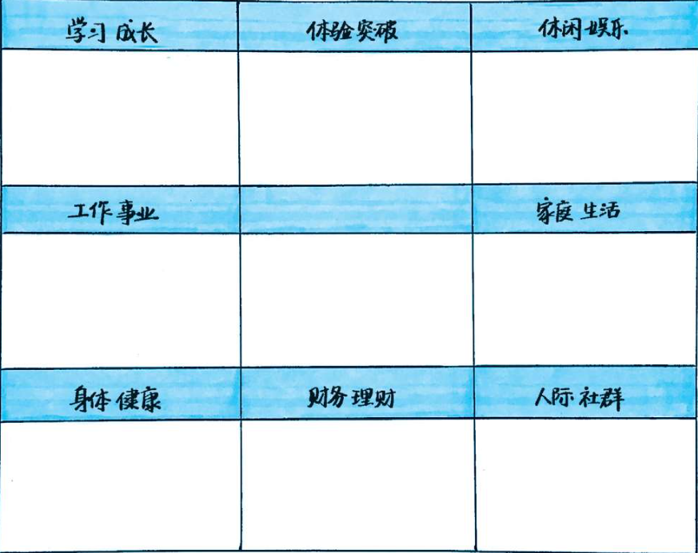
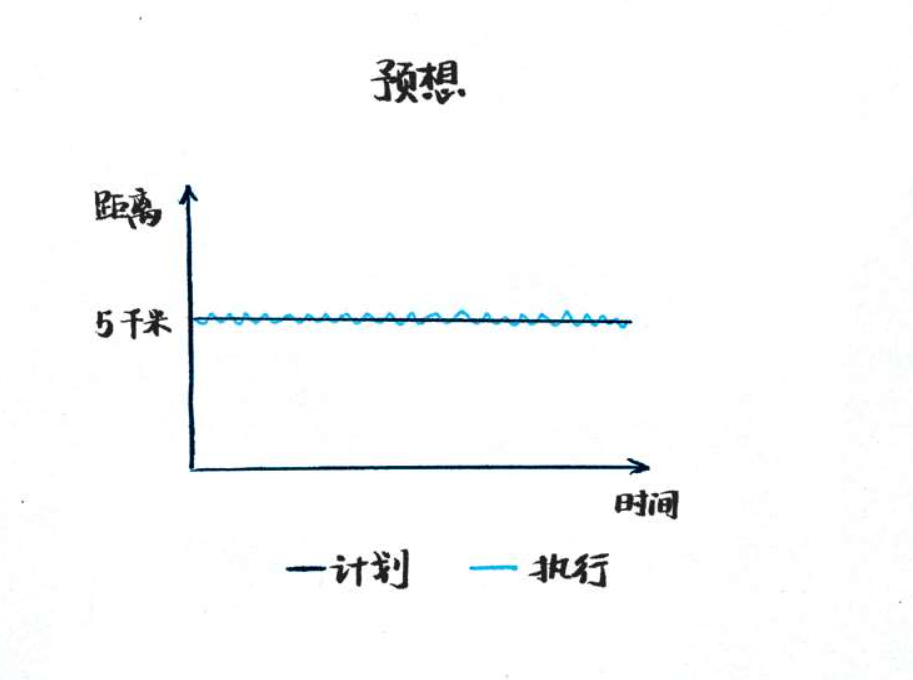

**说实话，我很喜欢《只管去做》这本书，内容不是长篇大论的讲大道理，而是很生活化的场景和真实感受。**

不用羡慕事业成功、家庭幸福的人，他们和你一样，都在经历着人生的不同阶段，绕到他们背后，就会看到那里有一级一级的台阶，他们在一点点实现心里的愿景。

# 第一章 写给五年后的自己的一封信

按照掌控和角度两个维度，将人的生活状态分为四种。

掌控：对事情的掌握和控制；

角度：站多高，看多远；

**空想家：**想的很多，真正落实去做的很少；

**回应者：**混吃等死的状态，安于现状，每一天都过的差不多。他们没什么能力，也不需要学习什么能力，别人让干什么就干什么，被动的过完一辈子。

**执行者：**能力强，交代给他们的事情都能妥妥的完成。但他们整天忙于琐事，没有时间考虑自己的未来，没有为了自己想要的生活方式而努力。

**指挥官：**他们既对自己的未来有着清晰的规划，又有足够的能力实现他们。他们是最有幸福感和成就感的一批人。

## 1、1 为什么你的年度计划总是实现不了

大部分人年度计划无法实现的原因：假、大、空、全

**假：**目标不是发自内心的，而是一时激情。比如看到别人健身，你也跟风去健身房健身，当激情退去，减肥健身就半途而废了。

**大：**目标超出能力范围，比如每天写1000行代码，“**每天**”都做，绝对超出了自己的能力范围。

**空：**写下了目标，但没有落实到计划细节中。年度计划没有拆解到每个月、每一天的计划中，导致计划内容没有得到有效的执行。

提升编码能力，这不是个好计划，如果改为每天阅读开源项目代码10分钟或者每天编码10行，这就是个落到实处的好计划。

**全：**贪多求全。想做的事情太多，年度计划中定下了太多的目标，其实你没搞清楚内心真正想要的是什么。

## 1、2 不走心的目标是假目标

**一个可以实现的年度计划，要从走心的愿景开始。**

很多人的年度计划总是遇到执行力不足的问题：半途而废或者三分钟热度，究其原因就是没有一个让自己怦然心动的愿景。

我们每天都很忙，甚至忙到都没有时间静下心来好好感受一下苹果的味道。

**五感写作法（视觉、味觉、听觉、触觉、嗅觉）可以让我们更慢，更走心。**

我有时候用脑想事情想的很累的时候，就走上街，用五感去观察人们的表情、穿着，呼吸一下周围的味道。

纯粹的观察，不加任何思考和评判，就会感觉到脑袋一下子空了，很放松，很舒服。

# 第二章 让梦想照进现实

## 2、1 你的梦想是不是忽略了什么

怎么把愿景孵化为具体的目标呢？我的做法是用九宫格。

如何理解这个九宫格呢？

在中间画一个人，人脚下踩着的是三个根基，包含健康、财务（钱）、社交。

人左右手握着的是工作和生活的平很，两手抓，两手都要硬。

人头顶上是三种享受，学习成长-》成长享受，体验突破-》愉悦享受，娱乐-》放松享受。

**体验突破：**做一些以前从来没做过的事情，看看会发生什么。

人生除了活得有意义，还要活得有意思。

如果追求人生意义，每天都是在学习和工作中忙碌，给公司做贡献，更为了提升个人能力，人生难免太枯燥了。

有意思：就是自己找点乐趣。

**中间空白部分，填写年度主题词**

可以随时提醒自己，整整一年就围绕这个主题词开展。

九宫格法，能让人重新回到初心，这样就不会跑偏了。

在实践九宫格方法时，在初期傻傻的去做就好。实践一段日子以后，再去衍生自己的方法，因为这些方法一定是有很多经验的沉淀的，不像看上去那么简单。

## 2、2 三步把模糊的愿景孵化成明确的目标

**愿景可以是模糊的大方向，让我们知道往哪里走，并且充满动力就可以了。**

**但目标一定是明确、具体、清晰的，否则就会容易犹豫和纠结。**

我使用的方法：

- **先定义**
- **再计划**
- **后目标**

很多人会问，做个年度计划有必要这么认真吗？

认真的态度是一种面对。其实这个过程也是在确认你到底是不是真的想要。

如果想要，你会很兴奋，因为这个过程让你的愿景更清晰。

如果不想要，你则会不愿面对，那就放弃，省下实践和精力去做其他你真正想做的事情。

大部分人年度计划半途而废不是因为毅力问题、坚持问题、时间问题，而是因为那些不是你自己真正想要的。

当愿景转化微目标后，把这个目标用不同颜色的笔写下来，和愿景有区别就可以了。

在十字路口，错误的选择是因为迷茫和纠结而原地不动。

不管你往哪个方向走，都会看到不同的风景，有不同的收获。

哪怕走了几步发现这条路行不通，也是一种收获啊。

成功了，可以总结经验，失败了，可以总结教训。

不管是路走的对不对，成功or失败，对自身都是提升的过程。

## 2、3 检查一下年度目标是否合理

想象一个场景：

刚制订年度计划时，信心满满，摩拳擦掌，等到真正开始做的时候，发现很多问题

- 目标太多
- 时间不足，没那么多时间
- 没想清楚，不知道如何下手

当我听你说既想要这个，又想要那个的时候，就察觉到你割裂了理想和现实，把自己的年度目标理想化了，没有考虑到现实问题。

做两道题

**第一道填空题时这样的：实现年度目标所需时间为__，一年中可支配时间为（）。**

每天读书，15-30分钟，包括写读书笔记；

每天编写个人代码，30分钟，包括提交代码到github上；

按每天2小时算，一周14个小时，一年52周算，也就是728个小时，这是我所有拥有的可支配时间。

第二道判断题是这样的：你的年度目标符合SMART原则吗？

- **具体的（Specific）**

- **可衡量的（Measurable）**

- **可以达到的（Attainable）**

- **目标必须和其他目标具有相关性（Relevant）**

- **目标有明确的时间期限（Time-based）**

这就是大名鼎鼎的SMART原则，在制订目标时要脚踏实地的使用起来它。

“这个夏天要瘦20斤”，这个目标符合SMART原则吗？

乍一看貌似比较符合，但是不能只看表面的东西，要多了解之后才能建立起实现目标的信心和决心。

我为什么要减肥？

1、我想变的更健康，身体更舒服

2、我想延长我的职业寿命，我喜欢现在工作

3、减肥让我的身材更好，做心里想做的事情时，就没有那么多后顾之忧了。

我为什么要辛辛苦苦的练习手敲代码？尤其是有了AI辅助编程软件cursor后，为什么还是坚持练习手写代码呢？

1、工程实践的核心能力要牢牢的掌握在程序员自己手中

2、我之前被人瞧不起过，所以我要奋发图强，争口气；

3、ai编写的代码，其质量还是不高，其稳定性也不高，还是需要程序员自身知道好代码是什么样的

4、提升自己编写代码以及调试bug的能力

# 第三章 抬头看路和低头走路

目标也分为项目类型的目标和习惯类型的目标。

习惯：周期性做一件事，比如每周锻炼身体三天。

培养习惯时容易遇到的挑战：

- **三分钟热度**
- **努力的坚持，但由于看不到结果而放弃**
- **被打断一次，就灰心丧气，慢慢放弃了**

项目：需要多个步骤来完成的事情

计划项目时容易遇到的挑战是：

- 总是拖到最后一刻才去做；
- 专注细节，忽略了整体进度；
- 多个项目同时进行，导致混乱

现在，拿出你的九宫格，把属于习惯类型的目标用圆圈标出来，项目类型的目标用三角标出来。（已经标出来了）

为什么有人同时做多个项目能游刃有余的搞定，并且平时也能有时间休闲和娱乐呢？其原因无非这几个：

**1、受虐狂**

明明知道自己需要更好的工作方法，或者学习新的项目管理方法，但是一想到学习就觉得累，就懒的行动。

主动改变 vs 被动接受

要不主动改变，要不只能被动接受，还在心里自我安慰，“我就这样，改变不了”。
宁愿受虐也不愿意改变，反而合理化所受到的痛苦和小皮鞭。

**2、选择困难**

选择A还是选择B，时间就在纠结和比较中飞逝，而你一直在纠结中度过，还没有做任何事情。

**3、极限生存**

有些人总喜欢把事情推到最后一刻才去做，明明2个月的暑假作业，在最后两周才开始赶工，完成后还佩服自己真牛逼。

如何解决这个问题呢？

**低头走路 + 抬头看路**

包括我自己听了很多课，订阅了很多专栏，学了很多东西，但为什么依旧没用呢？

这就是因为我一直在抬头看路，没有低头走路；一直在输入信息，没有输出行动。

**所以需要我们经常在两者之间切换。**

从**“怎么做”**的战术思考切换到**“目的是什么”**的战略思考，思考角度转变后，往往会有很大的收获。

## 3、1 甘特图：让你抬头看路

做项目也是如此，低头做项目会因为一定要解决某个问题，而忽略了项目的整体进度。

所以我会做一个甘特图和倒排项目清单。

**甘特图：**

看甘特图中的项目进度，就是在“抬头看路”

**倒排项目清单：**

搞定清单中的事项，就是在“低头走路”。

甘特图的画法：

第一步：准备一张A4纸，在横线上标上12个刻度，表示12个月份

在纵轴上将你今年的目标一一写下来

第二步：填充

预估每个年度目标的起止时间

NetDefenser项目的开始和结束时间是多少？从6月到年底的12月吧。

具体画法是用空心的方框覆盖这个区域，让所有项目的进度一目了然。

第三步：调整

年度计划不用调整的太频繁，在每月的最后一天更新下这幅甘特图即可。

实际过程中，可能会发生三种情况：

- 正常推进，把这个月的进度涂成实心即可
- 超前完成，把超前的部分也涂成实心，下个月可以轻松一点
- 进度滞后，只涂做完的一小段的进度，提醒自己下个月要抓紧下，赶赶进度

**甘特图的作用：**

根据上个月的项目的进展调整下个月的计划，提前让你紧张起来，别总是把事情都拖到最后一刻才去补。

可以把这幅图贴在书桌前面，随时提醒你各个项目的进度。

## 3、2 倒推分解法：让你低头走路

做计划之前，首先要了解你的项目。

从项目的“简单-复杂”和“具体-模糊”两个维度来看，所有的项目可以分为四类：

- 简单具体
- 复杂具体
- 简单模糊
- 复杂模糊

对于简单具体的事情，没有必要做复杂的计划，我的做法是用“预备，跑”的方式来做这类事情。

从要实现的目标，从将来的某一天一直倒推到现在才可以。而且越到现在越要明确具体的行动计划。所以你打算未来一周要做什么、明天要做什么？

为每个项目设置单独的清单，就像一个抽屉放一个项目一样，一个项目建立一个清单。

如果你用纸和笔的话，采用10张纸，用来记录10个项目的待办清单。

这样你多个项目并行处理的时候就不会乱了。

人都存在三种状态：

- 舒适区，以前做过的，有经验的项目，对自己没什么难度
- 学习区 ，有一定挑战性，感觉有点不舒服，但不至于恐慌
- 恐慌区，超出自己能力范围的事情，让我们心里感觉焦虑、恐慌，有可能放弃

如果计划中的目标处于恐慌区，那么怎么样才能把这个目标顺利搞定呢？

不仅要做项目分解，还要做项目化解。

**项目分解：**

明确完成项目的步骤，主要对项目有一定了解，项目分解还是不难做的。

**项目化解：**

在项目进行的过程中，会遇到很多难题，比如在写开源项目《基于DPDK的网络入侵检测系统》，我会遇到什么困难呢？

有入侵检测的TCP流重组挑战，需要处理乱序、重传、丢包等TCP复杂情况。

使用RSS网卡多队列技术，来解决同一个会话的所有数据包都分发到同一个cpu上处理的情况。

HTTP、DNS、SMTP等协议解析复杂度高。

解决这些困难的计划，就是项目化解，这才是你应该花精力去计划的部分。

对项目已经很熟悉，有足够的经验，那么只做项目分解即可；

如果对项目没有经验，也不是很熟悉，那就既需要做项目分解，也要做项目化解。

马斯克对于火星移民计划，是如何把个人成本从100亿元降低到100万元的呢？

**第一、火箭得是可以重复使用的。**

2015年底，SpaceX实现了火箭发射后，一级火箭的再回收。

**第二，飞船如果载满整个太空航行需要的燃料发射**，会非常沉重，导致成本高昂。

在太空轨道上，对飞船进行补给。采用这种方式，前往火星的成本降低了500呗。

**第三，在火星上制造燃料，**让飞船能够从火星返回地球，这样返程的燃料就不需要从地球带了。

**第四，使用正确的燃料。**

甲烷，因为甲烷在火星上制造起来相对容易。

经过多轮分析，马斯克将一个天方夜谭的技术难题和资本难题，拆解成了一系列具体的技术问题。

**如何进行项目化解呢？**

按照两个维度去化解：

1、我如何才能让这件事变得更简单？

2、我如何才能让这件事变得更具体？

说白了，就是把复杂、模糊的目标往学习区拉。

以写文档为例子，我们经常会遇到思路卡住了，不知道写点什么内容好，或者思路断断续续的无法成体系。

有两种化解方法：

**第一个是让模糊的事情变具体**

比如我写书之前会列大纲，而且至少是三级目录，详细的目录列出来了，模糊的想法就会慢慢完善到清晰，不清晰的地方要通过调研使其清晰。

**第二个是让复杂的事情变简单**

在写做的过程中卡壳了，不知道怎么写下来，我的做法是立即停笔，出去散散步。

有时就会冒出好主意，因为好主意总是在放松的时候产生。

如果想到头疼都没相处好方法，我会去运动，运动会让我们的大脑活跃起来。

**寻求他人的帮助**

如果实在都不行，我会邀请两个人一起讨论，听听别人对同样事情的思考和看法。

其中一位对我做的事情比较了解，而且有自己独到的见解。

另一位是我的听众，是从读者的角度。

有时自己想半天没懂的事情，别人三言两语就点醒我了。

是因为每个人对同一个问题有不同的角度，而且在交流的过程中会碰撞出更多的角度，相信总有一个角度刚好帮你解开难题。

**年度目标在舒适区、学习区、恐慌区如何分布才更好呢？**

如果你一年有12个目标的话，那么我的建议是1：2：1的比例进行：

- 3个舒适区的目标
- 6个学习区的目标
- 3个恐慌区的目标

这样的年度目标既有挑战，又有享受。

好的项目计划有三个标准，可以自己衡量下

**首先是坚韧**

接收真实的自己，有点懒，智商一般，有时情绪内耗，简称不完美；

所以在做计划时，要留点缓冲时间，补个B计划啥的，给自己留点余地。

**其次是简化**

**简：**让复杂的事情变简单。

做项目计划就是把脑袋里很复杂的事情，用纸币让它回归简单。

**化：**将项目中的难题化解掉，这样才不会卡住。

**最后是解放**

计划到什么程度才算好呢？

能让大脑摆脱某项事务的纠缠，这样的计划就是好的计划。

过度计划让人焦虑——》这么多事情什么时候才能做完啊

不计划也让人焦虑——》事情这么多，接下来先做哪样？该怎么做啊？

脑袋里塞满计划的时候，我们是活在未来的，只有适当的计划才能让大脑忘记这件事，从而才能专注于当下，更加专注。

# 第四章 如何培养一个好习惯

## 4、1 三分钟热度是怎么回事？

在这个知识付费的时代，不是爱学习的人多了，而是为了缓解内心的焦虑，贩卖焦虑和卖课的人往往是同一批人。

培养习惯的过程，一共是四个阶段：

1、带着新鲜感和热情开始

2、用方法、技巧、工具坚持下去

3、向内求做事的初心，向外求一些奖赏，来帮助自己突破

4、坚持21天以后，习惯成自然

有了这幅图，在培养习惯的过程中，就知道自己处于培养习惯的哪个阶段，下一个阶段是什么，需要做什么样的准备进入下一个阶段，这样心里就不会具足无措。

仅仅靠热度和激情就能培养起来习惯，是不可能的。

《习惯的力量》读书笔记

**第一，人生是无数习惯的组成**

早上的洗脸，刷牙

去公司的路上，做哪条路

中午喜欢去什么餐厅吃饭

下班去什么地方去运动，多久运动一次

这些都是习惯的结果。

**第二，养成习惯的秘密：习惯回路**

习惯是这样产生的：首先我们会收到某种暗示，然后就会产生惯性行为，接着获得奖赏。

下次我们收到同样暗示的时候，还会产生惯常行为，整个回路是有内心产生的。

平时坐地铁或者等公交等无聊时，想做点什么来打发时间，然后我们看手机打发时间，短视频，读书app，电视剧等，奖赏就是愉快的打发了时间，下次再无聊时，你还是走习惯回路来耍手机的。

**第三，习惯不能被消除，却能被替代**

想改掉无聊时看手机的习惯，我们可以改为听音乐，这种做法没有改变暗示，我们依旧会无聊，也没有改变奖赏，听音乐时候我们也会觉得时间过的很快，我们只是改变了习惯行为而已。

## 4、2 培养习惯的燃料

### **首先我会找出真正想培养的习惯，而不是把时间浪费在一时的冲动上。**

培养习惯的燃料有两个，一个是热情，一个是痛苦。

将习惯赋予更深的意义。

我对一件事越有热情，越是容易养成习惯。

那么如何才能找出自己真正想培养的习惯呢？

画一个表格，左边三个是你要培养的习惯，中间三列分别是痛苦、热情和时机：

**痛苦：**做这件事解决我哪些痛苦？那种痛苦有多深？

**热情：**做这件事的动力是什么？有多强烈？非常强烈打10分

**时机：**眼下是否适合做这件事。特别适合就打10分

现在你横向把每个习惯的得分加起来，就能找到你最想养成的那个习惯了。

这个表格能把你内心想法投射和量化出来，比较靠谱，同事调动你的理性思维，这样更容易做出选择。

时间管理真的不是在做加法而是在做减法。

### **其次是仪式感**

原因有三点：

第一，仪式感让弹性时间变为硬性时间

你过去培养习惯的时间可能是弹性的，也就是下班之后有时间就读书，所以一般是没时间。

仪式感就相当于把每天培养习惯的时间预支出去了，我一定要在这段时间里读书，这样一切都会为这段时间让路。

**第二，仪式感让人不假思索**

有时，行动力差的重要原因是想的太多了。

每到公司我都有固定流程：打开电脑，倒杯水，活动一下身体，把今日待办事项清单摆在左边，右边放一个本子随时记录想法，设置一个25分钟的番茄始终，开始工作，想想就是很高效的状态。

**第三，仪式感给人神圣感**

我的做法是做一张习惯培养卡片。

公式：

- 初心和动力（为什么做） 
- 触发条件（什么时候做） 
- 具体事项（每天编码十行）
- 何时达成目标算成功，让人感觉能实现
- 突发情况的应对措施 
- 庆祝每一次进步

实际案例：

为了有效提升我的个人编码技能帮我度过35岁危机（初心和动力），在每天蹲马步后（触发条件），快快乐乐的编写10行代码（清晰具体的事项）。

如果**连续21天**每天编码10行或者阅读10行代码，习惯就算培养成功（让你够的到的成功边界），

我会奖励自己一件礼物作为庆祝，更好的鼓励自己培养下一个习惯（学习奖励自己）。

如果加班没时间写，我会将自主写十行代码改为抄写十行代码（应对突发情况）；

如果手边没有电脑，我会将编写代码改为阅读十行代码；

如果晚上有聚会，我会选择在白天把代码先写完；

如果不不知道写什么代码，我会在笔记本上的计划表中提前规划好待办清单。

**初心：**内心无比渴望成为实战性高手，实战能力在ai时代尤为重要，还能帮我有机会度过35岁危险。

当想放弃时，就想想初心还在不在，还能不能打动自己，一般这时候都能重新振作起来。

**触发条件：**蹲完马步后是触发条件，以前蹲马步后一般都耍手机，现在改为编码练手，这是惯常行为的改变。

**具体事项：**

这十行代码，我是写什么功能，使用什么编程语言(c/c++/golang/python)，事项越具体越明确，你的想法就越少，执行力就越强。

人执行力变差，往往是因为想的太多，做的太少。

**买礼物：庆祝每一次小进步，小成功：**

哪怕是一点点的进度，也值得来庆祝。

**21天：给自己画条终点线，定义怎么才算成功养成习惯。**

如果让你“每天编程20行”或者“每天走一万步”，你听了只有有什么感受？

“有种遥遥无期的感觉，而且只有开始没有结束，更像是一种惩罚，没有终点的比赛”

连续21天都进行编码还是很有挑战的，因为中间有一天没写就得重新开始计数呢。

**习惯养成后维持就好，开始培养下一个习惯**

只要培养习惯达到了我定义的成功标准，我就会把它放开，让它自己运行，而我的注意力会转移到培养下一个好习惯上。

我们要学会放手，不能因为怕养成的习惯消失了就对它过分关注，失去了培养其他习惯的机会。

三分钟热度是没有达到成功的目标就放弃了，在达到成功的目标后的放弃，这个叫放手。

**突发情况的应对措施：**

对于编写代码习惯来说，加班没时间怎么应对？手头没电脑怎么应对？

事实是，在出现让你措手不及、没有任何准备的状态时，很容易放弃。

当我们预想到有阻碍，并且写出应对之法时，就想已经知道了会发生什么。

当这件事真的发生时，你也不会恐慌，也就不会轻易放弃了。

放置的位置：

将习惯卡片放到比较醒目、随时能看到的地方。

## 4、3 坚韧的计划比“一定要”的计划更靠谱

做习惯培养计划进入的坑是：把习惯名当作计划，但它其实是最终结果。

比如每天背60个单词，拿开车来比喻，这些应该是我们最终想到达的目的地。

每天背60个单词这种一蹴而就的计划，除了难以实现，还容易使人产生厌倦感。

好多习惯我们半途而废的原因不是意志力不够，也不是难度大，而是厌倦。

所以我的做法是希望培养习惯的计划更有挑战，也更有趣，就像游戏里打怪一样，一级一级的突破。

我把这叫做循序渐进的计划。

比如健身，首先教练会让你做个体能测试，告诉你肌肉变大是什么原理

接着，根据你体能测试的结果有针对性的制订计划。比如说你能推20千克的杠铃，教练不会让你直接推40千克的，而是让你从18千克开始，再到20千克，22千克，20千克，18千克。每次都从能力所及之处开始，然后中间突破极限，再慢慢回来，下次再提升一点，突破新的极限。

最后，教练不会让你每天都锻炼，而是一三五这样隔一天锻炼一次。每次锻炼都针对不同的部位，周一是手臂，周三是背部和肩，周五是腿和腰，同时还会提醒你规律作息和调整饮食。

这就是一个循序渐进的健身计划。

培养习惯的最后一步是忠实记录，积极反馈。

横轴上的刻度代表一个月的天数，纵轴是刻度，分别是5000步、10000步、15000步，沿着一万步这个刻度画出一条参考线。

上面还写着培养习惯的名字和奖励。

这三个小人是培养习惯的“三条命”。（越是完美的计划，越容易被打破。）

有人做计划：“每天慢跑5000米”，预想中是这样的：

但我们是人不是机器，我们每天的精力、情绪、时间、状态都是不一样的，就像这样：

所以刚开始的18天坚持的不错，突然有一天特殊原因，没有完成每天5千米的目标。

这时候就开始全盘否定自己的计划，觉得不适合自己，不合理；

开始否定自己，觉得自己是个三分钟热度的人。

**如果把视角抬高到一个月的高度，成都18天，失败1天，在我看来，这段培养习惯的过程非常成功啊。**

有时候放自己一马的话，我相信后面自己会坚持的更好的。

所以我的做法是，允许自己每个月有三次“挂掉并复活”的机会，每挂掉一次，就涂黑一个小人儿。

三个小人都黑了就game over，要重新开始培养这个习惯。

偶尔一次特殊情况没完成，也不会导致游戏结束，你还可以满血复活重新开始游戏。

只有三条命都用掉了，才是真正的游戏结束，game over。

奖励和奖赏

真正驱使我健身的是，我自己感受搞身体状态比之前好了，以及别人称赞我“有毅力”，“比之前精神了”。

越运动越感觉自己精神状态好，就越愿意运动。

**周围人对我的称赞是我坚持健身这个习惯带来的奖赏，人都希望被认可、被关注的内心需求，如果奖赏了这些需求，个人的驱动力就更强了。**

内在的驱动力会比外在的诱惑力输出更持久的能量，所以我的做法是只在习惯培养成功的时候奖励自己，在习惯培养的过程中奖赏自己。

所以在培养习惯的过程中，建议把注意力放在过程带来的积极感受上，这样更容易养成习惯。

找到习惯培育的过程中的乐趣，后续就会越做越顺了。

# 第五章 如何过一天就如何过一年

## 5、1 忙完工作再去实现年度计划就没戏了

### 1）没完成年度计划的原因

很多人制订好年度计划，但是因为每天很忙，根本没时间推进。

**第一，你不是没时间，而是没精力**

早上上班精力最旺盛，随着时间的推移，精力会慢慢下降，做的事情越多越难，精力下降的越快，等到下班的时候，整个人都累的跟行尸走肉一样，再挤地铁和公交回家，换成我，回家也只想看看电视剧，玩玩游戏。

**第二，你不是没时间，而是没大块时间**

这是个碎片化的时代，时间被各种app分割成碎片，想找个15分钟完全不被打扰的时间都很难。

**第三，你不是没时间，而是没有立刻去做**

### 2）如何改善上述情况

**把每天要做的事情都写到一张清单上就可以**

**把每天要做的事情都写到一张清单上就可以**

**把每天要做的事情都写到一张清单上就可以**

**第一、没时间完成年度计划**

你可能觉得“忙完工作以后，有时间了再完成个人年度计划的事情”，但工作是忙不完的，所以你总也没时间完成

年底计划的事情。

**第二、区分重要和不重要的事情**

一般我们会倾向于先完成简单的事情，因为好做容易出成果。

**第三、总有几件事做不完，拖到明天**

早上信心满满的写了很多待办事项，理想很丰满，现实很骨感，其实根本没那么多时间来做事。

所以总有几件事做不完，拖延到明天。

**左边一栏比较窄，上面有时间的刻度，这个是一天的时间轴，可以让我们掌握一天到底有多少时间资源可用。**

将每天固定时间做的固定事情确定好，比如早上9点到10点开会，这段时间就已经预支出去了，不是我可以自由支配的了。

其实一天留给我们的时间并没有想象的那么多。

**右边一栏比较宽，我把它叫自由区。**
这里写的才是真正的待办事项，有新的待办事项，随时可以加进来。

我建议把工作、生活、年度计划，所有的事情都列到同一张清单上，这张清单就代表着所有你今天要做的事情。

工作、生活、年度计划，他们是平等的。

**在工作之余穿插一些年度计划的事情，这不但会让你的工作更有效率，还不会让你太累。**

比如说可以脑力和体力交替。写代码写累了，可以打打拳，锻炼下身体。

### 3）任务分解

将“TRA项目总结文档”分解成了三个步骤：

收集项目资料、写大纲、完成文档。

首先，做任务分解的目的是让我们能利用好碎片时间。

比如你有15分钟时间，可以写完项目总结文档吗？写不完！

虽然写不完文档，但是收集一下写文档需要的资料还是可以的。

把生活中的碎片时间化零为整，好好的利用。

### 4）将清单事项更具体的记录

写清单的目的之一就是通过记录的方式，让我们把这事忘记，从而更专注于手头的工作，效率更高。

如果不把要做的事情都写下来，那么这些事就会在你的脑袋里打架。

将要做的事情写下来，就像从脑袋里面将事情剪切到纸上一样，脑袋就清净多了。

而且要记录的尽可能详细，否则我们心里总是担心有什么遗漏的地方。

### 5）4D工作法

Do it now:立刻去做

Delay it:计划去做

Delegate it:授权去做

Don't do it:尽量别做

四象限工作法更偏向于判断事情的轻重缓急，而4D工作法更偏向于执行。

如何把4D工作法落实到待办清单上呢？

不管遇到什么样的事，迅速用4D工作法确定它的下一步行动，然后写在待办清单里。

**第一、立刻去做的事情写在自由区**

做好标记，上班的时候优先去完成。

**第二、计划去做的事情**

（1）今天做，而且是固定时间去做的事情

这类事情放到手机日历中

（2）今天某个时间段做的事情

放到清单左侧的时间轴上，这段时间内我一定要排除其他干扰做这件事。

（3）今天做，但什么时候做都行的事情

把它写在右边的自由区，并且做任务分配

（4）今天别人交代给我的事情，却是将来要做的

我把它写到月历中

**第三、授权去做**

我把一件事授权给别人去做的时候，会跟他确认一下什么时候给我回复。

比如对方说三天后给结果，那么我就在日历中三天后设置一个体性，到时候我会跟进这件事情。

**第四、尽量别做**

尽量别做的事情，我压根不会写到清单中
