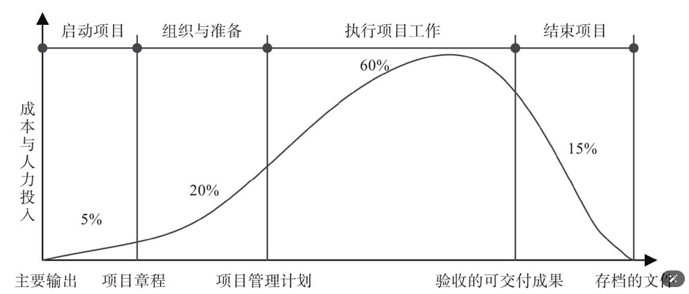

# 第2章 启动：师出有名，名正言顺

## 2、1 生命周期模型是项目管理的工具

项目生命周期是项目从启动到收尾所经历的一系列阶段，生命周期模型是项目管理者进行项目管理的工具。

### 2、1、1 项目生命周期的特征

**1、生命周期为管控项目提供框架**

通用生命周期结构通常有以下特征。

（1）成本和人力投入在开始时较低，在中间阶段最高，在项目快要结束时迅速回落。

（2）项目的风险和不确定性在项目开始时最大，在整个生命周期中随着时间推进而递减。

项目变更的代价不仅包括成本，还包括时间和质量代价。

（3）在不显著影响成本的前提下，改变项目产品最终特性的能力在项目开始时最大，随项目进展而减弱。变更和纠正错误的成本在项目接近完成时通常会显著增高。

实际上，站在项目实施方（乙方）的角度来说，在项目生命周期中问题的处理原则如下。

1）项目早期，更倾向于接受，“让怎么干就怎么干”，遵从公司的更变流程即可。

2）项目中期，“要变更，先谈谈“，尽可能与相关人员沟通，取消变更。

人对项目的影响、改变的能力在降低，而变更的成本却在增加。

3）项目后期，更变成本太高，原则上尽可能不变更。

遇到大的变更，可考虑启动一个新项目；

遇到小的变更，也要走售后服务时再做。

**当务之急是先验收，将项目收尾。**

## 2、2 定目标：项目始于业务终于业务

计划有用，但企业环境让其无用。

项目成员是定死的，项目的截至日期也是定死的，根本不管是否合理。（**这往往是常态**）

100万成本的项目，被销售人员以50万元的价格卖出，注定血本无归。

管理学大师提醒人们，不能只顾着低头拉车，还要学会抬头看路，牢记自己的主要目标。