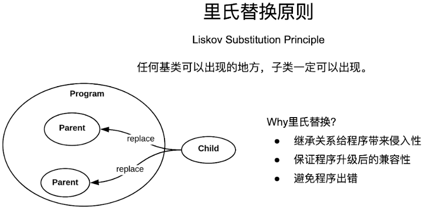

# 设计原则

组合优于继承。


## 里氏替换原则




为什么要遵守里氏替换原则呢？

使用继承给程序带来侵入性，一个父类被子类所继承，当这个父类需要被修改的时候，可能会对其子类造成影响。


如何规范地遵守里氏替换原则：

1、子类必须完全实现父类的抽象方法，但不能覆盖父类的非抽象方法

2、子类可以实现自己特有的方法

3、当子类的方法实现父类的抽象方法时，方法的后置条件要比父类更严格

4、子类的实例可以替换任何父类的实例，但反之不成立


## 接口隔离原则

一个类不应被迫实现它用不到的方法。

具体：大接口要被拆为多个小接口，每个接口只服务一个类型的子类。

```
class IPrinter {
public:
    virtual void print(const string& doc) = 0;
    virtual ~IPrinter(){}
};

class IScanner {
public:
    virtual void scan(const string& doc) = 0;
    virtual ~IScanner(){}
};

class IFax {
public:
    virtual void fax(const string& doc) = 0;
    virtual ~IFax(){}
};

// --- 设备实现类 ---
// 1️⃣ 仅实现打印机接口
class SimplePrinter : public IPrinter {
public:
    void print(const string& doc) {
        cout << "SimplePrinter Printing: " << doc << endl;
    }
};

// 2️⃣ 仅实现扫描仪接口
class SimpleScanner : public IScanner {
public:
    void scan(const string& doc) {
        cout << "SimpleScanner Scanning: " << doc << endl;
    }
};

// 3️⃣ 多功能一体机 —— 组合多个接口
class MultiFunctionMachine : public IPrinter, public IScanner, public IFax {
public:
    void print(const string& doc) {
        cout << "MultiFunctionMachinePrinting: " << doc << endl;
    }

    void scan(const string& doc) {
        cout << "MultiFunctionMachine Scanning: " << doc << endl;
    }

    void fax(const string& doc) {
        cout << "MultiFunctionMachine Faxing: " << doc << endl;
    }
};
```


## 依赖倒置原则

最通俗易懂的解释：

“上层的逻辑不要依赖下面的具体实现，而是依赖一个共同的接口”

你是一个“消息发布者”，需要告诉别人一些信息。

你可以用：

- 手机发短信（SMS）
- 邮件通知（Email）
- 微信通知（WeChat）

如果在代码中写死“发短信”，那么需求改为微信通知时就必须改代码。

**所以我们定义一个“通知接口”，不同方式都实现它。**

**这样主程序只认这个“接口”，不在乎它是短信通知还是邮件。**


依赖倒置原则：

**程序要“面向接口编程”，不要“面向实现编程”。**
