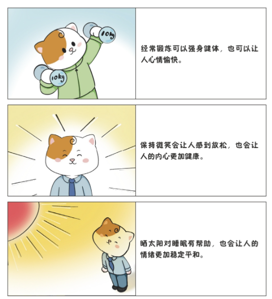

《猫先生的情绪自救》读书笔记

## 嫉妒：总觉得别人的成功会威胁到我

### 一、为什么产生嫉妒情绪

有些东西，别人有但是猫先生没有，让他感觉自己没有价值。

明明知道嫉妒情绪是源自比较，那么为什么猫先生还会与他人比较呢？

因为他的自我边界不清晰，只与昨天的自己比较，不和别人比较。

### 二、如何解决问题

#### 第一个方法：提升自尊

**自爱**

在小时候充分体验到被爱的人，长大后自爱的能力就强，也更有能力去爱别人。

弥补：做一些对自己好的事情，让自己开心，照顾自己的感受和情绪，慢慢找到自爱的感觉。

**自我概念**

简言之：

自己如何看待我们？

别人如何看待我们？

建立自我概念，首先要接受自己，无论是外在还是内在。

**外在：**我不是个帅哥，但是我长的挺喜庆的，像岳云鹏，哈哈。

**内在：**虽然我是非科班计算机出身，但凭借自己10年的努力，也把技术水平提升到了一定高度。虽然不如技术大佬那么牛逼，但是恰恰是我继续奋斗的动力。

所谓的优缺点都是相对的，

**自信**

自信的人会认为自己有能力、有信息去解决很多问题。

在日常生活中，一个不断去体验较小成功的人，往往更容易积累自信。（比如微习惯）

经过第一个方法过后，我们建立了自信心，并且我们能够认识真实的自己，包括自己的优点和缺点。

#### 第二个方法：自我效能

一方面是认识自我，接受真实的自我，有缺点也有优点，

另一方面是主动学习和模仿。

既然我们嫉妒对方是因为对方比我们好，那么我们就努力寻找对方比我们好的原因，带着学习的心态去提升自己。

#### 第三个方法：思考我们想要的到底是什么

我们在不知道自己想要什么的时候，往往会把别人的成功当作自己的目标。

比如大姐家买了新房子，房子和票子是别人的追求和目标，但有可能不是我自己的目标。

所以我没有必要嫉妒她，

想想自己追求的目标是什么，然后再把时间和精力锁定到自己的目标上。

我想成为技术卓越的工程师，虽然不在乎身外之物，但我更在乎个人能力的提升，更在乎个人成就感。

我喜欢在开源社区贡献力量，提升自己的社区影响力，比如在ebpf社区的影响力。

## 抑郁：遍布全身的沮丧无力

产生抑郁情绪后，要学会表达和宣泄出来。

如何预防抑郁情绪的产生呢？

**1、运动**

有氧运动，可以分泌多巴胺和内啡肽，让人积极和快乐。

**2、微笑**

微笑的表情和动作，会给人带来积极的反馈，长期以往你会越来越快乐。

**3、晒太阳**

多晒太阳可以分泌褪黑素，帮助睡眠。睡眠足的人，血清素的分泌也较为规律。

**丰富自己的价值系统**

如果价值系统单一，只以工作来换取价值，那么当工作出问题时，我们可能会陷入抑郁状态。

如果多涉及几个领域，那么我们产生抑郁的概率就要小得多。

让自己变的更有价值，是克服抑郁情绪的关键。一条路走不通，就多开拓几条路，这样才能让生活变的有趣起来。

# 第三章：猫先生的情绪自救

## 负面情绪：是痛苦，也是成长的契机

猫先生面对事情选择了逃避，导致根本问题没有被解决，才使焦虑情绪进一步发展成恐惧情绪。

然而，猫先生依然没有正确面对恐惧情绪，而是将恐惧情绪归结于外部原因，所以就出现了嫉妒情绪。

我们之所以会产生恐惧情绪，是因为自己无法面对困难的挑战，却过分重视结果，导致我们的自我价值受到了威胁，本质是我们的力量不够、资源不足，和应对困难的策略不佳。
