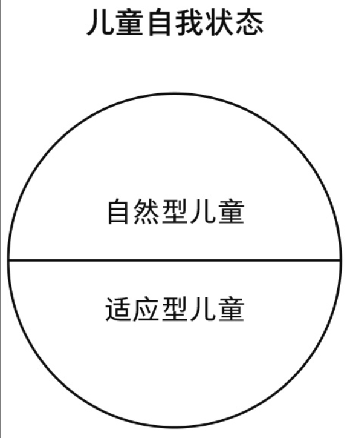

# 第五章 成长的寓言

老师不同于咨询师的地方，老师采用讲解模式，而咨询师采用倾听模式。

不论多大年纪，都可能进入儿童状态，此时他们的感受和行为都和小时候的自己如出一辙，和实际年龄并没有关系。

理解你的童年就是理解你自己的关键线索。

我们在婴儿期就开始学习应对生活，我们得对自己天生得行为做出调整，这个是什么意思？

从我们出生时，生命中就有两个人陪伴，我们必须依靠他们，我们唯一能做得就是适应他们每一次得喜怒无常。

我们会因为某些词或者某些场景而触发童年得感受。

回想一下你的童年，想想那些过往还有最初的记忆，然后我们再看能不能在咨询中一起悟出什么来。

# 第六章 探索童年