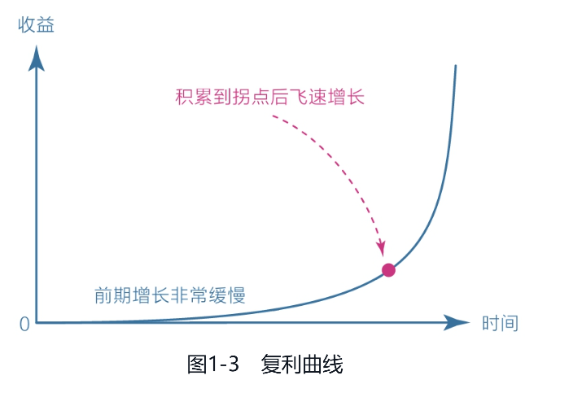
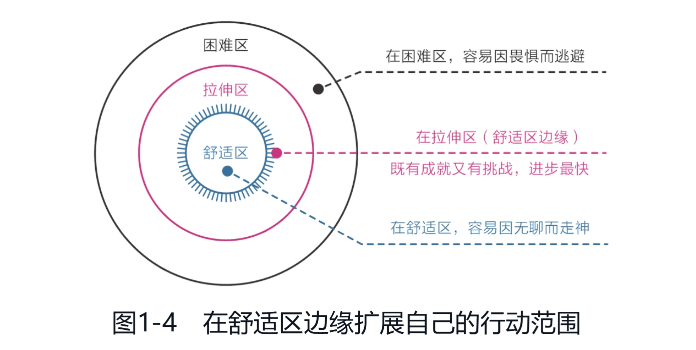
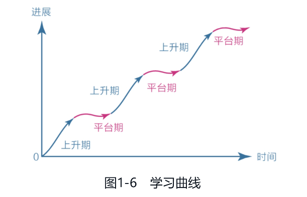

人生就是一场漫长的旅途，遗憾才是人生的常态。珍惜眼前才是你应该需要做的事。

用心去品尝每一口饭菜；用心去聆听每一次花开；

用心去观察每一处风景；用心去完成每一份责任；

用心去感受当下的每一次爱和喜悦。

过好当下好好生活，但行好事莫问前程。

# 第一章：大脑，一切问题的根源

## 第一节：大脑，重新认识你自己

理智脑：主管认知（人类独有），只有250万年的历史

情绪脑：主管情绪，已有近2亿年历史

本能脑：主管本能，已有近3.6亿年历史

从上述大脑的历史来看，理智脑在情绪脑和本能脑面前，就脆弱的像个孩子一样。

大多数时候我们以为自己在思考，其实都是在对自身的行为和欲望进行合理化，这正是人类被称作“自我解释的动物”的原因。

**成长就是克服天性的过程**

理智脑不是为了取代本能脑和情绪脑，更不是用意志力去对抗本能脑和情绪脑，而是通过科学的方法让本能脑和情绪脑开开心的把活干了，大家皆大欢喜。

## 第二节：焦虑，焦虑的根源

身边有很多成功人士功成名就，于是我们就产生了焦虑的情绪。

我们不应该和成功人士的现状比，他们刚起步奋斗时也是如我一样苦逼和辛苦，所以要比也应该和过去的成功人士比；

事实上，我更应该和过去的自己比，哪怕比过去好一点点，也是值得欢喜的。

### 焦虑的几种形式：

**第一，完成焦虑**

同时想学很多东西，但是个人可用时间根本不够；

每天例行要完成的事情太多，根本做不完，压得自己喘不过来气；

**第二，定位焦虑**

有自知之明，对自己的智商、情商、能力和水平有一个清醒的认知。

**第三，选择焦虑**

有时候选择太多也会让人焦虑。

比如放假空出来一段时间可以使用，但却因为想做的事情太多，最后把时间浪费在摇摆不定上，静不下来心去做重要的事情。

**第四，环境焦虑**

**第五，难度焦虑**

真正让你变强的东西，其核心的困难是无法回避的，下决心与它死磕，慢慢熬下去，也就克服了困难，就这么简单。

### 焦虑的根源

焦虑的根源就两条：

想同时做很多事情，又想立即看到效果。

焦虑的本质：自己的欲望大于能力，又极度缺乏耐心。

## 第三节： 耐心，得耐心者得天下

###  缺乏耐心，是人类的天性。

### 认知规律，耐心的倍增器。

很多时候，我们对困难的事情缺乏耐心，是因为我们看不到全局，也不知自己身在何处。

如爬山一样，我们能看到山顶在那里，我们处于半山腰，那么粗估计下还有一半的路程，

心里想：一半的路程虽然比较长，但是咬咬牙也能坚持住；最后还剩下1/5的路程，我觉得我可以做到。

而缺乏耐心，就像爬山时身处黑夜之中，

我们看不到终点在哪里？

我们也不知道自己身处在什么位置，距离终点还有多少距离，心里是无比迷茫的。

如果我们能了解一些事物发展的基本规律，改用理性这把客观之尺，则会极大的提升耐心。复利曲线就是一种理性工具。

复利曲线：前期增长非常缓慢，但达到一个拐点后会飞速增长。

舒适区边缘：能力以“舒适区-拉伸区-困难区”来分布，想让高效成长，必须让自己始终处于拉伸区，既有成就感又有挑战，进步最快。

对于学习而言，学习之后的思考、思考之后的行动、行动之后的改变更重要，多盯住内层的改变量。

很多人之所以痛苦焦虑，是因为只盯着表层的学习量。

读了不少书，报了不少课，天天坚持，努力到感动自己，但是没有深入关注过自己的思考、行动和改变，所以总是感觉学无所获，甚至会认为是自己不够努力，于是继续加大学习量，结果陷入了“越学越焦虑，越焦虑越学”的恶行循环。

**原因是天性在作祟。**单纯保持学习输入是简单的，而思考、行动和改变则相对困难。人的天性是**趋易避难**的，不自觉地沉浸在表层的学习中。

同时，表层学习能直接看到结果，读了多少页书，学了几节课，结果可见；

但是内层的改变则不容易发生，所以急于求成的天性也会促使我们选择前者。

比如，读书时不求记住书中的全部知识，只要有一两个观点促使自己发生了切实的改变就足够了，其收获和意义比读很多书但仅仅停留在知道的层面要大的多。

时刻以这样的标准指导自己学习，我们的收获就会越来越多，焦虑就会越来越少。

真实的学习曲线：

刚开始时进步很快，然后变慢，进入一个平台期。

在平台期，我们可能付出了大量的努力，但看起来毫无进步，甚至可能退步，因为大脑中的神经元细胞依旧在发生连接并被不断的巩固，到了某一个节点后，就会进入快速上升期。

就像写公众号，有耐心的人会牢牢盯住长远价值，他们的目光在5年、10年之后，所以不会因眼下文章的阅读量低而缺乏动力，也不会因别人写出10W+的文章而气馁，毕竟各自所处的阶段不同，只要持续创造价值，别人的今天就是你的明天。

从这个角度看，耐心不是毅力带来的结果，而是具有长远目光的结果。

### 怎样拥有耐心？

**首先，面对天性，放下心理包袱，坦然接受真实的自己。**

当自己表现出急躁、急于求成、不耐烦时，告诉自己这是正常的，缺乏耐心是人的天性。

培养耐心的过程非常长，不要指望一下子就能很有耐心。

**其次，面对诱惑，学会延迟满足，变对抗为沟通**（给娃娃讲解，什么叫延迟满足）

舒适和诱惑是本能脑和情绪脑的最爱，明智的做法不是和他们对抗，而是和他们沟通，因为理智脑不失本能脑和情绪脑的对手。

与本能脑和情绪脑对话，“该有的享受一点都不会少，只是不是现在享受，而是在完成某件重要的事情之后”。这是一个有效的策略。

延迟满足后享受的好处：将享乐的快感建立在完成重要任务后的成就感之上，很放松、踏实，像是一种奖励；

而“先娱乐”虽然刚开始很快活，但是因为心理挂念着未完成的重要任务，所以玩也没玩好，还拖延了重要的工作，随着时间的流逝，人会更加空虚和焦虑。

**最后，面对困难，主动改变视角，赋予行动意义**

有耐心的人更擅长探索认知原理，要想办法看清那些想做之事（比如读书和身体锻炼）的意义和好处，你看到的维度越多，耐心就会越强。

# 第二章：潜意识——生命留给我们的彩蛋

## 第一节：人生是一场消除模糊的比赛

为了更好的生存，潜意识来负责生理系统，意识来负责社会系统，如此分工，意识便得到了解放，可以全力投入到高级的社会活动中。

这种意识分层的方式带来巨大好处的同时也有副作用：**模糊**。

因为意识和潜意识处理各种信息的速度不对等，意识很难介入潜意识，而潜意识却能轻松左右意识，所以人们总是在做着自己不理解的事。

​	模糊，正是人生困扰之源。而人生也想一场消除模糊的比赛，谁的模糊越严重，谁就越混沌；谁的模糊越轻微，谁就越清醒。